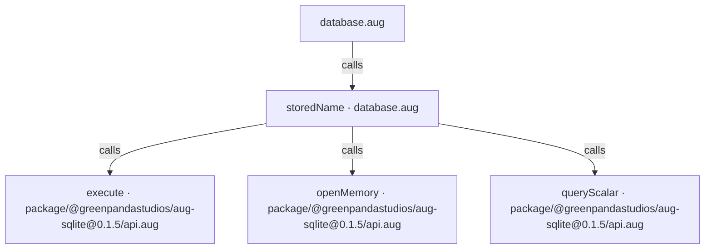
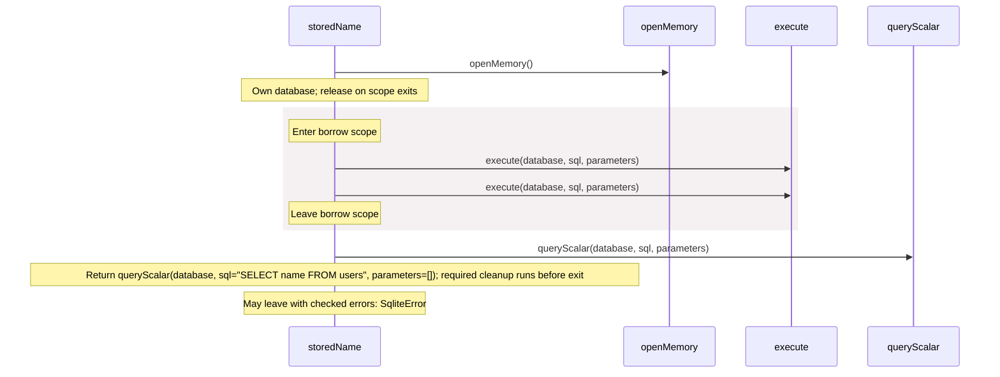

# database.aug diagrams

[A database with SQLite](index.md)

[Project overview](diagrams/index.md) · [Compiled explanation](database.md)

## Class interactions

No relationships at this level.

## API calls

## Sequences

Call arrows identify checked targets; loop and branch frames determine when they run. Open that target’s module to follow its implementation. Branches describe alternatives; loops describe repeated work. Native calls and interface dispatch stop at their declared contracts. Exit notes end that path; enclosing recovery and cleanup remain visible.

### storedName {#sequence-storedName}

::: spec-paragraph specification-paragraph-1
[Source](database.md#source-L5)
:::

## Called contracts

- [storedName](database-diagrams.md#sequence-storedName) — database.aug
- [execute](dependencies/packages/%40greenpandastudios/aug-sqlite/0.1.5/api-diagrams.md#sequence-execute) — package/@greenpandastudios/aug-sqlite@0.1.5/api.aug
- [openMemory](dependencies/packages/%40greenpandastudios/aug-sqlite/0.1.5/api-diagrams.md#sequence-openMemory) — package/@greenpandastudios/aug-sqlite@0.1.5/api.aug
- [queryScalar](dependencies/packages/%40greenpandastudios/aug-sqlite/0.1.5/api-diagrams.md#sequence-queryScalar) — package/@greenpandastudios/aug-sqlite@0.1.5/api.aug
