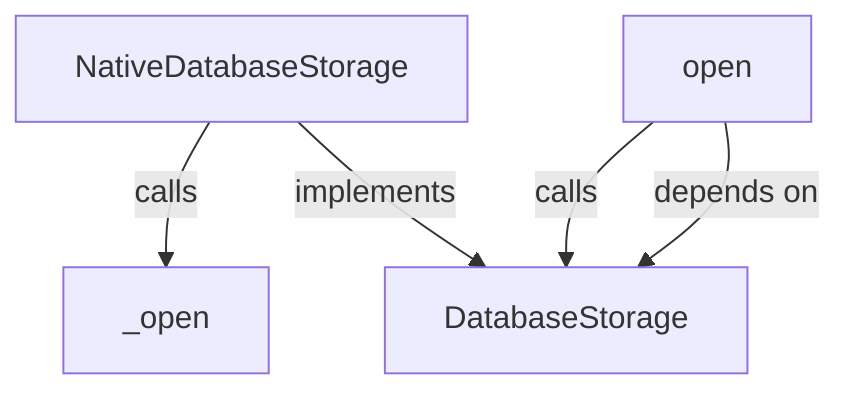
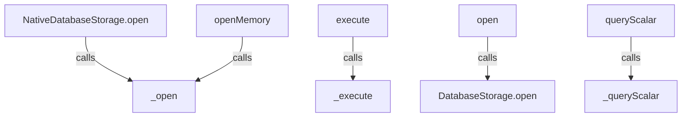
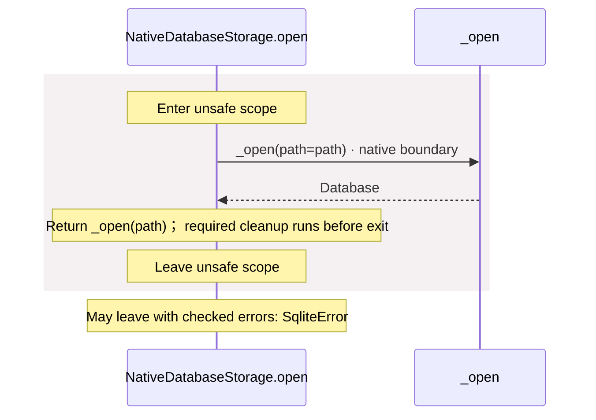
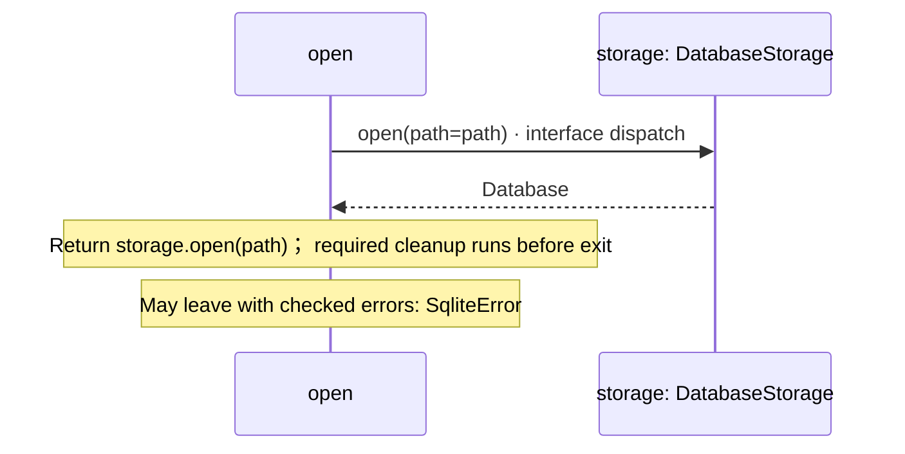
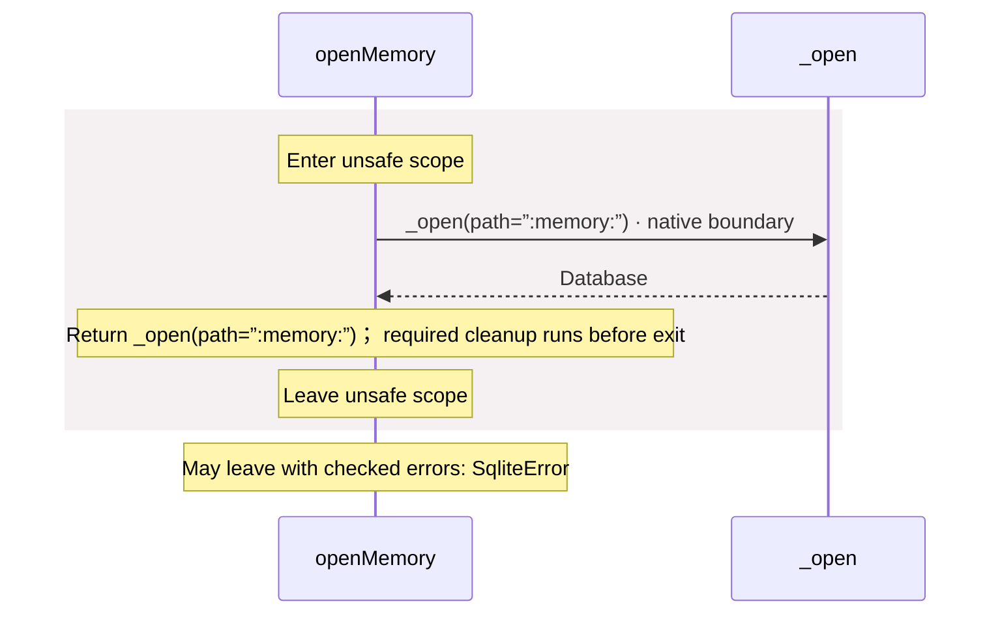
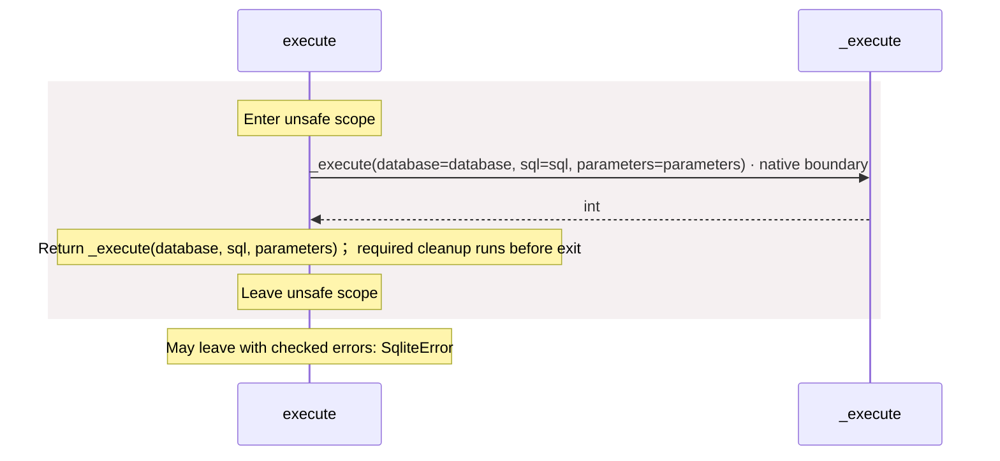
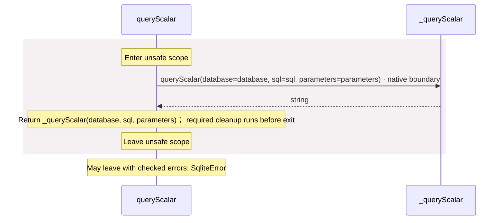

# package/@greenpandastudios/aug-sqlite@0.1.5/api.aug diagrams

[A database with SQLite](../../../../../index.md)

[Project overview](../../../../../diagrams/index.md) · [Compiled explanation](api.md)

## Class interactions

::: details Call relationships

:::

## Sequences

Call arrows identify checked targets; loop and branch frames determine when they run. Open that target’s module to follow its implementation. Branches describe alternatives; loops describe repeated work. Native calls and interface dispatch stop at their declared contracts. Exit notes end that path; enclosing recovery and cleanup remain visible.

### \_open {#sequence-_open}

::: spec-paragraph specification-paragraph-1
[Source](api.md#source-L5)
:::

May leave with checked errors: SqliteError. Native implementation; only the declared contract is known. [Explanation](api.md).

### \_execute {#sequence-_execute}

::: spec-paragraph specification-paragraph-2
[Source](api.md#source-L6)
:::

May leave with checked errors: SqliteError. Native implementation; only the declared contract is known. [Explanation](api.md).

### \_queryScalar {#sequence-_queryScalar}

::: spec-paragraph specification-paragraph-3
[Source](api.md#source-L7)
:::

May leave with checked errors: SqliteError. Native implementation; only the declared contract is known. [Explanation](api.md).

### NativeDatabaseStorage constructor {#sequence-NativeDatabaseStorage-20-constructor}

::: spec-paragraph specification-paragraph-4
[Source](api.md#source-L9)
:::

[Explanation](api.md).

### NativeDatabaseStorage.open {#sequence-NativeDatabaseStorage.open}

::: spec-paragraph specification-paragraph-5
[Source](api.md#source-L10)
:::

### open {#sequence-open}

::: spec-paragraph specification-paragraph-6
[Source](api.md#source-L13)
:::

### openMemory {#sequence-openMemory}

::: spec-paragraph specification-paragraph-7
[Source](api.md#source-L16)
:::

### execute {#sequence-execute}

::: spec-paragraph specification-paragraph-8
[Source](api.md#source-L20)
:::

### queryScalar {#sequence-queryScalar}

::: spec-paragraph specification-paragraph-9
[Source](api.md#source-L24)
:::

## Called contracts

- [\_execute](api-diagrams.md#sequence-_execute) — package/@greenpandastudios/aug-sqlite@0.1.5/api.aug
- [\_open](api-diagrams.md#sequence-_open) — package/@greenpandastudios/aug-sqlite@0.1.5/api.aug
- [\_queryScalar](api-diagrams.md#sequence-_queryScalar) — package/@greenpandastudios/aug-sqlite@0.1.5/api.aug
- [DatabaseStorage](contracts-diagrams.md) — package/@greenpandastudios/aug-sqlite@0.1.5/contracts.aug
- [DatabaseStorage.open](contracts-diagrams.md#sequence-DatabaseStorage.open) — package/@greenpandastudios/aug-sqlite@0.1.5/contracts.aug
