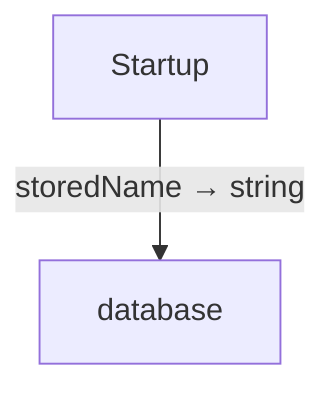
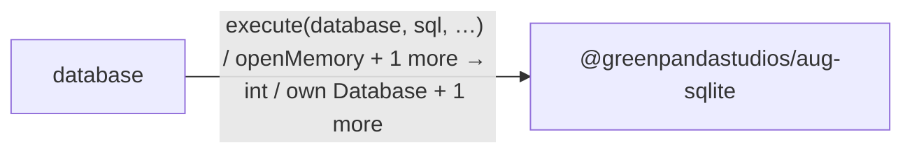

# A database with SQLite diagrams

[A database with SQLite](../index.md)

Start here to see what moves between the application’s folders. Each arrow names an operation’s inputs and the result it returns to its caller. Open a folder for the next level of detail. Expand the contract list for complete types and dependency links.

## Data flow

### Package boundaries

::: details database package calls

:::

::: details Data crossing these boundaries (4 contracts)

| From | To | Operation and inputs | Result |
| --- | --- | --- | --- |
| database | @greenpandastudios/aug-sqlite | [execute](../dependencies/packages/%40greenpandastudios/aug-sqlite/0.1.5/api.md#symbol-execute) · database: borrow Database, sql: string, parameters: List\<string\> | int |
| database | @greenpandastudios/aug-sqlite | [openMemory](../dependencies/packages/%40greenpandastudios/aug-sqlite/0.1.5/api.md#symbol-openMemory) | own Database |
| database | @greenpandastudios/aug-sqlite | [queryScalar](../dependencies/packages/%40greenpandastudios/aug-sqlite/0.1.5/api.md#symbol-queryScalar) · database: Database, sql: string, parameters: List\<string\> | string |
| Startup | database | [storedName](../database.md#symbol-storedName) | string |

:::

## Open a module

| Module | Read |
| --- | --- |
| database.aug | [Flow and sequences](../database-diagrams.md) · [Explanation](../database.md) |
| main.aug | [Flow and sequences](../main-diagrams.md) · [Explanation](../main.md) |

These are static call boundaries, not a request trace. Interface implementations and foreign internals stop at their checked contracts. Dotted arrows defer a callback or browser action. Imports alone do not imply a call.
