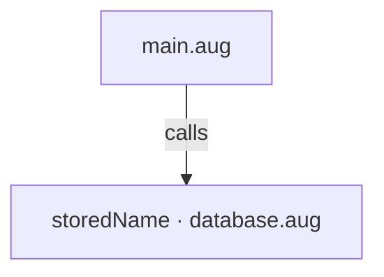
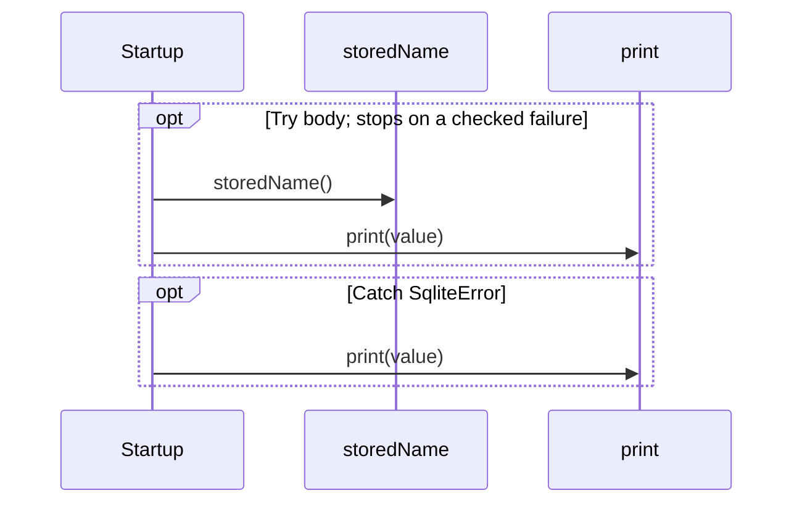

# main.aug diagrams

[A database with SQLite](index.md)

[Project overview](diagrams/index.md) · [Compiled explanation](main.md)

## Class interactions

No relationships at this level.

## API calls

## Sequences

Call arrows identify checked targets; loop and branch frames determine when they run. Open that target’s module to follow its implementation. Branches describe alternatives; loops describe repeated work. Native calls and interface dispatch stop at their declared contracts. Exit notes end that path; enclosing recovery and cleanup remain visible.

### Startup {#sequence-Startup}

::: spec-paragraph specification-paragraph-1
[Source](main.md#source-L5)
:::

## Called contracts

- [storedName](database-diagrams.md#sequence-storedName) — database.aug
