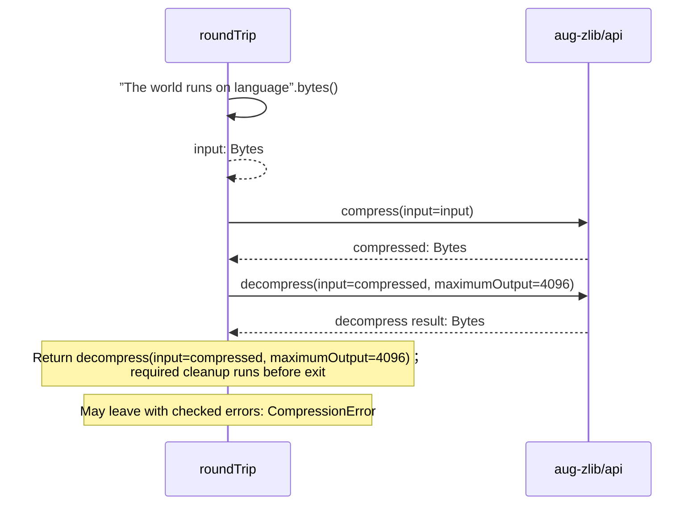

# compression.aug diagrams

[Compression with zlib](index.md)

[Project overview](diagrams/index.md) · [Compiled explanation](compression.md)

## Sequences

Call arrows identify checked targets; loop and branch frames determine when they run. Open that target’s module to follow its implementation. Branches describe alternatives; loops describe repeated work. Native calls and interface dispatch stop at their declared contracts. Exit notes end that path; enclosing recovery and cleanup remain visible.

### roundTrip {#sequence-roundTrip}

::: spec-paragraph specification-paragraph-1
[Source](compression.md#source-L5)
:::

Compress text with zlib, then restore its bytes within a fixed output limit.

Failures can raise [`CompressionError`](dependencies/packages/%40greenpandastudios/aug-zlib/0.2.0/contracts.md#symbol-CompressionError).

## Called contracts

- [roundTrip](compression-diagrams.md#sequence-roundTrip) — compression.aug
- [compress](dependencies/packages/%40greenpandastudios/aug-zlib/0.2.0/api-diagrams.md#sequence-compress) — package/@greenpandastudios/aug-zlib@0.2.0/api.aug
- [decompress](dependencies/packages/%40greenpandastudios/aug-zlib/0.2.0/api-diagrams.md#sequence-decompress) — package/@greenpandastudios/aug-zlib@0.2.0/api.aug
