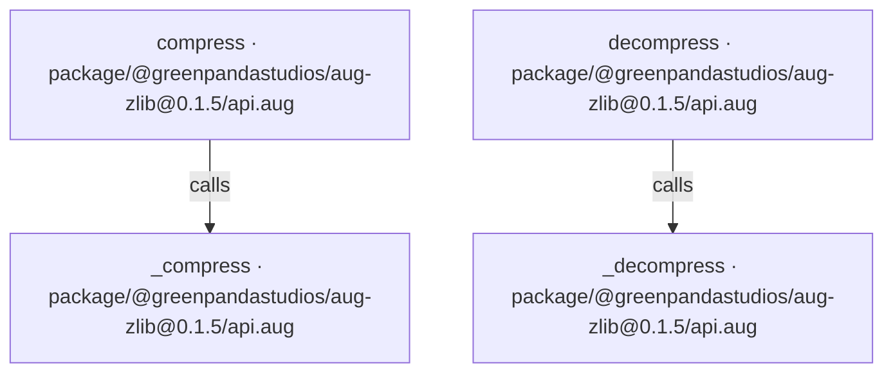
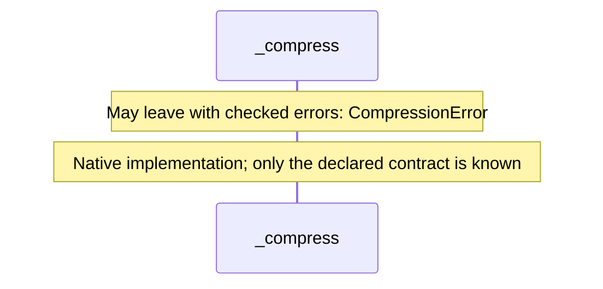
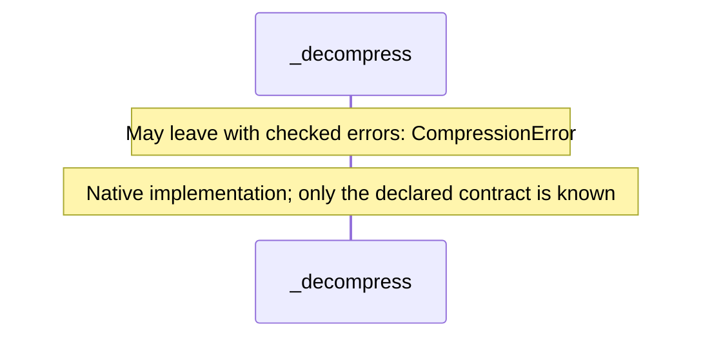
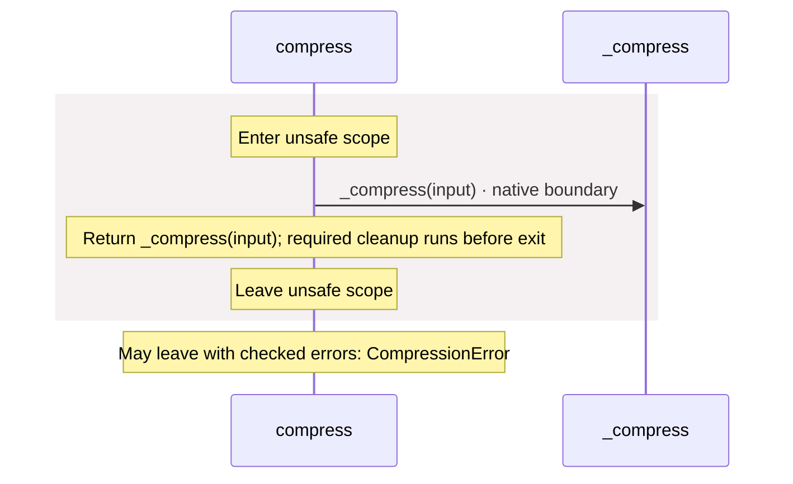
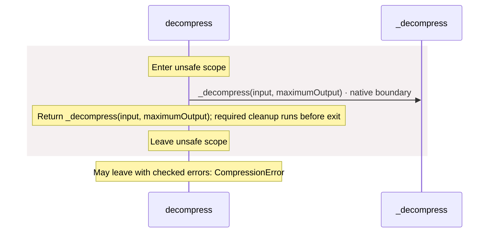

# package/@greenpandastudios/aug-zlib@0.1.5/api.aug diagrams

[Compression with zlib](../../../../../index.md)

[Project overview](../../../../../diagrams/index.md) · [Compiled explanation](api.md)

## Class interactions

No relationships at this level.

## API calls

## Sequences

Call arrows identify checked targets; loop and branch frames determine when they run. Open that target’s module to follow its implementation. Branches describe alternatives; loops describe repeated work. Native calls and interface dispatch stop at their declared contracts. Exit notes end that path; enclosing recovery and cleanup remain visible.

### \_compress {#sequence-_compress}

::: spec-paragraph specification-paragraph-1
[Source](api.md#source-L4)
:::

### \_decompress {#sequence-_decompress}

::: spec-paragraph specification-paragraph-2
[Source](api.md#source-L5)
:::

### compress {#sequence-compress}

::: spec-paragraph specification-paragraph-3
[Source](api.md#source-L7)
:::

### decompress {#sequence-decompress}

::: spec-paragraph specification-paragraph-4
[Source](api.md#source-L11)
:::

## Called contracts

- [\_compress](api-diagrams.md#sequence-_compress) — package/@greenpandastudios/aug-zlib@0.1.5/api.aug
- [\_decompress](api-diagrams.md#sequence-_decompress) — package/@greenpandastudios/aug-zlib@0.1.5/api.aug
