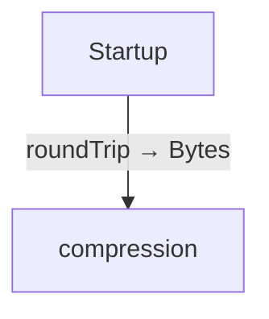
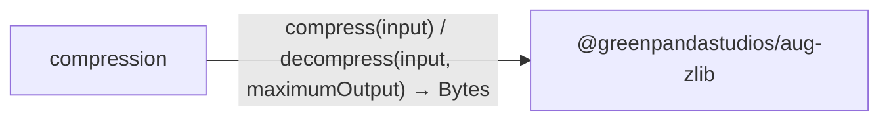

# Compression with zlib diagrams

[Compression with zlib](../index.md)

Start here to see what moves between the application’s folders. Each arrow names an operation’s inputs and the result it returns to its caller. Open a folder for the next level of detail. Expand the contract list for complete types and dependency links.

## Data flow

### Package boundaries

::: details compression package calls

:::

::: details Data crossing these boundaries (3 contracts)

| From | To | Operation and inputs | Result |
| --- | --- | --- | --- |
| compression | @greenpandastudios/aug-zlib | [compress](../dependencies/packages/%40greenpandastudios/aug-zlib/0.2.0/api.md#symbol-compress) · input: Bytes | Bytes |
| compression | @greenpandastudios/aug-zlib | [decompress](../dependencies/packages/%40greenpandastudios/aug-zlib/0.2.0/api.md#symbol-decompress) · input: Bytes, maximumOutput: int | Bytes |
| Startup | compression | [roundTrip](../compression.md#symbol-roundTrip) | Bytes |

:::

## Open a module

| Module | Read |
| --- | --- |
| compression.aug | [Flow and sequences](../compression-diagrams.md) · [Explanation](../compression.md) |
| main.aug | [Flow and sequences](../main-diagrams.md) · [Explanation](../main.md) |

These are static call boundaries, not a request trace. Interface implementations and foreign internals stop at their checked contracts. Dotted arrows defer a callback or browser action. Imports alone do not imply a call.
