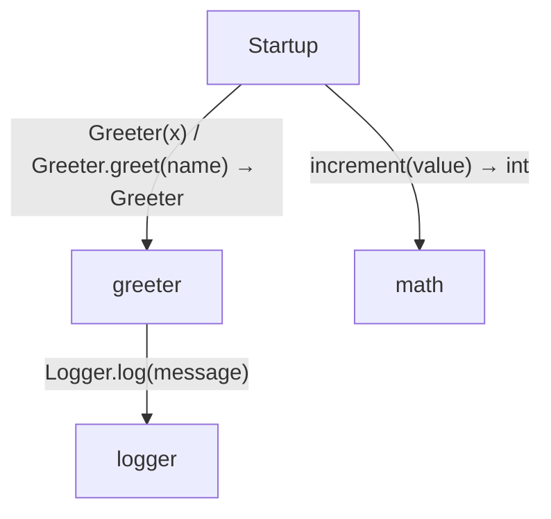
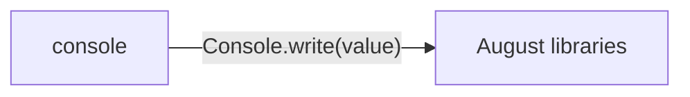

# Labeled calls and injection diagrams

[Labeled calls and injection](../index.md)

Start here to see what moves between the application’s folders. Each arrow names an operation’s inputs and the result it returns to its caller. Open a folder for the next level of detail. Expand the contract list for complete types and dependency links.

## Data flow

### Package boundaries

::: details console package calls

:::

::: details Data crossing these boundaries (5 contracts)

| From | To | Operation and inputs | Result |
| --- | --- | --- | --- |
| console | August libraries | [Console.write](../dependencies/august/0.23.0/io/contracts.md#symbol-Console.write) · value: string · interface dispatch | void |
| greeter | logger | [Logger.log](../logger.md#symbol-Logger.log) · message: string · interface dispatch | void |
| Startup | greeter | [Greeter](../greeter.md#symbol-Greeter) · x: int | Greeter |
| Startup | greeter | [Greeter.greet](../greeter.md#symbol-Greeter.greet) · name: string | void |
| Startup | math | [increment](../math.md#symbol-increment) · value: int | int |

:::

## Open a module

| Module | Read |
| --- | --- |
| console.aug | [Flow and sequences](../console-diagrams.md) · [Explanation](../console.md) |
| greeter.aug | [Flow and sequences](../greeter-diagrams.md) · [Explanation](../greeter.md) |
| logger.aug | [Flow and sequences](../logger-diagrams.md) · [Explanation](../logger.md) |
| main.aug | [Flow and sequences](../main-diagrams.md) · [Explanation](../main.md) |
| math.aug | [Flow and sequences](../math-diagrams.md) · [Explanation](../math.md) |

These are static call boundaries, not a request trace. Interface implementations and foreign internals stop at their checked contracts. Dotted arrows defer a callback or browser action. Imports alone do not imply a call.
