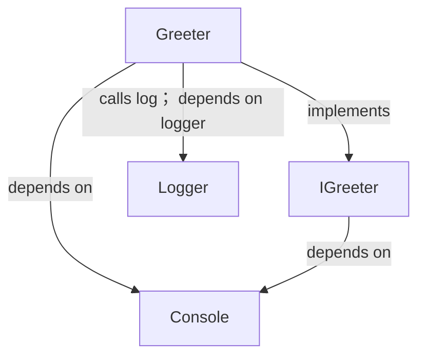
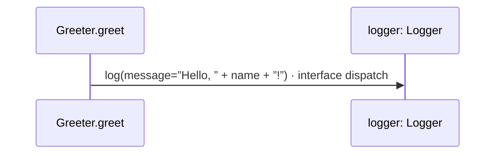

# greeter.aug diagrams

[Labeled calls and injection](index.md)

[Project overview](diagrams/index.md) · [Compiled explanation](greeter.md)

## Class interactions

## Sequences

Call arrows identify checked targets; loop and branch frames determine when they run. Open that target’s module to follow its implementation. Branches describe alternatives; loops describe repeated work. Native calls and interface dispatch stop at their declared contracts. Exit notes end that path; enclosing recovery and cleanup remain visible.

### Greeter constructor {#sequence-Greeter-20-constructor}

::: spec-paragraph specification-paragraph-1
[Source](greeter.md#source-L4)
:::

It implements [`IGreeter`](greeter.md#symbol-IGreeter).

It takes `x` as an integer, kept read-only. It gets `logger` ([`Logger`](logger.md#symbol-Logger)), kept read-only from dependency injection.

Receive fields: injected logger, x. [Explanation](greeter.md).

### Greeter.greet {#sequence-Greeter.greet}

::: spec-paragraph specification-paragraph-2
[Source](greeter.md#source-L5)
:::

It takes `name` as a string. It gets `console` ([`Console`](dependencies/august/1.0.0/io/contracts.md#symbol-Console)) from dependency injection.

It can call [`Console.write`](dependencies/august/1.0.0/io/contracts.md#symbol-Console.write).

### IGreeter.greet {#sequence-IGreeter.greet}

::: spec-paragraph specification-paragraph-3
[Source](greeter.md#source-L10)
:::

It takes `name` as a string. It gets `console` ([`Console`](dependencies/august/1.0.0/io/contracts.md#symbol-Console)) from dependency injection.

It can call [`Console.write`](dependencies/august/1.0.0/io/contracts.md#symbol-Console.write).

Interface contract; implementation selected at runtime. [Explanation](greeter.md).

## Called contracts

- [Console](dependencies/august/1.0.0/io/contracts-diagrams.md) — august/io/contracts.aug
- [IGreeter](greeter-diagrams.md) — greeter.aug
- [Logger.log](logger-diagrams.md#sequence-Logger.log) — logger.aug
