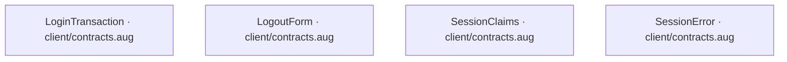
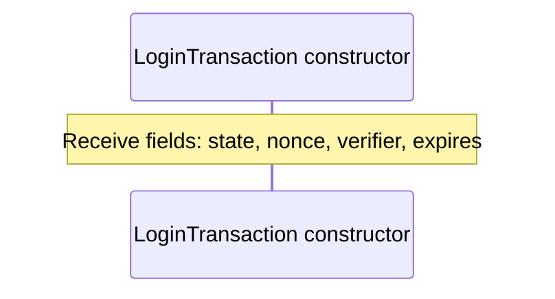
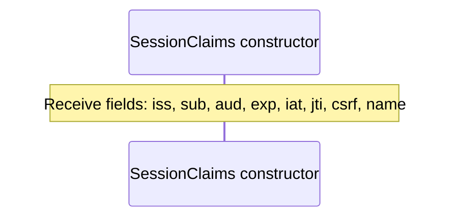
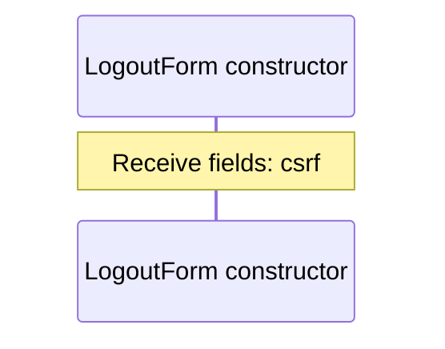
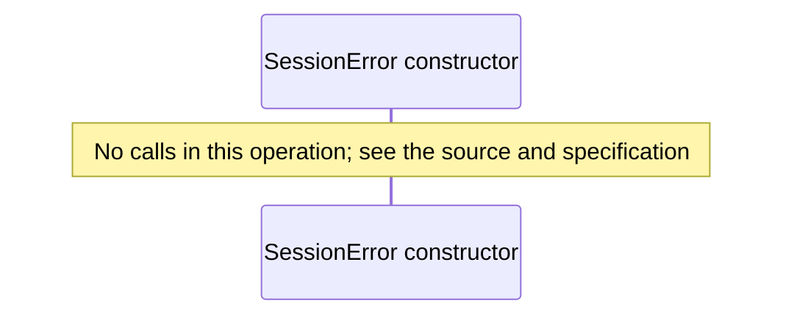

# client/contracts.aug diagrams

[OpenID Connect login application](../index.md)

[Project overview](../diagrams/index.md) · [Compiled explanation](contracts.md)

## Class interactions

## API calls

No relationships at this level.

## Sequences

Call arrows identify checked targets; loop and branch frames determine when they run. Open that target’s module to follow its implementation. Branches describe alternatives; loops describe repeated work. Native calls and interface dispatch stop at their declared contracts. Exit notes end that path; enclosing recovery and cleanup remain visible.

### LoginTransaction constructor {#sequence-LoginTransaction-20-constructor}

::: spec-paragraph specification-paragraph-1
[Source](contracts.md#source-L3)
:::

### SessionClaims constructor {#sequence-SessionClaims-20-constructor}

::: spec-paragraph specification-paragraph-2
[Source](contracts.md#source-L5)
:::

### LogoutForm constructor {#sequence-LogoutForm-20-constructor}

::: spec-paragraph specification-paragraph-3
[Source](contracts.md#source-L6)
:::

### SessionError constructor {#sequence-SessionError-20-constructor}

::: spec-paragraph specification-paragraph-4
[Source](contracts.md#source-L7)
:::

