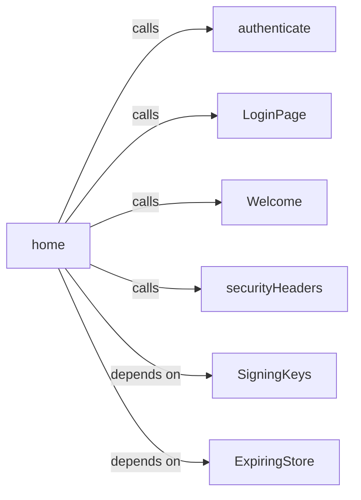
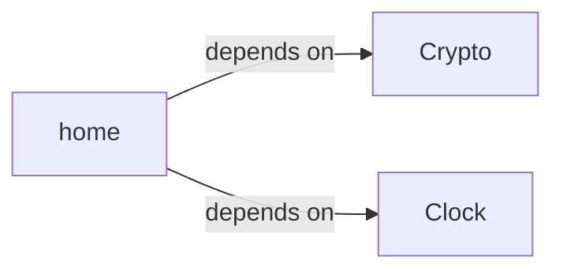
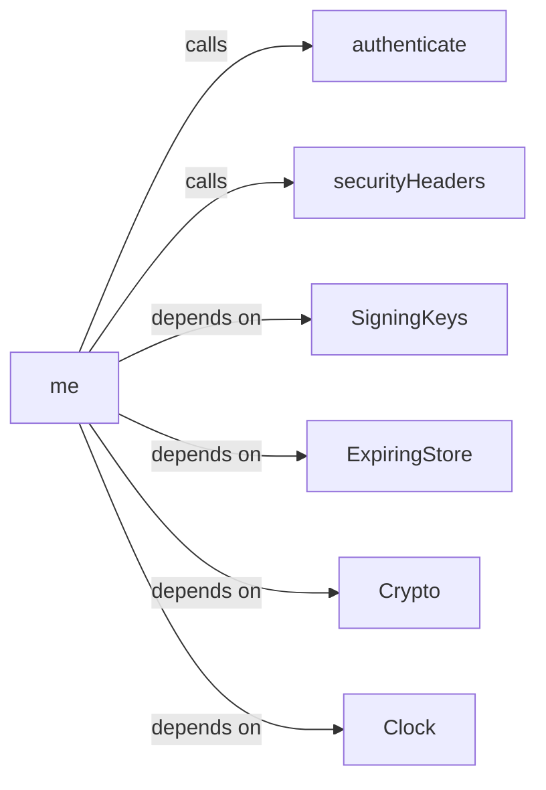
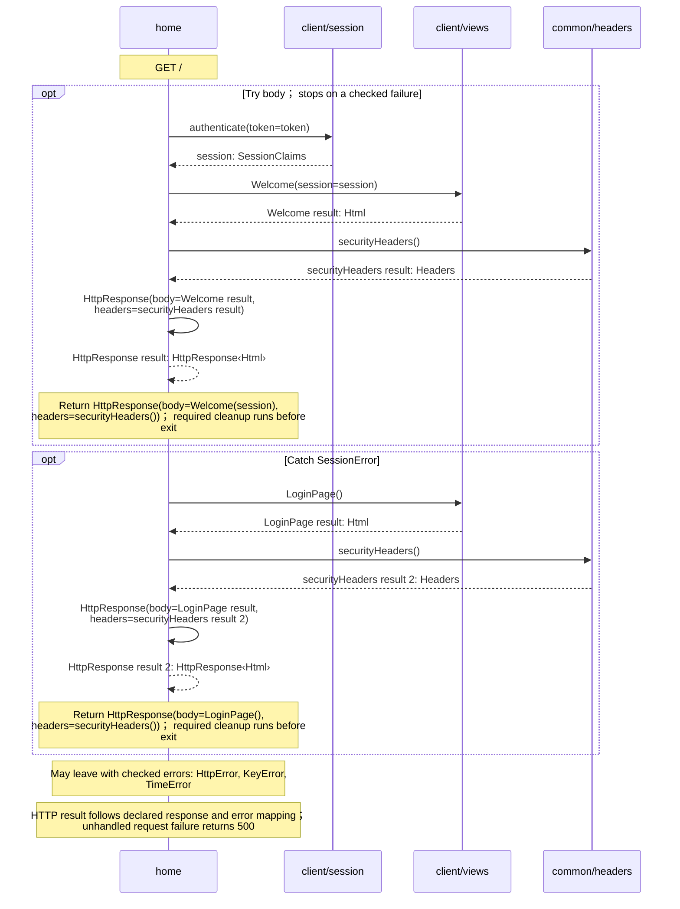
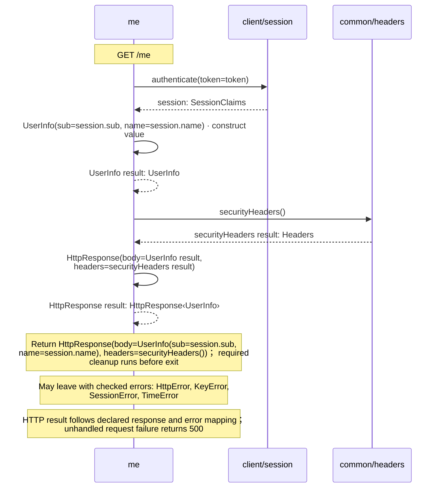

# client/endpoints.aug diagrams

[OpenID Connect login application](../index.md)

[Project overview](../diagrams/index.md) · [Compiled explanation](endpoints.md)

## Class interactions

### home

#### View 1 of 2

#### View 2 of 2

### me

## Sequences

Call arrows identify checked targets; loop and branch frames determine when they run. Open that target’s module to follow its implementation. Branches describe alternatives; loops describe repeated work. Native calls and interface dispatch stop at their declared contracts. Exit notes end that path; enclosing recovery and cleanup remain visible.

### home {#sequence-home}

::: spec-paragraph specification-paragraph-1
[Source](endpoints.md#source-L12)
:::

`home` handles `GET /`.

The app renders a verified session or offers its OIDC login flow. No token claims are displayed before verification.

It takes `token` as `optional string` from the HTTP cookie `aug_session`. It gets `crypto` ([`Crypto`](../dependencies/packages/%40git/url_9ef654c66d34ab8f5527/0.0.0-git.b14a0f9aa41f1ce58bd51133bcdc424033e40d40/contracts.md#symbol-Crypto)), `clock` ([`Clock`](../dependencies/packages/%40git/url_c092cd151499c4e1d8a1/0.0.0-git.a39fc582565d4fca40be4f75fa304d71adc69301/contracts.md#symbol-Clock)), `keys` ([`SigningKeys`](../common/keys.md#symbol-SigningKeys)), and `sessions` ([`ExpiringStore<SessionClaims>`](../dependencies/packages/%40git/url_0eb7c89453c87681ed15/0.0.0-git.a39fc582565d4fca40be4f75fa304d71adc69301/store.md#symbol-ExpiringStore)) from dependency injection. Omitted optional inputs are null.

It can call [`SigningKeys.session`](../common/keys.md#symbol-SigningKeys.session), [`Crypto.publicRsa`](../dependencies/packages/%40git/url_9ef654c66d34ab8f5527/0.0.0-git.b14a0f9aa41f1ce58bd51133bcdc424033e40d40/contracts.md#symbol-Crypto.publicRsa), [`Clock.now`](../dependencies/packages/%40git/url_c092cd151499c4e1d8a1/0.0.0-git.a39fc582565d4fca40be4f75fa304d71adc69301/contracts.md#symbol-Clock.now), [`ExpiringStore<SessionClaims>.get`](../dependencies/packages/%40git/url_0eb7c89453c87681ed15/0.0.0-git.a39fc582565d4fca40be4f75fa304d71adc69301/store.md#symbol-ExpiringStore.get), [`Crypto.equal`](../dependencies/packages/%40git/url_9ef654c66d34ab8f5527/0.0.0-git.b14a0f9aa41f1ce58bd51133bcdc424033e40d40/contracts.md#symbol-Crypto.equal), [`Crypto.decodeBase64url`](../dependencies/packages/%40git/url_9ef654c66d34ab8f5527/0.0.0-git.b14a0f9aa41f1ce58bd51133bcdc424033e40d40/contracts.md#symbol-Crypto.decodeBase64url), and [`Crypto.verifyRsa`](../dependencies/packages/%40git/url_9ef654c66d34ab8f5527/0.0.0-git.b14a0f9aa41f1ce58bd51133bcdc424033e40d40/contracts.md#symbol-Crypto.verifyRsa).

It can also raise `HttpError`, `KeyError`, and `TimeError`.

### me {#sequence-me}

::: spec-paragraph specification-paragraph-2
[Source](endpoints.md#source-L20)
:::

`me` handles `GET /me`.

A protected JSON resource accepts only a live, verified application session.

It takes `token` as `optional string` from the HTTP cookie `aug_session`. It gets `crypto` ([`Crypto`](../dependencies/packages/%40git/url_9ef654c66d34ab8f5527/0.0.0-git.b14a0f9aa41f1ce58bd51133bcdc424033e40d40/contracts.md#symbol-Crypto)), `clock` ([`Clock`](../dependencies/packages/%40git/url_c092cd151499c4e1d8a1/0.0.0-git.a39fc582565d4fca40be4f75fa304d71adc69301/contracts.md#symbol-Clock)), `keys` ([`SigningKeys`](../common/keys.md#symbol-SigningKeys)), and `sessions` ([`ExpiringStore<SessionClaims>`](../dependencies/packages/%40git/url_0eb7c89453c87681ed15/0.0.0-git.a39fc582565d4fca40be4f75fa304d71adc69301/store.md#symbol-ExpiringStore)) from dependency injection. Omitted optional inputs are null.

It can call [`SigningKeys.session`](../common/keys.md#symbol-SigningKeys.session), [`Crypto.publicRsa`](../dependencies/packages/%40git/url_9ef654c66d34ab8f5527/0.0.0-git.b14a0f9aa41f1ce58bd51133bcdc424033e40d40/contracts.md#symbol-Crypto.publicRsa), [`Clock.now`](../dependencies/packages/%40git/url_c092cd151499c4e1d8a1/0.0.0-git.a39fc582565d4fca40be4f75fa304d71adc69301/contracts.md#symbol-Clock.now), [`ExpiringStore<SessionClaims>.get`](../dependencies/packages/%40git/url_0eb7c89453c87681ed15/0.0.0-git.a39fc582565d4fca40be4f75fa304d71adc69301/store.md#symbol-ExpiringStore.get), [`Crypto.equal`](../dependencies/packages/%40git/url_9ef654c66d34ab8f5527/0.0.0-git.b14a0f9aa41f1ce58bd51133bcdc424033e40d40/contracts.md#symbol-Crypto.equal), [`Crypto.decodeBase64url`](../dependencies/packages/%40git/url_9ef654c66d34ab8f5527/0.0.0-git.b14a0f9aa41f1ce58bd51133bcdc424033e40d40/contracts.md#symbol-Crypto.decodeBase64url), and [`Crypto.verifyRsa`](../dependencies/packages/%40git/url_9ef654c66d34ab8f5527/0.0.0-git.b14a0f9aa41f1ce58bd51133bcdc424033e40d40/contracts.md#symbol-Crypto.verifyRsa).

The handler responds with HTTP 401 for [`SessionError`](contracts.md#symbol-SessionError).

It can also raise `HttpError`, `KeyError`, and `TimeError`.

## Called contracts

- [authenticate](session-diagrams.md#sequence-authenticate) — client/session.aug
- [LoginPage](views-diagrams.md#sequence-LoginPage) — client/views.aug
- [Welcome](views-diagrams.md#sequence-Welcome) — client/views.aug
- [securityHeaders](../common/headers-diagrams.md#sequence-securityHeaders) — common/headers.aug
- [SigningKeys](../common/keys-diagrams.md) — common/keys.aug
- [ExpiringStore](../dependencies/packages/%40git/url_0eb7c89453c87681ed15/0.0.0-git.a39fc582565d4fca40be4f75fa304d71adc69301/store-diagrams.md) — package/@git/url\_0eb7c89453c87681ed15@0.0.0-git.a39fc582565d4fca40be4f75fa304d71adc69301/store.aug
- [Crypto](../dependencies/packages/%40git/url_9ef654c66d34ab8f5527/0.0.0-git.b14a0f9aa41f1ce58bd51133bcdc424033e40d40/contracts-diagrams.md) — package/@git/url\_9ef654c66d34ab8f5527@0.0.0-git.b14a0f9aa41f1ce58bd51133bcdc424033e40d40/contracts.aug
- [Clock](../dependencies/packages/%40git/url_c092cd151499c4e1d8a1/0.0.0-git.a39fc582565d4fca40be4f75fa304d71adc69301/contracts-diagrams.md) — package/@git/url\_c092cd151499c4e1d8a1@0.0.0-git.a39fc582565d4fca40be4f75fa304d71adc69301/contracts.aug
- [UserInfo](../provider/contracts-diagrams.md#sequence-UserInfo-20-constructor) — provider/contracts.aug
