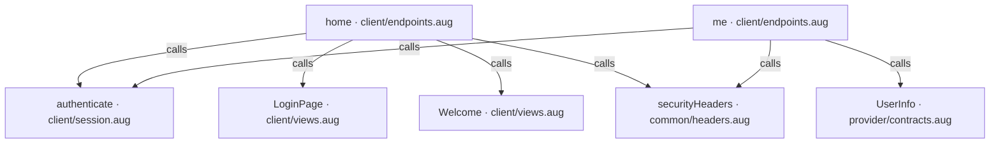
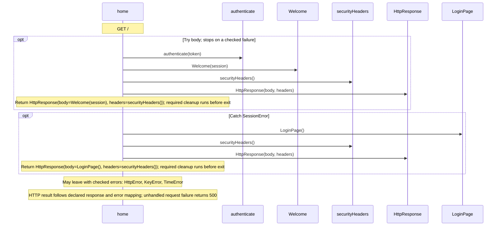
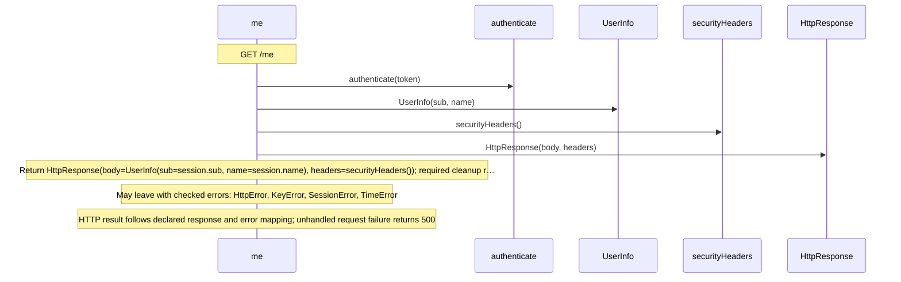

# client/endpoints.aug diagrams

[OpenID Connect login application](../index.md)

[Project overview](../diagrams/index.md) · [Compiled explanation](endpoints.md)

## Class interactions

```mermaid
flowchart TD
    n0["home · client/endpoints.aug"]
    n1["me · client/endpoints.aug"]
    n2["authenticate · client/session.aug"]
    n3["LoginPage · client/views.aug"]
    n4["Welcome · client/views.aug"]
    n5["securityHeaders · common/headers.aug"]
    n6["SigningKeys · common/keys.aug"]
    n7["ExpiringStore · package/@git/url_0eb7c89453c87681ed15@0.0.0-git.a39fc582565d4fca40be4f75fa304d71adc69301/store.aug"]
    n8["Crypto · package/@git/url_9ef654c66d34ab8f5527@0.0.0-git.b14a0f9aa41f1ce58bd51133bcdc424033e40d40/contracts.aug"]
    n9["Clock · package/@git/url_c092cd151499c4e1d8a1@0.0.0-git.a39fc582565d4fca40be4f75fa304d71adc69301/contracts.aug"]
    n10["UserInfo · provider/contracts.aug"]
    n0 -->|"calls"| n2
    n0 -->|"calls"| n3
    n0 -->|"calls"| n4
    n0 -->|"calls"| n5
    n0 -->|"depends on"| n6
    n0 -->|"depends on"| n7
    n0 -->|"depends on"| n8
    n0 -->|"depends on"| n9
    n1 -->|"calls"| n2
    n1 -->|"calls"| n5
    n1 -->|"depends on"| n6
    n1 -->|"depends on"| n7
    n1 -->|"depends on"| n8
    n1 -->|"depends on"| n9
    n1 -->|"calls"| n10
```

## API calls

## Sequences

Call arrows identify checked targets; loop and branch frames determine when they run. Open that target’s module to follow its implementation. Branches describe alternatives; loops describe repeated work. Native calls and interface dispatch stop at their declared contracts. Exit notes end that path; enclosing recovery and cleanup remain visible.

### home {#sequence-home}

::: spec-paragraph specification-paragraph-1
[Source](endpoints.md#source-L12)
:::

### me {#sequence-me}

::: spec-paragraph specification-paragraph-2
[Source](endpoints.md#source-L20)
:::

## Called contracts

- [authenticate](session-diagrams.md#sequence-authenticate) — client/session.aug
- [LoginPage](views-diagrams.md#sequence-LoginPage) — client/views.aug
- [Welcome](views-diagrams.md#sequence-Welcome) — client/views.aug
- [securityHeaders](../common/headers-diagrams.md#sequence-securityHeaders) — common/headers.aug
- [SigningKeys](../common/keys-diagrams.md) — common/keys.aug
- [ExpiringStore](../dependencies/packages/%40git/url_0eb7c89453c87681ed15/0.0.0-git.a39fc582565d4fca40be4f75fa304d71adc69301/store-diagrams.md) — package/@git/url\_0eb7c89453c87681ed15@0.0.0-git.a39fc582565d4fca40be4f75fa304d71adc69301/store.aug
- [Crypto](../dependencies/packages/%40git/url_9ef654c66d34ab8f5527/0.0.0-git.b14a0f9aa41f1ce58bd51133bcdc424033e40d40/contracts-diagrams.md) — package/@git/url\_9ef654c66d34ab8f5527@0.0.0-git.b14a0f9aa41f1ce58bd51133bcdc424033e40d40/contracts.aug
- [Clock](../dependencies/packages/%40git/url_c092cd151499c4e1d8a1/0.0.0-git.a39fc582565d4fca40be4f75fa304d71adc69301/contracts-diagrams.md) — package/@git/url\_c092cd151499c4e1d8a1@0.0.0-git.a39fc582565d4fca40be4f75fa304d71adc69301/contracts.aug
- [UserInfo](../provider/contracts-diagrams.md#sequence-UserInfo-20-constructor) — provider/contracts.aug
