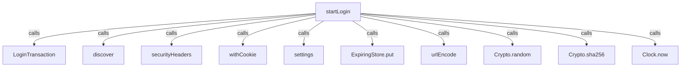
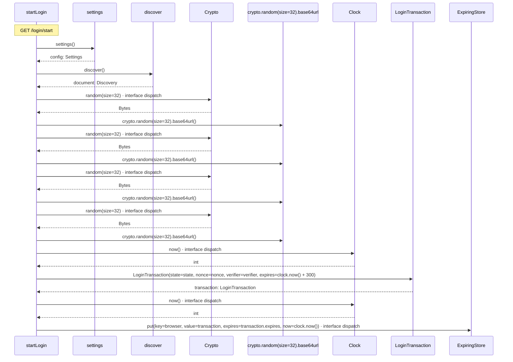
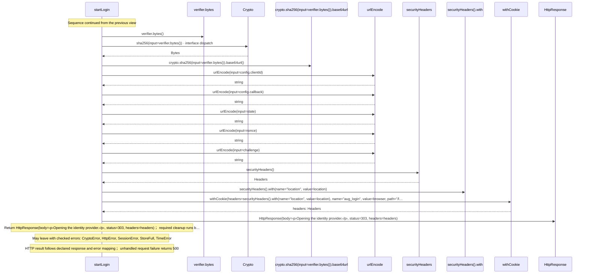
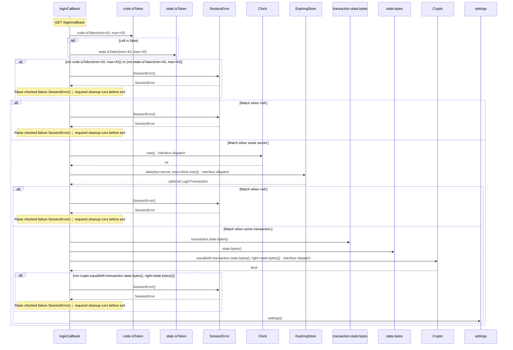
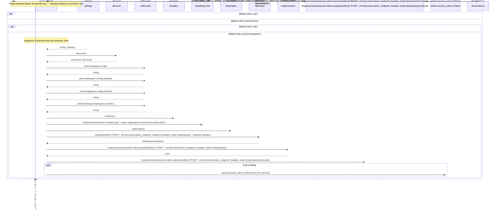
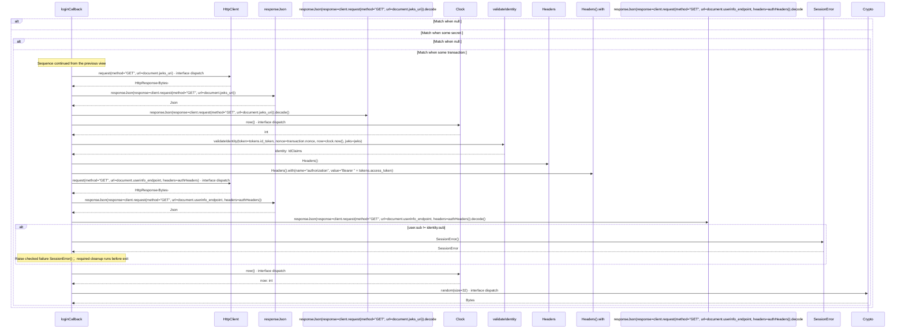
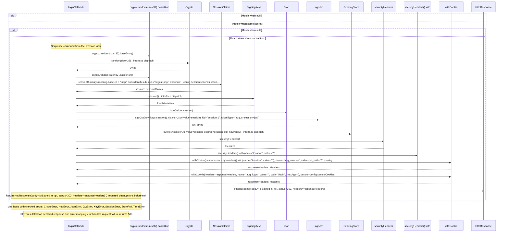

# client/login.aug diagrams

[OpenID Connect login application](../index.md)

[Project overview](../diagrams/index.md) · [Compiled explanation](login.md)

## Class interactions

```mermaid
flowchart TD
    n0["loginCallback"]
    n1["startLogin"]
    n2["discover"]
    n3["responseJson"]
    n4["validateIdentity"]
    n5["securityHeaders"]
    n6["withCookie"]
    n7["SigningKeys"]
    n8["settings"]
    n9["ExpiringStore"]
    n10["HttpClient"]
    n11["urlEncode"]
    n12["Crypto"]
    n13["signJwt"]
    n14["Clock"]
    n0 -->|"calls"| n2
    n0 -->|"calls"| n3
    n0 -->|"calls"| n4
    n0 -->|"calls"| n5
    n0 -->|"calls"| n6
    n0 -->|"calls"| n7
    n0 -->|"depends on"| n7
    n0 -->|"calls"| n8
    n0 -->|"calls"| n9
    n0 -->|"depends on"| n9
    n0 -->|"calls"| n10
    n0 -->|"depends on"| n10
    n0 -->|"calls"| n11
    n0 -->|"calls"| n12
    n0 -->|"depends on"| n12
    n0 -->|"calls"| n13
    n0 -->|"calls"| n14
    n0 -->|"depends on"| n14
    n1 -->|"calls"| n2
    n1 -->|"calls"| n5
    n1 -->|"calls"| n6
    n1 -->|"calls"| n8
    n1 -->|"calls"| n9
    n1 -->|"depends on"| n9
    n1 -->|"depends on"| n10
    n1 -->|"calls"| n11
    n1 -->|"calls"| n12
    n1 -->|"depends on"| n12
    n1 -->|"calls"| n14
    n1 -->|"depends on"| n14
```

::: details Call relationships

#### View 1 of 2

```mermaid
flowchart TD
    n0["SessionClaims"]
    n1["SessionError"]
    n2["loginCallback"]
    n3["discover"]
    n4["responseJson"]
    n5["validateIdentity"]
    n6["securityHeaders"]
    n7["withCookie"]
    n8["SigningKeys.session"]
    n9["settings"]
    n10["ExpiringStore.put"]
    n11["ExpiringStore.take"]
    n12["HttpClient.request"]
    n13["urlEncode"]
    n14["Crypto.equal"]
    n15["Crypto.random"]
    n16["signJwt"]
    n17["Clock.now"]
    n2 -->|"calls"| n0
    n2 -->|"calls"| n1
    n2 -->|"calls"| n3
    n2 -->|"calls"| n4
    n2 -->|"calls"| n5
    n2 -->|"calls"| n6
    n2 -->|"calls"| n7
    n2 -->|"calls"| n8
    n2 -->|"calls"| n9
    n2 -->|"calls"| n10
    n2 -->|"calls"| n11
    n2 -->|"calls"| n12
    n2 -->|"calls"| n13
    n2 -->|"calls"| n14
    n2 -->|"calls"| n15
    n2 -->|"calls"| n16
    n2 -->|"calls"| n17
```

#### View 2 of 2

:::

## Sequences

Call arrows identify checked targets; loop and branch frames determine when they run. Open that target’s module to follow its implementation. Branches describe alternatives; loops describe repeated work. Native calls and interface dispatch stop at their declared contracts. Exit notes end that path; enclosing recovery and cleanup remain visible.

### startLogin {#sequence-startLogin}

::: spec-paragraph specification-paragraph-1
[Source](login.md#source-L12)
:::

#### Sequence 1 of 2 (continued)

#### Sequence 2 of 2 (continued)

### loginCallback {#sequence-loginCallback}

::: spec-paragraph specification-paragraph-2
[Source](login.md#source-L27)
:::

#### Sequence 1 of 4 (continued)

#### Sequence 2 of 4 (continued)

#### Sequence 3 of 4 (continued)

#### Sequence 4 of 4 (continued)

## Called contracts

- [LoginTransaction](contracts-diagrams.md#sequence-LoginTransaction-20-constructor) — client/contracts.aug
- [SessionClaims](contracts-diagrams.md#sequence-SessionClaims-20-constructor) — client/contracts.aug
- [SessionError](contracts-diagrams.md#sequence-SessionError-20-constructor) — client/contracts.aug
- [discover](protocol-diagrams.md#sequence-discover) — client/protocol.aug
- [responseJson](protocol-diagrams.md#sequence-responseJson) — client/protocol.aug
- [validateIdentity](protocol-diagrams.md#sequence-validateIdentity) — client/protocol.aug
- [securityHeaders](../common/headers-diagrams.md#sequence-securityHeaders) — common/headers.aug
- [withCookie](../common/headers-diagrams.md#sequence-withCookie) — common/headers.aug
- [SigningKeys](../common/keys-diagrams.md) — common/keys.aug
- [SigningKeys.session](../common/keys-diagrams.md#sequence-SigningKeys.session) — common/keys.aug
- [settings](../common/settings-diagrams.md#sequence-settings) — common/settings.aug
- [ExpiringStore](../dependencies/packages/%40git/url_0eb7c89453c87681ed15/0.0.0-git.a39fc582565d4fca40be4f75fa304d71adc69301/store-diagrams.md) — package/@git/url\_0eb7c89453c87681ed15@0.0.0-git.a39fc582565d4fca40be4f75fa304d71adc69301/store.aug
- [ExpiringStore.put](../dependencies/packages/%40git/url_0eb7c89453c87681ed15/0.0.0-git.a39fc582565d4fca40be4f75fa304d71adc69301/store-diagrams.md#sequence-ExpiringStore.put) — package/@git/url\_0eb7c89453c87681ed15@0.0.0-git.a39fc582565d4fca40be4f75fa304d71adc69301/store.aug
- [ExpiringStore.take](../dependencies/packages/%40git/url_0eb7c89453c87681ed15/0.0.0-git.a39fc582565d4fca40be4f75fa304d71adc69301/store-diagrams.md#sequence-ExpiringStore.take) — package/@git/url\_0eb7c89453c87681ed15@0.0.0-git.a39fc582565d4fca40be4f75fa304d71adc69301/store.aug
- [HttpClient](../dependencies/packages/%40git/url_897efafd565158fc4908/0.0.0-git.a39fc582565d4fca40be4f75fa304d71adc69301/contracts-diagrams.md) — package/@git/url\_897efafd565158fc4908@0.0.0-git.a39fc582565d4fca40be4f75fa304d71adc69301/contracts.aug
- [HttpClient.request](../dependencies/packages/%40git/url_897efafd565158fc4908/0.0.0-git.a39fc582565d4fca40be4f75fa304d71adc69301/contracts-diagrams.md#sequence-HttpClient.request) — package/@git/url\_897efafd565158fc4908@0.0.0-git.a39fc582565d4fca40be4f75fa304d71adc69301/contracts.aug
- [urlEncode](../dependencies/packages/%40git/url_897efafd565158fc4908/0.0.0-git.a39fc582565d4fca40be4f75fa304d71adc69301/contracts-diagrams.md#sequence-urlEncode) — package/@git/url\_897efafd565158fc4908@0.0.0-git.a39fc582565d4fca40be4f75fa304d71adc69301/contracts.aug
- [Crypto](../dependencies/packages/%40git/url_9ef654c66d34ab8f5527/0.0.0-git.b14a0f9aa41f1ce58bd51133bcdc424033e40d40/contracts-diagrams.md) — package/@git/url\_9ef654c66d34ab8f5527@0.0.0-git.b14a0f9aa41f1ce58bd51133bcdc424033e40d40/contracts.aug
- [Crypto.equal](../dependencies/packages/%40git/url_9ef654c66d34ab8f5527/0.0.0-git.b14a0f9aa41f1ce58bd51133bcdc424033e40d40/contracts-diagrams.md#sequence-Crypto.equal) — package/@git/url\_9ef654c66d34ab8f5527@0.0.0-git.b14a0f9aa41f1ce58bd51133bcdc424033e40d40/contracts.aug
- [Crypto.random](../dependencies/packages/%40git/url_9ef654c66d34ab8f5527/0.0.0-git.b14a0f9aa41f1ce58bd51133bcdc424033e40d40/contracts-diagrams.md#sequence-Crypto.random) — package/@git/url\_9ef654c66d34ab8f5527@0.0.0-git.b14a0f9aa41f1ce58bd51133bcdc424033e40d40/contracts.aug
- [Crypto.sha256](../dependencies/packages/%40git/url_9ef654c66d34ab8f5527/0.0.0-git.b14a0f9aa41f1ce58bd51133bcdc424033e40d40/contracts-diagrams.md#sequence-Crypto.sha256) — package/@git/url\_9ef654c66d34ab8f5527@0.0.0-git.b14a0f9aa41f1ce58bd51133bcdc424033e40d40/contracts.aug
- [signJwt](../dependencies/packages/%40git/url_9ef654c66d34ab8f5527/0.0.0-git.b14a0f9aa41f1ce58bd51133bcdc424033e40d40/jose-diagrams.md#sequence-signJwt) — package/@git/url\_9ef654c66d34ab8f5527@0.0.0-git.b14a0f9aa41f1ce58bd51133bcdc424033e40d40/jose.aug
- [Clock](../dependencies/packages/%40git/url_c092cd151499c4e1d8a1/0.0.0-git.a39fc582565d4fca40be4f75fa304d71adc69301/contracts-diagrams.md) — package/@git/url\_c092cd151499c4e1d8a1@0.0.0-git.a39fc582565d4fca40be4f75fa304d71adc69301/contracts.aug
- [Clock.now](../dependencies/packages/%40git/url_c092cd151499c4e1d8a1/0.0.0-git.a39fc582565d4fca40be4f75fa304d71adc69301/contracts-diagrams.md#sequence-Clock.now) — package/@git/url\_c092cd151499c4e1d8a1@0.0.0-git.a39fc582565d4fca40be4f75fa304d71adc69301/contracts.aug
