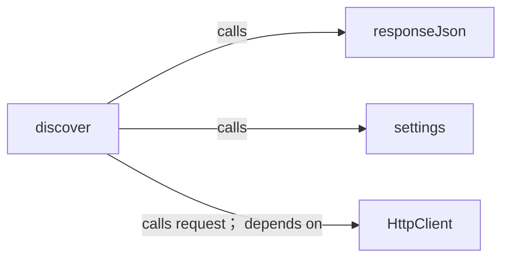
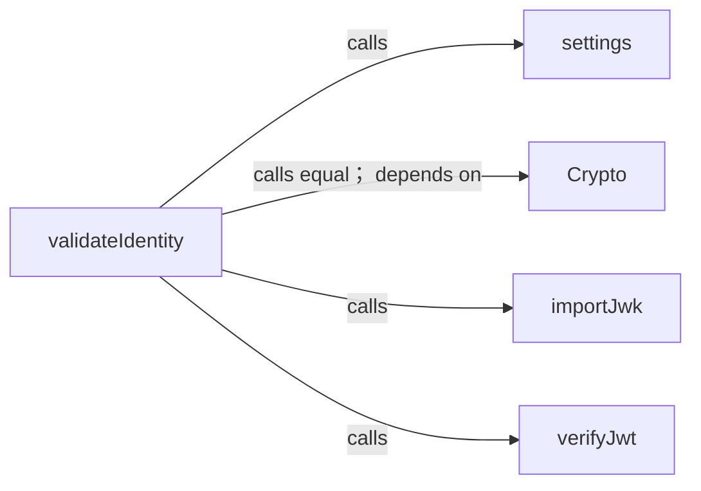
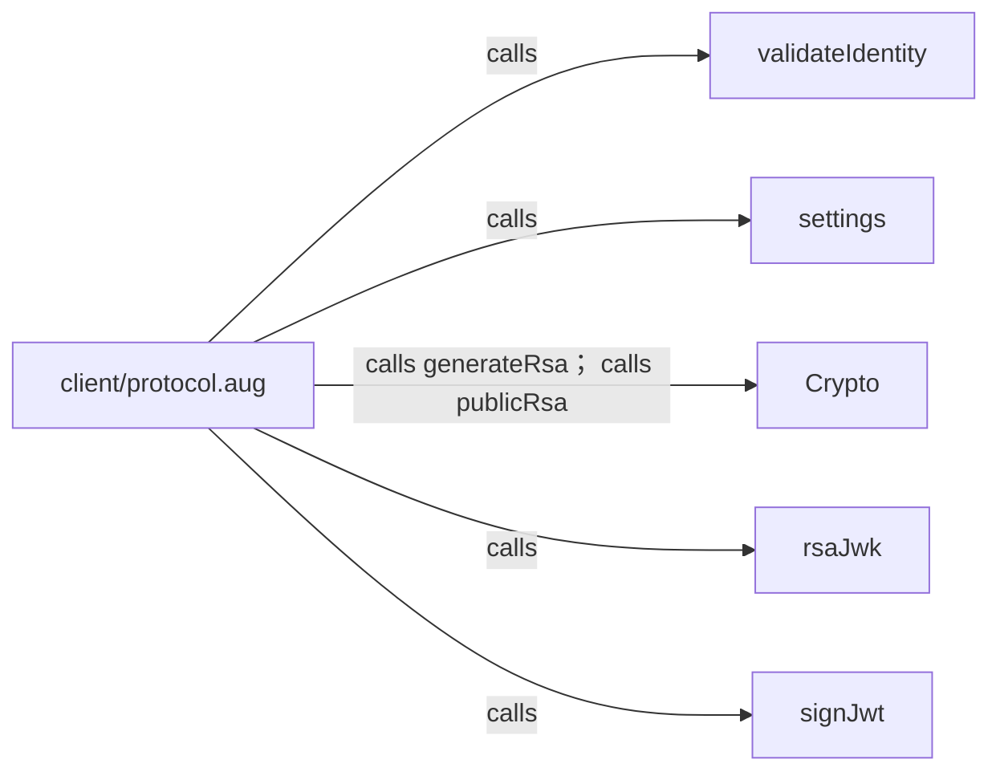
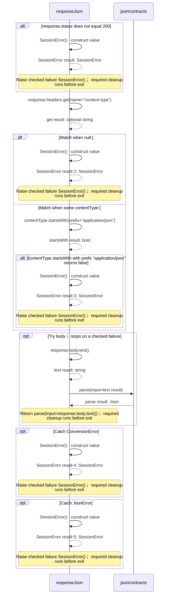
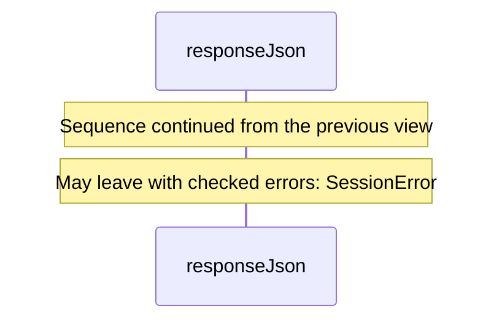
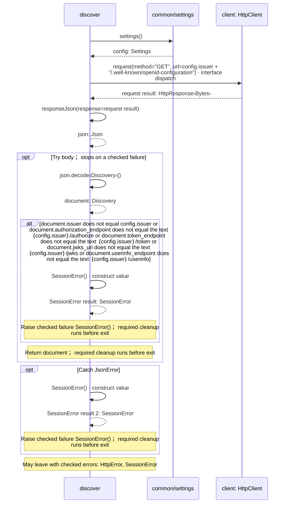
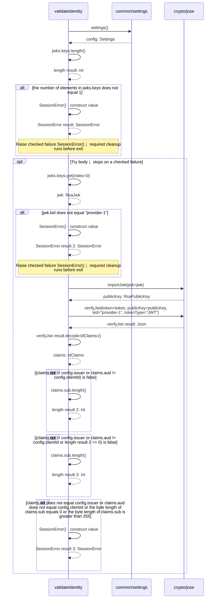
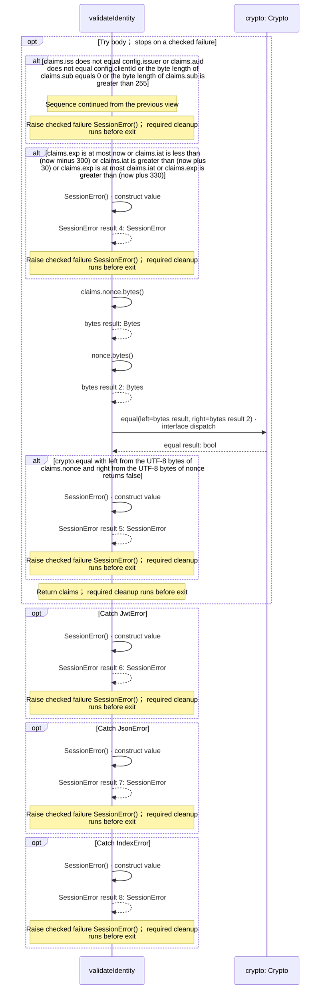
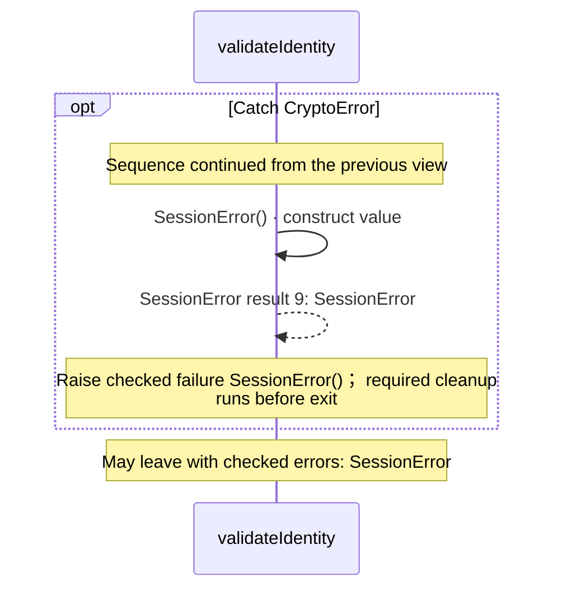

# client/protocol.aug diagrams

[OpenID Connect login application](../index.md)

[Project overview](../diagrams/index.md) · [Compiled explanation](protocol.md)

## Class interactions

### discover

### validateIdentity

### module:client/protocol.aug

## Sequences

Call arrows identify checked targets; loop and branch frames determine when they run. Open that target’s module to follow its implementation. Branches describe alternatives; loops describe repeated work. Native calls and interface dispatch stop at their declared contracts. Exit notes end that path; enclosing recovery and cleanup remain visible.

### responseJson {#sequence-responseJson}

::: spec-paragraph specification-paragraph-1
[Source](protocol.md#source-L10)
:::

Accept only a successful JSON response. Redirects remain explicit and are never followed by the transport.

It takes `response` as `HttpResponse<Bytes>`.

Failures can raise [`SessionError`](contracts.md#symbol-SessionError).

#### Sequence 1 of 2

#### Sequence 2 of 2 (continued)

### discover {#sequence-discover}

::: spec-paragraph specification-paragraph-2
[Source](protocol.md#source-L27)
:::

Discovery is fetched over HTTP. Every advertised URL is checked against the registered issuer before any credential is sent.

It gets `client` ([`HttpClient`](../dependencies/packages/%40git/url_897efafd565158fc4908/0.0.0-git.a39fc582565d4fca40be4f75fa304d71adc69301/contracts.md#symbol-HttpClient)) from dependency injection.

It can call [`HttpClient.request`](../dependencies/packages/%40git/url_897efafd565158fc4908/0.0.0-git.a39fc582565d4fca40be4f75fa304d71adc69301/contracts.md#symbol-HttpClient.request). Failures can raise `HttpError` and [`SessionError`](contracts.md#symbol-SessionError).

### validateIdentity {#sequence-validateIdentity}

::: spec-paragraph specification-paragraph-3
[Source](protocol.md#source-L39)
:::

Validate the signed ID token using a public key from this issuer's HTTP JWKS, then validate the registered claims and one-use nonce.

It takes `token` and `nonce` as strings, `now` as an integer, and `jwks` as [`RsaJwks`](../dependencies/packages/%40git/url_9ef654c66d34ab8f5527/0.0.0-git.b14a0f9aa41f1ce58bd51133bcdc424033e40d40/jose.md#symbol-RsaJwks). It gets `crypto` ([`Crypto`](../dependencies/packages/%40git/url_9ef654c66d34ab8f5527/0.0.0-git.b14a0f9aa41f1ce58bd51133bcdc424033e40d40/contracts.md#symbol-Crypto)) from dependency injection.

It can call [`Crypto.equal`](../dependencies/packages/%40git/url_9ef654c66d34ab8f5527/0.0.0-git.b14a0f9aa41f1ce58bd51133bcdc424033e40d40/contracts.md#symbol-Crypto.equal), [`Crypto.decodeBase64url`](../dependencies/packages/%40git/url_9ef654c66d34ab8f5527/0.0.0-git.b14a0f9aa41f1ce58bd51133bcdc424033e40d40/contracts.md#symbol-Crypto.decodeBase64url), [`Crypto.importRsa`](../dependencies/packages/%40git/url_9ef654c66d34ab8f5527/0.0.0-git.b14a0f9aa41f1ce58bd51133bcdc424033e40d40/contracts.md#symbol-Crypto.importRsa), and [`Crypto.verifyRsa`](../dependencies/packages/%40git/url_9ef654c66d34ab8f5527/0.0.0-git.b14a0f9aa41f1ce58bd51133bcdc424033e40d40/contracts.md#symbol-Crypto.verifyRsa). Failures can raise [`SessionError`](contracts.md#symbol-SessionError).

#### Sequence 1 of 3

#### Sequence 2 of 3 (continued)

#### Sequence 3 of 3 (continued)

## Called contracts

- [SessionError](contracts-diagrams.md#sequence-SessionError-20-constructor) — client/contracts.aug
- [responseJson](protocol-diagrams.md#sequence-responseJson) — client/protocol.aug
- [validateIdentity](protocol-diagrams.md#sequence-validateIdentity) — client/protocol.aug
- [settings](../common/settings-diagrams.md#sequence-settings) — common/settings.aug
- [parse](../dependencies/packages/%40git/url_2d3c37c690c0fa115be1/0.0.0-git.a39fc582565d4fca40be4f75fa304d71adc69301/contracts-diagrams.md#sequence-parse) — package/@git/url\_2d3c37c690c0fa115be1@0.0.0-git.a39fc582565d4fca40be4f75fa304d71adc69301/contracts.aug
- [HttpClient](../dependencies/packages/%40git/url_897efafd565158fc4908/0.0.0-git.a39fc582565d4fca40be4f75fa304d71adc69301/contracts-diagrams.md) — package/@git/url\_897efafd565158fc4908@0.0.0-git.a39fc582565d4fca40be4f75fa304d71adc69301/contracts.aug
- [HttpClient.request](../dependencies/packages/%40git/url_897efafd565158fc4908/0.0.0-git.a39fc582565d4fca40be4f75fa304d71adc69301/contracts-diagrams.md#sequence-HttpClient.request) — package/@git/url\_897efafd565158fc4908@0.0.0-git.a39fc582565d4fca40be4f75fa304d71adc69301/contracts.aug
- [Crypto](../dependencies/packages/%40git/url_9ef654c66d34ab8f5527/0.0.0-git.b14a0f9aa41f1ce58bd51133bcdc424033e40d40/contracts-diagrams.md) — package/@git/url\_9ef654c66d34ab8f5527@0.0.0-git.b14a0f9aa41f1ce58bd51133bcdc424033e40d40/contracts.aug
- [Crypto.equal](../dependencies/packages/%40git/url_9ef654c66d34ab8f5527/0.0.0-git.b14a0f9aa41f1ce58bd51133bcdc424033e40d40/contracts-diagrams.md#sequence-Crypto.equal) — package/@git/url\_9ef654c66d34ab8f5527@0.0.0-git.b14a0f9aa41f1ce58bd51133bcdc424033e40d40/contracts.aug
- [Crypto.generateRsa](../dependencies/packages/%40git/url_9ef654c66d34ab8f5527/0.0.0-git.b14a0f9aa41f1ce58bd51133bcdc424033e40d40/contracts-diagrams.md#sequence-Crypto.generateRsa) — package/@git/url\_9ef654c66d34ab8f5527@0.0.0-git.b14a0f9aa41f1ce58bd51133bcdc424033e40d40/contracts.aug
- [Crypto.publicRsa](../dependencies/packages/%40git/url_9ef654c66d34ab8f5527/0.0.0-git.b14a0f9aa41f1ce58bd51133bcdc424033e40d40/contracts-diagrams.md#sequence-Crypto.publicRsa) — package/@git/url\_9ef654c66d34ab8f5527@0.0.0-git.b14a0f9aa41f1ce58bd51133bcdc424033e40d40/contracts.aug
- [RsaJwks](../dependencies/packages/%40git/url_9ef654c66d34ab8f5527/0.0.0-git.b14a0f9aa41f1ce58bd51133bcdc424033e40d40/jose-diagrams.md#sequence-RsaJwks-20-constructor) — package/@git/url\_9ef654c66d34ab8f5527@0.0.0-git.b14a0f9aa41f1ce58bd51133bcdc424033e40d40/jose.aug
- [importJwk](../dependencies/packages/%40git/url_9ef654c66d34ab8f5527/0.0.0-git.b14a0f9aa41f1ce58bd51133bcdc424033e40d40/jose-diagrams.md#sequence-importJwk) — package/@git/url\_9ef654c66d34ab8f5527@0.0.0-git.b14a0f9aa41f1ce58bd51133bcdc424033e40d40/jose.aug
- [rsaJwk](../dependencies/packages/%40git/url_9ef654c66d34ab8f5527/0.0.0-git.b14a0f9aa41f1ce58bd51133bcdc424033e40d40/jose-diagrams.md#sequence-rsaJwk) — package/@git/url\_9ef654c66d34ab8f5527@0.0.0-git.b14a0f9aa41f1ce58bd51133bcdc424033e40d40/jose.aug
- [signJwt](../dependencies/packages/%40git/url_9ef654c66d34ab8f5527/0.0.0-git.b14a0f9aa41f1ce58bd51133bcdc424033e40d40/jose-diagrams.md#sequence-signJwt) — package/@git/url\_9ef654c66d34ab8f5527@0.0.0-git.b14a0f9aa41f1ce58bd51133bcdc424033e40d40/jose.aug
- [verifyJwt](../dependencies/packages/%40git/url_9ef654c66d34ab8f5527/0.0.0-git.b14a0f9aa41f1ce58bd51133bcdc424033e40d40/jose-diagrams.md#sequence-verifyJwt) — package/@git/url\_9ef654c66d34ab8f5527@0.0.0-git.b14a0f9aa41f1ce58bd51133bcdc424033e40d40/jose.aug
- [IdClaims](../provider/contracts-diagrams.md#sequence-IdClaims-20-constructor) — provider/contracts.aug
