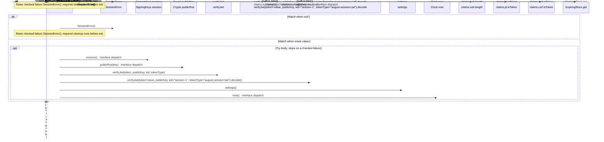
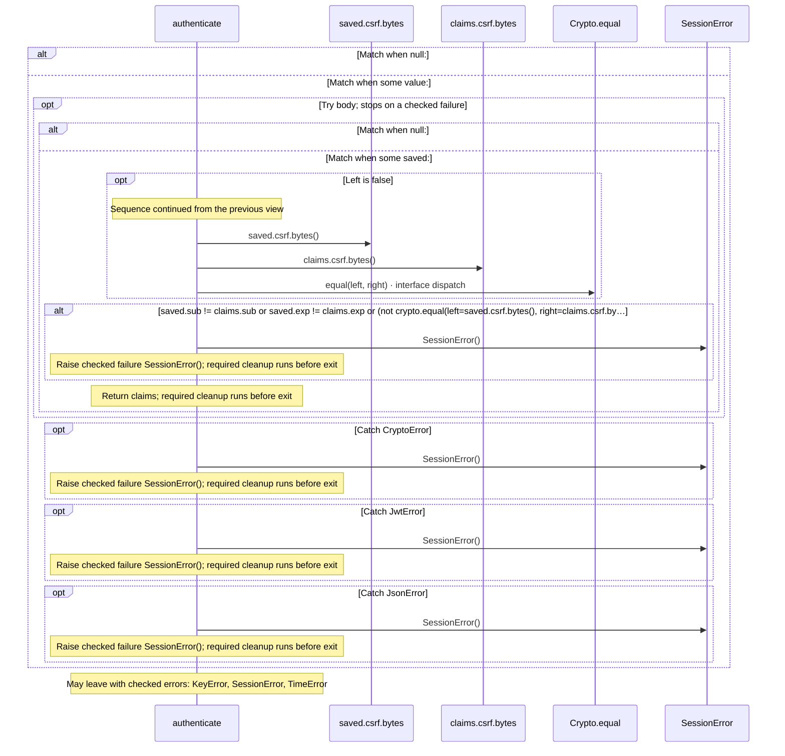

# client/session.aug diagrams

[OpenID Connect login application](../index.md)

[Project overview](../diagrams/index.md) · [Compiled explanation](session.md)

## Class interactions

```mermaid
flowchart TD
    n0["SessionError · client/contracts.aug"]
    n1["authenticate · client/session.aug"]
    n2["SigningKeys · common/keys.aug"]
    n3["settings · common/settings.aug"]
    n4["ExpiringStore · package/@git/url_0eb7c89453c87681ed15@0.0.0-git.a39fc582565d4fca40be4f75fa304d71adc69301/store.aug"]
    n5["Crypto · package/@git/url_9ef654c66d34ab8f5527@0.0.0-git.b14a0f9aa41f1ce58bd51133bcdc424033e40d40/contracts.aug"]
    n6["verifyJwt · package/@git/url_9ef654c66d34ab8f5527@0.0.0-git.b14a0f9aa41f1ce58bd51133bcdc424033e40d40/jose.aug"]
    n7["Clock · package/@git/url_c092cd151499c4e1d8a1@0.0.0-git.a39fc582565d4fca40be4f75fa304d71adc69301/contracts.aug"]
    n1 -->|"calls"| n0
    n1 -->|"calls"| n2
    n1 -->|"depends on"| n2
    n1 -->|"calls"| n3
    n1 -->|"calls"| n4
    n1 -->|"depends on"| n4
    n1 -->|"calls"| n5
    n1 -->|"depends on"| n5
    n1 -->|"calls"| n6
    n1 -->|"calls"| n7
    n1 -->|"depends on"| n7
```

## API calls

```mermaid
flowchart TD
    n0["SessionError · client/contracts.aug"]
    n1["authenticate · client/session.aug"]
    n2["SigningKeys.session · common/keys.aug"]
    n3["settings · common/settings.aug"]
    n4["ExpiringStore.get · package/@git/url_0eb7c89453c87681ed15@0.0.0-git.a39fc582565d4fca40be4f75fa304d71adc69301/store.aug"]
    n5["Crypto.equal · package/@git/url_9ef654c66d34ab8f5527@0.0.0-git.b14a0f9aa41f1ce58bd51133bcdc424033e40d40/contracts.aug"]
    n6["Crypto.publicRsa · package/@git/url_9ef654c66d34ab8f5527@0.0.0-git.b14a0f9aa41f1ce58bd51133bcdc424033e40d40/contracts…"]
    n7["verifyJwt · package/@git/url_9ef654c66d34ab8f5527@0.0.0-git.b14a0f9aa41f1ce58bd51133bcdc424033e40d40/jose.aug"]
    n8["Clock.now · package/@git/url_c092cd151499c4e1d8a1@0.0.0-git.a39fc582565d4fca40be4f75fa304d71adc69301/contracts.aug"]
    n1 -->|"calls"| n0
    n1 -->|"calls"| n2
    n1 -->|"calls"| n3
    n1 -->|"calls"| n4
    n1 -->|"calls"| n5
    n1 -->|"calls"| n6
    n1 -->|"calls"| n7
    n1 -->|"calls"| n8
```

## Sequences

Call arrows identify checked targets; loop and branch frames determine when they run. Open that target’s module to follow its implementation. Branches describe alternatives; loops describe repeated work. Native calls and interface dispatch stop at their declared contracts. Exit notes end that path; enclosing recovery and cleanup remain visible.

### authenticate {#sequence-authenticate}

::: spec-paragraph specification-paragraph-1
[Source](session.md#source-L9)
:::

#### Sequence 1 of 2 (continued)

#### Sequence 2 of 2 (continued)

## Called contracts

- [SessionError](contracts-diagrams.md#sequence-SessionError-20-constructor) — client/contracts.aug
- [SigningKeys](../common/keys-diagrams.md) — common/keys.aug
- [SigningKeys.session](../common/keys-diagrams.md#sequence-SigningKeys.session) — common/keys.aug
- [settings](../common/settings-diagrams.md#sequence-settings) — common/settings.aug
- [ExpiringStore](../dependencies/packages/%40git/url_0eb7c89453c87681ed15/0.0.0-git.a39fc582565d4fca40be4f75fa304d71adc69301/store-diagrams.md) — package/@git/url\_0eb7c89453c87681ed15@0.0.0-git.a39fc582565d4fca40be4f75fa304d71adc69301/store.aug
- [ExpiringStore.get](../dependencies/packages/%40git/url_0eb7c89453c87681ed15/0.0.0-git.a39fc582565d4fca40be4f75fa304d71adc69301/store-diagrams.md#sequence-ExpiringStore.get) — package/@git/url\_0eb7c89453c87681ed15@0.0.0-git.a39fc582565d4fca40be4f75fa304d71adc69301/store.aug
- [Crypto](../dependencies/packages/%40git/url_9ef654c66d34ab8f5527/0.0.0-git.b14a0f9aa41f1ce58bd51133bcdc424033e40d40/contracts-diagrams.md) — package/@git/url\_9ef654c66d34ab8f5527@0.0.0-git.b14a0f9aa41f1ce58bd51133bcdc424033e40d40/contracts.aug
- [Crypto.equal](../dependencies/packages/%40git/url_9ef654c66d34ab8f5527/0.0.0-git.b14a0f9aa41f1ce58bd51133bcdc424033e40d40/contracts-diagrams.md#sequence-Crypto.equal) — package/@git/url\_9ef654c66d34ab8f5527@0.0.0-git.b14a0f9aa41f1ce58bd51133bcdc424033e40d40/contracts.aug
- [Crypto.publicRsa](../dependencies/packages/%40git/url_9ef654c66d34ab8f5527/0.0.0-git.b14a0f9aa41f1ce58bd51133bcdc424033e40d40/contracts-diagrams.md#sequence-Crypto.publicRsa) — package/@git/url\_9ef654c66d34ab8f5527@0.0.0-git.b14a0f9aa41f1ce58bd51133bcdc424033e40d40/contracts.aug
- [verifyJwt](../dependencies/packages/%40git/url_9ef654c66d34ab8f5527/0.0.0-git.b14a0f9aa41f1ce58bd51133bcdc424033e40d40/jose-diagrams.md#sequence-verifyJwt) — package/@git/url\_9ef654c66d34ab8f5527@0.0.0-git.b14a0f9aa41f1ce58bd51133bcdc424033e40d40/jose.aug
- [Clock](../dependencies/packages/%40git/url_c092cd151499c4e1d8a1/0.0.0-git.a39fc582565d4fca40be4f75fa304d71adc69301/contracts-diagrams.md) — package/@git/url\_c092cd151499c4e1d8a1@0.0.0-git.a39fc582565d4fca40be4f75fa304d71adc69301/contracts.aug
- [Clock.now](../dependencies/packages/%40git/url_c092cd151499c4e1d8a1/0.0.0-git.a39fc582565d4fca40be4f75fa304d71adc69301/contracts-diagrams.md#sequence-Clock.now) — package/@git/url\_c092cd151499c4e1d8a1@0.0.0-git.a39fc582565d4fca40be4f75fa304d71adc69301/contracts.aug
