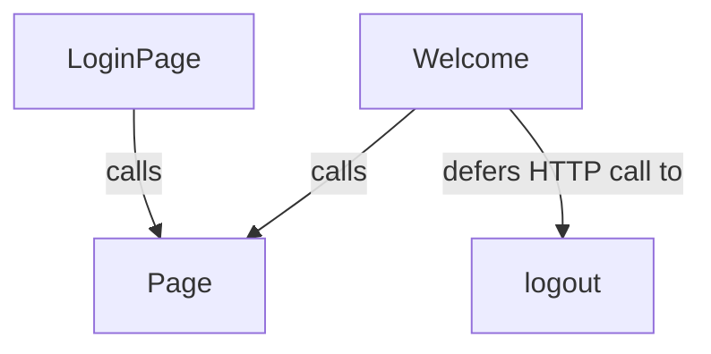
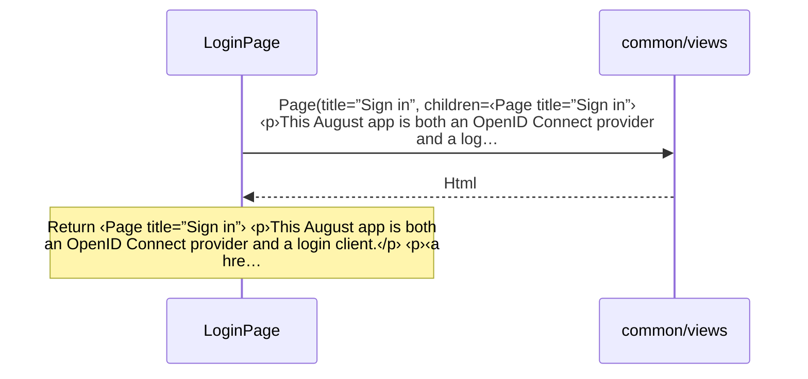
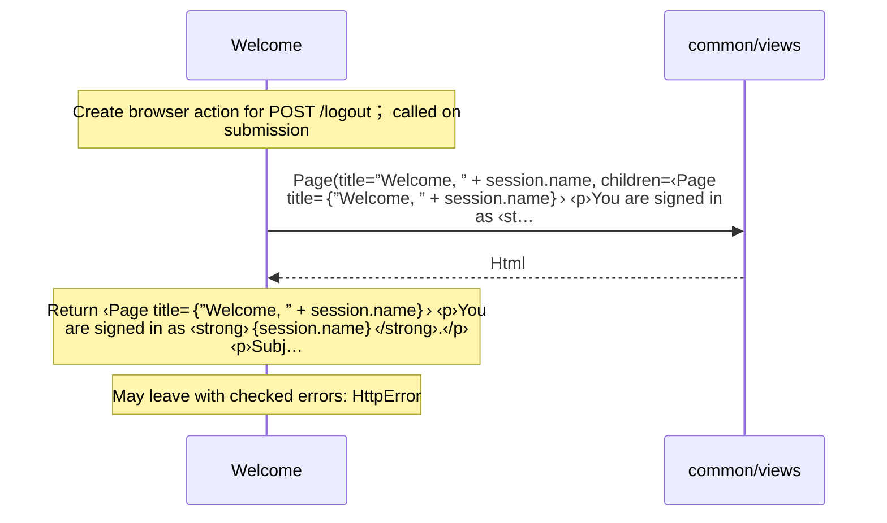

# client/views.aug diagrams

[OpenID Connect login application](../index.md)

[Project overview](../diagrams/index.md) · [Compiled explanation](views.md)

::: details Call relationships

:::

## Sequences

Call arrows identify checked targets; loop and branch frames determine when they run. Open that target’s module to follow its implementation. Branches describe alternatives; loops describe repeated work. Native calls and interface dispatch stop at their declared contracts. Exit notes end that path; enclosing recovery and cleanup remain visible.

### LoginPage {#sequence-LoginPage}

::: spec-paragraph specification-paragraph-1
[Source](views.md#source-L6)
:::

### Welcome {#sequence-Welcome}

::: spec-paragraph specification-paragraph-2
[Source](views.md#source-L13)
:::

## Called contracts

- [logout](logout-diagrams.md#sequence-logout) — client/logout.aug
- [Page](../common/views-diagrams.md#sequence-Page) — common/views.aug
