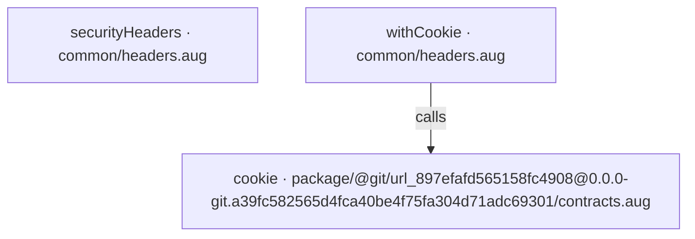
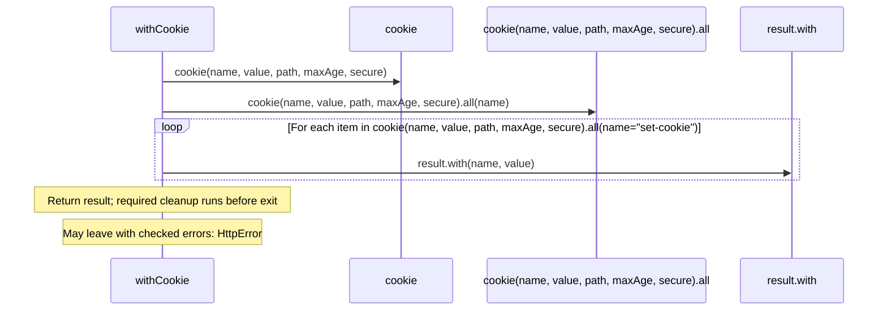

# common/headers.aug diagrams

[OpenID Connect login application](../index.md)

[Project overview](../diagrams/index.md) · [Compiled explanation](headers.md)

## Class interactions

No relationships at this level.

## API calls

## Sequences

Call arrows identify checked targets; loop and branch frames determine when they run. Open that target’s module to follow its implementation. Branches describe alternatives; loops describe repeated work. Native calls and interface dispatch stop at their declared contracts. Exit notes end that path; enclosing recovery and cleanup remain visible.

### securityHeaders {#sequence-securityHeaders}

::: spec-paragraph specification-paragraph-1
[Source](headers.md#source-L3)
:::

```mermaid
sequenceDiagram
    participant p0 as securityHeaders
    participant p1 as Headers
    participant p2 as Headers().with
    participant p3 as Headers().with(name=#34;cache-control#34;, value=#34;no-store#34;).with
    participant p4 as Headers().with(name=#34;cache-control#34;, value=#34;no-store#34;).with(name=#34;pragma#34;, value=#34;no-cache#34;).with
    participant p5 as Headers().with(name=#34;cache-control#34;, value=#34;no-store#34;).with(name=#34;pragma#34;, value=#34;no-cache#34;).with(name=#34;x-content-typ…
    participant p6 as Headers().with(name=#34;cache-control#34;, value=#34;no-store#34;).with(name=#34;pragma#34;, value=#34;no-cache#34;).with(name=#34;x-content-typ…
    p0->>p1: Headers()
    p0->>p2: Headers().with(name, value)
    p0->>p3: Headers().with(name=#34;cache-control#34;, value=#34;no-store#34;).with(name, value)
    p0->>p4: Headers().with(name=#34;cache-control#34;, value=#34;no-store#34;).with(name=#34;pragma#34;, value=#34;no-cache#34;).with(name, value)
    p0->>p5: Headers().with(name=#34;cache-control#34;, value=#34;no-store#34;).with(name=#34;pragma#34;, value=#34;no-cache#34;).with(name=#34;x-content-typ…
    p0->>p6: Headers().with(name=#34;cache-control#34;, value=#34;no-store#34;).with(name=#34;pragma#34;, value=#34;no-cache#34;).with(name=#34;x-content-typ…
    Note over p0: Return Headers().with(name=#34;cache-control#34;, value=#34;no-store#34;).with(name=#34;pragma#34;, value=#34;no-cache#34;).with(name=#34;x-cont…
    Note over p0: May leave with checked errors: HttpError
```

### withCookie {#sequence-withCookie}

::: spec-paragraph specification-paragraph-2
[Source](headers.md#source-L7)
:::

## Called contracts

- [cookie](../dependencies/packages/%40git/url_897efafd565158fc4908/0.0.0-git.a39fc582565d4fca40be4f75fa304d71adc69301/contracts-diagrams.md#sequence-cookie) — package/@git/url\_897efafd565158fc4908@0.0.0-git.a39fc582565d4fca40be4f75fa304d71adc69301/contracts.aug
