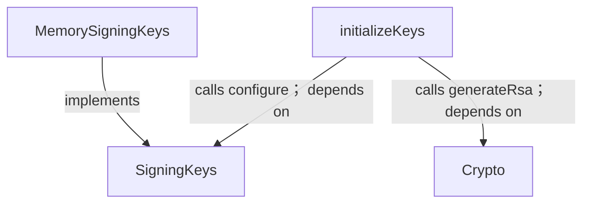
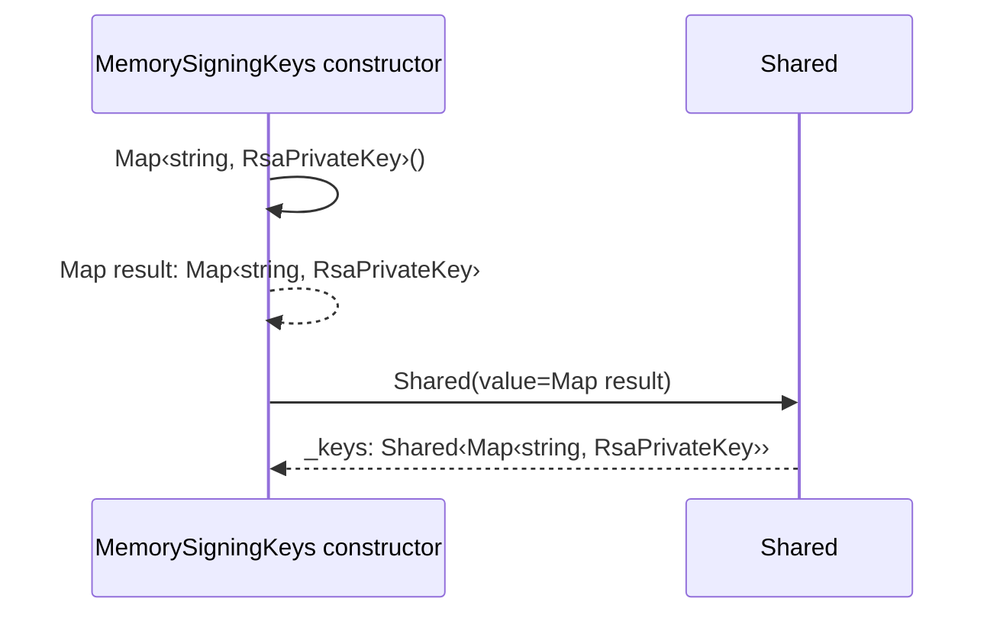
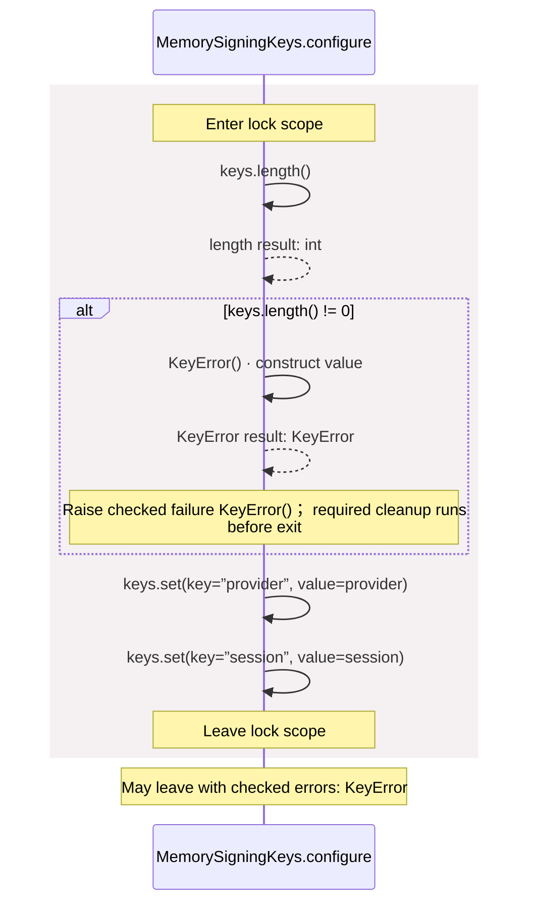
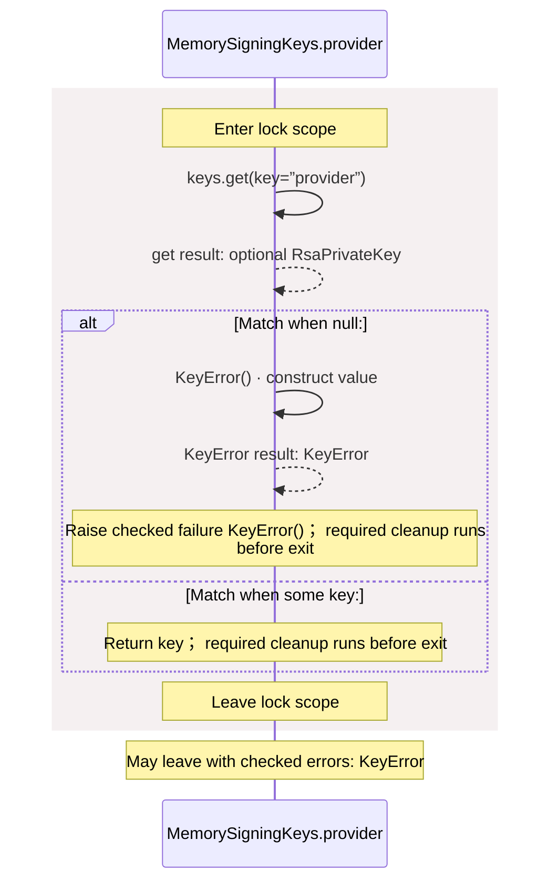
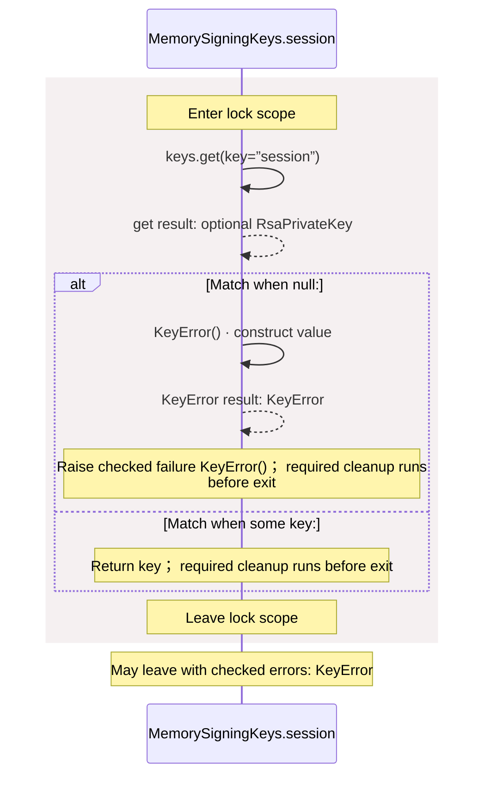
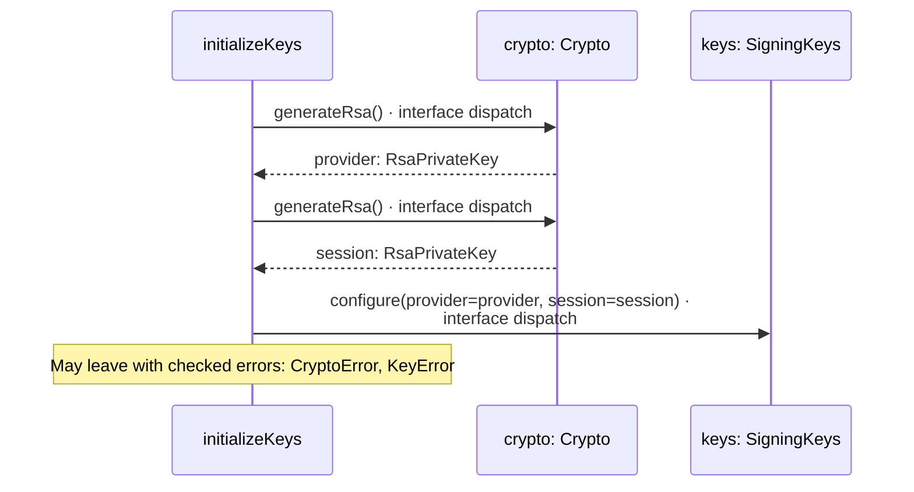

# common/keys.aug diagrams

[OpenID Connect login application](../index.md)

[Project overview](../diagrams/index.md) · [Compiled explanation](keys.md)

## Class interactions

## Sequences

Call arrows identify checked targets; loop and branch frames determine when they run. Open that target’s module to follow its implementation. Branches describe alternatives; loops describe repeated work. Native calls and interface dispatch stop at their declared contracts. Exit notes end that path; enclosing recovery and cleanup remain visible.

### KeyError constructor {#sequence-KeyError-20-constructor}

::: spec-paragraph specification-paragraph-1
[Source](keys.md#source-L4)
:::

[Explanation](keys.md).

### SigningKeys.configure {#sequence-SigningKeys.configure}

::: spec-paragraph specification-paragraph-2
[Source](keys.md#source-L8)
:::

May leave with checked errors: KeyError. Interface contract; implementation selected at runtime. [Explanation](keys.md).

### SigningKeys.provider {#sequence-SigningKeys.provider}

::: spec-paragraph specification-paragraph-3
[Source](keys.md#source-L9)
:::

May leave with checked errors: KeyError. Interface contract; implementation selected at runtime. [Explanation](keys.md).

### SigningKeys.session {#sequence-SigningKeys.session}

::: spec-paragraph specification-paragraph-4
[Source](keys.md#source-L10)
:::

May leave with checked errors: KeyError. Interface contract; implementation selected at runtime. [Explanation](keys.md).

### MemorySigningKeys constructor {#sequence-MemorySigningKeys-20-constructor}

::: spec-paragraph specification-paragraph-5
[Source](keys.md#source-L12)
:::

### MemorySigningKeys.configure {#sequence-MemorySigningKeys.configure}

::: spec-paragraph specification-paragraph-6
[Source](keys.md#source-L14)
:::

### MemorySigningKeys.provider {#sequence-MemorySigningKeys.provider}

::: spec-paragraph specification-paragraph-7
[Source](keys.md#source-L20)
:::

### MemorySigningKeys.session {#sequence-MemorySigningKeys.session}

::: spec-paragraph specification-paragraph-8
[Source](keys.md#source-L27)
:::

### initializeKeys {#sequence-initializeKeys}

::: spec-paragraph specification-paragraph-9
[Source](keys.md#source-L35)
:::

## Called contracts

- [KeyError](keys-diagrams.md#sequence-KeyError-20-constructor) — common/keys.aug
- [SigningKeys](keys-diagrams.md) — common/keys.aug
- [SigningKeys.configure](keys-diagrams.md#sequence-SigningKeys.configure) — common/keys.aug
- [Crypto](../dependencies/packages/%40git/url_9ef654c66d34ab8f5527/0.0.0-git.b14a0f9aa41f1ce58bd51133bcdc424033e40d40/contracts-diagrams.md) — package/@git/url\_9ef654c66d34ab8f5527@0.0.0-git.b14a0f9aa41f1ce58bd51133bcdc424033e40d40/contracts.aug
- [Crypto.generateRsa](../dependencies/packages/%40git/url_9ef654c66d34ab8f5527/0.0.0-git.b14a0f9aa41f1ce58bd51133bcdc424033e40d40/contracts-diagrams.md#sequence-Crypto.generateRsa) — package/@git/url\_9ef654c66d34ab8f5527@0.0.0-git.b14a0f9aa41f1ce58bd51133bcdc424033e40d40/contracts.aug
