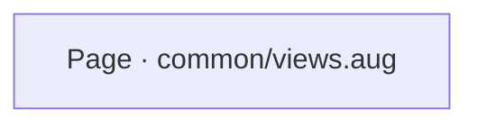
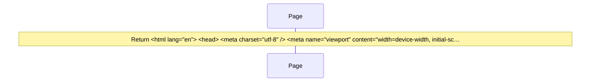

# common/views.aug diagrams

[OpenID Connect login application](../index.md)

[Project overview](../diagrams/index.md) · [Compiled explanation](views.md)

## Class interactions

No relationships at this level.

## API calls

## Sequences

Call arrows identify checked targets; loop and branch frames determine when they run. Open that target’s module to follow its implementation. Branches describe alternatives; loops describe repeated work. Native calls and interface dispatch stop at their declared contracts. Exit notes end that path; enclosing recovery and cleanup remain visible.

### Page {#sequence-Page}

::: spec-paragraph specification-paragraph-1
[Source](views.md#source-L3)
:::

