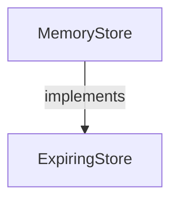
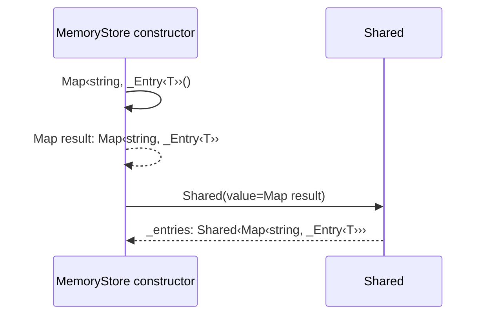
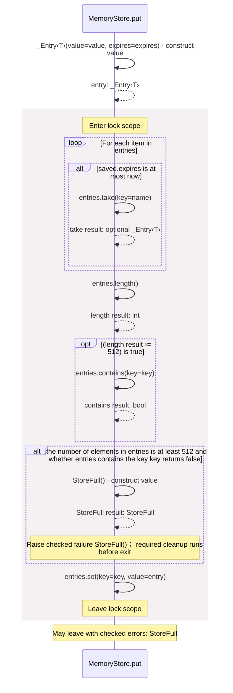
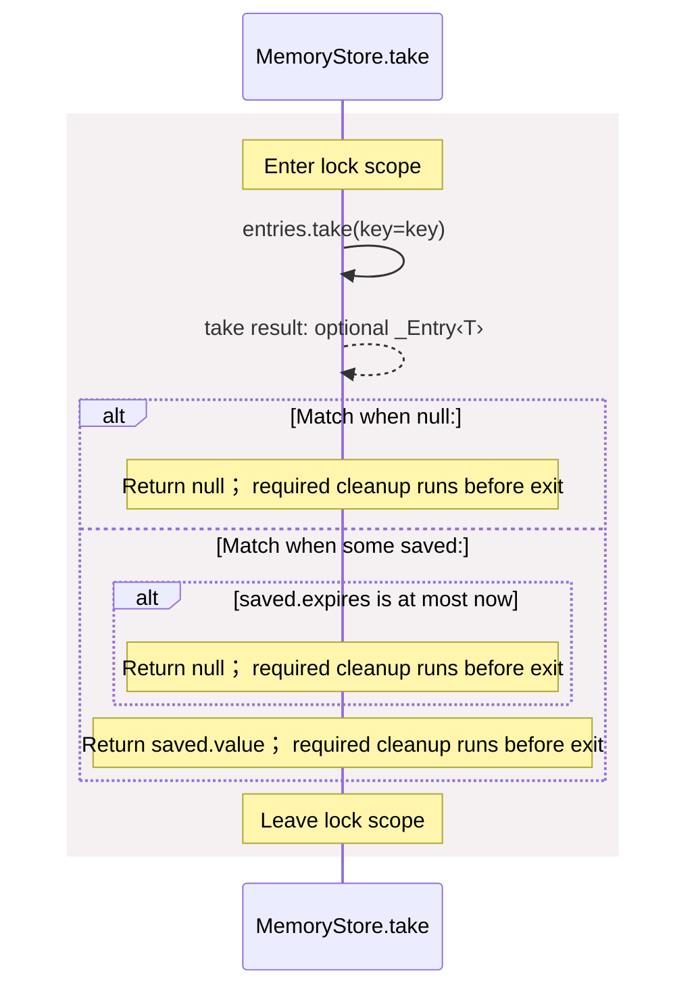

# package/@git/url\_0eb7c89453c87681ed15@0.0.0-git.a39fc582565d4fca40be4f75fa304d71adc69301/store.aug diagrams

[OpenID Connect login application](../../../../../index.md)

[Project overview](../../../../../diagrams/index.md) · [Compiled explanation](store.md)

## Class interactions

## Sequences

Call arrows identify checked targets; loop and branch frames determine when they run. Open that target’s module to follow its implementation. Branches describe alternatives; loops describe repeated work. Native calls and interface dispatch stop at their declared contracts. Exit notes end that path; enclosing recovery and cleanup remain visible.

### StoreFull constructor {#sequence-StoreFull-20-constructor}

::: spec-paragraph specification-paragraph-1
[Source](store.md#source-L3)
:::

The bounded store could not accept another live entry. It implements `Error`.

[Explanation](store.md).

### \_Entry constructor {#sequence-_Entry-20-constructor}

::: spec-paragraph specification-paragraph-2
[Source](store.md#source-L5)
:::

It is private to this file. The type parameters are `T` which must satisfy `Data`.

It takes `value` as `T`, kept read-only and `expires` as an integer, kept read-only.

Receive fields: value, expires. [Explanation](store.md).

### ExpiringStore.put {#sequence-ExpiringStore.put}

::: spec-paragraph specification-paragraph-3
[Source](store.md#source-L10)
:::

Remove expired entries, then store at most 512 live entries. Time is supplied by the caller.

It takes `key` as a string, `value` as `T`, and `expires` and `now` as integers.

It can call [`ExpiringStore.put`](store.md#symbol-ExpiringStore.put). Failures can raise [`StoreFull`](store.md#symbol-StoreFull).

May leave with checked errors: StoreFull. Interface contract; implementation selected at runtime. [Explanation](store.md).

### ExpiringStore.take {#sequence-ExpiringStore.take}

::: spec-paragraph specification-paragraph-4
[Source](store.md#source-L12)
:::

Atomically remove a value. Expired or absent entries return null.

It takes `key` as a string and `now` as an integer.

It returns `optional T`. It can call [`ExpiringStore.take`](store.md#symbol-ExpiringStore.take).

Interface contract; implementation selected at runtime. [Explanation](store.md).

### ExpiringStore.get {#sequence-ExpiringStore.get}

::: spec-paragraph specification-paragraph-5
[Source](store.md#source-L14)
:::

Read a live value without consuming it.

It takes `key` as a string and `now` as an integer.

It returns `optional T`. It can call [`ExpiringStore.get`](store.md#symbol-ExpiringStore.get).

Interface contract; implementation selected at runtime. [Explanation](store.md).

### MemoryStore constructor {#sequence-MemoryStore-20-constructor}

::: spec-paragraph specification-paragraph-6
[Source](store.md#source-L17)
:::

A synchronized table with short critical sections and no I/O while locked. It implements [`ExpiringStore<T>`](store.md#symbol-ExpiringStore). The type parameters are `T` which must satisfy `Data`.

The read-only, private field `_entries` has type `Shared<Map<string,_Entry<T>>>` and starts as a `Shared` with `value` from an empty map from `string` to [`_Entry<T>`](store.md#symbol-_Entry).

### MemoryStore.put {#sequence-MemoryStore.put}

::: spec-paragraph specification-paragraph-7
[Source](store.md#source-L19)
:::

Remove expired entries, then store at most 512 live entries. Time is supplied by the caller.

It takes `key` as a string, `value` as `T`, and `expires` and `now` as integers.

It can call [`ExpiringStore<T>.put`](store.md#symbol-ExpiringStore.put). Failures can raise [`StoreFull`](store.md#symbol-StoreFull).

### MemoryStore.take {#sequence-MemoryStore.take}

::: spec-paragraph specification-paragraph-8
[Source](store.md#source-L28)
:::

Atomically remove a value. Expired or absent entries return null.

It takes `key` as a string and `now` as an integer.

It can call [`ExpiringStore<T>.take`](store.md#symbol-ExpiringStore.take).

### MemoryStore.get {#sequence-MemoryStore.get}

::: spec-paragraph specification-paragraph-9
[Source](store.md#source-L37)
:::

Read a live value without consuming it.

It takes `key` as a string and `now` as an integer.

It can call [`ExpiringStore<T>.get`](store.md#symbol-ExpiringStore.get).

## Called contracts

- [ExpiringStore](store-diagrams.md) — package/@git/url\_0eb7c89453c87681ed15@0.0.0-git.a39fc582565d4fca40be4f75fa304d71adc69301/store.aug
- [StoreFull](store-diagrams.md#sequence-StoreFull-20-constructor) — package/@git/url\_0eb7c89453c87681ed15@0.0.0-git.a39fc582565d4fca40be4f75fa304d71adc69301/store.aug
- [\_Entry](store-diagrams.md#sequence-_Entry-20-constructor) — package/@git/url\_0eb7c89453c87681ed15@0.0.0-git.a39fc582565d4fca40be4f75fa304d71adc69301/store.aug
