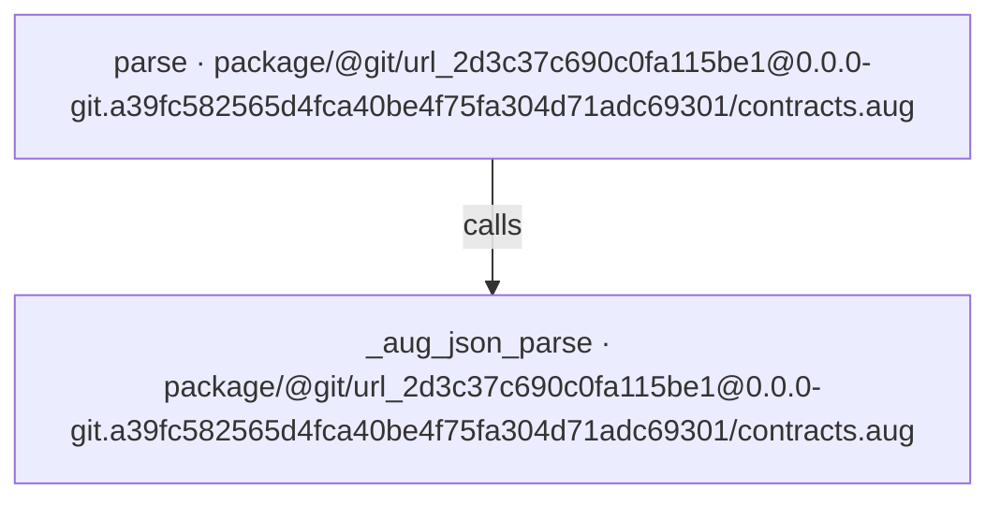
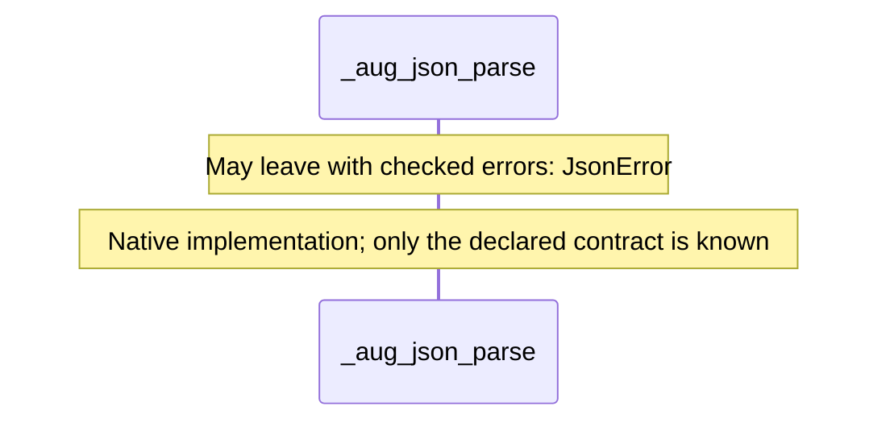
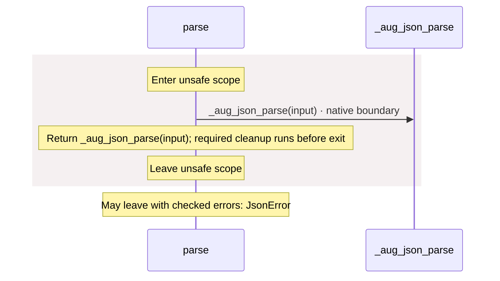

# package/@git/url\_2d3c37c690c0fa115be1@0.0.0-git.a39fc582565d4fca40be4f75fa304d71adc69301/contracts.aug diagrams

[OpenID Connect login application](../../../../../index.md)

[Project overview](../../../../../diagrams/index.md) · [Compiled explanation](contracts.md)

## Class interactions

No relationships at this level.

## API calls

## Sequences

Call arrows identify checked targets; loop and branch frames determine when they run. Open that target’s module to follow its implementation. Branches describe alternatives; loops describe repeated work. Native calls and interface dispatch stop at their declared contracts. Exit notes end that path; enclosing recovery and cleanup remain visible.

### \_aug\_json\_parse {#sequence-_aug_json_parse}

::: spec-paragraph specification-paragraph-1
[Source](contracts.md#source-L2)
:::

### parse {#sequence-parse}

::: spec-paragraph specification-paragraph-2
[Source](contracts.md#source-L4)
:::

## Called contracts

- [\_aug\_json\_parse](contracts-diagrams.md#sequence-_aug_json_parse) — package/@git/url\_2d3c37c690c0fa115be1@0.0.0-git.a39fc582565d4fca40be4f75fa304d71adc69301/contracts.aug
