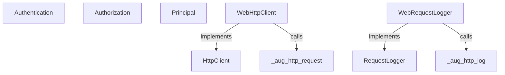
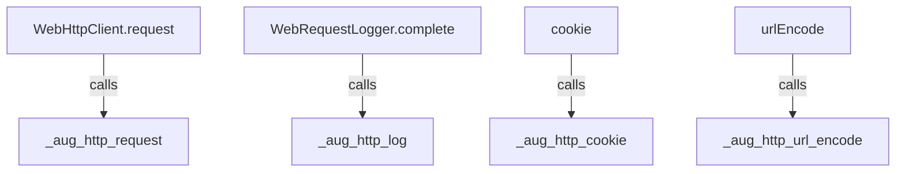
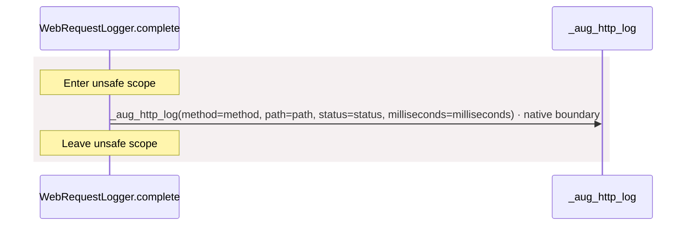
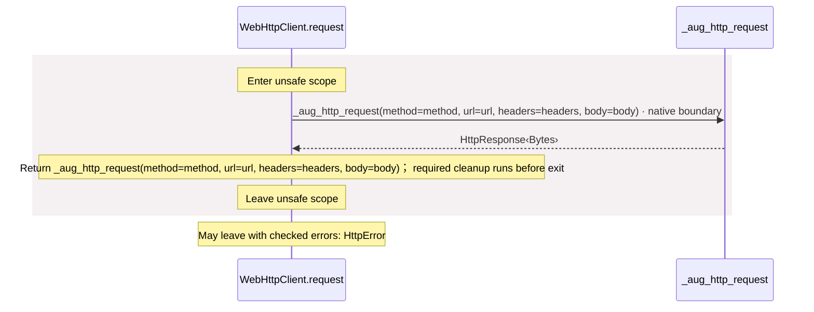
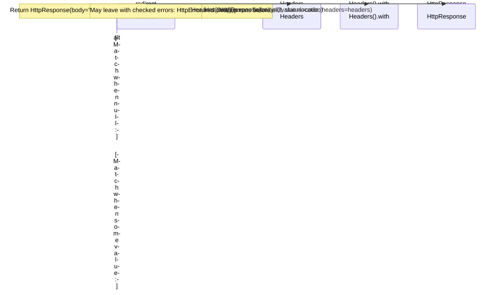
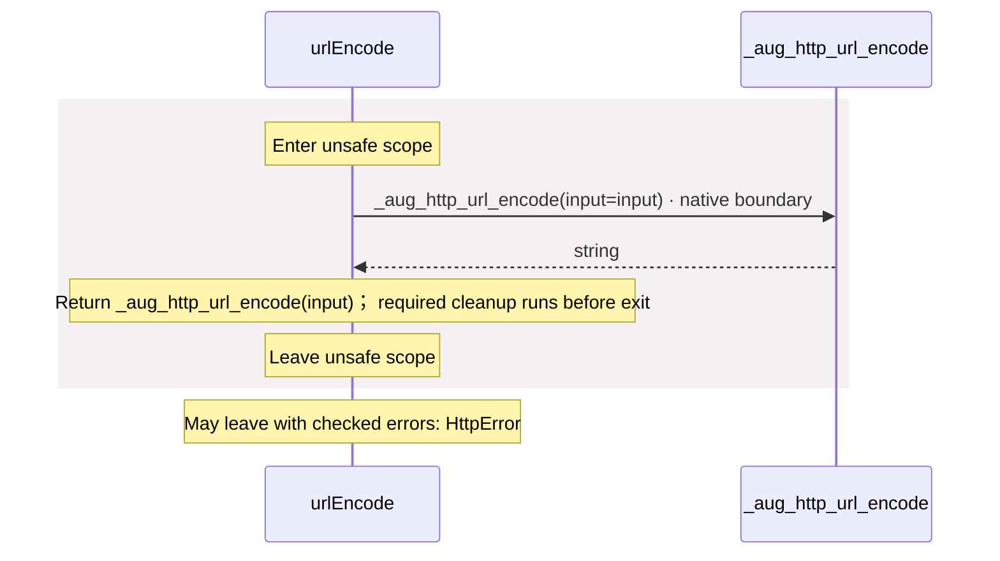
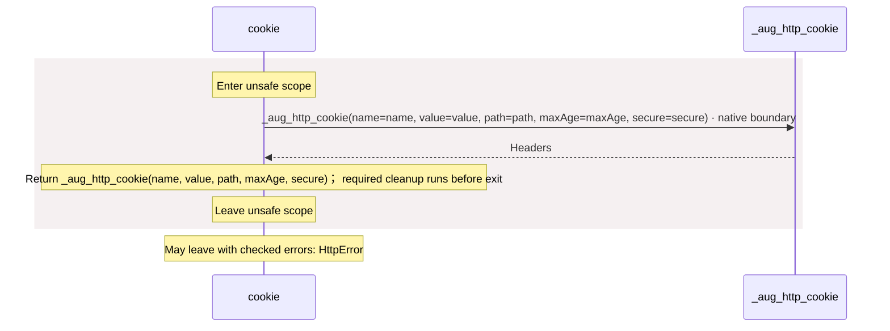

# package/@git/url\_897efafd565158fc4908@0.0.0-git.a39fc582565d4fca40be4f75fa304d71adc69301/contracts.aug diagrams

[OpenID Connect login application](../../../../../index.md)

[Project overview](../../../../../diagrams/index.md) · [Compiled explanation](contracts.md)

## Class interactions

::: details Call relationships

:::

## Sequences

Call arrows identify checked targets; loop and branch frames determine when they run. Open that target’s module to follow its implementation. Branches describe alternatives; loops describe repeated work. Native calls and interface dispatch stop at their declared contracts. Exit notes end that path; enclosing recovery and cleanup remain visible.

### Principal constructor {#sequence-Principal-20-constructor}

::: spec-paragraph specification-paragraph-1
[Source](contracts.md#source-L3)
:::

Receive fields: subject, permissions. [Explanation](contracts.md).

### Authentication.authenticate {#sequence-Authentication.authenticate}

::: spec-paragraph specification-paragraph-2
[Source](contracts.md#source-L7)
:::

May leave with checked errors: HttpError. Interface contract; implementation selected at runtime. [Explanation](contracts.md).

### Authorization.authorize {#sequence-Authorization.authorize}

::: spec-paragraph specification-paragraph-3
[Source](contracts.md#source-L11)
:::

May leave with checked errors: HttpError. Interface contract; implementation selected at runtime. [Explanation](contracts.md).

### RequestLogger.complete {#sequence-RequestLogger.complete}

::: spec-paragraph specification-paragraph-4
[Source](contracts.md#source-L15)
:::

Interface contract; implementation selected at runtime. [Explanation](contracts.md).

### \_aug\_http\_log {#sequence-_aug_http_log}

::: spec-paragraph specification-paragraph-5
[Source](contracts.md#source-L17)
:::

Native implementation; only the declared contract is known. [Explanation](contracts.md).

### WebRequestLogger constructor {#sequence-WebRequestLogger-20-constructor}

::: spec-paragraph specification-paragraph-6
[Source](contracts.md#source-L19)
:::

[Explanation](contracts.md).

### WebRequestLogger.complete {#sequence-WebRequestLogger.complete}

::: spec-paragraph specification-paragraph-7
[Source](contracts.md#source-L20)
:::

### HttpClient.request {#sequence-HttpClient.request}

::: spec-paragraph specification-paragraph-8
[Source](contracts.md#source-L27)
:::

May leave with checked errors: HttpError. Interface contract; implementation selected at runtime. [Explanation](contracts.md).

### \_aug\_http\_request {#sequence-_aug_http_request}

::: spec-paragraph specification-paragraph-9
[Source](contracts.md#source-L29)
:::

May leave with checked errors: HttpError. Native implementation; only the declared contract is known. [Explanation](contracts.md).

### WebHttpClient constructor {#sequence-WebHttpClient-20-constructor}

::: spec-paragraph specification-paragraph-10
[Source](contracts.md#source-L32)
:::

[Explanation](contracts.md).

### WebHttpClient.request {#sequence-WebHttpClient.request}

::: spec-paragraph specification-paragraph-11
[Source](contracts.md#source-L33)
:::

### redirect {#sequence-redirect}

::: spec-paragraph specification-paragraph-12
[Source](contracts.md#source-L38)
:::

### \_aug\_http\_url\_encode {#sequence-_aug_http_url_encode}

::: spec-paragraph specification-paragraph-13
[Source](contracts.md#source-L48)
:::

May leave with checked errors: HttpError. Native implementation; only the declared contract is known. [Explanation](contracts.md).

### urlEncode {#sequence-urlEncode}

::: spec-paragraph specification-paragraph-14
[Source](contracts.md#source-L50)
:::

### \_aug\_http\_cookie {#sequence-_aug_http_cookie}

::: spec-paragraph specification-paragraph-15
[Source](contracts.md#source-L54)
:::

May leave with checked errors: HttpError. Native implementation; only the declared contract is known. [Explanation](contracts.md).

### cookie {#sequence-cookie}

::: spec-paragraph specification-paragraph-16
[Source](contracts.md#source-L56)
:::

## Called contracts

- [HttpClient](contracts-diagrams.md) — package/@git/url\_897efafd565158fc4908@0.0.0-git.a39fc582565d4fca40be4f75fa304d71adc69301/contracts.aug
- [RequestLogger](contracts-diagrams.md) — package/@git/url\_897efafd565158fc4908@0.0.0-git.a39fc582565d4fca40be4f75fa304d71adc69301/contracts.aug
- [\_aug\_http\_cookie](contracts-diagrams.md#sequence-_aug_http_cookie) — package/@git/url\_897efafd565158fc4908@0.0.0-git.a39fc582565d4fca40be4f75fa304d71adc69301/contracts.aug
- [\_aug\_http\_log](contracts-diagrams.md#sequence-_aug_http_log) — package/@git/url\_897efafd565158fc4908@0.0.0-git.a39fc582565d4fca40be4f75fa304d71adc69301/contracts.aug
- [\_aug\_http\_request](contracts-diagrams.md#sequence-_aug_http_request) — package/@git/url\_897efafd565158fc4908@0.0.0-git.a39fc582565d4fca40be4f75fa304d71adc69301/contracts.aug
- [\_aug\_http\_url\_encode](contracts-diagrams.md#sequence-_aug_http_url_encode) — package/@git/url\_897efafd565158fc4908@0.0.0-git.a39fc582565d4fca40be4f75fa304d71adc69301/contracts.aug
