# package/@git/url\_9ef654c66d34ab8f5527@0.0.0-git.b14a0f9aa41f1ce58bd51133bcdc424033e40d40/contracts.aug diagrams

[OpenID Connect login application](../../../../../index.md)

[Project overview](../../../../../diagrams/index.md) · [Compiled explanation](contracts.md)

## Class interactions

### GnuTlsCrypto

#### View 1 of 2

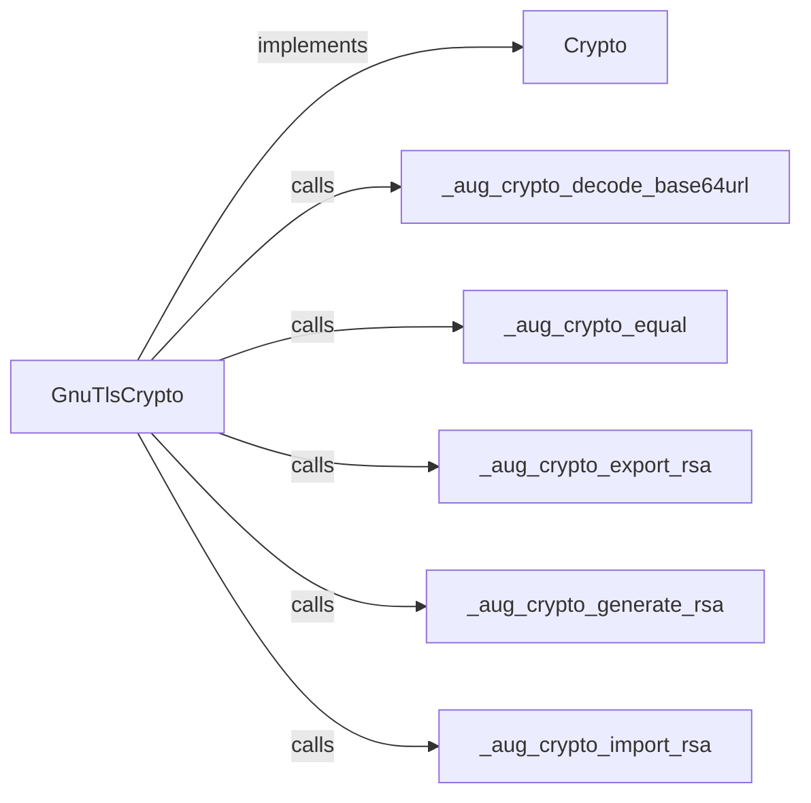
```mermaid
flowchart LR
    n0["Crypto"]
    n1["GnuTlsCrypto"]
    n2["_aug_crypto_decode_base64url"]
    n3["_aug_crypto_equal"]
    n4["_aug_crypto_export_rsa"]
    n5["_aug_crypto_generate_rsa"]
    n6["_aug_crypto_import_rsa"]
    n1 -->|"implements"| n0
    n1 -->|"calls"| n2
    n1 -->|"calls"| n3
    n1 -->|"calls"| n4
    n1 -->|"calls"| n5
    n1 -->|"calls"| n6
```

#### View 2 of 2

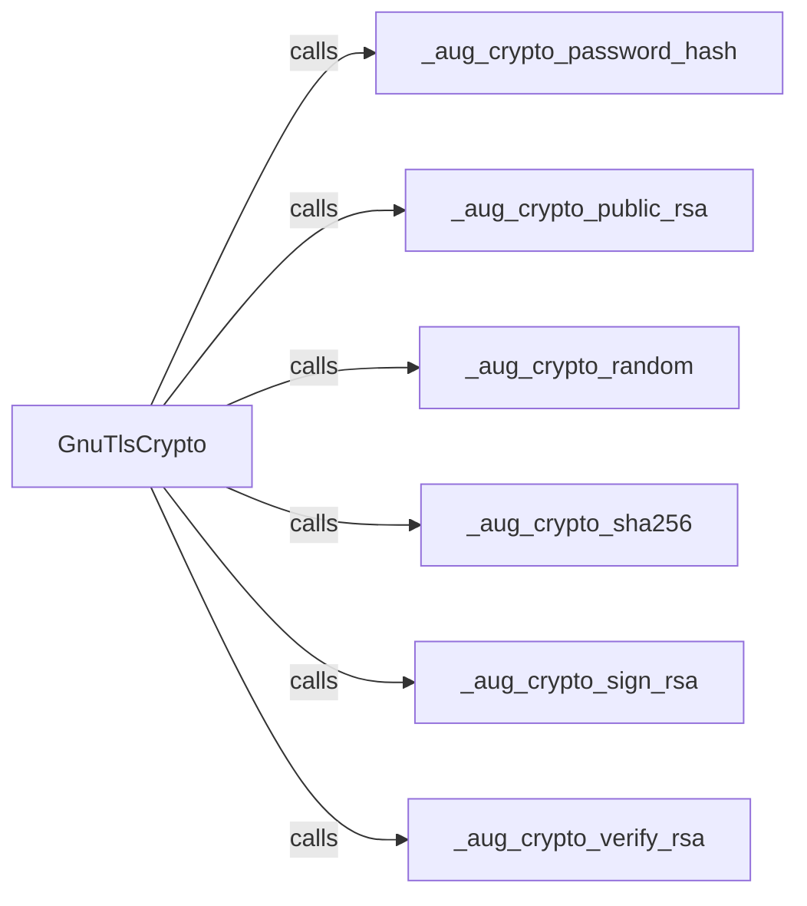
```mermaid
flowchart LR
    n0["GnuTlsCrypto"]
    n1["_aug_crypto_password_hash"]
    n2["_aug_crypto_public_rsa"]
    n3["_aug_crypto_random"]
    n4["_aug_crypto_sha256"]
    n5["_aug_crypto_sign_rsa"]
    n6["_aug_crypto_verify_rsa"]
    n0 -->|"calls"| n1
    n0 -->|"calls"| n2
    n0 -->|"calls"| n3
    n0 -->|"calls"| n4
    n0 -->|"calls"| n5
    n0 -->|"calls"| n6
```

## Sequences

Call arrows identify checked targets; loop and branch frames determine when they run. Open that target’s module to follow its implementation. Branches describe alternatives; loops describe repeated work. Native calls and interface dispatch stop at their declared contracts. Exit notes end that path; enclosing recovery and cleanup remain visible.

### Crypto.random {#sequence-Crypto.random}

::: spec-paragraph specification-paragraph-1
[Source](contracts.md#source-L6)
:::

May leave with checked errors: CryptoError. Interface contract; implementation selected at runtime. [Explanation](contracts.md).

### Crypto.sha256 {#sequence-Crypto.sha256}

::: spec-paragraph specification-paragraph-2
[Source](contracts.md#source-L8)
:::

May leave with checked errors: CryptoError. Interface contract; implementation selected at runtime. [Explanation](contracts.md).

### Crypto.generateRsa {#sequence-Crypto.generateRsa}

::: spec-paragraph specification-paragraph-3
[Source](contracts.md#source-L10)
:::

May leave with checked errors: CryptoError. Interface contract; implementation selected at runtime. [Explanation](contracts.md).

### Crypto.publicRsa {#sequence-Crypto.publicRsa}

::: spec-paragraph specification-paragraph-4
[Source](contracts.md#source-L12)
:::

May leave with checked errors: CryptoError. Interface contract; implementation selected at runtime. [Explanation](contracts.md).

### Crypto.signRsa {#sequence-Crypto.signRsa}

::: spec-paragraph specification-paragraph-5
[Source](contracts.md#source-L14)
:::

May leave with checked errors: CryptoError. Interface contract; implementation selected at runtime. [Explanation](contracts.md).

### Crypto.verifyRsa {#sequence-Crypto.verifyRsa}

::: spec-paragraph specification-paragraph-6
[Source](contracts.md#source-L16)
:::

May leave with checked errors: CryptoError. Interface contract; implementation selected at runtime. [Explanation](contracts.md).

### Crypto.decodeBase64url {#sequence-Crypto.decodeBase64url}

::: spec-paragraph specification-paragraph-7
[Source](contracts.md#source-L18)
:::

May leave with checked errors: CryptoError. Interface contract; implementation selected at runtime. [Explanation](contracts.md).

### Crypto.equal {#sequence-Crypto.equal}

::: spec-paragraph specification-paragraph-8
[Source](contracts.md#source-L20)
:::

Interface contract; implementation selected at runtime. [Explanation](contracts.md).

### Crypto.exportRsa {#sequence-Crypto.exportRsa}

::: spec-paragraph specification-paragraph-9
[Source](contracts.md#source-L22)
:::

May leave with checked errors: CryptoError. Interface contract; implementation selected at runtime. [Explanation](contracts.md).

### Crypto.importRsa {#sequence-Crypto.importRsa}

::: spec-paragraph specification-paragraph-10
[Source](contracts.md#source-L24)
:::

May leave with checked errors: CryptoError. Interface contract; implementation selected at runtime. [Explanation](contracts.md).

### Crypto.passwordHash {#sequence-Crypto.passwordHash}

::: spec-paragraph specification-paragraph-11
[Source](contracts.md#source-L26)
:::

May leave with checked errors: CryptoError. Interface contract; implementation selected at runtime. [Explanation](contracts.md).

### \_aug\_crypto\_random {#sequence-_aug_crypto_random}

::: spec-paragraph specification-paragraph-12
[Source](contracts.md#source-L28)
:::

May leave with checked errors: CryptoError. Native implementation; only the declared contract is known. [Explanation](contracts.md).

### \_aug\_crypto\_sha256 {#sequence-_aug_crypto_sha256}

::: spec-paragraph specification-paragraph-13
[Source](contracts.md#source-L29)
:::

May leave with checked errors: CryptoError. Native implementation; only the declared contract is known. [Explanation](contracts.md).

### \_aug\_crypto\_generate\_rsa {#sequence-_aug_crypto_generate_rsa}

::: spec-paragraph specification-paragraph-14
[Source](contracts.md#source-L30)
:::

May leave with checked errors: CryptoError. Native implementation; only the declared contract is known. [Explanation](contracts.md).

### \_aug\_crypto\_public\_rsa {#sequence-_aug_crypto_public_rsa}

::: spec-paragraph specification-paragraph-15
[Source](contracts.md#source-L31)
:::

May leave with checked errors: CryptoError. Native implementation; only the declared contract is known. [Explanation](contracts.md).

### \_aug\_crypto\_sign\_rsa {#sequence-_aug_crypto_sign_rsa}

::: spec-paragraph specification-paragraph-16
[Source](contracts.md#source-L32)
:::

May leave with checked errors: CryptoError. Native implementation; only the declared contract is known. [Explanation](contracts.md).

### \_aug\_crypto\_verify\_rsa {#sequence-_aug_crypto_verify_rsa}

::: spec-paragraph specification-paragraph-17
[Source](contracts.md#source-L33)
:::

May leave with checked errors: CryptoError. Native implementation; only the declared contract is known. [Explanation](contracts.md).

### \_aug\_crypto\_decode\_base64url {#sequence-_aug_crypto_decode_base64url}

::: spec-paragraph specification-paragraph-18
[Source](contracts.md#source-L34)
:::

May leave with checked errors: CryptoError. Native implementation; only the declared contract is known. [Explanation](contracts.md).

### \_aug\_crypto\_equal {#sequence-_aug_crypto_equal}

::: spec-paragraph specification-paragraph-19
[Source](contracts.md#source-L35)
:::

Native implementation; only the declared contract is known. [Explanation](contracts.md).

### \_aug\_crypto\_export\_rsa {#sequence-_aug_crypto_export_rsa}

::: spec-paragraph specification-paragraph-20
[Source](contracts.md#source-L36)
:::

May leave with checked errors: CryptoError. Native implementation; only the declared contract is known. [Explanation](contracts.md).

### \_aug\_crypto\_import\_rsa {#sequence-_aug_crypto_import_rsa}

::: spec-paragraph specification-paragraph-21
[Source](contracts.md#source-L37)
:::

May leave with checked errors: CryptoError. Native implementation; only the declared contract is known. [Explanation](contracts.md).

### \_aug\_crypto\_password\_hash {#sequence-_aug_crypto_password_hash}

::: spec-paragraph specification-paragraph-22
[Source](contracts.md#source-L38)
:::

May leave with checked errors: CryptoError. Native implementation; only the declared contract is known. [Explanation](contracts.md).

### GnuTlsCrypto constructor {#sequence-GnuTlsCrypto-20-constructor}

::: spec-paragraph specification-paragraph-23
[Source](contracts.md#source-L41)
:::

[Explanation](contracts.md).

### GnuTlsCrypto.random {#sequence-GnuTlsCrypto.random}

::: spec-paragraph specification-paragraph-24
[Source](contracts.md#source-L42)
:::

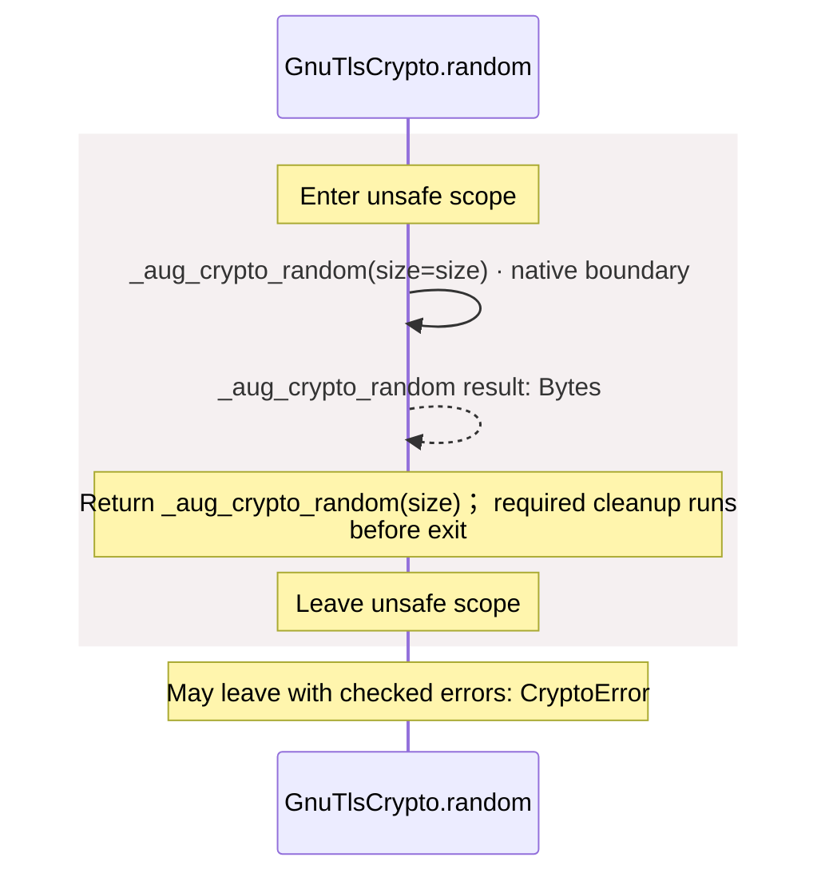
```mermaid
sequenceDiagram
    participant p0 as GnuTlsCrypto.random

    rect rgb(245, 240, 241)
    Note over p0: Enter unsafe scope
    p0->>p0: _aug_crypto_random(size=size) · native boundary
    p0-->>p0: _aug_crypto_random result: Bytes
    Note over p0: Return _aug_crypto_random(size)； required cleanup runs<br/>before exit
    Note over p0: Leave unsafe scope
    end
    Note over p0: May leave with checked errors: CryptoError
```

### GnuTlsCrypto.sha256 {#sequence-GnuTlsCrypto.sha256}

::: spec-paragraph specification-paragraph-25
[Source](contracts.md#source-L45)
:::

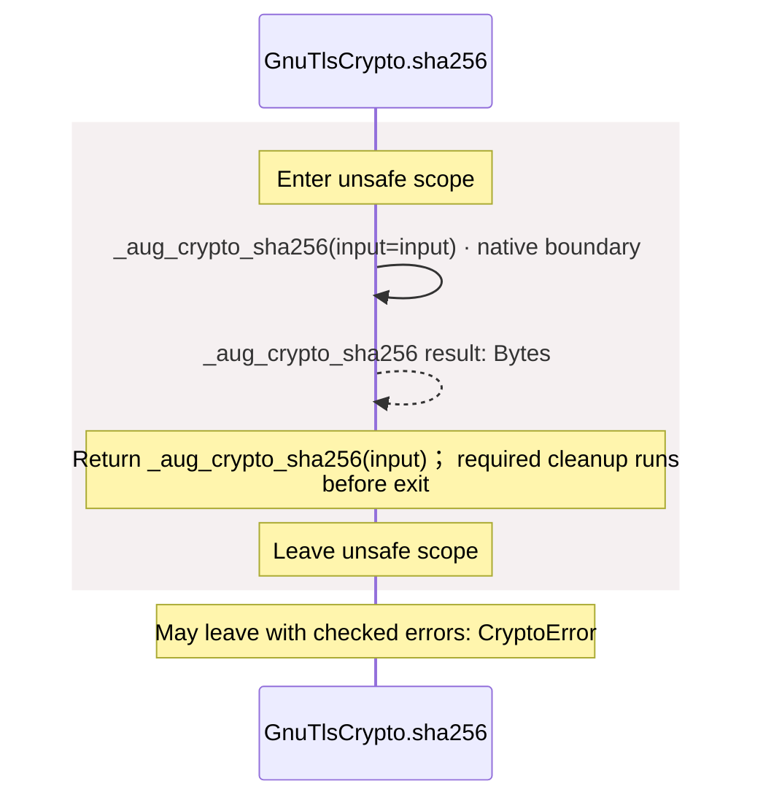
```mermaid
sequenceDiagram
    participant p0 as GnuTlsCrypto.sha256

    rect rgb(245, 240, 241)
    Note over p0: Enter unsafe scope
    p0->>p0: _aug_crypto_sha256(input=input) · native boundary
    p0-->>p0: _aug_crypto_sha256 result: Bytes
    Note over p0: Return _aug_crypto_sha256(input)； required cleanup runs<br/>before exit
    Note over p0: Leave unsafe scope
    end
    Note over p0: May leave with checked errors: CryptoError
```

### GnuTlsCrypto.generateRsa {#sequence-GnuTlsCrypto.generateRsa}

::: spec-paragraph specification-paragraph-26
[Source](contracts.md#source-L48)
:::

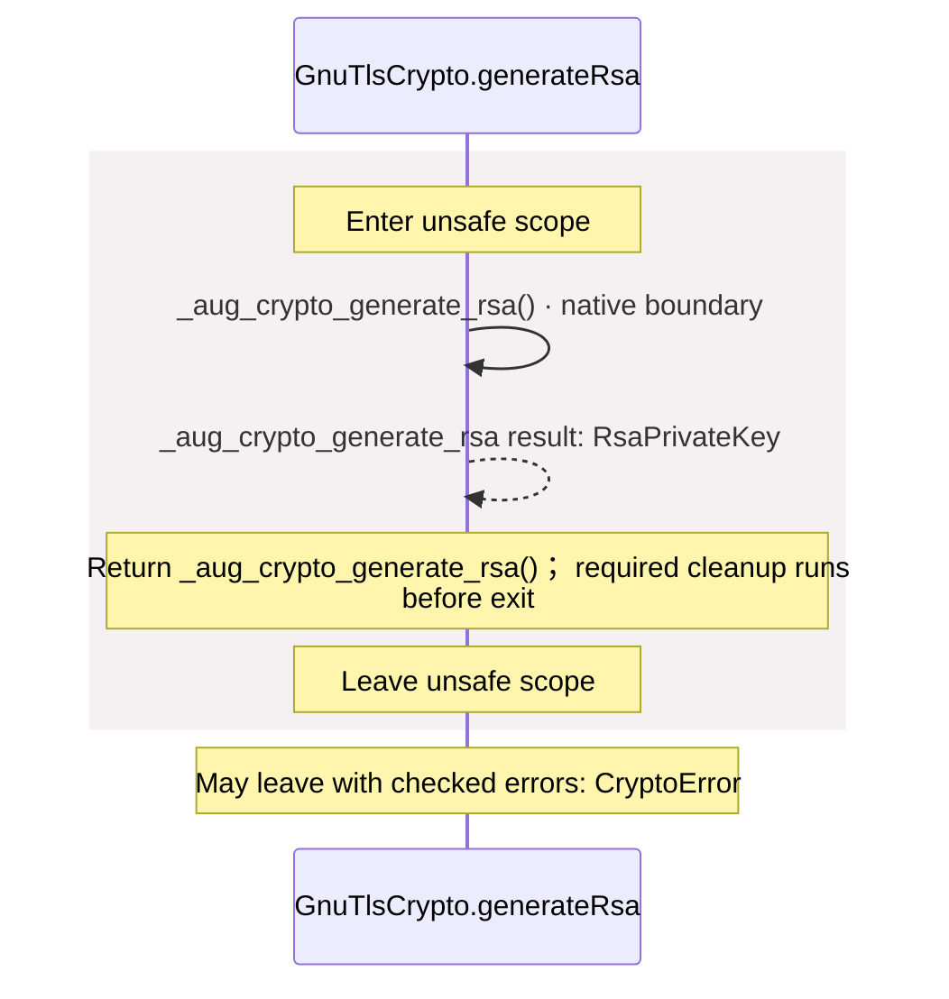
```mermaid
sequenceDiagram
    participant p0 as GnuTlsCrypto.generateRsa

    rect rgb(245, 240, 241)
    Note over p0: Enter unsafe scope
    p0->>p0: _aug_crypto_generate_rsa() · native boundary
    p0-->>p0: _aug_crypto_generate_rsa result: RsaPrivateKey
    Note over p0: Return _aug_crypto_generate_rsa()； required cleanup runs<br/>before exit
    Note over p0: Leave unsafe scope
    end
    Note over p0: May leave with checked errors: CryptoError
```

### GnuTlsCrypto.publicRsa {#sequence-GnuTlsCrypto.publicRsa}

::: spec-paragraph specification-paragraph-27
[Source](contracts.md#source-L51)
:::

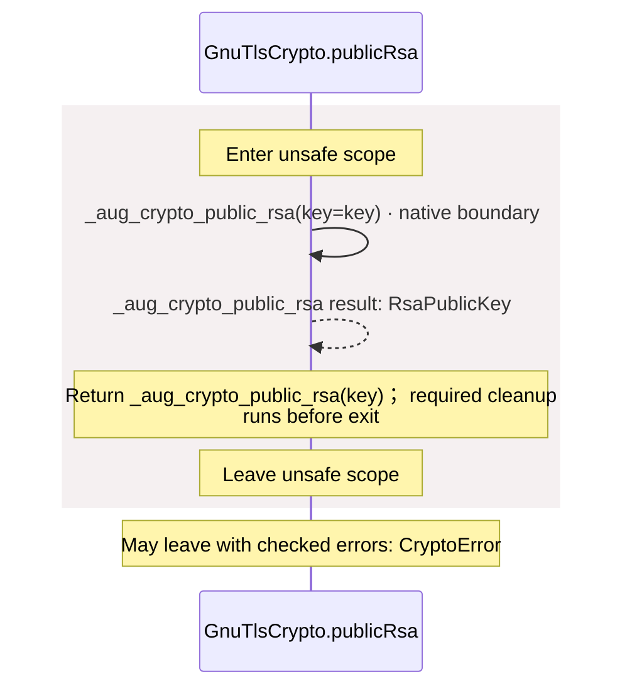
```mermaid
sequenceDiagram
    participant p0 as GnuTlsCrypto.publicRsa

    rect rgb(245, 240, 241)
    Note over p0: Enter unsafe scope
    p0->>p0: _aug_crypto_public_rsa(key=key) · native boundary
    p0-->>p0: _aug_crypto_public_rsa result: RsaPublicKey
    Note over p0: Return _aug_crypto_public_rsa(key)； required cleanup<br/>runs before exit
    Note over p0: Leave unsafe scope
    end
    Note over p0: May leave with checked errors: CryptoError
```

### GnuTlsCrypto.signRsa {#sequence-GnuTlsCrypto.signRsa}

::: spec-paragraph specification-paragraph-28
[Source](contracts.md#source-L54)
:::

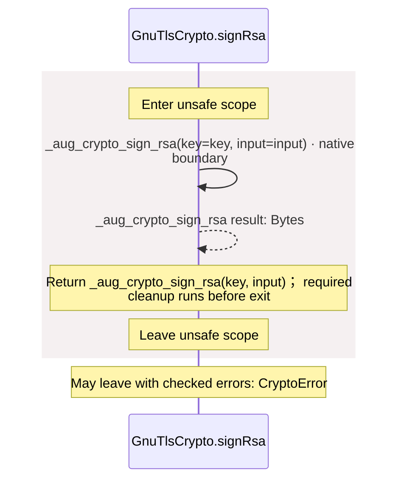
```mermaid
sequenceDiagram
    participant p0 as GnuTlsCrypto.signRsa

    rect rgb(245, 240, 241)
    Note over p0: Enter unsafe scope
    p0->>p0: _aug_crypto_sign_rsa(key=key, input=input) · native<br/>boundary
    p0-->>p0: _aug_crypto_sign_rsa result: Bytes
    Note over p0: Return _aug_crypto_sign_rsa(key, input)； required<br/>cleanup runs before exit
    Note over p0: Leave unsafe scope
    end
    Note over p0: May leave with checked errors: CryptoError
```

### GnuTlsCrypto.verifyRsa {#sequence-GnuTlsCrypto.verifyRsa}

::: spec-paragraph specification-paragraph-29
[Source](contracts.md#source-L57)
:::

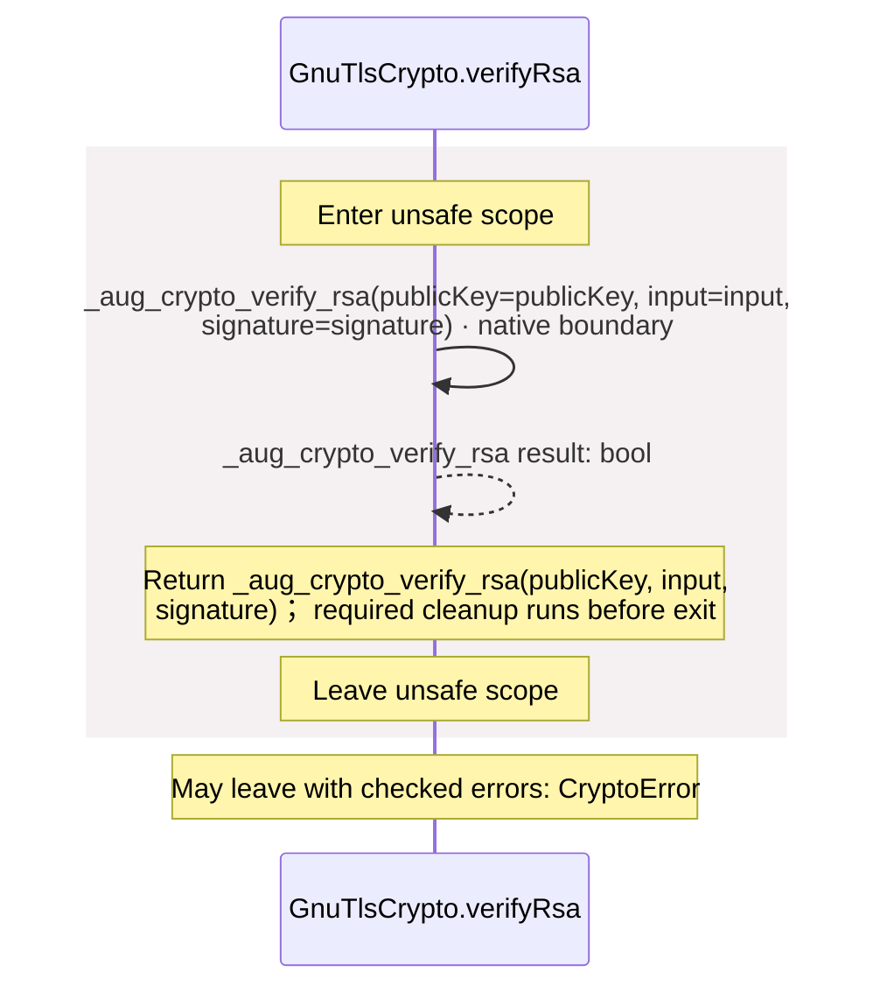
```mermaid
sequenceDiagram
    participant p0 as GnuTlsCrypto.verifyRsa

    rect rgb(245, 240, 241)
    Note over p0: Enter unsafe scope
    p0->>p0: _aug_crypto_verify_rsa(publicKey=publicKey, input=input,<br/>signature=signature) · native boundary
    p0-->>p0: _aug_crypto_verify_rsa result: bool
    Note over p0: Return _aug_crypto_verify_rsa(publicKey, input,<br/>signature)； required cleanup runs before exit
    Note over p0: Leave unsafe scope
    end
    Note over p0: May leave with checked errors: CryptoError
```

### GnuTlsCrypto.decodeBase64url {#sequence-GnuTlsCrypto.decodeBase64url}

::: spec-paragraph specification-paragraph-30
[Source](contracts.md#source-L60)
:::

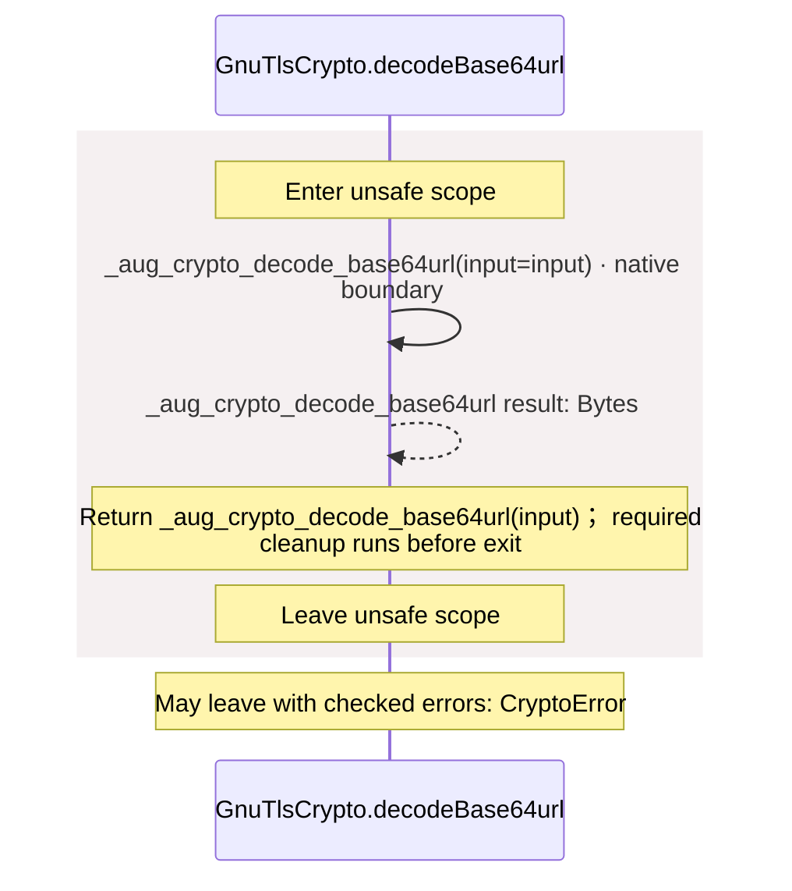
```mermaid
sequenceDiagram
    participant p0 as GnuTlsCrypto.decodeBase64url

    rect rgb(245, 240, 241)
    Note over p0: Enter unsafe scope
    p0->>p0: _aug_crypto_decode_base64url(input=input) · native<br/>boundary
    p0-->>p0: _aug_crypto_decode_base64url result: Bytes
    Note over p0: Return _aug_crypto_decode_base64url(input)； required<br/>cleanup runs before exit
    Note over p0: Leave unsafe scope
    end
    Note over p0: May leave with checked errors: CryptoError
```

### GnuTlsCrypto.equal {#sequence-GnuTlsCrypto.equal}

::: spec-paragraph specification-paragraph-31
[Source](contracts.md#source-L63)
:::

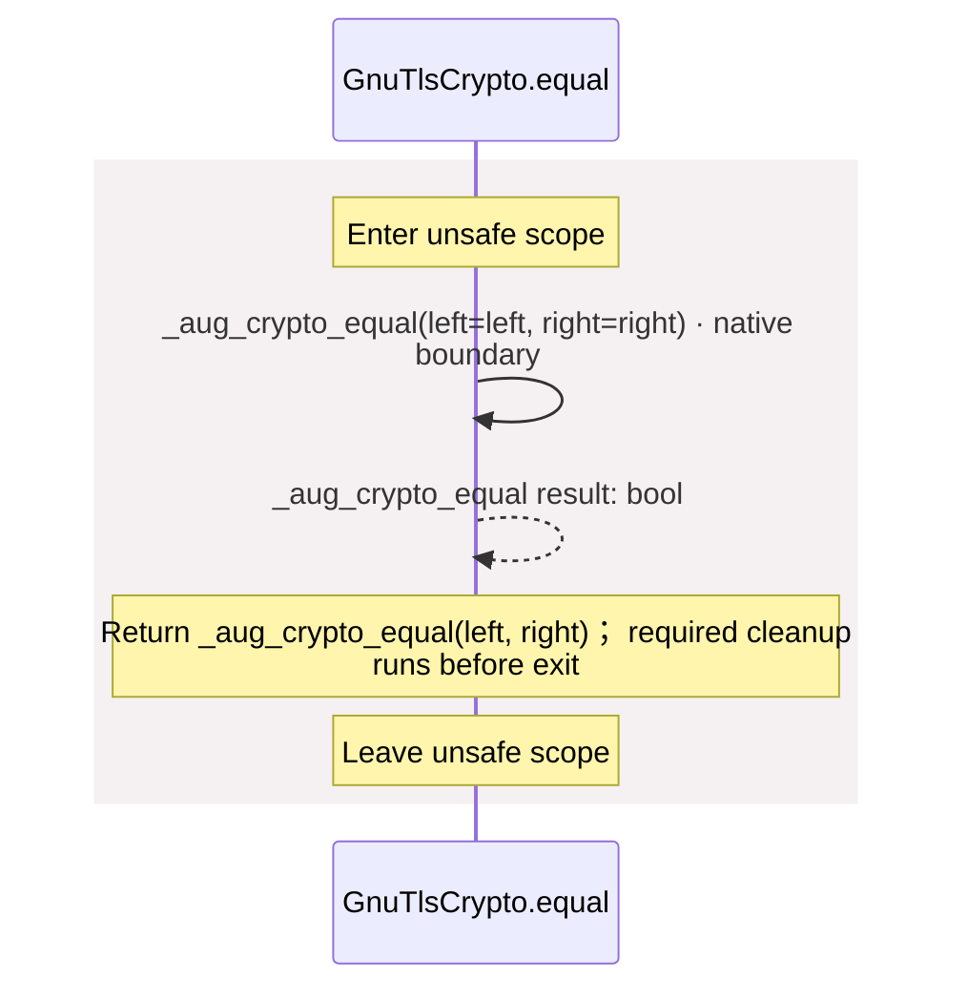
```mermaid
sequenceDiagram
    participant p0 as GnuTlsCrypto.equal

    rect rgb(245, 240, 241)
    Note over p0: Enter unsafe scope
    p0->>p0: _aug_crypto_equal(left=left, right=right) · native<br/>boundary
    p0-->>p0: _aug_crypto_equal result: bool
    Note over p0: Return _aug_crypto_equal(left, right)； required cleanup<br/>runs before exit
    Note over p0: Leave unsafe scope
    end
```

### GnuTlsCrypto.exportRsa {#sequence-GnuTlsCrypto.exportRsa}

::: spec-paragraph specification-paragraph-32
[Source](contracts.md#source-L66)
:::

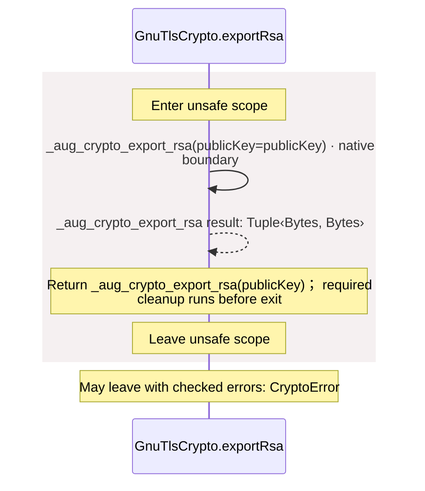
```mermaid
sequenceDiagram
    participant p0 as GnuTlsCrypto.exportRsa

    rect rgb(245, 240, 241)
    Note over p0: Enter unsafe scope
    p0->>p0: _aug_crypto_export_rsa(publicKey=publicKey) · native<br/>boundary
    p0-->>p0: _aug_crypto_export_rsa result: Tuple‹Bytes, Bytes›
    Note over p0: Return _aug_crypto_export_rsa(publicKey)； required<br/>cleanup runs before exit
    Note over p0: Leave unsafe scope
    end
    Note over p0: May leave with checked errors: CryptoError
```

### GnuTlsCrypto.importRsa {#sequence-GnuTlsCrypto.importRsa}

::: spec-paragraph specification-paragraph-33
[Source](contracts.md#source-L69)
:::

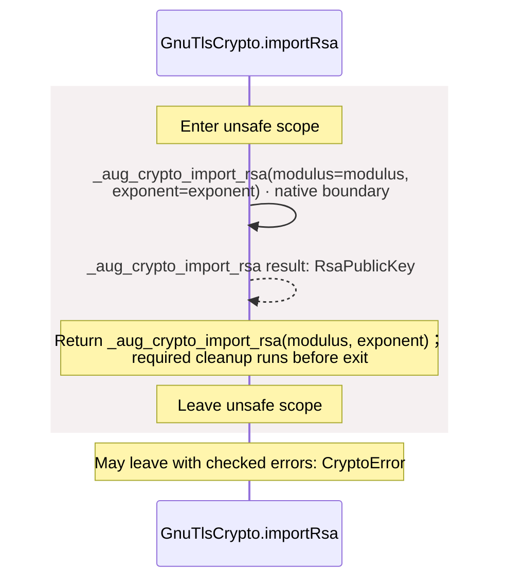
```mermaid
sequenceDiagram
    participant p0 as GnuTlsCrypto.importRsa

    rect rgb(245, 240, 241)
    Note over p0: Enter unsafe scope
    p0->>p0: _aug_crypto_import_rsa(modulus=modulus,<br/>exponent=exponent) · native boundary
    p0-->>p0: _aug_crypto_import_rsa result: RsaPublicKey
    Note over p0: Return _aug_crypto_import_rsa(modulus, exponent)；<br/>required cleanup runs before exit
    Note over p0: Leave unsafe scope
    end
    Note over p0: May leave with checked errors: CryptoError
```

### GnuTlsCrypto.passwordHash {#sequence-GnuTlsCrypto.passwordHash}

::: spec-paragraph specification-paragraph-34
[Source](contracts.md#source-L72)
:::

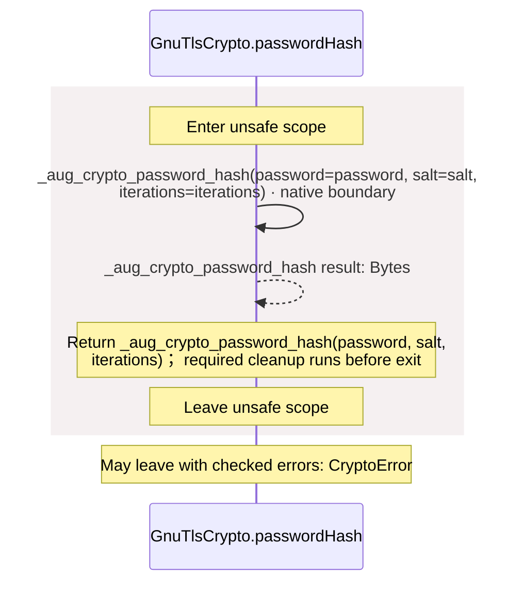
```mermaid
sequenceDiagram
    participant p0 as GnuTlsCrypto.passwordHash

    rect rgb(245, 240, 241)
    Note over p0: Enter unsafe scope
    p0->>p0: _aug_crypto_password_hash(password=password, salt=salt,<br/>iterations=iterations) · native boundary
    p0-->>p0: _aug_crypto_password_hash result: Bytes
    Note over p0: Return _aug_crypto_password_hash(password, salt,<br/>iterations)； required cleanup runs before exit
    Note over p0: Leave unsafe scope
    end
    Note over p0: May leave with checked errors: CryptoError
```

## Called contracts

- [Crypto](contracts-diagrams.md) — package/@git/url\_9ef654c66d34ab8f5527@0.0.0-git.b14a0f9aa41f1ce58bd51133bcdc424033e40d40/contracts.aug
- [\_aug\_crypto\_decode\_base64url](contracts-diagrams.md#sequence-_aug_crypto_decode_base64url) — package/@git/url\_9ef654c66d34ab8f5527@0.0.0-git.b14a0f9aa41f1ce58bd51133bcdc424033e40d40/contracts.aug
- [\_aug\_crypto\_equal](contracts-diagrams.md#sequence-_aug_crypto_equal) — package/@git/url\_9ef654c66d34ab8f5527@0.0.0-git.b14a0f9aa41f1ce58bd51133bcdc424033e40d40/contracts.aug
- [\_aug\_crypto\_export\_rsa](contracts-diagrams.md#sequence-_aug_crypto_export_rsa) — package/@git/url\_9ef654c66d34ab8f5527@0.0.0-git.b14a0f9aa41f1ce58bd51133bcdc424033e40d40/contracts.aug
- [\_aug\_crypto\_generate\_rsa](contracts-diagrams.md#sequence-_aug_crypto_generate_rsa) — package/@git/url\_9ef654c66d34ab8f5527@0.0.0-git.b14a0f9aa41f1ce58bd51133bcdc424033e40d40/contracts.aug
- [\_aug\_crypto\_import\_rsa](contracts-diagrams.md#sequence-_aug_crypto_import_rsa) — package/@git/url\_9ef654c66d34ab8f5527@0.0.0-git.b14a0f9aa41f1ce58bd51133bcdc424033e40d40/contracts.aug
- [\_aug\_crypto\_password\_hash](contracts-diagrams.md#sequence-_aug_crypto_password_hash) — package/@git/url\_9ef654c66d34ab8f5527@0.0.0-git.b14a0f9aa41f1ce58bd51133bcdc424033e40d40/contracts.aug
- [\_aug\_crypto\_public\_rsa](contracts-diagrams.md#sequence-_aug_crypto_public_rsa) — package/@git/url\_9ef654c66d34ab8f5527@0.0.0-git.b14a0f9aa41f1ce58bd51133bcdc424033e40d40/contracts.aug
- [\_aug\_crypto\_random](contracts-diagrams.md#sequence-_aug_crypto_random) — package/@git/url\_9ef654c66d34ab8f5527@0.0.0-git.b14a0f9aa41f1ce58bd51133bcdc424033e40d40/contracts.aug
- [\_aug\_crypto\_sha256](contracts-diagrams.md#sequence-_aug_crypto_sha256) — package/@git/url\_9ef654c66d34ab8f5527@0.0.0-git.b14a0f9aa41f1ce58bd51133bcdc424033e40d40/contracts.aug
- [\_aug\_crypto\_sign\_rsa](contracts-diagrams.md#sequence-_aug_crypto_sign_rsa) — package/@git/url\_9ef654c66d34ab8f5527@0.0.0-git.b14a0f9aa41f1ce58bd51133bcdc424033e40d40/contracts.aug
- [\_aug\_crypto\_verify\_rsa](contracts-diagrams.md#sequence-_aug_crypto_verify_rsa) — package/@git/url\_9ef654c66d34ab8f5527@0.0.0-git.b14a0f9aa41f1ce58bd51133bcdc424033e40d40/contracts.aug
