# OpenID Connect login application diagrams

[OpenID Connect login application](../../../../../index.md)

[Project overview](../../../../../diagrams/index.md) · [Compiled explanation](contracts.md)

### Class interactions

```mermaid
flowchart TD
    n0["Crypto · package/@git/url_9ef654c66d34ab8f5527@0.0.0-git.b14a0f9aa41f1ce58bd51133bcdc424033e40d40/contracts.aug"]
    n1["GnuTlsCrypto · package/@git/url_9ef654c66d34ab8f5527@0.0.0-git.b14a0f9aa41f1ce58bd51133bcdc424033e40d40/contracts.aug"]
    n2["_aug_crypto_decode_base64url · package/@git/url_9ef654c66d34ab8f5527@0.0.0-git.b14a0f9aa41f1ce58bd51133bcdc424033e40d…"]
    n3["_aug_crypto_equal · package/@git/url_9ef654c66d34ab8f5527@0.0.0-git.b14a0f9aa41f1ce58bd51133bcdc424033e40d40/contract…"]
    n4["_aug_crypto_export_rsa · package/@git/url_9ef654c66d34ab8f5527@0.0.0-git.b14a0f9aa41f1ce58bd51133bcdc424033e40d40/con…"]
    n5["_aug_crypto_generate_rsa · package/@git/url_9ef654c66d34ab8f5527@0.0.0-git.b14a0f9aa41f1ce58bd51133bcdc424033e40d40/c…"]
    n6["_aug_crypto_import_rsa · package/@git/url_9ef654c66d34ab8f5527@0.0.0-git.b14a0f9aa41f1ce58bd51133bcdc424033e40d40/con…"]
    n7["_aug_crypto_password_hash · package/@git/url_9ef654c66d34ab8f5527@0.0.0-git.b14a0f9aa41f1ce58bd51133bcdc424033e40d40/…"]
    n8["_aug_crypto_public_rsa · package/@git/url_9ef654c66d34ab8f5527@0.0.0-git.b14a0f9aa41f1ce58bd51133bcdc424033e40d40/con…"]
    n9["_aug_crypto_random · package/@git/url_9ef654c66d34ab8f5527@0.0.0-git.b14a0f9aa41f1ce58bd51133bcdc424033e40d40/contrac…"]
    n10["_aug_crypto_sha256 · package/@git/url_9ef654c66d34ab8f5527@0.0.0-git.b14a0f9aa41f1ce58bd51133bcdc424033e40d40/contrac…"]
    n11["_aug_crypto_sign_rsa · package/@git/url_9ef654c66d34ab8f5527@0.0.0-git.b14a0f9aa41f1ce58bd51133bcdc424033e40d40/contr…"]
    n12["_aug_crypto_verify_rsa · package/@git/url_9ef654c66d34ab8f5527@0.0.0-git.b14a0f9aa41f1ce58bd51133bcdc424033e40d40/con…"]
    n1 -->|"implements"| n0
    n1 -->|"calls"| n2
    n1 -->|"calls"| n3
    n1 -->|"calls"| n4
    n1 -->|"calls"| n5
    n1 -->|"calls"| n6
    n1 -->|"calls"| n7
    n1 -->|"calls"| n8
    n1 -->|"calls"| n9
    n1 -->|"calls"| n10
    n1 -->|"calls"| n11
    n1 -->|"calls"| n12
```

### API calls

##### View 1 of 2

```mermaid
flowchart TD
    n0["GnuTlsCrypto.decodeBase64url · package/@git/url_9ef654c66d34ab8f5527@0.0.0-git.b14a0f9aa41f1ce58bd51133bcdc424033e40d…"]
    n1["GnuTlsCrypto.equal · package/@git/url_9ef654c66d34ab8f5527@0.0.0-git.b14a0f9aa41f1ce58bd51133bcdc424033e40d40/contrac…"]
    n2["GnuTlsCrypto.exportRsa · package/@git/url_9ef654c66d34ab8f5527@0.0.0-git.b14a0f9aa41f1ce58bd51133bcdc424033e40d40/con…"]
    n3["GnuTlsCrypto.generateRsa · package/@git/url_9ef654c66d34ab8f5527@0.0.0-git.b14a0f9aa41f1ce58bd51133bcdc424033e40d40/c…"]
    n4["GnuTlsCrypto.importRsa · package/@git/url_9ef654c66d34ab8f5527@0.0.0-git.b14a0f9aa41f1ce58bd51133bcdc424033e40d40/con…"]
    n5["GnuTlsCrypto.passwordHash · package/@git/url_9ef654c66d34ab8f5527@0.0.0-git.b14a0f9aa41f1ce58bd51133bcdc424033e40d40/…"]
    n6["GnuTlsCrypto.publicRsa · package/@git/url_9ef654c66d34ab8f5527@0.0.0-git.b14a0f9aa41f1ce58bd51133bcdc424033e40d40/con…"]
    n7["GnuTlsCrypto.random · package/@git/url_9ef654c66d34ab8f5527@0.0.0-git.b14a0f9aa41f1ce58bd51133bcdc424033e40d40/contra…"]
    n8["GnuTlsCrypto.sha256 · package/@git/url_9ef654c66d34ab8f5527@0.0.0-git.b14a0f9aa41f1ce58bd51133bcdc424033e40d40/contra…"]
    n9["_aug_crypto_decode_base64url · package/@git/url_9ef654c66d34ab8f5527@0.0.0-git.b14a0f9aa41f1ce58bd51133bcdc424033e40d…"]
    n10["_aug_crypto_equal · package/@git/url_9ef654c66d34ab8f5527@0.0.0-git.b14a0f9aa41f1ce58bd51133bcdc424033e40d40/contract…"]
    n11["_aug_crypto_export_rsa · package/@git/url_9ef654c66d34ab8f5527@0.0.0-git.b14a0f9aa41f1ce58bd51133bcdc424033e40d40/con…"]
    n12["_aug_crypto_generate_rsa · package/@git/url_9ef654c66d34ab8f5527@0.0.0-git.b14a0f9aa41f1ce58bd51133bcdc424033e40d40/c…"]
    n13["_aug_crypto_import_rsa · package/@git/url_9ef654c66d34ab8f5527@0.0.0-git.b14a0f9aa41f1ce58bd51133bcdc424033e40d40/con…"]
    n14["_aug_crypto_password_hash · package/@git/url_9ef654c66d34ab8f5527@0.0.0-git.b14a0f9aa41f1ce58bd51133bcdc424033e40d40/…"]
    n15["_aug_crypto_public_rsa · package/@git/url_9ef654c66d34ab8f5527@0.0.0-git.b14a0f9aa41f1ce58bd51133bcdc424033e40d40/con…"]
    n16["_aug_crypto_random · package/@git/url_9ef654c66d34ab8f5527@0.0.0-git.b14a0f9aa41f1ce58bd51133bcdc424033e40d40/contrac…"]
    n17["_aug_crypto_sha256 · package/@git/url_9ef654c66d34ab8f5527@0.0.0-git.b14a0f9aa41f1ce58bd51133bcdc424033e40d40/contrac…"]
    n0 -->|"calls"| n9
    n1 -->|"calls"| n10
    n2 -->|"calls"| n11
    n3 -->|"calls"| n12
    n4 -->|"calls"| n13
    n5 -->|"calls"| n14
    n6 -->|"calls"| n15
    n7 -->|"calls"| n16
    n8 -->|"calls"| n17
```

##### View 2 of 2

```mermaid
flowchart TD
    n0["Crypto.decodeBase64url · package/@git/url_9ef654c66d34ab8f5527@0.0.0-git.b14a0f9aa41f1ce58bd51133bcdc424033e40d40/con…"]
    n1["Crypto.equal · package/@git/url_9ef654c66d34ab8f5527@0.0.0-git.b14a0f9aa41f1ce58bd51133bcdc424033e40d40/contracts.aug"]
    n2["Crypto.exportRsa · package/@git/url_9ef654c66d34ab8f5527@0.0.0-git.b14a0f9aa41f1ce58bd51133bcdc424033e40d40/contracts…"]
    n3["Crypto.generateRsa · package/@git/url_9ef654c66d34ab8f5527@0.0.0-git.b14a0f9aa41f1ce58bd51133bcdc424033e40d40/contrac…"]
    n4["Crypto.importRsa · package/@git/url_9ef654c66d34ab8f5527@0.0.0-git.b14a0f9aa41f1ce58bd51133bcdc424033e40d40/contracts…"]
    n5["Crypto.passwordHash · package/@git/url_9ef654c66d34ab8f5527@0.0.0-git.b14a0f9aa41f1ce58bd51133bcdc424033e40d40/contra…"]
    n6["Crypto.publicRsa · package/@git/url_9ef654c66d34ab8f5527@0.0.0-git.b14a0f9aa41f1ce58bd51133bcdc424033e40d40/contracts…"]
    n7["Crypto.random · package/@git/url_9ef654c66d34ab8f5527@0.0.0-git.b14a0f9aa41f1ce58bd51133bcdc424033e40d40/contracts.aug"]
    n8["Crypto.sha256 · package/@git/url_9ef654c66d34ab8f5527@0.0.0-git.b14a0f9aa41f1ce58bd51133bcdc424033e40d40/contracts.aug"]
    n9["Crypto.signRsa · package/@git/url_9ef654c66d34ab8f5527@0.0.0-git.b14a0f9aa41f1ce58bd51133bcdc424033e40d40/contracts.aug"]
    n10["Crypto.verifyRsa · package/@git/url_9ef654c66d34ab8f5527@0.0.0-git.b14a0f9aa41f1ce58bd51133bcdc424033e40d40/contracts…"]
    n11["GnuTlsCrypto.signRsa · package/@git/url_9ef654c66d34ab8f5527@0.0.0-git.b14a0f9aa41f1ce58bd51133bcdc424033e40d40/contr…"]
    n12["GnuTlsCrypto.verifyRsa · package/@git/url_9ef654c66d34ab8f5527@0.0.0-git.b14a0f9aa41f1ce58bd51133bcdc424033e40d40/con…"]
    n13["_aug_crypto_sign_rsa · package/@git/url_9ef654c66d34ab8f5527@0.0.0-git.b14a0f9aa41f1ce58bd51133bcdc424033e40d40/contr…"]
    n14["_aug_crypto_verify_rsa · package/@git/url_9ef654c66d34ab8f5527@0.0.0-git.b14a0f9aa41f1ce58bd51133bcdc424033e40d40/con…"]
    n11 -->|"calls"| n13
    n12 -->|"calls"| n14
```

### Sequences

Call arrows identify checked targets; loop and branch frames determine when they run. Open that target’s module to follow its implementation. Branches describe alternatives; loops describe repeated work. Native calls and interface dispatch stop at their declared contracts. Exit notes end that path; enclosing recovery and cleanup remain visible.

#### Crypto.random {#sequence-Crypto.random}

::: spec-paragraph specification-paragraph-1
[Source](contracts.md#source-L6)
:::

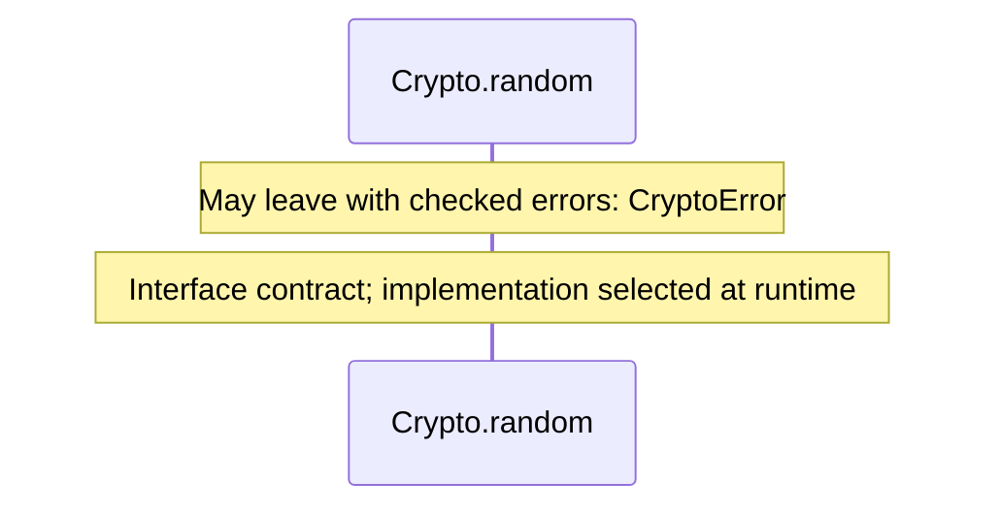

#### Crypto.sha256 {#sequence-Crypto.sha256}

::: spec-paragraph specification-paragraph-2
[Source](contracts.md#source-L8)
:::

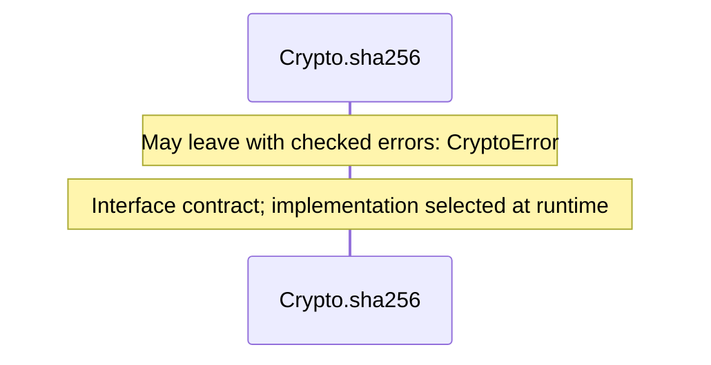

#### Crypto.generateRsa {#sequence-Crypto.generateRsa}

::: spec-paragraph specification-paragraph-3
[Source](contracts.md#source-L10)
:::

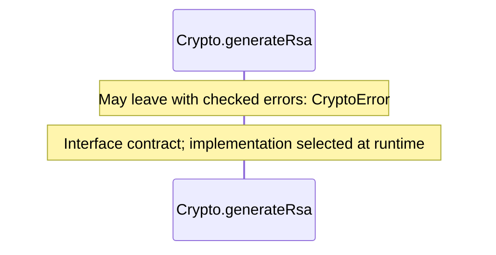

#### Crypto.publicRsa {#sequence-Crypto.publicRsa}

::: spec-paragraph specification-paragraph-4
[Source](contracts.md#source-L12)
:::

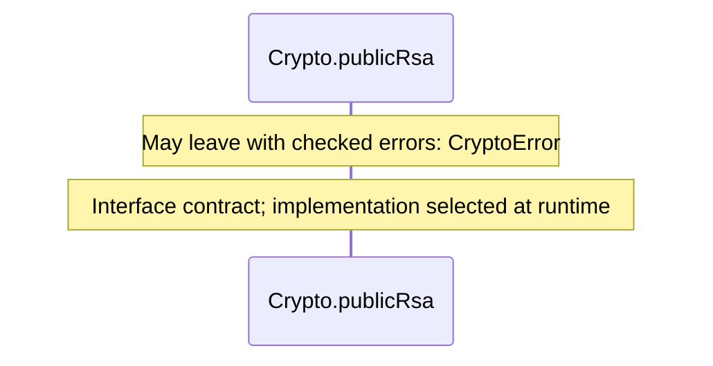

#### Crypto.signRsa {#sequence-Crypto.signRsa}

::: spec-paragraph specification-paragraph-5
[Source](contracts.md#source-L14)
:::

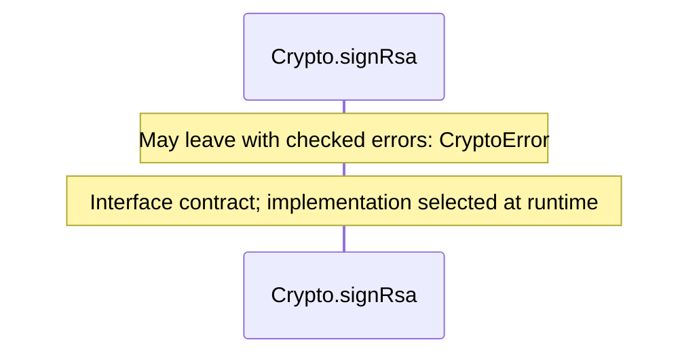

#### Crypto.verifyRsa {#sequence-Crypto.verifyRsa}

::: spec-paragraph specification-paragraph-6
[Source](contracts.md#source-L16)
:::


#### Crypto.decodeBase64url {#sequence-Crypto.decodeBase64url}

::: spec-paragraph specification-paragraph-7
[Source](contracts.md#source-L18)
:::

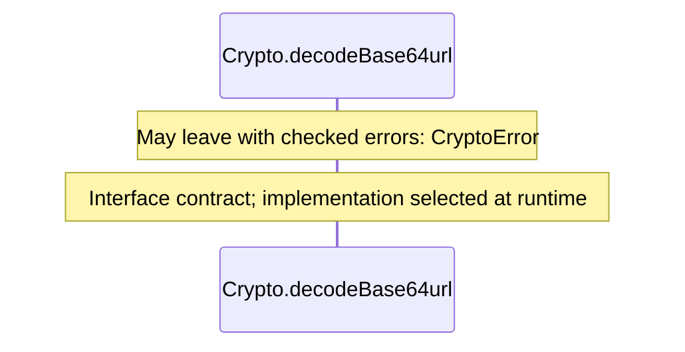

#### Crypto.equal {#sequence-Crypto.equal}

::: spec-paragraph specification-paragraph-8
[Source](contracts.md#source-L20)
:::

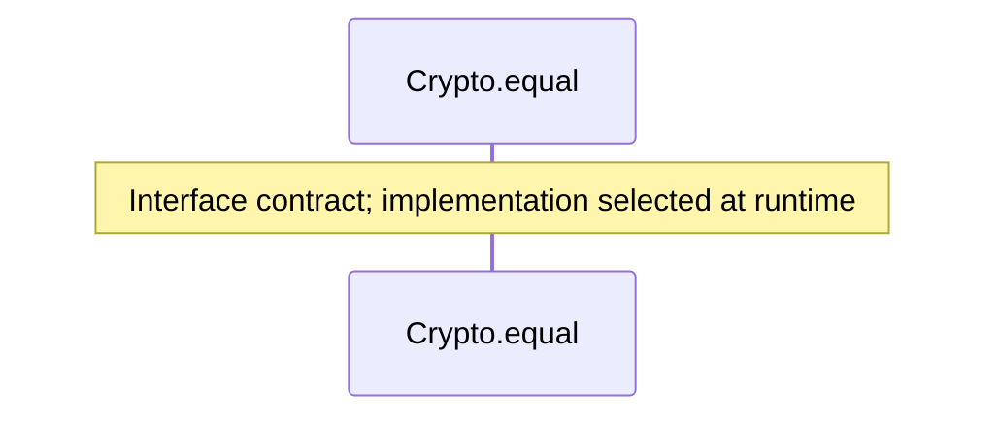

#### Crypto.exportRsa {#sequence-Crypto.exportRsa}

::: spec-paragraph specification-paragraph-9
[Source](contracts.md#source-L22)
:::


#### Crypto.importRsa {#sequence-Crypto.importRsa}

::: spec-paragraph specification-paragraph-10
[Source](contracts.md#source-L24)
:::


#### Crypto.passwordHash {#sequence-Crypto.passwordHash}

::: spec-paragraph specification-paragraph-11
[Source](contracts.md#source-L26)
:::

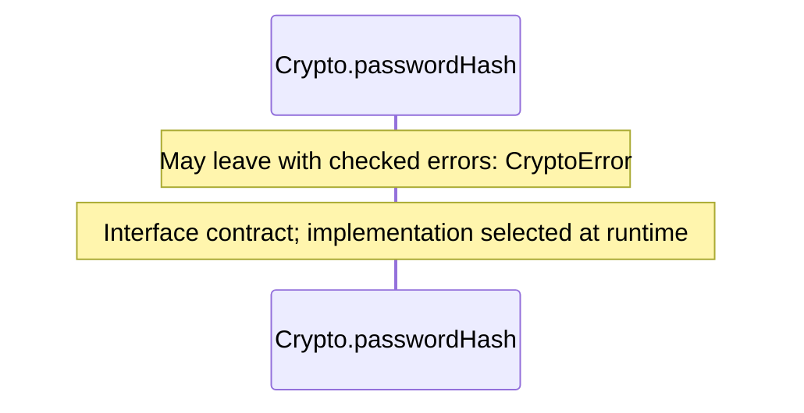

#### \_aug\_crypto\_random {#sequence-_aug_crypto_random}

::: spec-paragraph specification-paragraph-12
[Source](contracts.md#source-L28)
:::

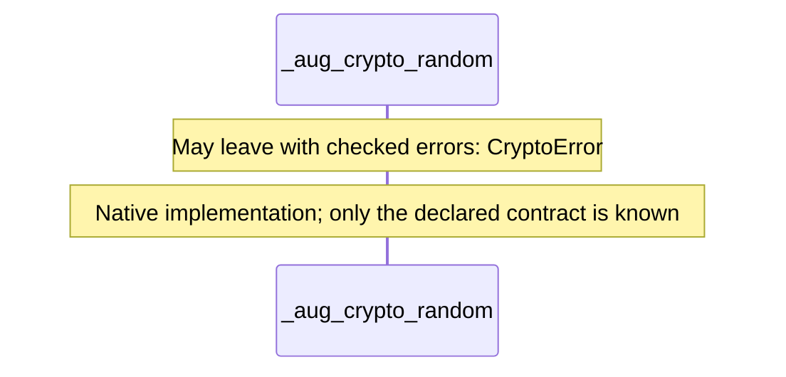

#### \_aug\_crypto\_sha256 {#sequence-_aug_crypto_sha256}

::: spec-paragraph specification-paragraph-13
[Source](contracts.md#source-L29)
:::

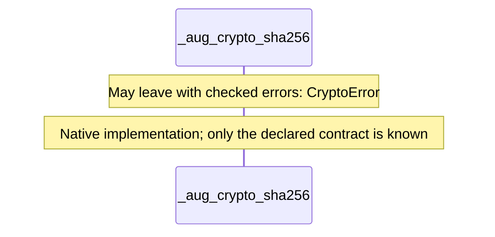

#### \_aug\_crypto\_generate\_rsa {#sequence-_aug_crypto_generate_rsa}

::: spec-paragraph specification-paragraph-14
[Source](contracts.md#source-L30)
:::

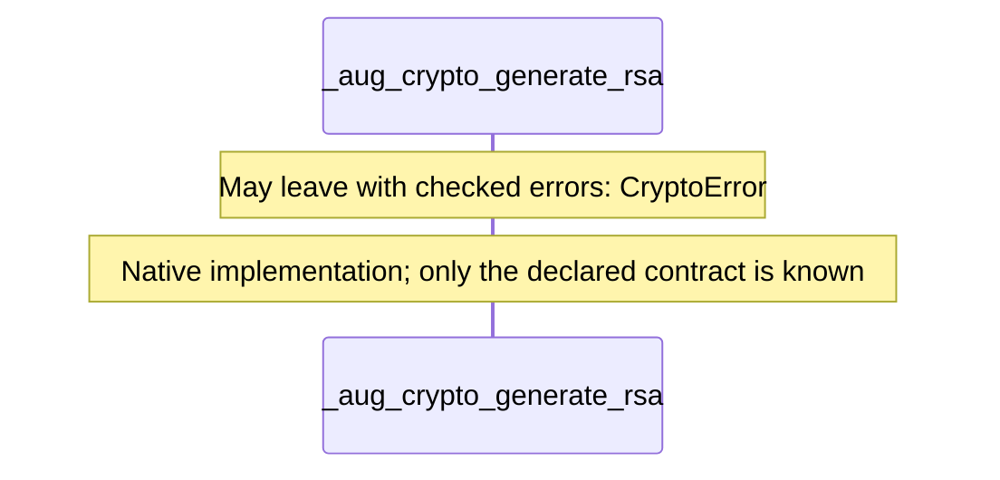

#### \_aug\_crypto\_public\_rsa {#sequence-_aug_crypto_public_rsa}

::: spec-paragraph specification-paragraph-15
[Source](contracts.md#source-L31)
:::

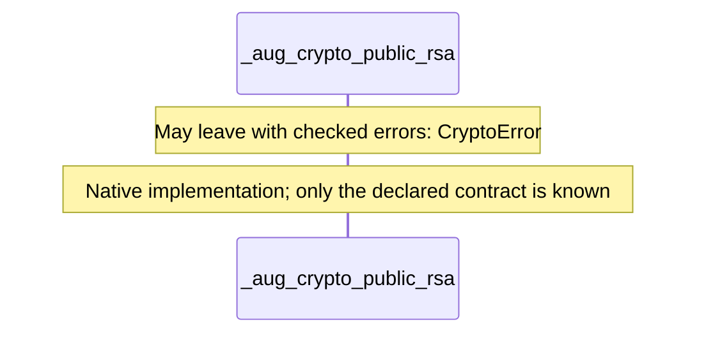

#### \_aug\_crypto\_sign\_rsa {#sequence-_aug_crypto_sign_rsa}

::: spec-paragraph specification-paragraph-16
[Source](contracts.md#source-L32)
:::

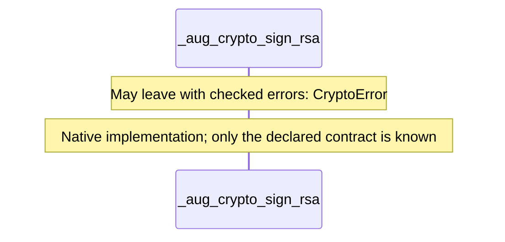

#### \_aug\_crypto\_verify\_rsa {#sequence-_aug_crypto_verify_rsa}

::: spec-paragraph specification-paragraph-17
[Source](contracts.md#source-L33)
:::

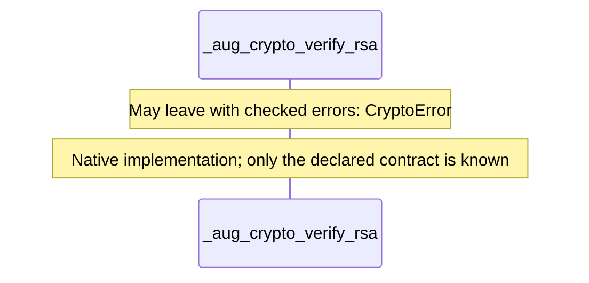

#### \_aug\_crypto\_decode\_base64url {#sequence-_aug_crypto_decode_base64url}

::: spec-paragraph specification-paragraph-18
[Source](contracts.md#source-L34)
:::

```mermaid
sequenceDiagram
    participant p0 as _aug_crypto_decode_base64url

    Note over p0: May leave with checked errors: CryptoError
    Note over p0: Native implementation#59; only the declared contract is known
```

#### \_aug\_crypto\_equal {#sequence-_aug_crypto_equal}

::: spec-paragraph specification-paragraph-19
[Source](contracts.md#source-L35)
:::

```mermaid
sequenceDiagram
    participant p0 as _aug_crypto_equal

    Note over p0: Native implementation#59; only the declared contract is known
```

#### \_aug\_crypto\_export\_rsa {#sequence-_aug_crypto_export_rsa}

::: spec-paragraph specification-paragraph-20
[Source](contracts.md#source-L36)
:::

```mermaid
sequenceDiagram
    participant p0 as _aug_crypto_export_rsa

    Note over p0: May leave with checked errors: CryptoError
    Note over p0: Native implementation#59; only the declared contract is known
```

#### \_aug\_crypto\_import\_rsa {#sequence-_aug_crypto_import_rsa}

::: spec-paragraph specification-paragraph-21
[Source](contracts.md#source-L37)
:::

```mermaid
sequenceDiagram
    participant p0 as _aug_crypto_import_rsa

    Note over p0: May leave with checked errors: CryptoError
    Note over p0: Native implementation#59; only the declared contract is known
```

#### \_aug\_crypto\_password\_hash {#sequence-_aug_crypto_password_hash}

::: spec-paragraph specification-paragraph-22
[Source](contracts.md#source-L38)
:::

```mermaid
sequenceDiagram
    participant p0 as _aug_crypto_password_hash

    Note over p0: May leave with checked errors: CryptoError
    Note over p0: Native implementation#59; only the declared contract is known
```

#### GnuTlsCrypto constructor {#sequence-GnuTlsCrypto-20-constructor}

::: spec-paragraph specification-paragraph-23
[Source](contracts.md#source-L41)
:::

```mermaid
sequenceDiagram
    participant p0 as GnuTlsCrypto constructor

    Note over p0: No calls in this operation#59; see the source and specification
```

#### GnuTlsCrypto.random {#sequence-GnuTlsCrypto.random}

::: spec-paragraph specification-paragraph-24
[Source](contracts.md#source-L42)
:::

```mermaid
sequenceDiagram
    participant p0 as GnuTlsCrypto.random
    participant p1 as _aug_crypto_random
    rect rgb(245, 240, 241)
    Note over p0: Enter unsafe scope
    p0->>p1: _aug_crypto_random(size) · native boundary
    Note over p0: Return _aug_crypto_random(size)#59; required cleanup runs before exit
    Note over p0: Leave unsafe scope
    end
    Note over p0: May leave with checked errors: CryptoError
```

#### GnuTlsCrypto.sha256 {#sequence-GnuTlsCrypto.sha256}

::: spec-paragraph specification-paragraph-25
[Source](contracts.md#source-L45)
:::

```mermaid
sequenceDiagram
    participant p0 as GnuTlsCrypto.sha256
    participant p1 as _aug_crypto_sha256
    rect rgb(245, 240, 241)
    Note over p0: Enter unsafe scope
    p0->>p1: _aug_crypto_sha256(input) · native boundary
    Note over p0: Return _aug_crypto_sha256(input)#59; required cleanup runs before exit
    Note over p0: Leave unsafe scope
    end
    Note over p0: May leave with checked errors: CryptoError
```

#### GnuTlsCrypto.generateRsa {#sequence-GnuTlsCrypto.generateRsa}

::: spec-paragraph specification-paragraph-26
[Source](contracts.md#source-L48)
:::

```mermaid
sequenceDiagram
    participant p0 as GnuTlsCrypto.generateRsa
    participant p1 as _aug_crypto_generate_rsa
    rect rgb(245, 240, 241)
    Note over p0: Enter unsafe scope
    p0->>p1: _aug_crypto_generate_rsa() · native boundary
    Note over p0: Return _aug_crypto_generate_rsa()#59; required cleanup runs before exit
    Note over p0: Leave unsafe scope
    end
    Note over p0: May leave with checked errors: CryptoError
```

#### GnuTlsCrypto.publicRsa {#sequence-GnuTlsCrypto.publicRsa}

::: spec-paragraph specification-paragraph-27
[Source](contracts.md#source-L51)
:::

```mermaid
sequenceDiagram
    participant p0 as GnuTlsCrypto.publicRsa
    participant p1 as _aug_crypto_public_rsa
    rect rgb(245, 240, 241)
    Note over p0: Enter unsafe scope
    p0->>p1: _aug_crypto_public_rsa(key) · native boundary
    Note over p0: Return _aug_crypto_public_rsa(key)#59; required cleanup runs before exit
    Note over p0: Leave unsafe scope
    end
    Note over p0: May leave with checked errors: CryptoError
```

#### GnuTlsCrypto.signRsa {#sequence-GnuTlsCrypto.signRsa}

::: spec-paragraph specification-paragraph-28
[Source](contracts.md#source-L54)
:::

```mermaid
sequenceDiagram
    participant p0 as GnuTlsCrypto.signRsa
    participant p1 as _aug_crypto_sign_rsa
    rect rgb(245, 240, 241)
    Note over p0: Enter unsafe scope
    p0->>p1: _aug_crypto_sign_rsa(key, input) · native boundary
    Note over p0: Return _aug_crypto_sign_rsa(key, input)#59; required cleanup runs before exit
    Note over p0: Leave unsafe scope
    end
    Note over p0: May leave with checked errors: CryptoError
```

#### GnuTlsCrypto.verifyRsa {#sequence-GnuTlsCrypto.verifyRsa}

::: spec-paragraph specification-paragraph-29
[Source](contracts.md#source-L57)
:::

```mermaid
sequenceDiagram
    participant p0 as GnuTlsCrypto.verifyRsa
    participant p1 as _aug_crypto_verify_rsa
    rect rgb(245, 240, 241)
    Note over p0: Enter unsafe scope
    p0->>p1: _aug_crypto_verify_rsa(publicKey, input, signature) · native boundary
    Note over p0: Return _aug_crypto_verify_rsa(publicKey, input, signature)#59; required cleanup runs before exit
    Note over p0: Leave unsafe scope
    end
    Note over p0: May leave with checked errors: CryptoError
```

#### GnuTlsCrypto.decodeBase64url {#sequence-GnuTlsCrypto.decodeBase64url}

::: spec-paragraph specification-paragraph-30
[Source](contracts.md#source-L60)
:::

```mermaid
sequenceDiagram
    participant p0 as GnuTlsCrypto.decodeBase64url
    participant p1 as _aug_crypto_decode_base64url
    rect rgb(245, 240, 241)
    Note over p0: Enter unsafe scope
    p0->>p1: _aug_crypto_decode_base64url(input) · native boundary
    Note over p0: Return _aug_crypto_decode_base64url(input)#59; required cleanup runs before exit
    Note over p0: Leave unsafe scope
    end
    Note over p0: May leave with checked errors: CryptoError
```

#### GnuTlsCrypto.equal {#sequence-GnuTlsCrypto.equal}

::: spec-paragraph specification-paragraph-31
[Source](contracts.md#source-L63)
:::

```mermaid
sequenceDiagram
    participant p0 as GnuTlsCrypto.equal
    participant p1 as _aug_crypto_equal
    rect rgb(245, 240, 241)
    Note over p0: Enter unsafe scope
    p0->>p1: _aug_crypto_equal(left, right) · native boundary
    Note over p0: Return _aug_crypto_equal(left, right)#59; required cleanup runs before exit
    Note over p0: Leave unsafe scope
    end
```

#### GnuTlsCrypto.exportRsa {#sequence-GnuTlsCrypto.exportRsa}

::: spec-paragraph specification-paragraph-32
[Source](contracts.md#source-L66)
:::

```mermaid
sequenceDiagram
    participant p0 as GnuTlsCrypto.exportRsa
    participant p1 as _aug_crypto_export_rsa
    rect rgb(245, 240, 241)
    Note over p0: Enter unsafe scope
    p0->>p1: _aug_crypto_export_rsa(publicKey) · native boundary
    Note over p0: Return _aug_crypto_export_rsa(publicKey)#59; required cleanup runs before exit
    Note over p0: Leave unsafe scope
    end
    Note over p0: May leave with checked errors: CryptoError
```

#### GnuTlsCrypto.importRsa {#sequence-GnuTlsCrypto.importRsa}

::: spec-paragraph specification-paragraph-33
[Source](contracts.md#source-L69)
:::

```mermaid
sequenceDiagram
    participant p0 as GnuTlsCrypto.importRsa
    participant p1 as _aug_crypto_import_rsa
    rect rgb(245, 240, 241)
    Note over p0: Enter unsafe scope
    p0->>p1: _aug_crypto_import_rsa(modulus, exponent) · native boundary
    Note over p0: Return _aug_crypto_import_rsa(modulus, exponent)#59; required cleanup runs before exit
    Note over p0: Leave unsafe scope
    end
    Note over p0: May leave with checked errors: CryptoError
```

#### GnuTlsCrypto.passwordHash {#sequence-GnuTlsCrypto.passwordHash}

::: spec-paragraph specification-paragraph-34
[Source](contracts.md#source-L72)
:::

```mermaid
sequenceDiagram
    participant p0 as GnuTlsCrypto.passwordHash
    participant p1 as _aug_crypto_password_hash
    rect rgb(245, 240, 241)
    Note over p0: Enter unsafe scope
    p0->>p1: _aug_crypto_password_hash(password, salt, iterations) · native boundary
    Note over p0: Return _aug_crypto_password_hash(password, salt, iterations)#59; required cleanup runs before exit
    Note over p0: Leave unsafe scope
    end
    Note over p0: May leave with checked errors: CryptoError
```

### Called contracts

- [Crypto](contracts-diagrams.md) — package/@git/url\_9ef654c66d34ab8f5527@0.0.0-git.b14a0f9aa41f1ce58bd51133bcdc424033e40d40/contracts.aug
- [\_aug\_crypto\_decode\_base64url](contracts-diagrams.md#sequence-_aug_crypto_decode_base64url) — package/@git/url\_9ef654c66d34ab8f5527@0.0.0-git.b14a0f9aa41f1ce58bd51133bcdc424033e40d40/contracts.aug
- [\_aug\_crypto\_equal](contracts-diagrams.md#sequence-_aug_crypto_equal) — package/@git/url\_9ef654c66d34ab8f5527@0.0.0-git.b14a0f9aa41f1ce58bd51133bcdc424033e40d40/contracts.aug
- [\_aug\_crypto\_export\_rsa](contracts-diagrams.md#sequence-_aug_crypto_export_rsa) — package/@git/url\_9ef654c66d34ab8f5527@0.0.0-git.b14a0f9aa41f1ce58bd51133bcdc424033e40d40/contracts.aug
- [\_aug\_crypto\_generate\_rsa](contracts-diagrams.md#sequence-_aug_crypto_generate_rsa) — package/@git/url\_9ef654c66d34ab8f5527@0.0.0-git.b14a0f9aa41f1ce58bd51133bcdc424033e40d40/contracts.aug
- [\_aug\_crypto\_import\_rsa](contracts-diagrams.md#sequence-_aug_crypto_import_rsa) — package/@git/url\_9ef654c66d34ab8f5527@0.0.0-git.b14a0f9aa41f1ce58bd51133bcdc424033e40d40/contracts.aug
- [\_aug\_crypto\_password\_hash](contracts-diagrams.md#sequence-_aug_crypto_password_hash) — package/@git/url\_9ef654c66d34ab8f5527@0.0.0-git.b14a0f9aa41f1ce58bd51133bcdc424033e40d40/contracts.aug
- [\_aug\_crypto\_public\_rsa](contracts-diagrams.md#sequence-_aug_crypto_public_rsa) — package/@git/url\_9ef654c66d34ab8f5527@0.0.0-git.b14a0f9aa41f1ce58bd51133bcdc424033e40d40/contracts.aug
- [\_aug\_crypto\_random](contracts-diagrams.md#sequence-_aug_crypto_random) — package/@git/url\_9ef654c66d34ab8f5527@0.0.0-git.b14a0f9aa41f1ce58bd51133bcdc424033e40d40/contracts.aug
- [\_aug\_crypto\_sha256](contracts-diagrams.md#sequence-_aug_crypto_sha256) — package/@git/url\_9ef654c66d34ab8f5527@0.0.0-git.b14a0f9aa41f1ce58bd51133bcdc424033e40d40/contracts.aug
- [\_aug\_crypto\_sign\_rsa](contracts-diagrams.md#sequence-_aug_crypto_sign_rsa) — package/@git/url\_9ef654c66d34ab8f5527@0.0.0-git.b14a0f9aa41f1ce58bd51133bcdc424033e40d40/contracts.aug
- [\_aug\_crypto\_verify\_rsa](contracts-diagrams.md#sequence-_aug_crypto_verify_rsa) — package/@git/url\_9ef654c66d34ab8f5527@0.0.0-git.b14a0f9aa41f1ce58bd51133bcdc424033e40d40/contracts.aug
