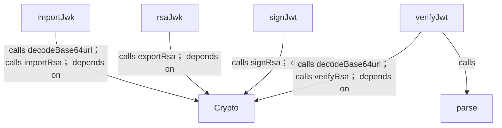
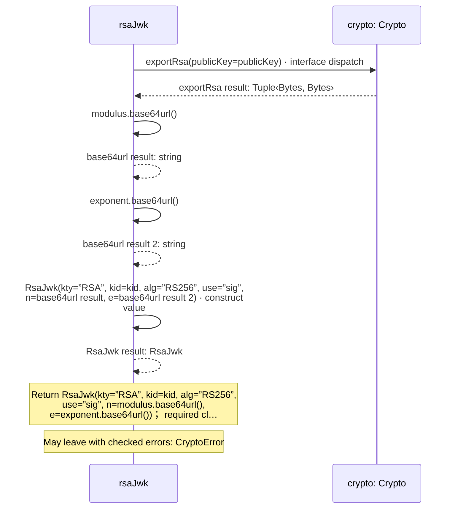
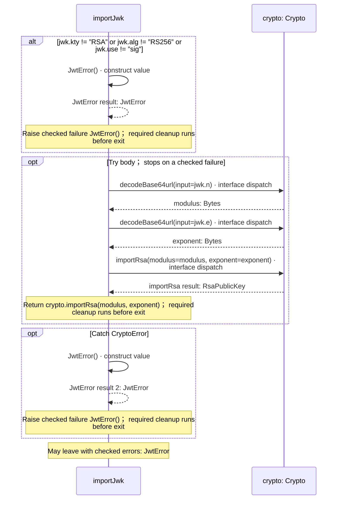
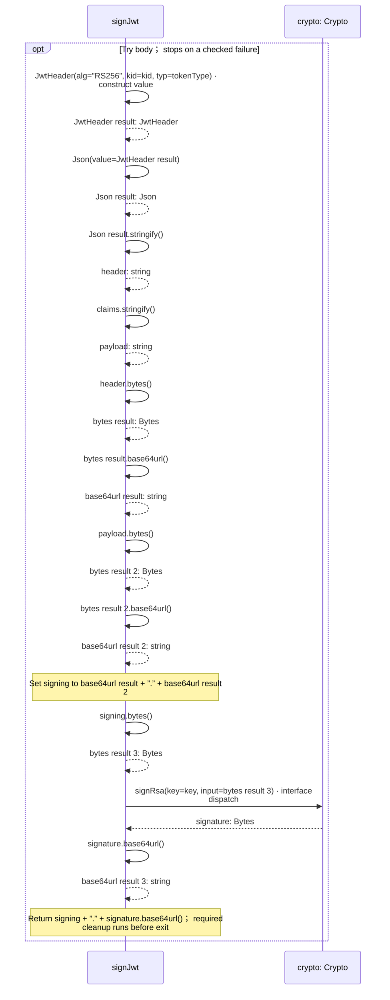
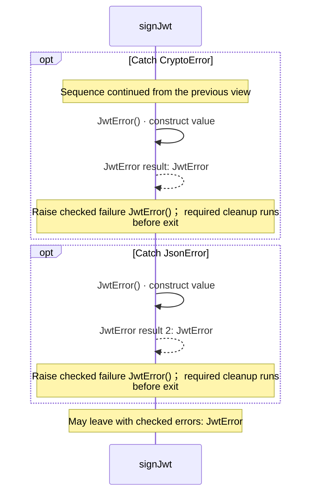
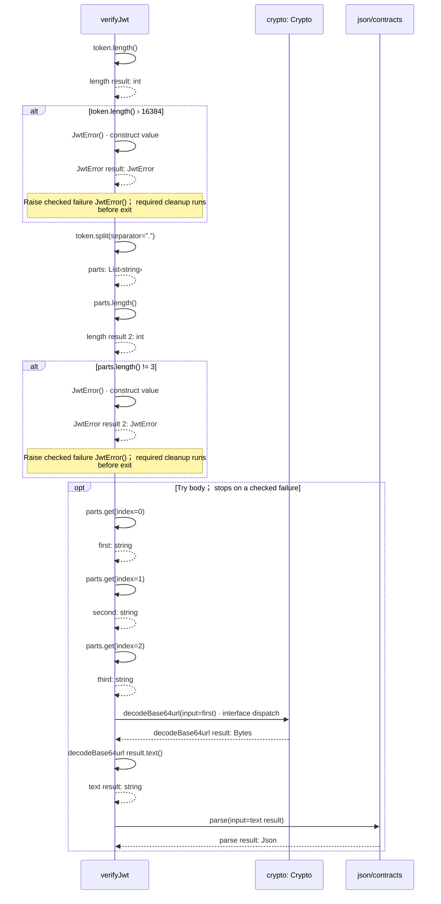
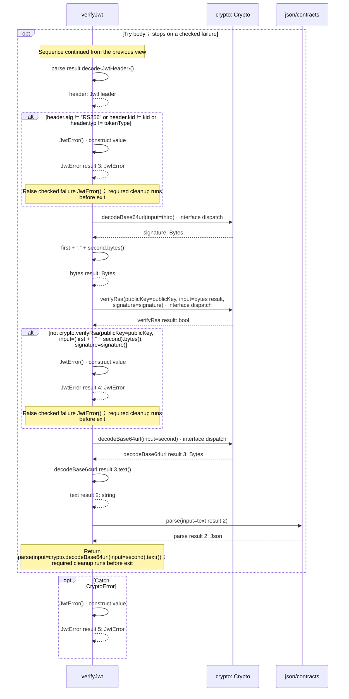
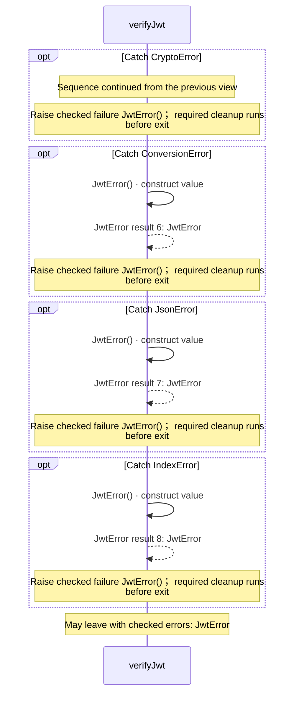

# package/@git/url\_9ef654c66d34ab8f5527@0.0.0-git.b14a0f9aa41f1ce58bd51133bcdc424033e40d40/jose.aug diagrams

[OpenID Connect login application](../../../../../index.md)

[Project overview](../../../../../diagrams/index.md) · [Compiled explanation](jose.md)

## Class interactions

## Sequences

Call arrows identify checked targets; loop and branch frames determine when they run. Open that target’s module to follow its implementation. Branches describe alternatives; loops describe repeated work. Native calls and interface dispatch stop at their declared contracts. Exit notes end that path; enclosing recovery and cleanup remain visible.

### JwtError constructor {#sequence-JwtError-20-constructor}

::: spec-paragraph specification-paragraph-1
[Source](jose.md#source-L7)
:::

[Explanation](jose.md).

### JwtHeader constructor {#sequence-JwtHeader-20-constructor}

::: spec-paragraph specification-paragraph-2
[Source](jose.md#source-L10)
:::

Receive fields: alg, kid, typ. [Explanation](jose.md).

### RsaJwk constructor {#sequence-RsaJwk-20-constructor}

::: spec-paragraph specification-paragraph-3
[Source](jose.md#source-L12)
:::

Receive fields: kty, kid, alg, use, n, e. [Explanation](jose.md).

### RsaJwks constructor {#sequence-RsaJwks-20-constructor}

::: spec-paragraph specification-paragraph-4
[Source](jose.md#source-L13)
:::

Receive fields: keys. [Explanation](jose.md).

### rsaJwk {#sequence-rsaJwk}

::: spec-paragraph specification-paragraph-5
[Source](jose.md#source-L16)
:::

### importJwk {#sequence-importJwk}

::: spec-paragraph specification-paragraph-6
[Source](jose.md#source-L21)
:::

### signJwt {#sequence-signJwt}

::: spec-paragraph specification-paragraph-7
[Source](jose.md#source-L32)
:::

#### Sequence 1 of 2

#### Sequence 2 of 2 (continued)

### verifyJwt {#sequence-verifyJwt}

::: spec-paragraph specification-paragraph-8
[Source](jose.md#source-L45)
:::

#### Sequence 1 of 3

#### Sequence 2 of 3 (continued)

#### Sequence 3 of 3 (continued)

## Called contracts

- [parse](../../url_2d3c37c690c0fa115be1/0.0.0-git.a39fc582565d4fca40be4f75fa304d71adc69301/contracts-diagrams.md#sequence-parse) — package/@git/url\_2d3c37c690c0fa115be1@0.0.0-git.a39fc582565d4fca40be4f75fa304d71adc69301/contracts.aug
- [Crypto](contracts-diagrams.md) — package/@git/url\_9ef654c66d34ab8f5527@0.0.0-git.b14a0f9aa41f1ce58bd51133bcdc424033e40d40/contracts.aug
- [Crypto.decodeBase64url](contracts-diagrams.md#sequence-Crypto.decodeBase64url) — package/@git/url\_9ef654c66d34ab8f5527@0.0.0-git.b14a0f9aa41f1ce58bd51133bcdc424033e40d40/contracts.aug
- [Crypto.exportRsa](contracts-diagrams.md#sequence-Crypto.exportRsa) — package/@git/url\_9ef654c66d34ab8f5527@0.0.0-git.b14a0f9aa41f1ce58bd51133bcdc424033e40d40/contracts.aug
- [Crypto.importRsa](contracts-diagrams.md#sequence-Crypto.importRsa) — package/@git/url\_9ef654c66d34ab8f5527@0.0.0-git.b14a0f9aa41f1ce58bd51133bcdc424033e40d40/contracts.aug
- [Crypto.signRsa](contracts-diagrams.md#sequence-Crypto.signRsa) — package/@git/url\_9ef654c66d34ab8f5527@0.0.0-git.b14a0f9aa41f1ce58bd51133bcdc424033e40d40/contracts.aug
- [Crypto.verifyRsa](contracts-diagrams.md#sequence-Crypto.verifyRsa) — package/@git/url\_9ef654c66d34ab8f5527@0.0.0-git.b14a0f9aa41f1ce58bd51133bcdc424033e40d40/contracts.aug
- [JwtError](jose-diagrams.md#sequence-JwtError-20-constructor) — package/@git/url\_9ef654c66d34ab8f5527@0.0.0-git.b14a0f9aa41f1ce58bd51133bcdc424033e40d40/jose.aug
- [JwtHeader](jose-diagrams.md#sequence-JwtHeader-20-constructor) — package/@git/url\_9ef654c66d34ab8f5527@0.0.0-git.b14a0f9aa41f1ce58bd51133bcdc424033e40d40/jose.aug
- [RsaJwk](jose-diagrams.md#sequence-RsaJwk-20-constructor) — package/@git/url\_9ef654c66d34ab8f5527@0.0.0-git.b14a0f9aa41f1ce58bd51133bcdc424033e40d40/jose.aug
