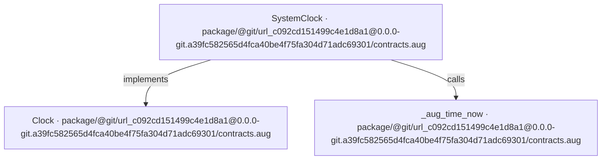
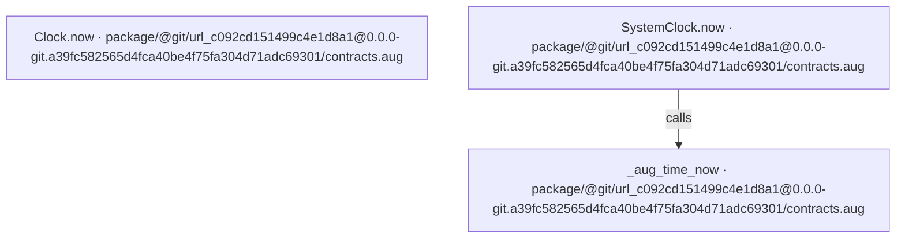
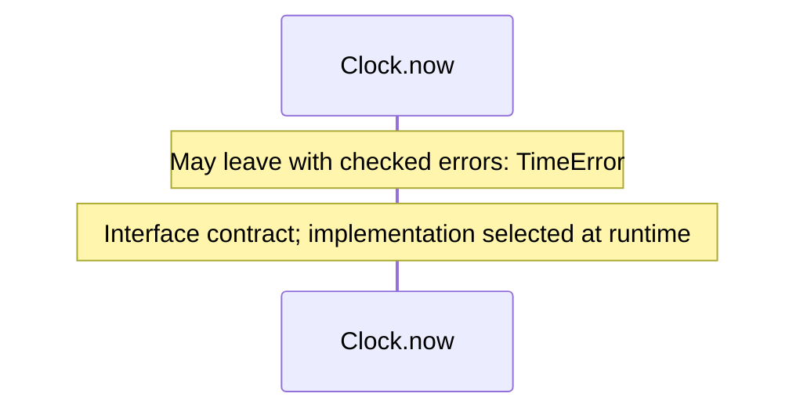
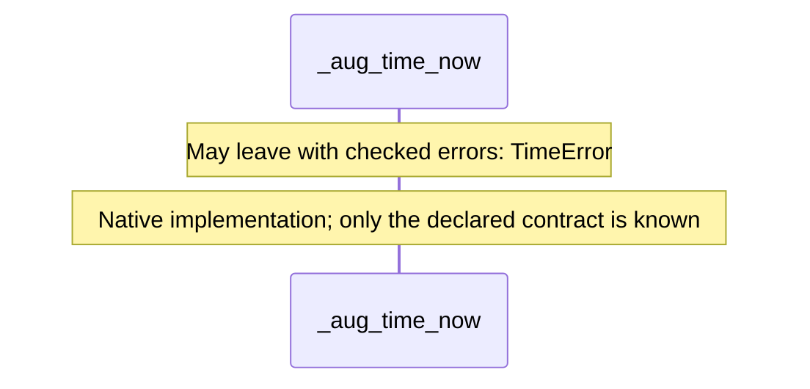
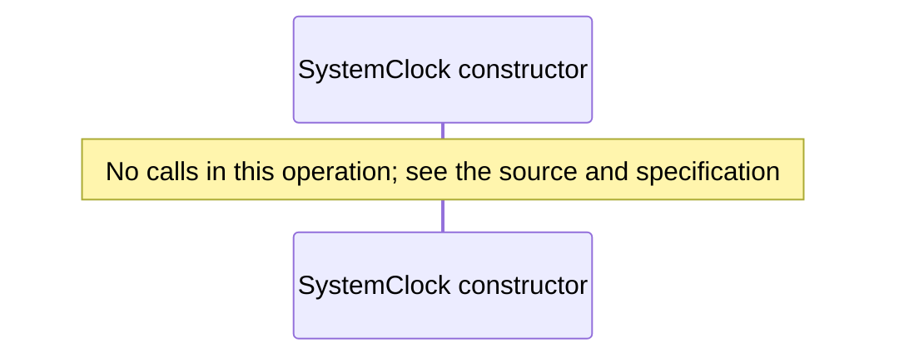
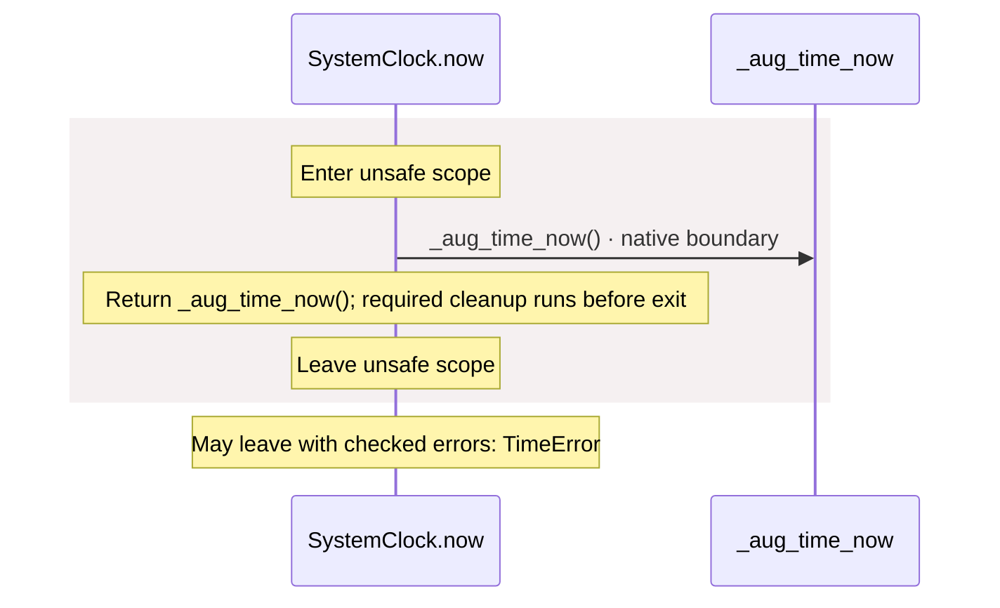

# OpenID Connect login application diagrams

[OpenID Connect login application](../../../../../index.md)

[Project overview](../../../../../diagrams/index.md) · [Compiled explanation](contracts.md)

### Class interactions

### API calls

### Sequences

Call arrows identify checked targets; loop and branch frames determine when they run. Open that target’s module to follow its implementation. Branches describe alternatives; loops describe repeated work. Native calls and interface dispatch stop at their declared contracts. Exit notes end that path; enclosing recovery and cleanup remain visible.

#### Clock.now {#sequence-Clock.now}

::: spec-paragraph specification-paragraph-1
[Source](contracts.md#source-L5)
:::

#### \_aug\_time\_now {#sequence-_aug_time_now}

::: spec-paragraph specification-paragraph-2
[Source](contracts.md#source-L6)
:::

#### SystemClock constructor {#sequence-SystemClock-20-constructor}

::: spec-paragraph specification-paragraph-3
[Source](contracts.md#source-L8)
:::

#### SystemClock.now {#sequence-SystemClock.now}

::: spec-paragraph specification-paragraph-4
[Source](contracts.md#source-L9)
:::

### Called contracts

- [Clock](contracts-diagrams.md) — package/@git/url\_c092cd151499c4e1d8a1@0.0.0-git.a39fc582565d4fca40be4f75fa304d71adc69301/contracts.aug
- [\_aug\_time\_now](contracts-diagrams.md#sequence-_aug_time_now) — package/@git/url\_c092cd151499c4e1d8a1@0.0.0-git.a39fc582565d4fca40be4f75fa304d71adc69301/contracts.aug
