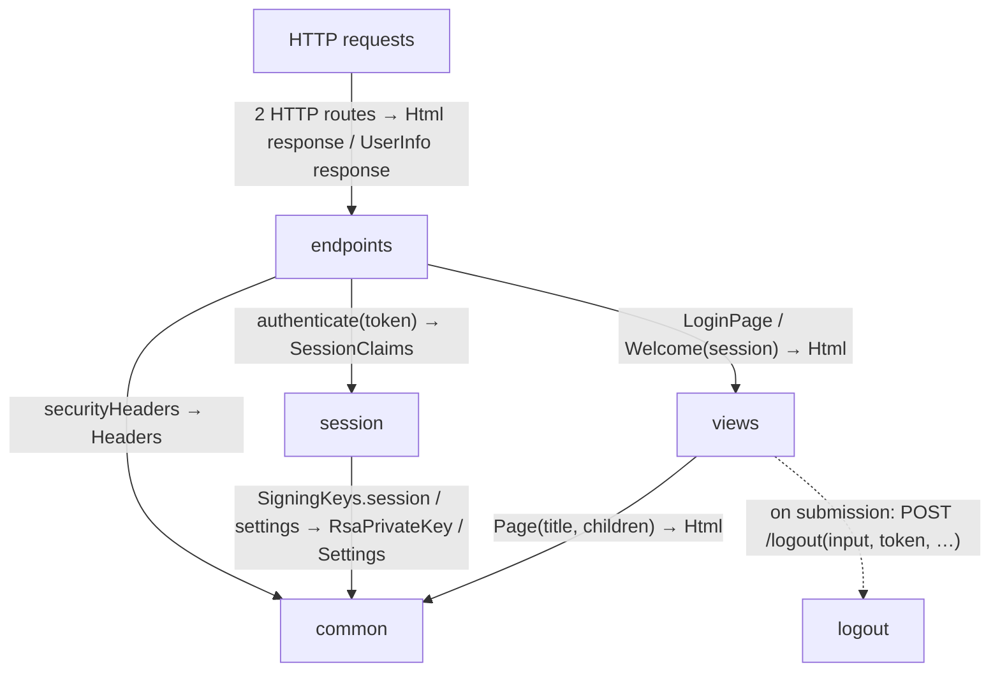
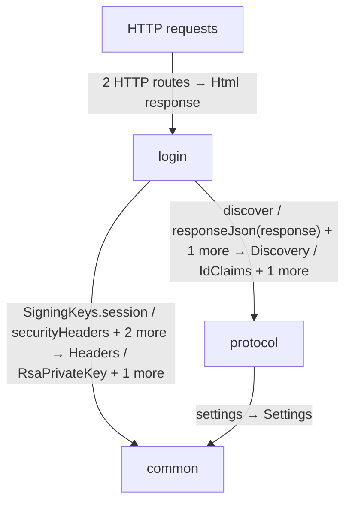
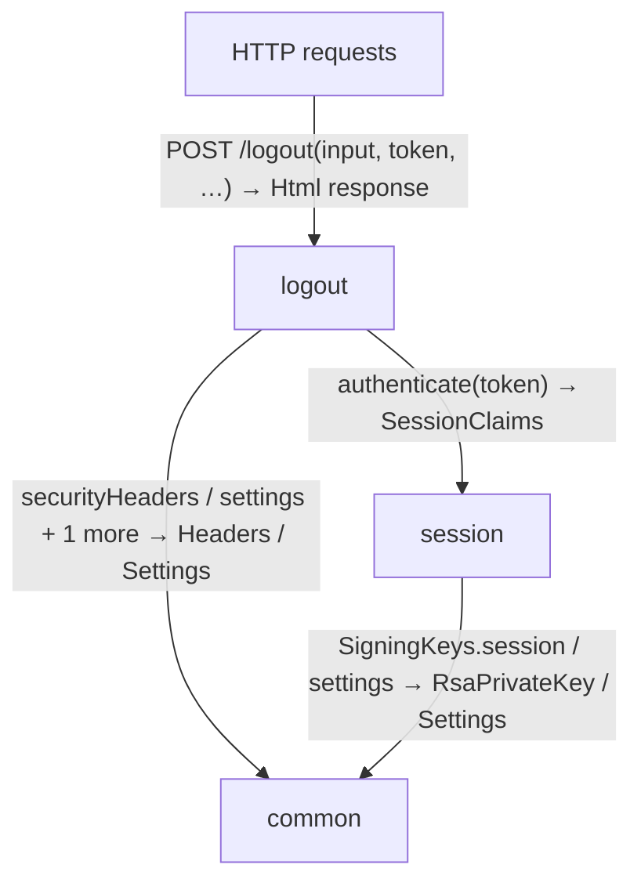
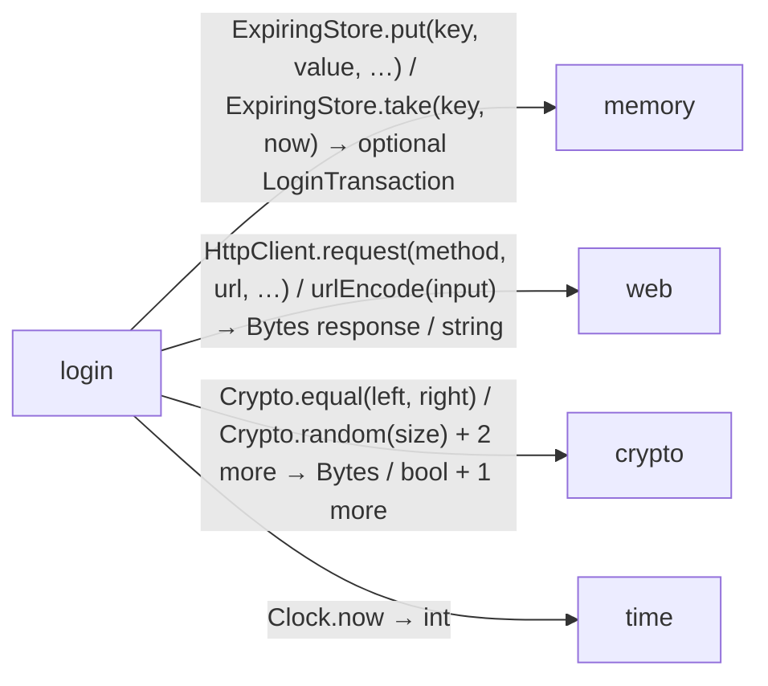
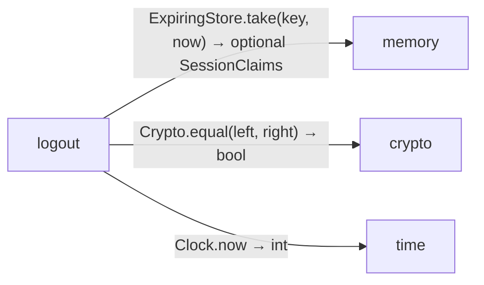
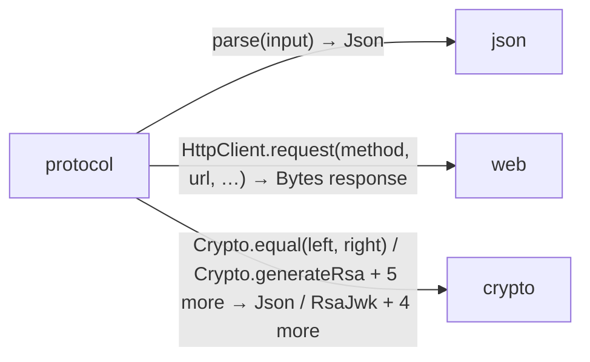
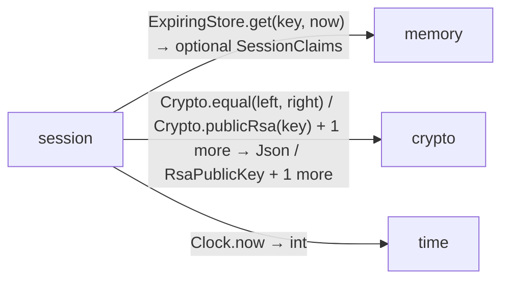

# client data flow

[OpenID Connect login application](../../../index.md)

[Project overview](../../index.md)

This view opens the client folder one level deeper. Each arrow shows the called operation and the data it returns to its caller. Calls inside a file stay in that file’s sequence view.

### endpoints request flow

### login request flow

### logout request flow

### Package boundaries

::: details login package calls

:::

::: details logout package calls

:::

::: details protocol package calls

:::

::: details session package calls

:::

::: details Data crossing these boundaries (63 contracts)

| From | To | Operation and inputs | Result |
| --- | --- | --- | --- |
| HTTP requests | endpoints | [GET /](../../../client/endpoints.md) · token: optional string from cookie · HTTP endpoint | HttpResponse\<Html\> |
| HTTP requests | endpoints | [GET /me](../../../client/endpoints.md) · token: optional string from cookie · HTTP endpoint | HttpResponse\<UserInfo\> |
| HTTP requests | login | [GET /login/callback](../../../client/login.md) · code: string from query, state: string from query, browser: optional string from cookie · HTTP endpoint | HttpResponse\<Html\> |
| HTTP requests | login | [GET /login/start](../../../client/login.md) · HTTP endpoint | HttpResponse\<Html\> |
| HTTP requests | logout | [POST /logout](../../../client/logout.md) · input: LogoutForm from form, token: optional string from cookie, origin: optional string from header · HTTP endpoint | HttpResponse\<Html\> |
| endpoints | session | [authenticate](../../../client/session.md) · token: optional string | SessionClaims |
| endpoints | views | [LoginPage](../../../client/views.md) | Html |
| endpoints | views | [Welcome](../../../client/views.md) · session: SessionClaims | Html |
| endpoints | common | [securityHeaders](../../../common/headers.md) | Headers |
| endpoints | provider | [UserInfo](../../../provider/contracts.md) · sub: string, name: string · value construction | UserInfo |
| login | contracts | [LoginTransaction](../../../client/contracts.md) · state: string, nonce: string, verifier: string, expires: int · value construction | LoginTransaction |
| login | contracts | [SessionClaims](../../../client/contracts.md) · iss: string, sub: string, aud: string, exp: int, iat: int, jti: string, csrf: string, name: string · value construction | SessionClaims |
| login | contracts | [SessionError](../../../client/contracts.md) · value construction | SessionError |
| login | protocol | [discover](../../../client/protocol.md) | Discovery |
| login | protocol | [responseJson](../../../client/protocol.md) · response: HttpResponse\<Bytes\> | Json |
| login | protocol | [validateIdentity](../../../client/protocol.md) · token: string, nonce: string, now: int, jwks: RsaJwks | IdClaims |
| login | common | [SigningKeys.session](../../../common/keys.md) · interface dispatch | RsaPrivateKey |
| login | common | [securityHeaders](../../../common/headers.md) | Headers |
| login | common | [settings](../../../common/settings.md) | Settings |
| login | common | [withCookie](../../../common/headers.md) · headers: Headers, name: string, value: string, path: string, maxAge: int, secure: bool | Headers |
| login | memory | [ExpiringStore.put](../../../dependencies/packages/%40git/url_0eb7c89453c87681ed15/0.0.0-git.a39fc582565d4fca40be4f75fa304d71adc69301/store.md) · key: string, value: LoginTransaction, expires: int, now: int · interface dispatch | void |
| login | memory | [ExpiringStore.put](../../../dependencies/packages/%40git/url_0eb7c89453c87681ed15/0.0.0-git.a39fc582565d4fca40be4f75fa304d71adc69301/store.md) · key: string, value: SessionClaims, expires: int, now: int · interface dispatch | void |
| login | memory | [ExpiringStore.take](../../../dependencies/packages/%40git/url_0eb7c89453c87681ed15/0.0.0-git.a39fc582565d4fca40be4f75fa304d71adc69301/store.md) · key: string, now: int · interface dispatch | optional LoginTransaction |
| login | web | [HttpClient.request](../../../dependencies/packages/%40git/url_897efafd565158fc4908/0.0.0-git.a39fc582565d4fca40be4f75fa304d71adc69301/contracts.md) · method: string, url: string, headers: Headers, body: Bytes · interface dispatch | HttpResponse\<Bytes\> |
| login | web | [HttpClient.request](../../../dependencies/packages/%40git/url_897efafd565158fc4908/0.0.0-git.a39fc582565d4fca40be4f75fa304d71adc69301/contracts.md) · method: string, url: string, headers: Headers, body: optional Bytes · interface dispatch | HttpResponse\<Bytes\> |
| login | web | [HttpClient.request](../../../dependencies/packages/%40git/url_897efafd565158fc4908/0.0.0-git.a39fc582565d4fca40be4f75fa304d71adc69301/contracts.md) · method: string, url: string, headers: optional Headers, body: optional Bytes · interface dispatch | HttpResponse\<Bytes\> |
| login | web | [urlEncode](../../../dependencies/packages/%40git/url_897efafd565158fc4908/0.0.0-git.a39fc582565d4fca40be4f75fa304d71adc69301/contracts.md) · input: string | string |
| login | crypto | [Crypto.equal](../../../dependencies/packages/%40git/url_9ef654c66d34ab8f5527/0.0.0-git.b14a0f9aa41f1ce58bd51133bcdc424033e40d40/contracts.md) · left: Bytes, right: Bytes · interface dispatch | bool |
| login | crypto | [Crypto.random](../../../dependencies/packages/%40git/url_9ef654c66d34ab8f5527/0.0.0-git.b14a0f9aa41f1ce58bd51133bcdc424033e40d40/contracts.md) · size: int · interface dispatch | Bytes |
| login | crypto | [Crypto.sha256](../../../dependencies/packages/%40git/url_9ef654c66d34ab8f5527/0.0.0-git.b14a0f9aa41f1ce58bd51133bcdc424033e40d40/contracts.md) · input: Bytes · interface dispatch | Bytes |
| login | crypto | [signJwt](../../../dependencies/packages/%40git/url_9ef654c66d34ab8f5527/0.0.0-git.b14a0f9aa41f1ce58bd51133bcdc424033e40d40/jose.md) · key: RsaPrivateKey, claims: Json, kid: string, tokenType: string | string |
| login | time | [Clock.now](../../../dependencies/packages/%40git/url_c092cd151499c4e1d8a1/0.0.0-git.a39fc582565d4fca40be4f75fa304d71adc69301/contracts.md) · interface dispatch | int |
| logout | contracts | [SessionError](../../../client/contracts.md) · value construction | SessionError |
| logout | session | [authenticate](../../../client/session.md) · token: optional string | SessionClaims |
| logout | common | [securityHeaders](../../../common/headers.md) | Headers |
| logout | common | [settings](../../../common/settings.md) | Settings |
| logout | common | [withCookie](../../../common/headers.md) · headers: Headers, name: string, value: string, path: string, maxAge: int, secure: bool | Headers |
| logout | memory | [ExpiringStore.take](../../../dependencies/packages/%40git/url_0eb7c89453c87681ed15/0.0.0-git.a39fc582565d4fca40be4f75fa304d71adc69301/store.md) · key: string, now: int · interface dispatch | optional SessionClaims |
| logout | crypto | [Crypto.equal](../../../dependencies/packages/%40git/url_9ef654c66d34ab8f5527/0.0.0-git.b14a0f9aa41f1ce58bd51133bcdc424033e40d40/contracts.md) · left: Bytes, right: Bytes · interface dispatch | bool |
| logout | time | [Clock.now](../../../dependencies/packages/%40git/url_c092cd151499c4e1d8a1/0.0.0-git.a39fc582565d4fca40be4f75fa304d71adc69301/contracts.md) · interface dispatch | int |
| protocol | contracts | [SessionError](../../../client/contracts.md) · value construction | SessionError |
| protocol | common | [settings](../../../common/settings.md) | Settings |
| protocol | json | [parse](../../../dependencies/packages/%40git/url_2d3c37c690c0fa115be1/0.0.0-git.a39fc582565d4fca40be4f75fa304d71adc69301/contracts.md) · input: string | Json |
| protocol | web | [HttpClient.request](../../../dependencies/packages/%40git/url_897efafd565158fc4908/0.0.0-git.a39fc582565d4fca40be4f75fa304d71adc69301/contracts.md) · method: string, url: string, headers: optional Headers, body: optional Bytes · interface dispatch | HttpResponse\<Bytes\> |
| protocol | crypto | [Crypto.equal](../../../dependencies/packages/%40git/url_9ef654c66d34ab8f5527/0.0.0-git.b14a0f9aa41f1ce58bd51133bcdc424033e40d40/contracts.md) · left: Bytes, right: Bytes · interface dispatch | bool |
| protocol | crypto | [Crypto.generateRsa](../../../dependencies/packages/%40git/url_9ef654c66d34ab8f5527/0.0.0-git.b14a0f9aa41f1ce58bd51133bcdc424033e40d40/contracts.md) · interface dispatch | RsaPrivateKey |
| protocol | crypto | [Crypto.publicRsa](../../../dependencies/packages/%40git/url_9ef654c66d34ab8f5527/0.0.0-git.b14a0f9aa41f1ce58bd51133bcdc424033e40d40/contracts.md) · key: RsaPrivateKey · interface dispatch | RsaPublicKey |
| protocol | crypto | [RsaJwks](../../../dependencies/packages/%40git/url_9ef654c66d34ab8f5527/0.0.0-git.b14a0f9aa41f1ce58bd51133bcdc424033e40d40/jose.md) · keys: List\<RsaJwk\> · value construction | RsaJwks |
| protocol | crypto | [importJwk](../../../dependencies/packages/%40git/url_9ef654c66d34ab8f5527/0.0.0-git.b14a0f9aa41f1ce58bd51133bcdc424033e40d40/jose.md) · jwk: RsaJwk | RsaPublicKey |
| protocol | crypto | [rsaJwk](../../../dependencies/packages/%40git/url_9ef654c66d34ab8f5527/0.0.0-git.b14a0f9aa41f1ce58bd51133bcdc424033e40d40/jose.md) · publicKey: RsaPublicKey, kid: string | RsaJwk |
| protocol | crypto | [signJwt](../../../dependencies/packages/%40git/url_9ef654c66d34ab8f5527/0.0.0-git.b14a0f9aa41f1ce58bd51133bcdc424033e40d40/jose.md) · key: RsaPrivateKey, claims: Json, kid: string, tokenType: string | string |
| protocol | crypto | [verifyJwt](../../../dependencies/packages/%40git/url_9ef654c66d34ab8f5527/0.0.0-git.b14a0f9aa41f1ce58bd51133bcdc424033e40d40/jose.md) · token: string, publicKey: RsaPublicKey, kid: string, tokenType: string | Json |
| protocol | provider | [IdClaims](../../../provider/contracts.md) · iss: string, sub: string, aud: string, exp: int, iat: int, nonce: string, name: string · value construction | IdClaims |
| session | contracts | [SessionError](../../../client/contracts.md) · value construction | SessionError |
| session | common | [SigningKeys.session](../../../common/keys.md) · interface dispatch | RsaPrivateKey |
| session | common | [settings](../../../common/settings.md) | Settings |
| session | memory | [ExpiringStore.get](../../../dependencies/packages/%40git/url_0eb7c89453c87681ed15/0.0.0-git.a39fc582565d4fca40be4f75fa304d71adc69301/store.md) · key: string, now: int · interface dispatch | optional SessionClaims |
| session | crypto | [Crypto.equal](../../../dependencies/packages/%40git/url_9ef654c66d34ab8f5527/0.0.0-git.b14a0f9aa41f1ce58bd51133bcdc424033e40d40/contracts.md) · left: Bytes, right: Bytes · interface dispatch | bool |
| session | crypto | [Crypto.publicRsa](../../../dependencies/packages/%40git/url_9ef654c66d34ab8f5527/0.0.0-git.b14a0f9aa41f1ce58bd51133bcdc424033e40d40/contracts.md) · key: RsaPrivateKey · interface dispatch | RsaPublicKey |
| session | crypto | [verifyJwt](../../../dependencies/packages/%40git/url_9ef654c66d34ab8f5527/0.0.0-git.b14a0f9aa41f1ce58bd51133bcdc424033e40d40/jose.md) · token: string, publicKey: RsaPublicKey, kid: string, tokenType: string | Json |
| session | time | [Clock.now](../../../dependencies/packages/%40git/url_c092cd151499c4e1d8a1/0.0.0-git.a39fc582565d4fca40be4f75fa304d71adc69301/contracts.md) · interface dispatch | int |
| views | logout | [on submission: POST /logout](../../../client/logout.md) · input: LogoutForm, token: optional string, origin: optional string · deferred HTTP action | HttpResponse\<Html\> |
| views | common | [Page](../../../common/views.md) · title: string, children: List\<Html\> | Html |

:::

## Files in this folder

| Module | Read |
| --- | --- |
| client/contracts.aug | [Flow and sequences](../../../client/contracts-diagrams.md) · [Explanation](../../../client/contracts.md) |
| client/endpoints.aug | [Flow and sequences](../../../client/endpoints-diagrams.md) · [Explanation](../../../client/endpoints.md) |
| client/export.aug | [Flow and sequences](../../../client/export-diagrams.md) · [Explanation](../../../client/export.md) |
| client/login.aug | [Flow and sequences](../../../client/login-diagrams.md) · [Explanation](../../../client/login.md) |
| client/logout.aug | [Flow and sequences](../../../client/logout-diagrams.md) · [Explanation](../../../client/logout.md) |
| client/protocol.aug | [Flow and sequences](../../../client/protocol-diagrams.md) · [Explanation](../../../client/protocol.md) |
| client/session.aug | [Flow and sequences](../../../client/session-diagrams.md) · [Explanation](../../../client/session.md) |
| client/views.aug | [Flow and sequences](../../../client/views-diagrams.md) · [Explanation](../../../client/views.md) |
