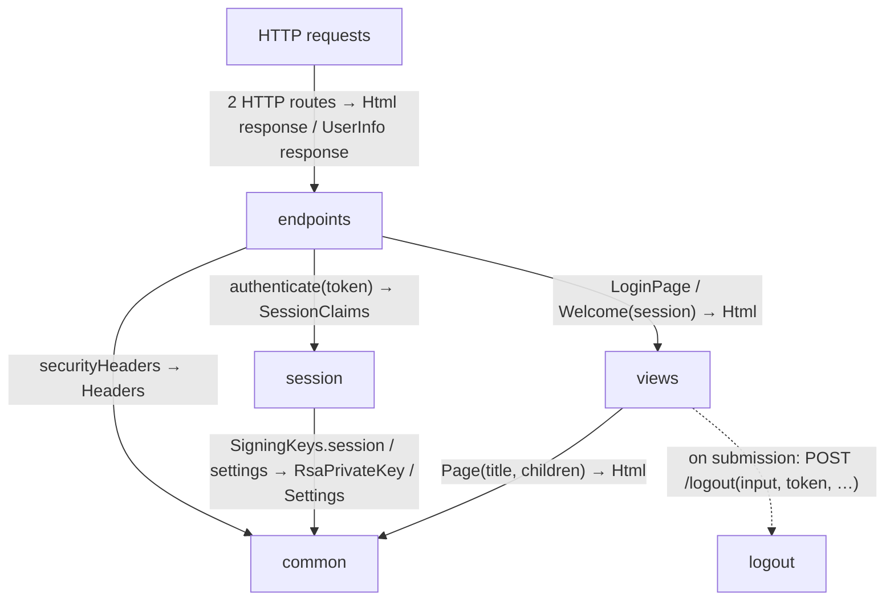
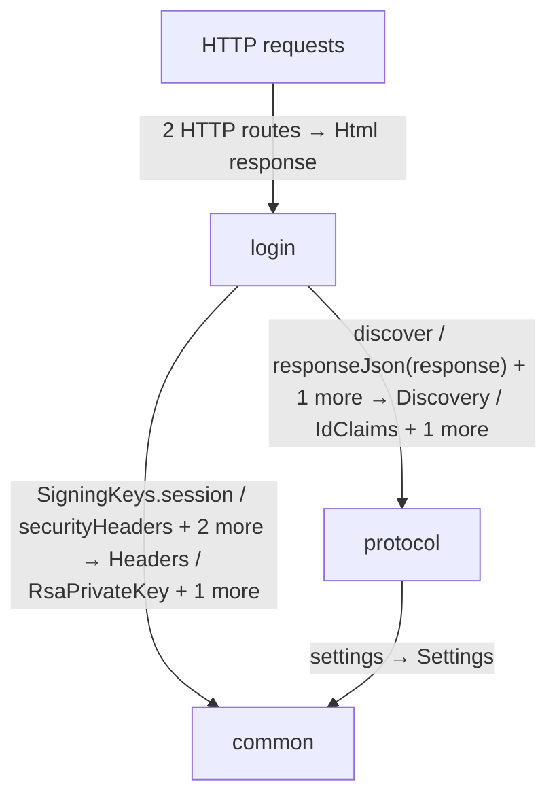
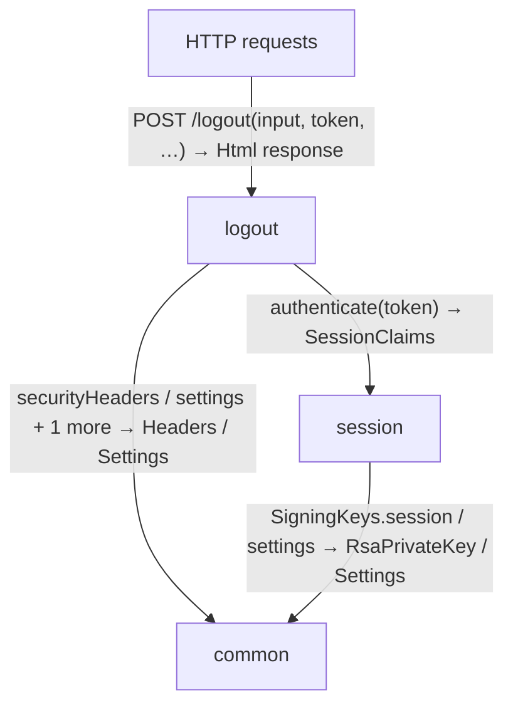
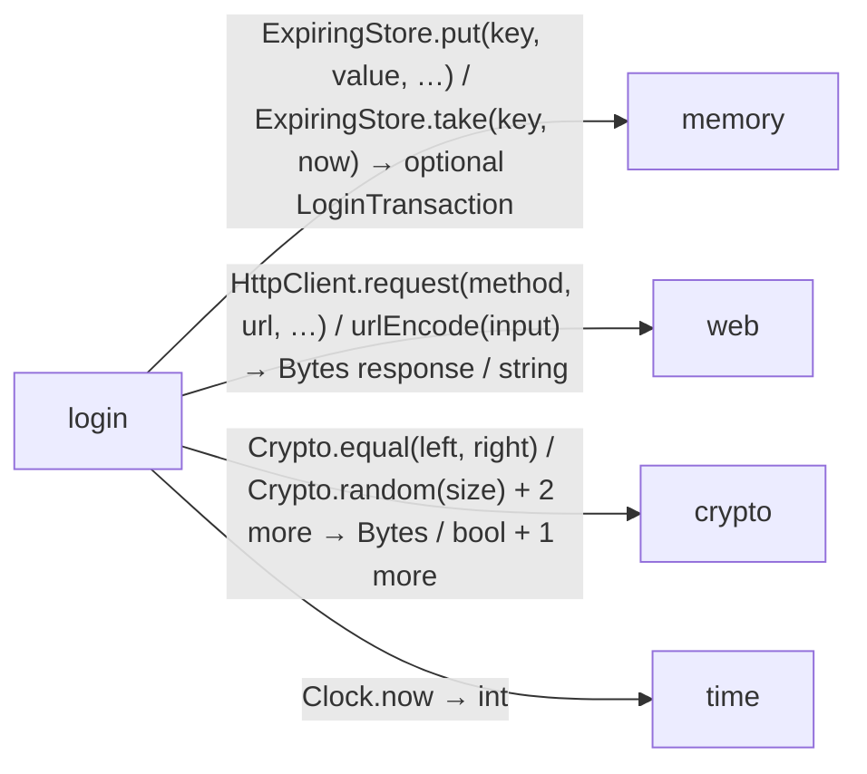
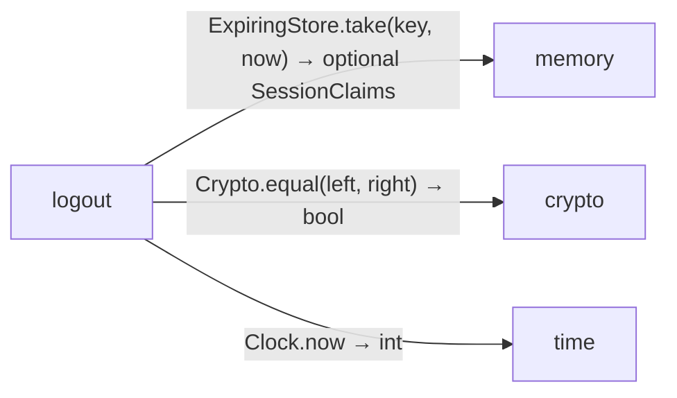
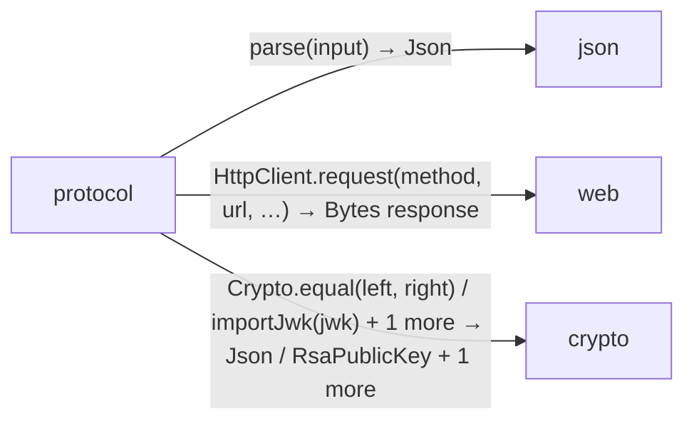
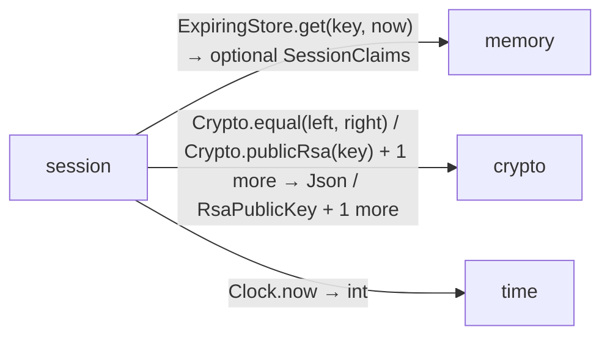

# client data flow

[OpenID Connect login application](../../../index.md)

[Project overview](../../index.md)

This view opens the client folder one level deeper. Each arrow shows the called operation and the data it returns to its caller. Calls inside a file stay in that file’s sequence view.

### endpoints request flow

### login request flow

### logout request flow

### Package boundaries

::: details login package calls

:::

::: details logout package calls

:::

::: details protocol package calls

:::

::: details session package calls

:::

### Follow the data

Each row opens the complete operations and call sites behind one pair of logical units. A grouped arrow records calls between those units; connected arrows need not belong to the same execution path.

| From | To | Operations | Read |
| --- | --- | --- | --- |
| HTTP requests | endpoints | 2 | [Inputs, results and call sites](index.md#boundary-5302a8375b93) |
| HTTP requests | login | 2 | [Inputs, results and call sites](index.md#boundary-bb83c276d089) |
| HTTP requests | logout | 1 | [Inputs, results and call sites](index.md#boundary-98e055b0effe) |
| endpoints | session | 1 | [Inputs, results and call sites](index.md#boundary-72889c4245b1) |
| endpoints | views | 2 | [Inputs, results and call sites](index.md#boundary-6f4be742168b) |
| endpoints | common | 1 | [Inputs, results and call sites](index.md#boundary-660d0493e538) |
| endpoints | provider | 1 | [Inputs, results and call sites](index.md#boundary-5790e1ecc946) |
| login | contracts | 3 | [Inputs, results and call sites](index.md#boundary-9a4e8be7d11b) |
| login | protocol | 3 | [Inputs, results and call sites](index.md#boundary-0c320083c290) |
| login | common | 4 | [Inputs, results and call sites](index.md#boundary-fe4896e987a3) |
| login | memory | 3 | [Inputs, results and call sites](index.md#boundary-dcb8b9f1e5ab) |
| login | web | 4 | [Inputs, results and call sites](index.md#boundary-415660060ec1) |
| login | crypto | 4 | [Inputs, results and call sites](index.md#boundary-f5a54536a31a) |
| login | time | 1 | [Inputs, results and call sites](index.md#boundary-d9c35d54da10) |
| logout | contracts | 1 | [Inputs, results and call sites](index.md#boundary-6625f3aaaf99) |
| logout | session | 1 | [Inputs, results and call sites](index.md#boundary-027209d2a899) |
| logout | common | 3 | [Inputs, results and call sites](index.md#boundary-2aeb50875e0c) |
| logout | memory | 1 | [Inputs, results and call sites](index.md#boundary-6917950ea8d2) |
| logout | crypto | 1 | [Inputs, results and call sites](index.md#boundary-a0f2157dec2a) |
| logout | time | 1 | [Inputs, results and call sites](index.md#boundary-c12ff5b3eae4) |
| protocol | contracts | 1 | [Inputs, results and call sites](index.md#boundary-dca7de50219d) |
| protocol | common | 1 | [Inputs, results and call sites](index.md#boundary-cc404bd522c1) |
| protocol | json | 1 | [Inputs, results and call sites](index.md#boundary-402d25608dc4) |
| protocol | web | 1 | [Inputs, results and call sites](index.md#boundary-be0b5eeec70b) |
| protocol | crypto | 8 | [Inputs, results and call sites](index.md#boundary-a1f5be5a04d9) |
| protocol | provider | 1 | [Inputs, results and call sites](index.md#boundary-4a3ea0b58ffb) |
| session | contracts | 1 | [Inputs, results and call sites](index.md#boundary-0d00a88f5b6a) |
| session | common | 2 | [Inputs, results and call sites](index.md#boundary-7ce0f6e60b8f) |
| session | memory | 1 | [Inputs, results and call sites](index.md#boundary-37ec86ff1057) |
| session | crypto | 3 | [Inputs, results and call sites](index.md#boundary-e29014c7daf2) |
| session | time | 1 | [Inputs, results and call sites](index.md#boundary-0b54c9fcbe8d) |
| views | logout | 1 | [Inputs, results and call sites](index.md#boundary-5cd8349873b6) |
| views | common | 1 | [Inputs, results and call sites](index.md#boundary-7eb55496faa9) |

#### Data crossing these boundaries (63 contracts)

#### HTTP requests → endpoints {#boundary-5302a8375b93}

::: details 2 operations, 2 sites

**[GET /](../../../client/endpoints.md#symbol-home)** · HTTP endpoint

Inputs: token: optional string from cookie. Result: HttpResponse\<Html\>.

| Caller or entry | Evidence |
| --- | --- |
| HTTP requests | [Declaration](../../../client/endpoints.md#source-L12) · [Caller explanation](../../../client/endpoints.md#symbol-home) |

**[GET /me](../../../client/endpoints.md#symbol-me)** · HTTP endpoint

Inputs: token: optional string from cookie. Result: HttpResponse\<UserInfo\>.

| Caller or entry | Evidence |
| --- | --- |
| HTTP requests | [Declaration](../../../client/endpoints.md#source-L20) · [Caller explanation](../../../client/endpoints.md#symbol-me) |

:::

#### HTTP requests → login {#boundary-bb83c276d089}

::: details 2 operations, 2 sites

**[GET /login/callback](../../../client/login.md#symbol-loginCallback)** · HTTP endpoint

Inputs: code: string from query, state: string from query, browser: optional string from cookie. Result: HttpResponse\<Html\>.

| Caller or entry | Evidence |
| --- | --- |
| HTTP requests | [Declaration](../../../client/login.md#source-L27) · [Caller explanation](../../../client/login.md#symbol-loginCallback) |

**[GET /login/start](../../../client/login.md#symbol-startLogin)** · HTTP endpoint

No caller-supplied inputs. Result: HttpResponse\<Html\>.

| Caller or entry | Evidence |
| --- | --- |
| HTTP requests | [Declaration](../../../client/login.md#source-L12) · [Caller explanation](../../../client/login.md#symbol-startLogin) |

:::

#### HTTP requests → logout {#boundary-98e055b0effe}

::: details 1 operation, 1 site

**[POST /logout](../../../client/logout.md#symbol-logout)** · HTTP endpoint

Inputs: input: LogoutForm from form, token: optional string from cookie, origin: optional string from header. Result: HttpResponse\<Html\>.

| Caller or entry | Evidence |
| --- | --- |
| HTTP requests | [Declaration](../../../client/logout.md#source-L10) · [Caller explanation](../../../client/logout.md#symbol-logout) |

:::

#### endpoints → session {#boundary-72889c4245b1}

::: details 1 operation, 2 sites

**[authenticate](../../../client/session.md#symbol-authenticate)**

Inputs: token: optional string. Result: SessionClaims.

| Caller or entry | Evidence |
| --- | --- |
| home | [Call site](../../../client/endpoints.md#source-L14) · [Caller explanation](../../../client/endpoints.md#symbol-home) |
| me | [Call site](../../../client/endpoints.md#source-L21) · [Caller explanation](../../../client/endpoints.md#symbol-me) |

:::

#### endpoints → views {#boundary-6f4be742168b}

::: details 2 operations, 2 sites

**[LoginPage](../../../client/views.md#symbol-LoginPage)**

No caller-supplied inputs. Result: Html.

| Caller or entry | Evidence |
| --- | --- |
| home | [Call site](../../../client/endpoints.md#source-L17) · [Caller explanation](../../../client/endpoints.md#symbol-home) |

**[Welcome](../../../client/views.md#symbol-Welcome)**

Inputs: session: SessionClaims. Result: Html.

| Caller or entry | Evidence |
| --- | --- |
| home | [Call site](../../../client/endpoints.md#source-L15) · [Caller explanation](../../../client/endpoints.md#symbol-home) |

:::

#### endpoints → common {#boundary-660d0493e538}

::: details 1 operation, 3 sites

**[securityHeaders](../../../common/headers.md#symbol-securityHeaders)**

No caller-supplied inputs. Result: Headers.

| Caller or entry | Evidence |
| --- | --- |
| home | [Call site](../../../client/endpoints.md#source-L15) · [Caller explanation](../../../client/endpoints.md#symbol-home) |
| home | [Call site](../../../client/endpoints.md#source-L17) · [Caller explanation](../../../client/endpoints.md#symbol-home) |
| me | [Call site](../../../client/endpoints.md#source-L22) · [Caller explanation](../../../client/endpoints.md#symbol-me) |

:::

#### endpoints → provider {#boundary-5790e1ecc946}

::: details 1 operation, 1 site

**[UserInfo](../../../provider/contracts.md#symbol-UserInfo)** · value construction

Inputs: sub: string, name: string. Result: UserInfo.

| Caller or entry | Evidence |
| --- | --- |
| me | [Call site](../../../client/endpoints.md#source-L22) · [Caller explanation](../../../client/endpoints.md#symbol-me) |

:::

#### login → contracts {#boundary-9a4e8be7d11b}

::: details 3 operations, 8 sites

**[LoginTransaction](../../../client/contracts.md#symbol-LoginTransaction)** · value construction

Inputs: state: string, nonce: string, verifier: string, expires: int. Result: LoginTransaction.

| Caller or entry | Evidence |
| --- | --- |
| startLogin | [Call site](../../../client/login.md#source-L19) · [Caller explanation](../../../client/login.md#symbol-startLogin) |

**[SessionClaims](../../../client/contracts.md#symbol-SessionClaims)** · value construction

Inputs: iss: string, sub: string, aud: string, exp: int, iat: int, jti: string, csrf: string, name: string. Result: SessionClaims.

| Caller or entry | Evidence |
| --- | --- |
| loginCallback | [Call site](../../../client/login.md#source-L54) · [Caller explanation](../../../client/login.md#symbol-loginCallback) |

**[SessionError](../../../client/contracts.md#symbol-SessionError)** · value construction

No caller-supplied inputs. Result: SessionError.

| Caller or entry | Evidence |
| --- | --- |
| loginCallback | [Call site](../../../client/login.md#source-L29) · [Caller explanation](../../../client/login.md#symbol-loginCallback) |
| loginCallback | [Call site](../../../client/login.md#source-L32) · [Caller explanation](../../../client/login.md#symbol-loginCallback) |
| loginCallback | [Call site](../../../client/login.md#source-L36) · [Caller explanation](../../../client/login.md#symbol-loginCallback) |
| loginCallback | [Call site](../../../client/login.md#source-L39) · [Caller explanation](../../../client/login.md#symbol-loginCallback) |
| loginCallback | [Call site](../../../client/login.md#source-L46) · [Caller explanation](../../../client/login.md#symbol-loginCallback) |
| loginCallback | [Call site](../../../client/login.md#source-L52) · [Caller explanation](../../../client/login.md#symbol-loginCallback) |

:::

#### login → protocol {#boundary-0c320083c290}

::: details 3 operations, 6 sites

**[discover](../../../client/protocol.md#symbol-discover)**

No caller-supplied inputs. Result: Discovery.

| Caller or entry | Evidence |
| --- | --- |
| startLogin | [Call site](../../../client/login.md#source-L14) · [Caller explanation](../../../client/login.md#symbol-startLogin) |
| loginCallback | [Call site](../../../client/login.md#source-L41) · [Caller explanation](../../../client/login.md#symbol-loginCallback) |

**[responseJson](../../../client/protocol.md#symbol-responseJson)**

Inputs: response: HttpResponse\<Bytes\>. Result: Json.

| Caller or entry | Evidence |
| --- | --- |
| loginCallback | [Call site](../../../client/login.md#source-L44) · [Caller explanation](../../../client/login.md#symbol-loginCallback) |
| loginCallback | [Call site](../../../client/login.md#source-L47) · [Caller explanation](../../../client/login.md#symbol-loginCallback) |
| loginCallback | [Call site](../../../client/login.md#source-L50) · [Caller explanation](../../../client/login.md#symbol-loginCallback) |

**[validateIdentity](../../../client/protocol.md#symbol-validateIdentity)**

Inputs: token: string, nonce: string, now: int, jwks: RsaJwks. Result: IdClaims.

| Caller or entry | Evidence |
| --- | --- |
| loginCallback | [Call site](../../../client/login.md#source-L48) · [Caller explanation](../../../client/login.md#symbol-loginCallback) |

:::

#### login → common {#boundary-fe4896e987a3}

::: details 4 operations, 8 sites

**[SigningKeys.session](../../../common/keys.md#symbol-SigningKeys.session)** · interface dispatch

No caller-supplied inputs. Result: RsaPrivateKey.

| Caller or entry | Evidence |
| --- | --- |
| loginCallback | [Call site](../../../client/login.md#source-L55) · [Caller explanation](../../../client/login.md#symbol-loginCallback) |

**[securityHeaders](../../../common/headers.md#symbol-securityHeaders)**

No caller-supplied inputs. Result: Headers.

| Caller or entry | Evidence |
| --- | --- |
| startLogin | [Call site](../../../client/login.md#source-L23) · [Caller explanation](../../../client/login.md#symbol-startLogin) |
| loginCallback | [Call site](../../../client/login.md#source-L57) · [Caller explanation](../../../client/login.md#symbol-loginCallback) |

**[settings](../../../common/settings.md#symbol-settings)**

No caller-supplied inputs. Result: Settings.

| Caller or entry | Evidence |
| --- | --- |
| startLogin | [Call site](../../../client/login.md#source-L13) · [Caller explanation](../../../client/login.md#symbol-startLogin) |
| loginCallback | [Call site](../../../client/login.md#source-L40) · [Caller explanation](../../../client/login.md#symbol-loginCallback) |

**[withCookie](../../../common/headers.md#symbol-withCookie)**

Inputs: headers: Headers, name: string, value: string, path: string, maxAge: int, secure: bool. Result: Headers.

| Caller or entry | Evidence |
| --- | --- |
| startLogin | [Call site](../../../client/login.md#source-L23) · [Caller explanation](../../../client/login.md#symbol-startLogin) |
| loginCallback | [Call site](../../../client/login.md#source-L57) · [Caller explanation](../../../client/login.md#symbol-loginCallback) |
| loginCallback | [Call site](../../../client/login.md#source-L58) · [Caller explanation](../../../client/login.md#symbol-loginCallback) |

:::

#### login → memory {#boundary-dcb8b9f1e5ab}

::: details 3 operations, 3 sites

**[ExpiringStore.put](../../../dependencies/packages/%40git/url_0eb7c89453c87681ed15/0.0.0-git.a39fc582565d4fca40be4f75fa304d71adc69301/store.md#symbol-ExpiringStore.put)** · interface dispatch

Inputs: key: string, value: LoginTransaction, expires: int, now: int. Result: void.

| Caller or entry | Evidence |
| --- | --- |
| startLogin | [Call site](../../../client/login.md#source-L20) · [Caller explanation](../../../client/login.md#symbol-startLogin) |

**[ExpiringStore.put](../../../dependencies/packages/%40git/url_0eb7c89453c87681ed15/0.0.0-git.a39fc582565d4fca40be4f75fa304d71adc69301/store.md#symbol-ExpiringStore.put)** · interface dispatch

Inputs: key: string, value: SessionClaims, expires: int, now: int. Result: void.

| Caller or entry | Evidence |
| --- | --- |
| loginCallback | [Call site](../../../client/login.md#source-L56) · [Caller explanation](../../../client/login.md#symbol-loginCallback) |

**[ExpiringStore.take](../../../dependencies/packages/%40git/url_0eb7c89453c87681ed15/0.0.0-git.a39fc582565d4fca40be4f75fa304d71adc69301/store.md#symbol-ExpiringStore.take)** · interface dispatch

Inputs: key: string, now: int. Result: optional LoginTransaction.

| Caller or entry | Evidence |
| --- | --- |
| loginCallback | [Call site](../../../client/login.md#source-L34) · [Caller explanation](../../../client/login.md#symbol-loginCallback) |

:::

#### login → web {#boundary-415660060ec1}

::: details 4 operations, 12 sites

**[HttpClient.request](../../../dependencies/packages/%40git/url_897efafd565158fc4908/0.0.0-git.a39fc582565d4fca40be4f75fa304d71adc69301/contracts.md#symbol-HttpClient.request)** · interface dispatch

Inputs: method: string, url: string, headers: Headers, body: Bytes. Result: HttpResponse\<Bytes\>.

| Caller or entry | Evidence |
| --- | --- |
| loginCallback | [Call site](../../../client/login.md#source-L44) · [Caller explanation](../../../client/login.md#symbol-loginCallback) |

**[HttpClient.request](../../../dependencies/packages/%40git/url_897efafd565158fc4908/0.0.0-git.a39fc582565d4fca40be4f75fa304d71adc69301/contracts.md#symbol-HttpClient.request)** · interface dispatch

Inputs: method: string, url: string, headers: Headers, body: optional Bytes. Result: HttpResponse\<Bytes\>.

| Caller or entry | Evidence |
| --- | --- |
| loginCallback | [Call site](../../../client/login.md#source-L50) · [Caller explanation](../../../client/login.md#symbol-loginCallback) |

**[HttpClient.request](../../../dependencies/packages/%40git/url_897efafd565158fc4908/0.0.0-git.a39fc582565d4fca40be4f75fa304d71adc69301/contracts.md#symbol-HttpClient.request)** · interface dispatch

Inputs: method: string, url: string, headers: optional Headers, body: optional Bytes. Result: HttpResponse\<Bytes\>.

| Caller or entry | Evidence |
| --- | --- |
| loginCallback | [Call site](../../../client/login.md#source-L47) · [Caller explanation](../../../client/login.md#symbol-loginCallback) |

**[urlEncode](../../../dependencies/packages/%40git/url_897efafd565158fc4908/0.0.0-git.a39fc582565d4fca40be4f75fa304d71adc69301/contracts.md#symbol-urlEncode)**

Inputs: input: string. Result: string.

| Caller or entry | Evidence |
| --- | --- |
| startLogin | [Call site](../../../client/login.md#source-L22) · [Caller explanation](../../../client/login.md#symbol-startLogin) |
| startLogin | [Call site](../../../client/login.md#source-L22) · [Caller explanation](../../../client/login.md#symbol-startLogin) |
| startLogin | [Call site](../../../client/login.md#source-L22) · [Caller explanation](../../../client/login.md#symbol-startLogin) |
| startLogin | [Call site](../../../client/login.md#source-L22) · [Caller explanation](../../../client/login.md#symbol-startLogin) |
| startLogin | [Call site](../../../client/login.md#source-L22) · [Caller explanation](../../../client/login.md#symbol-startLogin) |
| loginCallback | [Call site](../../../client/login.md#source-L42) · [Caller explanation](../../../client/login.md#symbol-loginCallback) |
| loginCallback | [Call site](../../../client/login.md#source-L42) · [Caller explanation](../../../client/login.md#symbol-loginCallback) |
| loginCallback | [Call site](../../../client/login.md#source-L42) · [Caller explanation](../../../client/login.md#symbol-loginCallback) |
| loginCallback | [Call site](../../../client/login.md#source-L42) · [Caller explanation](../../../client/login.md#symbol-loginCallback) |

:::

#### login → crypto {#boundary-f5a54536a31a}

::: details 4 operations, 9 sites

**[Crypto.equal](../../../dependencies/packages/%40git/url_9ef654c66d34ab8f5527/0.0.0-git.b14a0f9aa41f1ce58bd51133bcdc424033e40d40/contracts.md#symbol-Crypto.equal)** · interface dispatch

Inputs: left: Bytes, right: Bytes. Result: bool.

| Caller or entry | Evidence |
| --- | --- |
| loginCallback | [Call site](../../../client/login.md#source-L38) · [Caller explanation](../../../client/login.md#symbol-loginCallback) |

**[Crypto.random](../../../dependencies/packages/%40git/url_9ef654c66d34ab8f5527/0.0.0-git.b14a0f9aa41f1ce58bd51133bcdc424033e40d40/contracts.md#symbol-Crypto.random)** · interface dispatch

Inputs: size: int. Result: Bytes.

| Caller or entry | Evidence |
| --- | --- |
| startLogin | [Call site](../../../client/login.md#source-L15) · [Caller explanation](../../../client/login.md#symbol-startLogin) |
| startLogin | [Call site](../../../client/login.md#source-L16) · [Caller explanation](../../../client/login.md#symbol-startLogin) |
| startLogin | [Call site](../../../client/login.md#source-L17) · [Caller explanation](../../../client/login.md#symbol-startLogin) |
| startLogin | [Call site](../../../client/login.md#source-L18) · [Caller explanation](../../../client/login.md#symbol-startLogin) |
| loginCallback | [Call site](../../../client/login.md#source-L54) · [Caller explanation](../../../client/login.md#symbol-loginCallback) |
| loginCallback | [Call site](../../../client/login.md#source-L54) · [Caller explanation](../../../client/login.md#symbol-loginCallback) |

**[Crypto.sha256](../../../dependencies/packages/%40git/url_9ef654c66d34ab8f5527/0.0.0-git.b14a0f9aa41f1ce58bd51133bcdc424033e40d40/contracts.md#symbol-Crypto.sha256)** · interface dispatch

Inputs: input: Bytes. Result: Bytes.

| Caller or entry | Evidence |
| --- | --- |
| startLogin | [Call site](../../../client/login.md#source-L21) · [Caller explanation](../../../client/login.md#symbol-startLogin) |

**[signJwt](../../../dependencies/packages/%40git/url_9ef654c66d34ab8f5527/0.0.0-git.b14a0f9aa41f1ce58bd51133bcdc424033e40d40/jose.md#symbol-signJwt)**

Inputs: key: RsaPrivateKey, claims: Json, kid: string, tokenType: string. Result: string.

| Caller or entry | Evidence |
| --- | --- |
| loginCallback | [Call site](../../../client/login.md#source-L55) · [Caller explanation](../../../client/login.md#symbol-loginCallback) |

:::

#### login → time {#boundary-d9c35d54da10}

::: details 1 operation, 5 sites

**[Clock.now](../../../dependencies/packages/%40git/url_c092cd151499c4e1d8a1/0.0.0-git.a39fc582565d4fca40be4f75fa304d71adc69301/contracts.md#symbol-Clock.now)** · interface dispatch

No caller-supplied inputs. Result: int.

| Caller or entry | Evidence |
| --- | --- |
| startLogin | [Call site](../../../client/login.md#source-L19) · [Caller explanation](../../../client/login.md#symbol-startLogin) |
| startLogin | [Call site](../../../client/login.md#source-L20) · [Caller explanation](../../../client/login.md#symbol-startLogin) |
| loginCallback | [Call site](../../../client/login.md#source-L34) · [Caller explanation](../../../client/login.md#symbol-loginCallback) |
| loginCallback | [Call site](../../../client/login.md#source-L48) · [Caller explanation](../../../client/login.md#symbol-loginCallback) |
| loginCallback | [Call site](../../../client/login.md#source-L53) · [Caller explanation](../../../client/login.md#symbol-loginCallback) |

:::

#### logout → contracts {#boundary-6625f3aaaf99}

::: details 1 operation, 2 sites

**[SessionError](../../../client/contracts.md#symbol-SessionError)** · value construction

No caller-supplied inputs. Result: SessionError.

| Caller or entry | Evidence |
| --- | --- |
| logout | [Call site](../../../client/logout.md#source-L13) · [Caller explanation](../../../client/logout.md#symbol-logout) |
| logout | [Call site](../../../client/logout.md#source-L16) · [Caller explanation](../../../client/logout.md#symbol-logout) |

:::

#### logout → session {#boundary-027209d2a899}

::: details 1 operation, 1 site

**[authenticate](../../../client/session.md#symbol-authenticate)**

Inputs: token: optional string. Result: SessionClaims.

| Caller or entry | Evidence |
| --- | --- |
| logout | [Call site](../../../client/logout.md#source-L14) · [Caller explanation](../../../client/logout.md#symbol-logout) |

:::

#### logout → common {#boundary-2aeb50875e0c}

::: details 3 operations, 3 sites

**[securityHeaders](../../../common/headers.md#symbol-securityHeaders)**

No caller-supplied inputs. Result: Headers.

| Caller or entry | Evidence |
| --- | --- |
| logout | [Call site](../../../client/logout.md#source-L18) · [Caller explanation](../../../client/logout.md#symbol-logout) |

**[settings](../../../common/settings.md#symbol-settings)**

No caller-supplied inputs. Result: Settings.

| Caller or entry | Evidence |
| --- | --- |
| logout | [Call site](../../../client/logout.md#source-L11) · [Caller explanation](../../../client/logout.md#symbol-logout) |

**[withCookie](../../../common/headers.md#symbol-withCookie)**

Inputs: headers: Headers, name: string, value: string, path: string, maxAge: int, secure: bool. Result: Headers.

| Caller or entry | Evidence |
| --- | --- |
| logout | [Call site](../../../client/logout.md#source-L18) · [Caller explanation](../../../client/logout.md#symbol-logout) |

:::

#### logout → memory {#boundary-6917950ea8d2}

::: details 1 operation, 1 site

**[ExpiringStore.take](../../../dependencies/packages/%40git/url_0eb7c89453c87681ed15/0.0.0-git.a39fc582565d4fca40be4f75fa304d71adc69301/store.md#symbol-ExpiringStore.take)** · interface dispatch

Inputs: key: string, now: int. Result: optional SessionClaims.

| Caller or entry | Evidence |
| --- | --- |
| logout | [Call site](../../../client/logout.md#source-L17) · [Caller explanation](../../../client/logout.md#symbol-logout) |

:::

#### logout → crypto {#boundary-a0f2157dec2a}

::: details 1 operation, 1 site

**[Crypto.equal](../../../dependencies/packages/%40git/url_9ef654c66d34ab8f5527/0.0.0-git.b14a0f9aa41f1ce58bd51133bcdc424033e40d40/contracts.md#symbol-Crypto.equal)** · interface dispatch

Inputs: left: Bytes, right: Bytes. Result: bool.

| Caller or entry | Evidence |
| --- | --- |
| logout | [Call site](../../../client/logout.md#source-L15) · [Caller explanation](../../../client/logout.md#symbol-logout) |

:::

#### logout → time {#boundary-c12ff5b3eae4}

::: details 1 operation, 1 site

**[Clock.now](../../../dependencies/packages/%40git/url_c092cd151499c4e1d8a1/0.0.0-git.a39fc582565d4fca40be4f75fa304d71adc69301/contracts.md#symbol-Clock.now)** · interface dispatch

No caller-supplied inputs. Result: int.

| Caller or entry | Evidence |
| --- | --- |
| logout | [Call site](../../../client/logout.md#source-L17) · [Caller explanation](../../../client/logout.md#symbol-logout) |

:::

#### protocol → contracts {#boundary-dca7de50219d}

::: details 1 operation, 16 sites

**[SessionError](../../../client/contracts.md#symbol-SessionError)** · value construction

No caller-supplied inputs. Result: SessionError.

| Caller or entry | Evidence |
| --- | --- |
| responseJson | [Call site](../../../client/protocol.md#source-L12) · [Caller explanation](../../../client/protocol.md#symbol-responseJson) |
| responseJson | [Call site](../../../client/protocol.md#source-L15) · [Caller explanation](../../../client/protocol.md#symbol-responseJson) |
| responseJson | [Call site](../../../client/protocol.md#source-L18) · [Caller explanation](../../../client/protocol.md#symbol-responseJson) |
| responseJson | [Call site](../../../client/protocol.md#source-L22) · [Caller explanation](../../../client/protocol.md#symbol-responseJson) |
| responseJson | [Call site](../../../client/protocol.md#source-L24) · [Caller explanation](../../../client/protocol.md#symbol-responseJson) |
| discover | [Call site](../../../client/protocol.md#source-L33) · [Caller explanation](../../../client/protocol.md#symbol-discover) |
| discover | [Call site](../../../client/protocol.md#source-L36) · [Caller explanation](../../../client/protocol.md#symbol-discover) |
| validateIdentity | [Call site](../../../client/protocol.md#source-L42) · [Caller explanation](../../../client/protocol.md#symbol-validateIdentity) |
| validateIdentity | [Call site](../../../client/protocol.md#source-L46) · [Caller explanation](../../../client/protocol.md#symbol-validateIdentity) |
| validateIdentity | [Call site](../../../client/protocol.md#source-L50) · [Caller explanation](../../../client/protocol.md#symbol-validateIdentity) |
| validateIdentity | [Call site](../../../client/protocol.md#source-L52) · [Caller explanation](../../../client/protocol.md#symbol-validateIdentity) |
| validateIdentity | [Call site](../../../client/protocol.md#source-L54) · [Caller explanation](../../../client/protocol.md#symbol-validateIdentity) |
| validateIdentity | [Call site](../../../client/protocol.md#source-L57) · [Caller explanation](../../../client/protocol.md#symbol-validateIdentity) |
| validateIdentity | [Call site](../../../client/protocol.md#source-L59) · [Caller explanation](../../../client/protocol.md#symbol-validateIdentity) |
| validateIdentity | [Call site](../../../client/protocol.md#source-L61) · [Caller explanation](../../../client/protocol.md#symbol-validateIdentity) |
| validateIdentity | [Call site](../../../client/protocol.md#source-L63) · [Caller explanation](../../../client/protocol.md#symbol-validateIdentity) |

:::

#### protocol → common {#boundary-cc404bd522c1}

::: details 1 operation, 3 sites

**[settings](../../../common/settings.md#symbol-settings)**

No caller-supplied inputs. Result: Settings.

| Caller or entry | Evidence |
| --- | --- |
| discover | [Call site](../../../client/protocol.md#source-L28) · [Caller explanation](../../../client/protocol.md#symbol-discover) |
| validateIdentity | [Call site](../../../client/protocol.md#source-L40) · [Caller explanation](../../../client/protocol.md#symbol-validateIdentity) |
| test validateIdentity | [Call site](../../../client/protocol.md#source-L72) · [Caller explanation](../../../client/protocol.md#symbol-test-20-validateIdentity) |

:::

#### protocol → json {#boundary-402d25608dc4}

::: details 1 operation, 1 site

**[parse](../../../dependencies/packages/%40git/url_2d3c37c690c0fa115be1/0.0.0-git.a39fc582565d4fca40be4f75fa304d71adc69301/contracts.md#symbol-parse)**

Inputs: input: string. Result: Json.

| Caller or entry | Evidence |
| --- | --- |
| responseJson | [Call site](../../../client/protocol.md#source-L20) · [Caller explanation](../../../client/protocol.md#symbol-responseJson) |

:::

#### protocol → web {#boundary-be0b5eeec70b}

::: details 1 operation, 1 site

**[HttpClient.request](../../../dependencies/packages/%40git/url_897efafd565158fc4908/0.0.0-git.a39fc582565d4fca40be4f75fa304d71adc69301/contracts.md#symbol-HttpClient.request)** · interface dispatch

Inputs: method: string, url: string, headers: optional Headers, body: optional Bytes. Result: HttpResponse\<Bytes\>.

| Caller or entry | Evidence |
| --- | --- |
| discover | [Call site](../../../client/protocol.md#source-L29) · [Caller explanation](../../../client/protocol.md#symbol-discover) |

:::

#### protocol → crypto {#boundary-a1f5be5a04d9}

::: details 8 operations, 10 sites

**[Crypto.equal](../../../dependencies/packages/%40git/url_9ef654c66d34ab8f5527/0.0.0-git.b14a0f9aa41f1ce58bd51133bcdc424033e40d40/contracts.md#symbol-Crypto.equal)** · interface dispatch

Inputs: left: Bytes, right: Bytes. Result: bool.

| Caller or entry | Evidence |
| --- | --- |
| validateIdentity | [Call site](../../../client/protocol.md#source-L53) · [Caller explanation](../../../client/protocol.md#symbol-validateIdentity) |

**[Crypto.generateRsa](../../../dependencies/packages/%40git/url_9ef654c66d34ab8f5527/0.0.0-git.b14a0f9aa41f1ce58bd51133bcdc424033e40d40/contracts.md#symbol-Crypto.generateRsa)** · interface dispatch

No caller-supplied inputs. Result: RsaPrivateKey.

| Caller or entry | Evidence |
| --- | --- |
| test validateIdentity | [Call site](../../../client/protocol.md#source-L69) · [Caller explanation](../../../client/protocol.md#symbol-test-20-validateIdentity) |

**[Crypto.publicRsa](../../../dependencies/packages/%40git/url_9ef654c66d34ab8f5527/0.0.0-git.b14a0f9aa41f1ce58bd51133bcdc424033e40d40/contracts.md#symbol-Crypto.publicRsa)** · interface dispatch

Inputs: key: RsaPrivateKey. Result: RsaPublicKey.

| Caller or entry | Evidence |
| --- | --- |
| test validateIdentity | [Call site](../../../client/protocol.md#source-L70) · [Caller explanation](../../../client/protocol.md#symbol-test-20-validateIdentity) |

**[RsaJwks](../../../dependencies/packages/%40git/url_9ef654c66d34ab8f5527/0.0.0-git.b14a0f9aa41f1ce58bd51133bcdc424033e40d40/jose.md#symbol-RsaJwks)** · value construction

Inputs: keys: List\<RsaJwk\>. Result: RsaJwks.

| Caller or entry | Evidence |
| --- | --- |
| test validateIdentity | [Call site](../../../client/protocol.md#source-L71) · [Caller explanation](../../../client/protocol.md#symbol-test-20-validateIdentity) |

**[importJwk](../../../dependencies/packages/%40git/url_9ef654c66d34ab8f5527/0.0.0-git.b14a0f9aa41f1ce58bd51133bcdc424033e40d40/jose.md#symbol-importJwk)**

Inputs: jwk: RsaJwk. Result: RsaPublicKey.

| Caller or entry | Evidence |
| --- | --- |
| validateIdentity | [Call site](../../../client/protocol.md#source-L47) · [Caller explanation](../../../client/protocol.md#symbol-validateIdentity) |

**[rsaJwk](../../../dependencies/packages/%40git/url_9ef654c66d34ab8f5527/0.0.0-git.b14a0f9aa41f1ce58bd51133bcdc424033e40d40/jose.md#symbol-rsaJwk)**

Inputs: publicKey: RsaPublicKey, kid: string. Result: RsaJwk.

| Caller or entry | Evidence |
| --- | --- |
| test validateIdentity | [Call site](../../../client/protocol.md#source-L71) · [Caller explanation](../../../client/protocol.md#symbol-test-20-validateIdentity) |

**[signJwt](../../../dependencies/packages/%40git/url_9ef654c66d34ab8f5527/0.0.0-git.b14a0f9aa41f1ce58bd51133bcdc424033e40d40/jose.md#symbol-signJwt)**

Inputs: key: RsaPrivateKey, claims: Json, kid: string, tokenType: string. Result: string.

| Caller or entry | Evidence |
| --- | --- |
| test validateIdentity | [Call site](../../../client/protocol.md#source-L78) · [Caller explanation](../../../client/protocol.md#symbol-test-20-validateIdentity) |
| test validateIdentity | [Call site](../../../client/protocol.md#source-L93) · [Caller explanation](../../../client/protocol.md#symbol-test-20-validateIdentity) |
| test validateIdentity | [Call site](../../../client/protocol.md#source-L102) · [Caller explanation](../../../client/protocol.md#symbol-test-20-validateIdentity) |

**[verifyJwt](../../../dependencies/packages/%40git/url_9ef654c66d34ab8f5527/0.0.0-git.b14a0f9aa41f1ce58bd51133bcdc424033e40d40/jose.md#symbol-verifyJwt)**

Inputs: token: string, publicKey: RsaPublicKey, kid: string, tokenType: string. Result: Json.

| Caller or entry | Evidence |
| --- | --- |
| validateIdentity | [Call site](../../../client/protocol.md#source-L48) · [Caller explanation](../../../client/protocol.md#symbol-validateIdentity) |

:::

#### protocol → provider {#boundary-4a3ea0b58ffb}

::: details 1 operation, 3 sites

**[IdClaims](../../../provider/contracts.md#symbol-IdClaims)** · value construction

Inputs: iss: string, sub: string, aud: string, exp: int, iat: int, nonce: string, name: string. Result: IdClaims.

| Caller or entry | Evidence |
| --- | --- |
| test validateIdentity | [Call site](../../../client/protocol.md#source-L77) · [Caller explanation](../../../client/protocol.md#symbol-test-20-validateIdentity) |
| test validateIdentity | [Call site](../../../client/protocol.md#source-L92) · [Caller explanation](../../../client/protocol.md#symbol-test-20-validateIdentity) |
| test validateIdentity | [Call site](../../../client/protocol.md#source-L101) · [Caller explanation](../../../client/protocol.md#symbol-test-20-validateIdentity) |

:::

#### session → contracts {#boundary-0d00a88f5b6a}

::: details 1 operation, 8 sites

**[SessionError](../../../client/contracts.md#symbol-SessionError)** · value construction

No caller-supplied inputs. Result: SessionError.

| Caller or entry | Evidence |
| --- | --- |
| authenticate | [Call site](../../../client/session.md#source-L12) · [Caller explanation](../../../client/session.md#symbol-authenticate) |
| authenticate | [Call site](../../../client/session.md#source-L20) · [Caller explanation](../../../client/session.md#symbol-authenticate) |
| authenticate | [Call site](../../../client/session.md#source-L22) · [Caller explanation](../../../client/session.md#symbol-authenticate) |
| authenticate | [Call site](../../../client/session.md#source-L25) · [Caller explanation](../../../client/session.md#symbol-authenticate) |
| authenticate | [Call site](../../../client/session.md#source-L28) · [Caller explanation](../../../client/session.md#symbol-authenticate) |
| authenticate | [Call site](../../../client/session.md#source-L31) · [Caller explanation](../../../client/session.md#symbol-authenticate) |
| authenticate | [Call site](../../../client/session.md#source-L33) · [Caller explanation](../../../client/session.md#symbol-authenticate) |
| authenticate | [Call site](../../../client/session.md#source-L35) · [Caller explanation](../../../client/session.md#symbol-authenticate) |

:::

#### session → common {#boundary-7ce0f6e60b8f}

::: details 2 operations, 2 sites

**[SigningKeys.session](../../../common/keys.md#symbol-SigningKeys.session)** · interface dispatch

No caller-supplied inputs. Result: RsaPrivateKey.

| Caller or entry | Evidence |
| --- | --- |
| authenticate | [Call site](../../../client/session.md#source-L15) · [Caller explanation](../../../client/session.md#symbol-authenticate) |

**[settings](../../../common/settings.md#symbol-settings)**

No caller-supplied inputs. Result: Settings.

| Caller or entry | Evidence |
| --- | --- |
| authenticate | [Call site](../../../client/session.md#source-L17) · [Caller explanation](../../../client/session.md#symbol-authenticate) |

:::

#### session → memory {#boundary-37ec86ff1057}

::: details 1 operation, 1 site

**[ExpiringStore.get](../../../dependencies/packages/%40git/url_0eb7c89453c87681ed15/0.0.0-git.a39fc582565d4fca40be4f75fa304d71adc69301/store.md#symbol-ExpiringStore.get)** · interface dispatch

Inputs: key: string, now: int. Result: optional SessionClaims.

| Caller or entry | Evidence |
| --- | --- |
| authenticate | [Call site](../../../client/session.md#source-L23) · [Caller explanation](../../../client/session.md#symbol-authenticate) |

:::

#### session → crypto {#boundary-e29014c7daf2}

::: details 3 operations, 3 sites

**[Crypto.equal](../../../dependencies/packages/%40git/url_9ef654c66d34ab8f5527/0.0.0-git.b14a0f9aa41f1ce58bd51133bcdc424033e40d40/contracts.md#symbol-Crypto.equal)** · interface dispatch

Inputs: left: Bytes, right: Bytes. Result: bool.

| Caller or entry | Evidence |
| --- | --- |
| authenticate | [Call site](../../../client/session.md#source-L27) · [Caller explanation](../../../client/session.md#symbol-authenticate) |

**[Crypto.publicRsa](../../../dependencies/packages/%40git/url_9ef654c66d34ab8f5527/0.0.0-git.b14a0f9aa41f1ce58bd51133bcdc424033e40d40/contracts.md#symbol-Crypto.publicRsa)** · interface dispatch

Inputs: key: RsaPrivateKey. Result: RsaPublicKey.

| Caller or entry | Evidence |
| --- | --- |
| authenticate | [Call site](../../../client/session.md#source-L15) · [Caller explanation](../../../client/session.md#symbol-authenticate) |

**[verifyJwt](../../../dependencies/packages/%40git/url_9ef654c66d34ab8f5527/0.0.0-git.b14a0f9aa41f1ce58bd51133bcdc424033e40d40/jose.md#symbol-verifyJwt)**

Inputs: token: string, publicKey: RsaPublicKey, kid: string, tokenType: string. Result: Json.

| Caller or entry | Evidence |
| --- | --- |
| authenticate | [Call site](../../../client/session.md#source-L16) · [Caller explanation](../../../client/session.md#symbol-authenticate) |

:::

#### session → time {#boundary-0b54c9fcbe8d}

::: details 1 operation, 1 site

**[Clock.now](../../../dependencies/packages/%40git/url_c092cd151499c4e1d8a1/0.0.0-git.a39fc582565d4fca40be4f75fa304d71adc69301/contracts.md#symbol-Clock.now)** · interface dispatch

No caller-supplied inputs. Result: int.

| Caller or entry | Evidence |
| --- | --- |
| authenticate | [Call site](../../../client/session.md#source-L18) · [Caller explanation](../../../client/session.md#symbol-authenticate) |

:::

#### views → logout {#boundary-5cd8349873b6}

::: details 1 operation, 1 site

**[on submission: POST /logout](../../../client/logout.md#symbol-logout)** · deferred HTTP action

Inputs: input: LogoutForm, token: optional string, origin: optional string. Result: HttpResponse\<Html\>.

| Caller or entry | Evidence |
| --- | --- |
| Welcome | [Call site](../../../client/views.md#source-L18) · [Caller explanation](../../../client/views.md#symbol-Welcome) |

:::

#### views → common {#boundary-7eb55496faa9}

::: details 1 operation, 2 sites

**[Page](../../../common/views.md#symbol-Page)**

Inputs: title: string, children: List\<Html\>. Result: Html.

| Caller or entry | Evidence |
| --- | --- |
| LoginPage | [Call site](../../../client/views.md#source-L7) · [Caller explanation](../../../client/views.md#symbol-LoginPage) |
| Welcome | [Call site](../../../client/views.md#source-L14) · [Caller explanation](../../../client/views.md#symbol-Welcome) |

:::

## What this folder exposes

### Exports

Export the declaration `LoginTransaction` from [`contracts.aug`](../../../client/contracts.md#symbol-LoginTransaction). Export the declaration `SessionClaims` from [`contracts.aug`](../../../client/contracts.md#symbol-SessionClaims). Export the declaration `home` from [`endpoints.aug`](../../../client/endpoints.md#symbol-home). Export the declaration `me` from [`endpoints.aug`](../../../client/endpoints.md#symbol-me).

Export the declaration `logout` from [`logout.aug`](../../../client/logout.md#symbol-logout). Export the declaration `startLogin` from [`login.aug`](../../../client/login.md#symbol-startLogin). Export the declaration `loginCallback` from [`login.aug`](../../../client/login.md#symbol-loginCallback).

## Files in this folder

| Module | Read |
| --- | --- |
| client/contracts.aug | [Flow and sequences](../../../client/contracts-diagrams.md) · [Explanation](../../../client/contracts.md) |
| client/endpoints.aug | [Flow and sequences](../../../client/endpoints-diagrams.md) · [Explanation](../../../client/endpoints.md) |
| client/export.aug | [Flow and sequences](../../../client/export-diagrams.md) · [Explanation](../../../client/export.md) |
| client/login.aug | [Flow and sequences](../../../client/login-diagrams.md) · [Explanation](../../../client/login.md) |
| client/logout.aug | [Flow and sequences](../../../client/logout-diagrams.md) · [Explanation](../../../client/logout.md) |
| client/protocol.aug | [Flow and sequences](../../../client/protocol-diagrams.md) · [Explanation](../../../client/protocol.md) |
| client/session.aug | [Flow and sequences](../../../client/session-diagrams.md) · [Explanation](../../../client/session.md) |
| client/views.aug | [Flow and sequences](../../../client/views-diagrams.md) · [Explanation](../../../client/views.md) |
