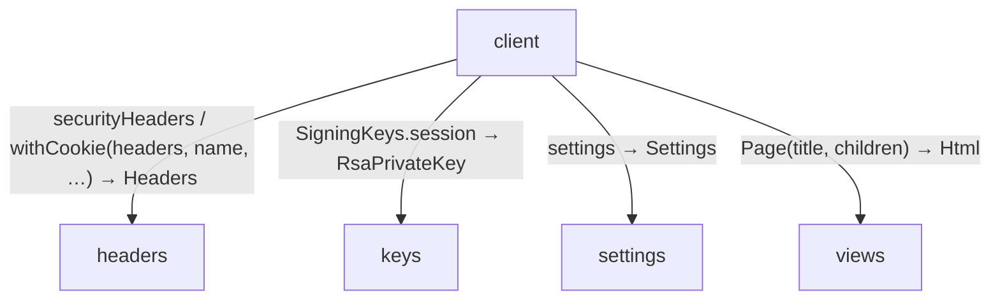
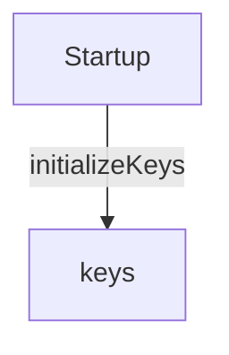
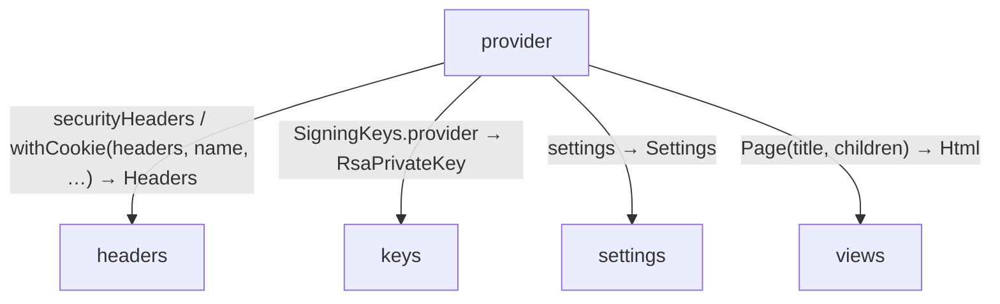
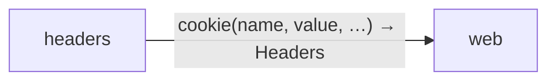
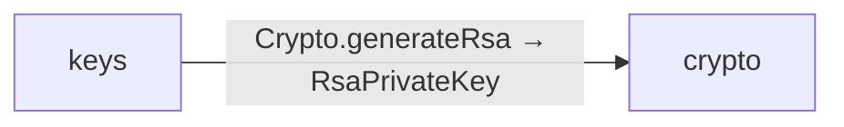

# common data flow

[OpenID Connect login application](../../../index.md)

[Project overview](../../index.md)

This view opens the common folder one level deeper. Each arrow shows the called operation and the data it returns to its caller. Calls inside a file stay in that file’s sequence view.

### client calls

### Startup calls

### provider calls

### Package boundaries

::: details headers package calls

:::

::: details keys package calls

:::

::: details Data crossing these boundaries (13 contracts)

| From | To | Operation and inputs | Result |
| --- | --- | --- | --- |
| client | headers | [securityHeaders](../../../common/headers.md#symbol-securityHeaders) | Headers |
| client | headers | [withCookie](../../../common/headers.md#symbol-withCookie) · headers: Headers, name: string, value: string, path: string, maxAge: int, secure: bool | Headers |
| client | keys | [SigningKeys.session](../../../common/keys.md#symbol-SigningKeys.session) · interface dispatch | RsaPrivateKey |
| client | settings | [settings](../../../common/settings.md#symbol-settings) | Settings |
| client | views | [Page](../../../common/views.md#symbol-Page) · title: string, children: List\<Html\> | Html |
| headers | web | [cookie](../../../dependencies/packages/%40git/url_897efafd565158fc4908/0.0.0-git.a39fc582565d4fca40be4f75fa304d71adc69301/contracts.md#symbol-cookie) · name: string, value: string, path: string, maxAge: int, secure: bool | Headers |
| keys | crypto | [Crypto.generateRsa](../../../dependencies/packages/%40git/url_9ef654c66d34ab8f5527/0.0.0-git.b14a0f9aa41f1ce58bd51133bcdc424033e40d40/contracts.md#symbol-Crypto.generateRsa) · interface dispatch | RsaPrivateKey |
| Startup | keys | [initializeKeys](../../../common/keys.md#symbol-initializeKeys) | void |
| provider | headers | [securityHeaders](../../../common/headers.md#symbol-securityHeaders) | Headers |
| provider | headers | [withCookie](../../../common/headers.md#symbol-withCookie) · headers: Headers, name: string, value: string, path: string, maxAge: int, secure: bool | Headers |
| provider | keys | [SigningKeys.provider](../../../common/keys.md#symbol-SigningKeys.provider) · interface dispatch | RsaPrivateKey |
| provider | settings | [settings](../../../common/settings.md#symbol-settings) | Settings |
| provider | views | [Page](../../../common/views.md#symbol-Page) · title: string, children: List\<Html\> | Html |

:::

## Files in this folder

| Module | Read |
| --- | --- |
| common/export.aug | [Flow and sequences](../../../common/export-diagrams.md) · [Explanation](../../../common/export.md) |
| common/headers.aug | [Flow and sequences](../../../common/headers-diagrams.md) · [Explanation](../../../common/headers.md) |
| common/keys.aug | [Flow and sequences](../../../common/keys-diagrams.md) · [Explanation](../../../common/keys.md) |
| common/settings.aug | [Flow and sequences](../../../common/settings-diagrams.md) · [Explanation](../../../common/settings.md) |
| common/views.aug | [Flow and sequences](../../../common/views-diagrams.md) · [Explanation](../../../common/views.md) |
