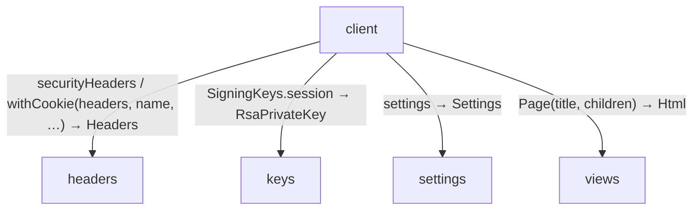
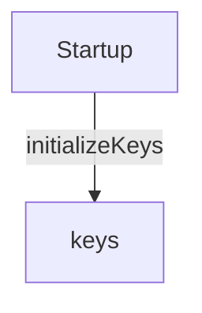
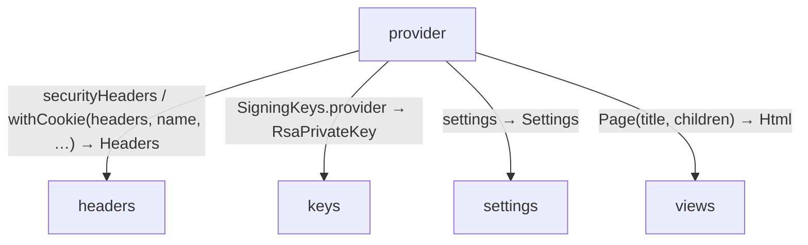
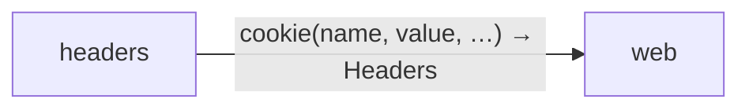
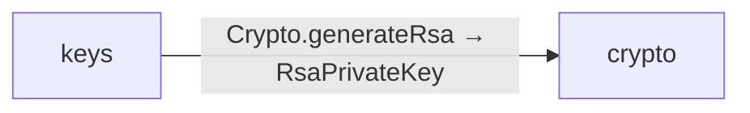

# common data flow

[OpenID Connect login application](../../../index.md)

[Project overview](../../index.md)

This view opens the common folder one level deeper. Each arrow shows the called operation and the data it returns to its caller. Calls inside a file stay in that file’s sequence view.

### client calls

### Startup calls

### provider calls

### Package boundaries

::: details headers package calls

:::

::: details keys package calls

:::

### Follow the data

Each row opens the complete operations and call sites behind one pair of logical units. A grouped arrow records calls between those units; connected arrows need not belong to the same execution path.

| From | To | Operations | Read |
| --- | --- | --- | --- |
| client | headers | 2 | [Inputs, results and call sites](index.md#boundary-ca4c97f666a3) |
| client | keys | 1 | [Inputs, results and call sites](index.md#boundary-a5eb17735da0) |
| client | settings | 1 | [Inputs, results and call sites](index.md#boundary-1c9605e5346d) |
| client | views | 1 | [Inputs, results and call sites](index.md#boundary-98fced9fac0c) |
| headers | web | 1 | [Inputs, results and call sites](index.md#boundary-f33f7aa6bf99) |
| keys | crypto | 1 | [Inputs, results and call sites](index.md#boundary-08dcb5124543) |
| Startup | keys | 1 | [Inputs, results and call sites](index.md#boundary-dc8bec48b62e) |
| provider | headers | 2 | [Inputs, results and call sites](index.md#boundary-b6fa3b54e48b) |
| provider | keys | 1 | [Inputs, results and call sites](index.md#boundary-cb7cb946eb8f) |
| provider | settings | 1 | [Inputs, results and call sites](index.md#boundary-40080323001e) |
| provider | views | 1 | [Inputs, results and call sites](index.md#boundary-aef6c26e7efa) |

#### Data crossing these boundaries (13 contracts)

#### client → headers {#boundary-ca4c97f666a3}

::: details 2 operations, 10 sites

**[securityHeaders](../../../common/headers.md#symbol-securityHeaders)**

No caller-supplied inputs. Result: Headers.

| Caller or entry | Evidence |
| --- | --- |
| home | [Call site](../../../client/endpoints.md#source-L15) · [Caller explanation](../../../client/endpoints.md#symbol-home) |
| home | [Call site](../../../client/endpoints.md#source-L17) · [Caller explanation](../../../client/endpoints.md#symbol-home) |
| me | [Call site](../../../client/endpoints.md#source-L22) · [Caller explanation](../../../client/endpoints.md#symbol-me) |
| startLogin | [Call site](../../../client/login.md#source-L23) · [Caller explanation](../../../client/login.md#symbol-startLogin) |
| loginCallback | [Call site](../../../client/login.md#source-L57) · [Caller explanation](../../../client/login.md#symbol-loginCallback) |
| logout | [Call site](../../../client/logout.md#source-L18) · [Caller explanation](../../../client/logout.md#symbol-logout) |

**[withCookie](../../../common/headers.md#symbol-withCookie)**

Inputs: headers: Headers, name: string, value: string, path: string, maxAge: int, secure: bool. Result: Headers.

| Caller or entry | Evidence |
| --- | --- |
| startLogin | [Call site](../../../client/login.md#source-L23) · [Caller explanation](../../../client/login.md#symbol-startLogin) |
| loginCallback | [Call site](../../../client/login.md#source-L57) · [Caller explanation](../../../client/login.md#symbol-loginCallback) |
| loginCallback | [Call site](../../../client/login.md#source-L58) · [Caller explanation](../../../client/login.md#symbol-loginCallback) |
| logout | [Call site](../../../client/logout.md#source-L18) · [Caller explanation](../../../client/logout.md#symbol-logout) |

:::

#### client → keys {#boundary-a5eb17735da0}

::: details 1 operation, 2 sites

**[SigningKeys.session](../../../common/keys.md#symbol-SigningKeys.session)** · interface dispatch

No caller-supplied inputs. Result: RsaPrivateKey.

| Caller or entry | Evidence |
| --- | --- |
| loginCallback | [Call site](../../../client/login.md#source-L55) · [Caller explanation](../../../client/login.md#symbol-loginCallback) |
| authenticate | [Call site](../../../client/session.md#source-L15) · [Caller explanation](../../../client/session.md#symbol-authenticate) |

:::

#### client → settings {#boundary-1c9605e5346d}

::: details 1 operation, 7 sites

**[settings](../../../common/settings.md#symbol-settings)**

No caller-supplied inputs. Result: Settings.

| Caller or entry | Evidence |
| --- | --- |
| startLogin | [Call site](../../../client/login.md#source-L13) · [Caller explanation](../../../client/login.md#symbol-startLogin) |
| loginCallback | [Call site](../../../client/login.md#source-L40) · [Caller explanation](../../../client/login.md#symbol-loginCallback) |
| logout | [Call site](../../../client/logout.md#source-L11) · [Caller explanation](../../../client/logout.md#symbol-logout) |
| discover | [Call site](../../../client/protocol.md#source-L28) · [Caller explanation](../../../client/protocol.md#symbol-discover) |
| validateIdentity | [Call site](../../../client/protocol.md#source-L40) · [Caller explanation](../../../client/protocol.md#symbol-validateIdentity) |
| test validateIdentity | [Call site](../../../client/protocol.md#source-L72) · [Caller explanation](../../../client/protocol.md#symbol-test-20-validateIdentity) |
| authenticate | [Call site](../../../client/session.md#source-L17) · [Caller explanation](../../../client/session.md#symbol-authenticate) |

:::

#### client → views {#boundary-98fced9fac0c}

::: details 1 operation, 2 sites

**[Page](../../../common/views.md#symbol-Page)**

Inputs: title: string, children: List\<Html\>. Result: Html.

| Caller or entry | Evidence |
| --- | --- |
| LoginPage | [Call site](../../../client/views.md#source-L7) · [Caller explanation](../../../client/views.md#symbol-LoginPage) |
| Welcome | [Call site](../../../client/views.md#source-L14) · [Caller explanation](../../../client/views.md#symbol-Welcome) |

:::

#### headers → web {#boundary-f33f7aa6bf99}

::: details 1 operation, 1 site

**[cookie](../../../dependencies/packages/%40git/url_897efafd565158fc4908/0.0.0-git.a39fc582565d4fca40be4f75fa304d71adc69301/contracts.md#symbol-cookie)**

Inputs: name: string, value: string, path: string, maxAge: int, secure: bool. Result: Headers.

| Caller or entry | Evidence |
| --- | --- |
| withCookie | [Call site](../../../common/headers.md#source-L9) · [Caller explanation](../../../common/headers.md#symbol-withCookie) |

:::

#### keys → crypto {#boundary-08dcb5124543}

::: details 1 operation, 2 sites

**[Crypto.generateRsa](../../../dependencies/packages/%40git/url_9ef654c66d34ab8f5527/0.0.0-git.b14a0f9aa41f1ce58bd51133bcdc424033e40d40/contracts.md#symbol-Crypto.generateRsa)** · interface dispatch

No caller-supplied inputs. Result: RsaPrivateKey.

| Caller or entry | Evidence |
| --- | --- |
| initializeKeys | [Call site](../../../common/keys.md#source-L36) · [Caller explanation](../../../common/keys.md#symbol-initializeKeys) |
| initializeKeys | [Call site](../../../common/keys.md#source-L37) · [Caller explanation](../../../common/keys.md#symbol-initializeKeys) |

:::

#### Startup → keys {#boundary-dc8bec48b62e}

::: details 1 operation, 1 site

**[initializeKeys](../../../common/keys.md#symbol-initializeKeys)**

No caller-supplied inputs. Result: void.

| Caller or entry | Evidence |
| --- | --- |
| Startup | [Call site](../../../main.md#source-L21) · [Caller explanation](../../../main.md#startup) |

:::

#### provider → headers {#boundary-b6fa3b54e48b}

::: details 2 operations, 14 sites

**[securityHeaders](../../../common/headers.md#symbol-securityHeaders)**

No caller-supplied inputs. Result: Headers.

| Caller or entry | Evidence |
| --- | --- |
| authorize | [Call site](../../../provider/authorization.md#source-L31) · [Caller explanation](../../../provider/authorization.md#symbol-authorize) |
| providerLogin | [Call site](../../../provider/authorization.md#source-L39) · [Caller explanation](../../../provider/authorization.md#symbol-providerLogin) |
| providerLogin | [Call site](../../../provider/authorization.md#source-L42) · [Caller explanation](../../../provider/authorization.md#symbol-providerLogin) |
| providerLogin | [Call site](../../../provider/authorization.md#source-L46) · [Caller explanation](../../../provider/authorization.md#symbol-providerLogin) |
| providerLogin | [Call site](../../../provider/authorization.md#source-L49) · [Caller explanation](../../../provider/authorization.md#symbol-providerLogin) |
| providerLogin | [Call site](../../../provider/authorization.md#source-L51) · [Caller explanation](../../../provider/authorization.md#symbol-providerLogin) |
| providerLogin | [Call site](../../../provider/authorization.md#source-L57) · [Caller explanation](../../../provider/authorization.md#symbol-providerLogin) |
| providerLogin | [Call site](../../../provider/authorization.md#source-L60) · [Caller explanation](../../../provider/authorization.md#symbol-providerLogin) |
| \_oauthError | [Call site](../../../provider/token.md#source-L9) · [Caller explanation](../../../provider/token.md#symbol-_oauthError) |
| token | [Call site](../../../provider/token.md#source-L36) · [Caller explanation](../../../provider/token.md#symbol-token) |
| userinfo | [Call site](../../../provider/userinfo.md#source-L23) · [Caller explanation](../../../provider/userinfo.md#symbol-userinfo) |
| userinfo | [Call site](../../../provider/userinfo.md#source-L26) · [Caller explanation](../../../provider/userinfo.md#symbol-userinfo) |

**[withCookie](../../../common/headers.md#symbol-withCookie)**

Inputs: headers: Headers, name: string, value: string, path: string, maxAge: int, secure: bool. Result: Headers.

| Caller or entry | Evidence |
| --- | --- |
| authorize | [Call site](../../../provider/authorization.md#source-L31) · [Caller explanation](../../../provider/authorization.md#symbol-authorize) |
| providerLogin | [Call site](../../../provider/authorization.md#source-L57) · [Caller explanation](../../../provider/authorization.md#symbol-providerLogin) |

:::

#### provider → keys {#boundary-cb7cb946eb8f}

::: details 1 operation, 2 sites

**[SigningKeys.provider](../../../common/keys.md#symbol-SigningKeys.provider)** · interface dispatch

No caller-supplied inputs. Result: RsaPrivateKey.

| Caller or entry | Evidence |
| --- | --- |
| jwks | [Call site](../../../provider/discovery.md#source-L13) · [Caller explanation](../../../provider/discovery.md#symbol-jwks) |
| token | [Call site](../../../provider/token.md#source-L31) · [Caller explanation](../../../provider/token.md#symbol-token) |

:::

#### provider → settings {#boundary-40080323001e}

::: details 1 operation, 4 sites

**[settings](../../../common/settings.md#symbol-settings)**

No caller-supplied inputs. Result: Settings.

| Caller or entry | Evidence |
| --- | --- |
| authorize | [Call site](../../../provider/authorization.md#source-L13) · [Caller explanation](../../../provider/authorization.md#symbol-authorize) |
| providerLogin | [Call site](../../../provider/authorization.md#source-L36) · [Caller explanation](../../../provider/authorization.md#symbol-providerLogin) |
| discovery | [Call site](../../../provider/discovery.md#source-L8) · [Caller explanation](../../../provider/discovery.md#symbol-discovery) |
| token | [Call site](../../../provider/token.md#source-L13) · [Caller explanation](../../../provider/token.md#symbol-token) |

:::

#### provider → views {#boundary-aef6c26e7efa}

::: details 1 operation, 2 sites

**[Page](../../../common/views.md#symbol-Page)**

Inputs: title: string, children: List\<Html\>. Result: Html.

| Caller or entry | Evidence |
| --- | --- |
| ProviderLogin | [Call site](../../../provider/views.md#source-L5) · [Caller explanation](../../../provider/views.md#symbol-ProviderLogin) |
| ProviderFailure | [Call site](../../../provider/views.md#source-L19) · [Caller explanation](../../../provider/views.md#symbol-ProviderFailure) |

:::

## What this folder exposes

### Exports

Export the declaration `Settings` from [`settings.aug`](../../../common/settings.md#symbol-Settings). Export the declaration `settings` from [`settings.aug`](../../../common/settings.md#symbol-settings). Export the declaration `SigningKeys` from [`keys.aug`](../../../common/keys.md#symbol-SigningKeys). Export the declaration `MemorySigningKeys` from [`keys.aug`](../../../common/keys.md#symbol-MemorySigningKeys).

Export the declaration `initializeKeys` from [`keys.aug`](../../../common/keys.md#symbol-initializeKeys). Export the declaration `KeyError` from [`keys.aug`](../../../common/keys.md#symbol-KeyError). Export the declaration `Page` from [`views.aug`](../../../common/views.md#symbol-Page). Export the declaration `securityHeaders` from [`headers.aug`](../../../common/headers.md#symbol-securityHeaders).

Export the declaration `withCookie` from [`headers.aug`](../../../common/headers.md#symbol-withCookie).

## Files in this folder

| Module | Read |
| --- | --- |
| common/export.aug | [Flow and sequences](../../../common/export-diagrams.md) · [Explanation](../../../common/export.md) |
| common/headers.aug | [Flow and sequences](../../../common/headers-diagrams.md) · [Explanation](../../../common/headers.md) |
| common/keys.aug | [Flow and sequences](../../../common/keys-diagrams.md) · [Explanation](../../../common/keys.md) |
| common/settings.aug | [Flow and sequences](../../../common/settings-diagrams.md) · [Explanation](../../../common/settings.md) |
| common/views.aug | [Flow and sequences](../../../common/views-diagrams.md) · [Explanation](../../../common/views.md) |
