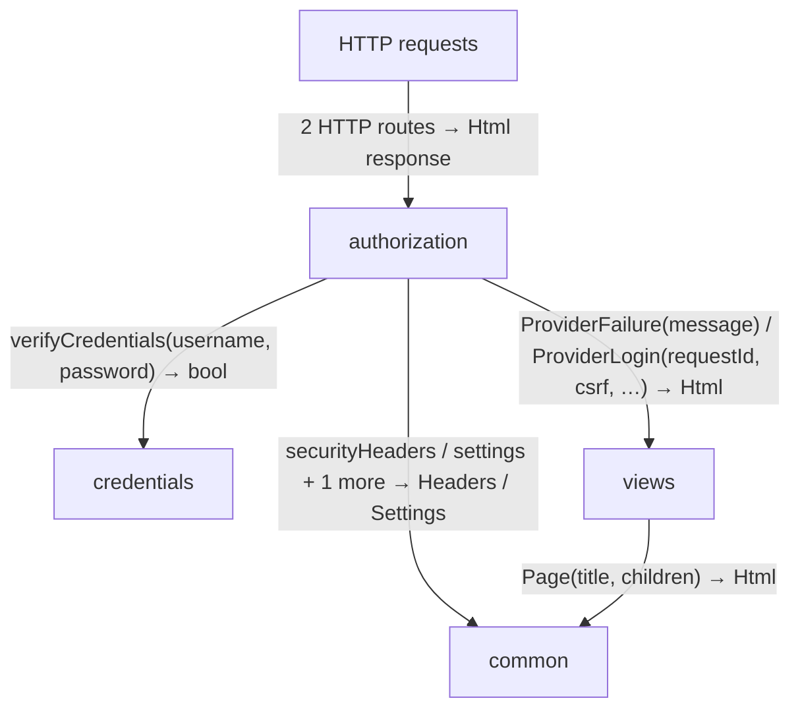
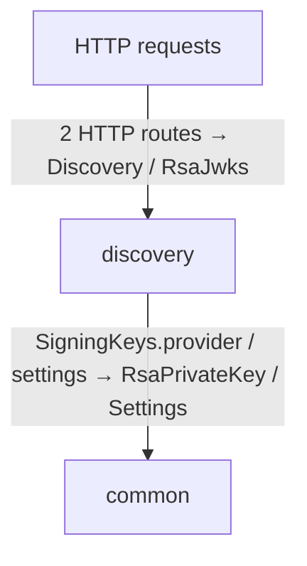
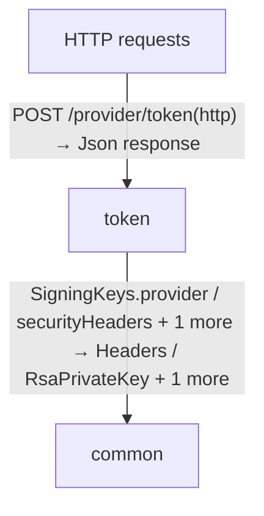
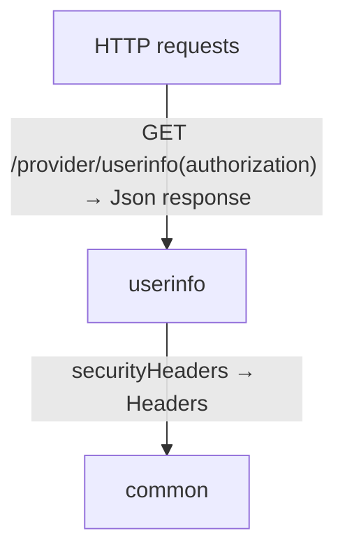
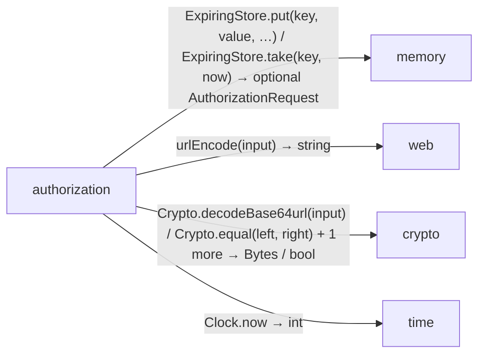
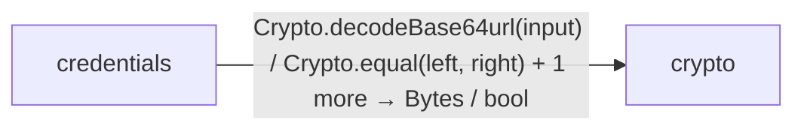
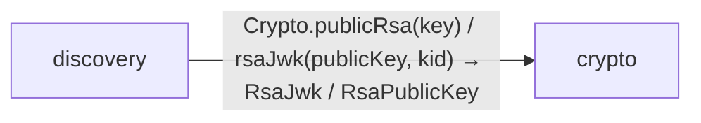
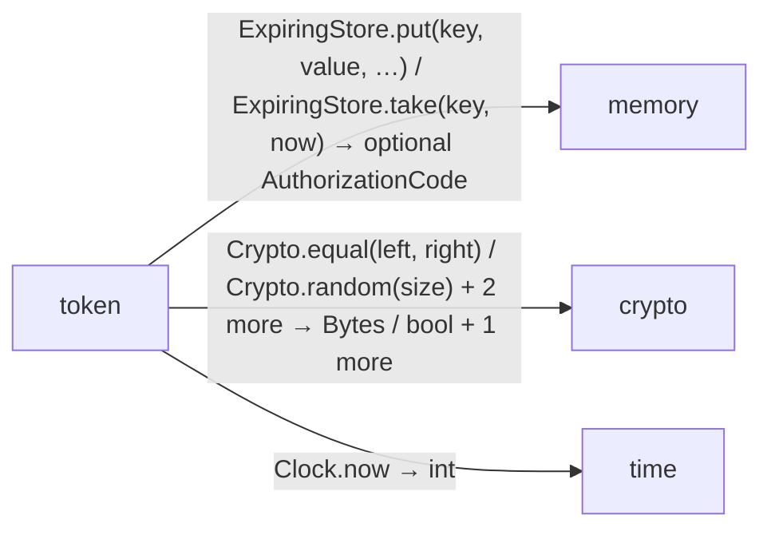
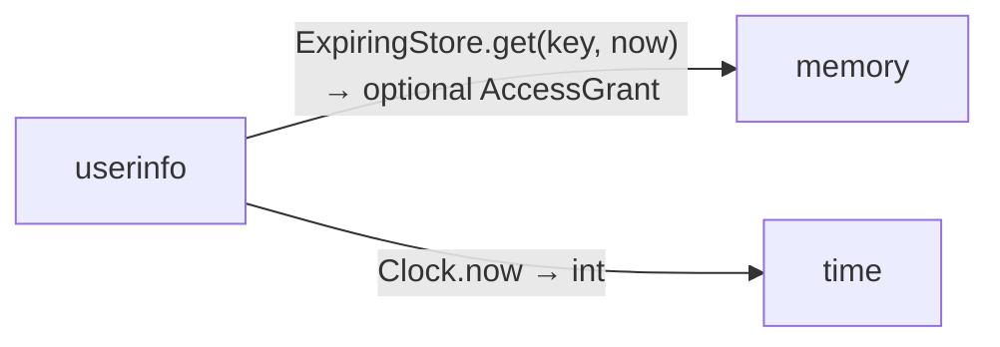

# provider data flow

[OpenID Connect login application](../../../index.md)

[Project overview](../../index.md)

This view opens the provider folder one level deeper. Each arrow shows the called operation and the data it returns to its caller. Calls inside a file stay in that file’s sequence view.

### authorization request flow

### discovery request flow

### token request flow

### userinfo request flow

### Package boundaries

::: details authorization package calls

:::

::: details credentials package calls

:::

::: details discovery package calls

:::

::: details token package calls

:::

::: details userinfo package calls

:::

::: details Data crossing these boundaries (52 contracts)

| From | To | Operation and inputs | Result |
| --- | --- | --- | --- |
| HTTP requests | authorization | [GET /provider/authorize](../../../provider/authorization.md) · response\_type: string from query, client\_id: string from query, redirect\_uri: string from query, requestedScope: string from query, state: string from query, nonce: string from query, code\_challenge: string from query, code\_challenge\_method: string from query · HTTP endpoint | HttpResponse\<Html\> |
| HTTP requests | authorization | [POST /provider/login](../../../provider/authorization.md) · form: LoginForm from form, browser: optional string from cookie, origin: optional string from header · HTTP endpoint | HttpResponse\<Html\> |
| HTTP requests | discovery | [GET /provider/.well-known/openid-configuration](../../../provider/discovery.md) · HTTP endpoint | Discovery |
| HTTP requests | discovery | [GET /provider/jwks](../../../provider/discovery.md) · HTTP endpoint | RsaJwks |
| HTTP requests | token | [POST /provider/token](../../../provider/token.md) · http: HttpRequest from request · HTTP endpoint | HttpResponse\<Json\> |
| HTTP requests | userinfo | [GET /provider/userinfo](../../../provider/userinfo.md) · authorization: optional string from header · HTTP endpoint | HttpResponse\<Json\> |
| client | contracts | [IdClaims](../../../provider/contracts.md) · iss: string, sub: string, aud: string, exp: int, iat: int, nonce: string, name: string · value construction | IdClaims |
| client | contracts | [UserInfo](../../../provider/contracts.md) · sub: string, name: string · value construction | UserInfo |
| authorization | common | [securityHeaders](../../../common/headers.md) | Headers |
| authorization | common | [settings](../../../common/settings.md) | Settings |
| authorization | common | [withCookie](../../../common/headers.md) · headers: Headers, name: string, value: string, path: string, maxAge: int, secure: bool | Headers |
| authorization | memory | [ExpiringStore.put](../../../dependencies/packages/%40git/url_0eb7c89453c87681ed15/0.0.0-git.a39fc582565d4fca40be4f75fa304d71adc69301/store.md) · key: string, value: AuthorizationCode, expires: int, now: int · interface dispatch | void |
| authorization | memory | [ExpiringStore.put](../../../dependencies/packages/%40git/url_0eb7c89453c87681ed15/0.0.0-git.a39fc582565d4fca40be4f75fa304d71adc69301/store.md) · key: string, value: AuthorizationRequest, expires: int, now: int · interface dispatch | void |
| authorization | memory | [ExpiringStore.take](../../../dependencies/packages/%40git/url_0eb7c89453c87681ed15/0.0.0-git.a39fc582565d4fca40be4f75fa304d71adc69301/store.md) · key: string, now: int · interface dispatch | optional AuthorizationRequest |
| authorization | web | [urlEncode](../../../dependencies/packages/%40git/url_897efafd565158fc4908/0.0.0-git.a39fc582565d4fca40be4f75fa304d71adc69301/contracts.md) · input: string | string |
| authorization | crypto | [Crypto.decodeBase64url](../../../dependencies/packages/%40git/url_9ef654c66d34ab8f5527/0.0.0-git.b14a0f9aa41f1ce58bd51133bcdc424033e40d40/contracts.md) · input: string · interface dispatch | Bytes |
| authorization | crypto | [Crypto.equal](../../../dependencies/packages/%40git/url_9ef654c66d34ab8f5527/0.0.0-git.b14a0f9aa41f1ce58bd51133bcdc424033e40d40/contracts.md) · left: Bytes, right: Bytes · interface dispatch | bool |
| authorization | crypto | [Crypto.random](../../../dependencies/packages/%40git/url_9ef654c66d34ab8f5527/0.0.0-git.b14a0f9aa41f1ce58bd51133bcdc424033e40d40/contracts.md) · size: int · interface dispatch | Bytes |
| authorization | time | [Clock.now](../../../dependencies/packages/%40git/url_c092cd151499c4e1d8a1/0.0.0-git.a39fc582565d4fca40be4f75fa304d71adc69301/contracts.md) · interface dispatch | int |
| authorization | contracts | [AuthorizationCode](../../../provider/contracts.md) · clientId: string, redirectUri: string, challenge: string, nonce: string, subject: string, name: string, expires: int · value construction | AuthorizationCode |
| authorization | contracts | [AuthorizationRequest](../../../provider/contracts.md) · clientId: string, redirectUri: string, state: string, nonce: string, challenge: string, browser: string, csrf: string, expires: int · value construction | AuthorizationRequest |
| authorization | contracts | [LoginError](../../../provider/contracts.md) · value construction | LoginError |
| authorization | credentials | [verifyCredentials](../../../provider/credentials.md) · username: string, password: string | bool |
| authorization | views | [ProviderFailure](../../../provider/views.md) · message: string | Html |
| authorization | views | [ProviderLogin](../../../provider/views.md) · requestId: string, csrf: string, message: string, submit: HttpAction | Html |
| credentials | crypto | [Crypto.decodeBase64url](../../../dependencies/packages/%40git/url_9ef654c66d34ab8f5527/0.0.0-git.b14a0f9aa41f1ce58bd51133bcdc424033e40d40/contracts.md) · input: string · interface dispatch | Bytes |
| credentials | crypto | [Crypto.equal](../../../dependencies/packages/%40git/url_9ef654c66d34ab8f5527/0.0.0-git.b14a0f9aa41f1ce58bd51133bcdc424033e40d40/contracts.md) · left: Bytes, right: Bytes · interface dispatch | bool |
| credentials | crypto | [Crypto.passwordHash](../../../dependencies/packages/%40git/url_9ef654c66d34ab8f5527/0.0.0-git.b14a0f9aa41f1ce58bd51133bcdc424033e40d40/contracts.md) · password: Bytes, salt: Bytes, iterations: int · interface dispatch | Bytes |
| discovery | common | [SigningKeys.provider](../../../common/keys.md) · interface dispatch | RsaPrivateKey |
| discovery | common | [settings](../../../common/settings.md) | Settings |
| discovery | crypto | [Crypto.publicRsa](../../../dependencies/packages/%40git/url_9ef654c66d34ab8f5527/0.0.0-git.b14a0f9aa41f1ce58bd51133bcdc424033e40d40/contracts.md) · key: RsaPrivateKey · interface dispatch | RsaPublicKey |
| discovery | crypto | [RsaJwks](../../../dependencies/packages/%40git/url_9ef654c66d34ab8f5527/0.0.0-git.b14a0f9aa41f1ce58bd51133bcdc424033e40d40/jose.md) · keys: List\<RsaJwk\> · value construction | RsaJwks |
| discovery | crypto | [rsaJwk](../../../dependencies/packages/%40git/url_9ef654c66d34ab8f5527/0.0.0-git.b14a0f9aa41f1ce58bd51133bcdc424033e40d40/jose.md) · publicKey: RsaPublicKey, kid: string | RsaJwk |
| token | common | [SigningKeys.provider](../../../common/keys.md) · interface dispatch | RsaPrivateKey |
| token | common | [securityHeaders](../../../common/headers.md) | Headers |
| token | common | [settings](../../../common/settings.md) | Settings |
| token | memory | [ExpiringStore.put](../../../dependencies/packages/%40git/url_0eb7c89453c87681ed15/0.0.0-git.a39fc582565d4fca40be4f75fa304d71adc69301/store.md) · key: string, value: AccessGrant, expires: int, now: int · interface dispatch | void |
| token | memory | [ExpiringStore.take](../../../dependencies/packages/%40git/url_0eb7c89453c87681ed15/0.0.0-git.a39fc582565d4fca40be4f75fa304d71adc69301/store.md) · key: string, now: int · interface dispatch | optional AuthorizationCode |
| token | crypto | [Crypto.equal](../../../dependencies/packages/%40git/url_9ef654c66d34ab8f5527/0.0.0-git.b14a0f9aa41f1ce58bd51133bcdc424033e40d40/contracts.md) · left: Bytes, right: Bytes · interface dispatch | bool |
| token | crypto | [Crypto.random](../../../dependencies/packages/%40git/url_9ef654c66d34ab8f5527/0.0.0-git.b14a0f9aa41f1ce58bd51133bcdc424033e40d40/contracts.md) · size: int · interface dispatch | Bytes |
| token | crypto | [Crypto.sha256](../../../dependencies/packages/%40git/url_9ef654c66d34ab8f5527/0.0.0-git.b14a0f9aa41f1ce58bd51133bcdc424033e40d40/contracts.md) · input: Bytes · interface dispatch | Bytes |
| token | crypto | [signJwt](../../../dependencies/packages/%40git/url_9ef654c66d34ab8f5527/0.0.0-git.b14a0f9aa41f1ce58bd51133bcdc424033e40d40/jose.md) · key: RsaPrivateKey, claims: Json, kid: string, tokenType: string | string |
| token | time | [Clock.now](../../../dependencies/packages/%40git/url_c092cd151499c4e1d8a1/0.0.0-git.a39fc582565d4fca40be4f75fa304d71adc69301/contracts.md) · interface dispatch | int |
| token | contracts | [AccessGrant](../../../provider/contracts.md) · subject: string, name: string, expires: int · value construction | AccessGrant |
| token | contracts | [IdClaims](../../../provider/contracts.md) · iss: string, sub: string, aud: string, exp: int, iat: int, nonce: string, name: string · value construction | IdClaims |
| token | contracts | [OAuthError](../../../provider/contracts.md) · error: string, error\_description: string · value construction | OAuthError |
| token | contracts | [TokenResponse](../../../provider/contracts.md) · token\_type: string, access\_token: string, id\_token: string, expires\_in: int, scope: string · value construction | TokenResponse |
| userinfo | common | [securityHeaders](../../../common/headers.md) | Headers |
| userinfo | memory | [ExpiringStore.get](../../../dependencies/packages/%40git/url_0eb7c89453c87681ed15/0.0.0-git.a39fc582565d4fca40be4f75fa304d71adc69301/store.md) · key: string, now: int · interface dispatch | optional AccessGrant |
| userinfo | time | [Clock.now](../../../dependencies/packages/%40git/url_c092cd151499c4e1d8a1/0.0.0-git.a39fc582565d4fca40be4f75fa304d71adc69301/contracts.md) · interface dispatch | int |
| userinfo | contracts | [UserInfo](../../../provider/contracts.md) · sub: string, name: string · value construction | UserInfo |
| views | common | [Page](../../../common/views.md) · title: string, children: List\<Html\> | Html |

:::

## Files in this folder

| Module | Read |
| --- | --- |
| provider/authorization.aug | [Flow and sequences](../../../provider/authorization-diagrams.md) · [Explanation](../../../provider/authorization.md) |
| provider/contracts.aug | [Flow and sequences](../../../provider/contracts-diagrams.md) · [Explanation](../../../provider/contracts.md) |
| provider/credentials.aug | [Flow and sequences](../../../provider/credentials-diagrams.md) · [Explanation](../../../provider/credentials.md) |
| provider/discovery.aug | [Flow and sequences](../../../provider/discovery-diagrams.md) · [Explanation](../../../provider/discovery.md) |
| provider/export.aug | [Flow and sequences](../../../provider/export-diagrams.md) · [Explanation](../../../provider/export.md) |
| provider/token.aug | [Flow and sequences](../../../provider/token-diagrams.md) · [Explanation](../../../provider/token.md) |
| provider/userinfo.aug | [Flow and sequences](../../../provider/userinfo-diagrams.md) · [Explanation](../../../provider/userinfo.md) |
| provider/views.aug | [Flow and sequences](../../../provider/views-diagrams.md) · [Explanation](../../../provider/views.md) |
