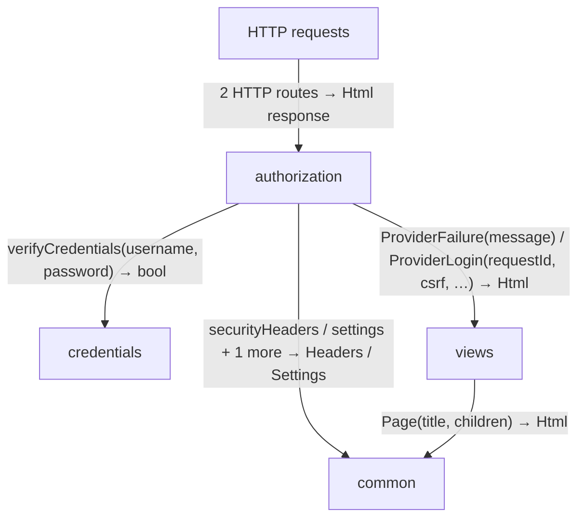
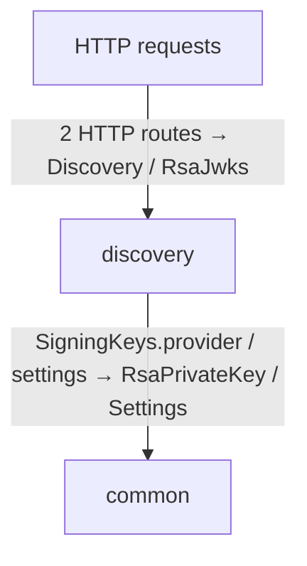
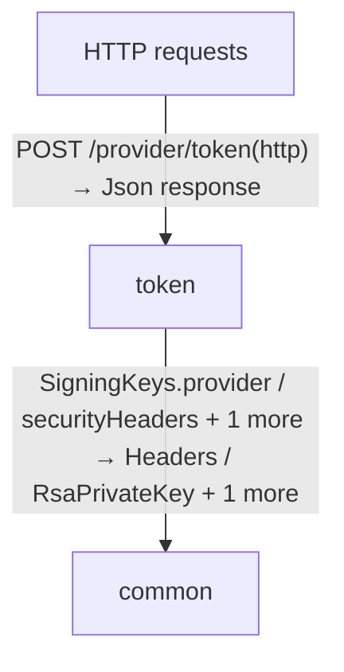
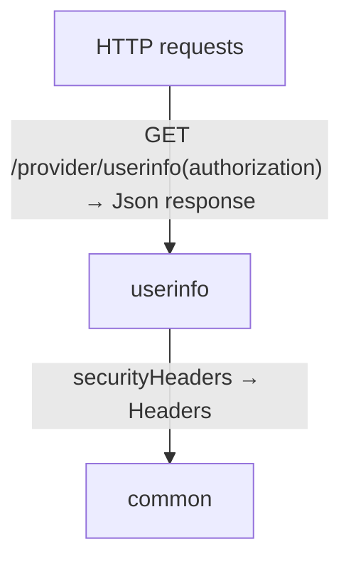
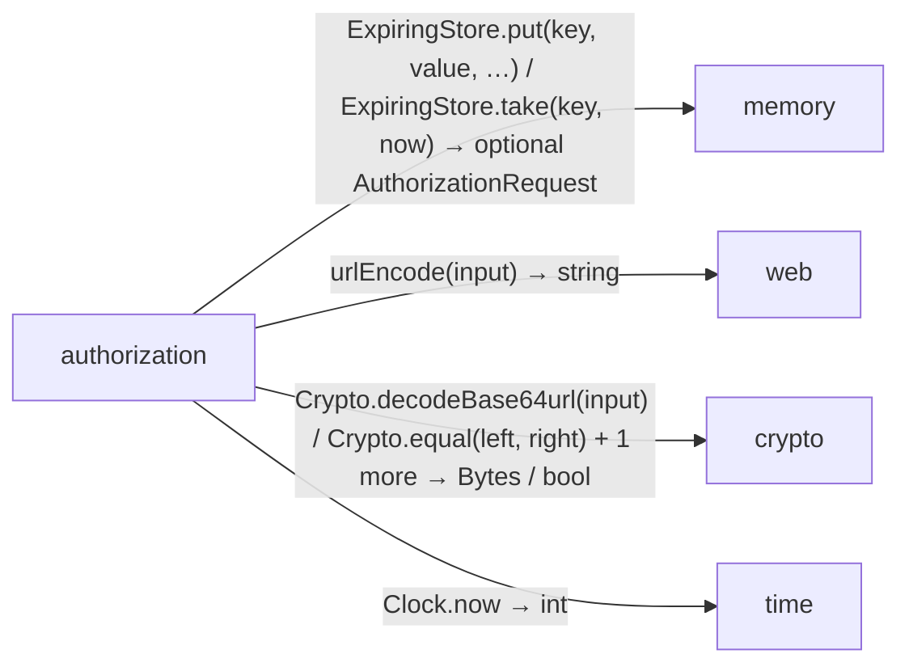
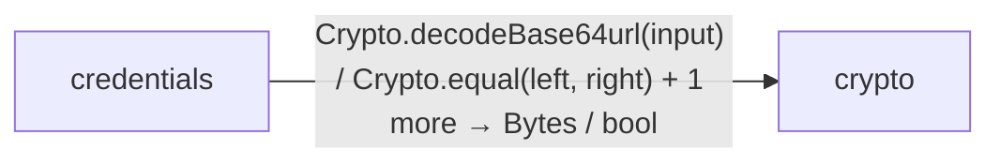
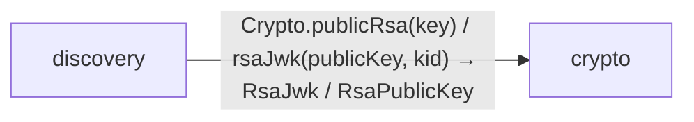
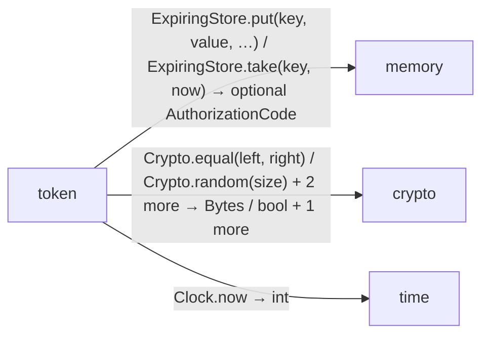
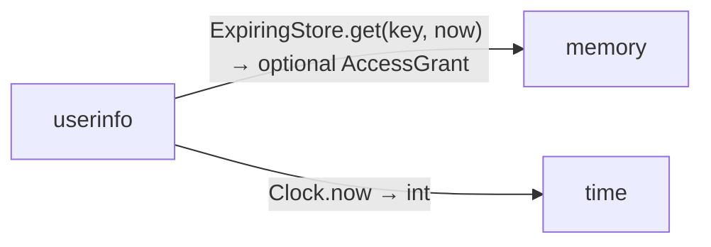

# provider data flow

[OpenID Connect login application](../../../index.md)

[Project overview](../../index.md)

This view opens the provider folder one level deeper. Each arrow shows the called operation and the data it returns to its caller. Calls inside a file stay in that file’s sequence view.

### authorization request flow

### discovery request flow

### token request flow

### userinfo request flow

### Package boundaries

::: details authorization package calls

:::

::: details credentials package calls

:::

::: details discovery package calls

:::

::: details token package calls

:::

::: details userinfo package calls

:::

### Follow the data

Each row opens the complete operations and call sites behind one pair of logical units. A grouped arrow records calls between those units; connected arrows need not belong to the same execution path.

| From | To | Operations | Read |
| --- | --- | --- | --- |
| HTTP requests | authorization | 2 | [Inputs, results and call sites](index.md#boundary-f284ddc14b35) |
| HTTP requests | discovery | 2 | [Inputs, results and call sites](index.md#boundary-d5e31773ee9e) |
| HTTP requests | token | 1 | [Inputs, results and call sites](index.md#boundary-43950ba19cd9) |
| HTTP requests | userinfo | 1 | [Inputs, results and call sites](index.md#boundary-2a457b6a5230) |
| client | contracts | 2 | [Inputs, results and call sites](index.md#boundary-c07a1079a00b) |
| authorization | common | 3 | [Inputs, results and call sites](index.md#boundary-e025c605bcf9) |
| authorization | memory | 3 | [Inputs, results and call sites](index.md#boundary-d69b612153ca) |
| authorization | web | 1 | [Inputs, results and call sites](index.md#boundary-d728919085d1) |
| authorization | crypto | 3 | [Inputs, results and call sites](index.md#boundary-10da6ae22ab5) |
| authorization | time | 1 | [Inputs, results and call sites](index.md#boundary-1f5e9371d670) |
| authorization | contracts | 3 | [Inputs, results and call sites](index.md#boundary-8d892e560a3f) |
| authorization | credentials | 1 | [Inputs, results and call sites](index.md#boundary-447618afade3) |
| authorization | views | 2 | [Inputs, results and call sites](index.md#boundary-f2004fedde81) |
| credentials | crypto | 3 | [Inputs, results and call sites](index.md#boundary-e690d8c4a6e7) |
| discovery | common | 2 | [Inputs, results and call sites](index.md#boundary-5a61a88aa885) |
| discovery | crypto | 3 | [Inputs, results and call sites](index.md#boundary-b9b053fb734e) |
| token | common | 3 | [Inputs, results and call sites](index.md#boundary-29c1da3ea87d) |
| token | memory | 2 | [Inputs, results and call sites](index.md#boundary-2bb31b97bec3) |
| token | crypto | 4 | [Inputs, results and call sites](index.md#boundary-ed5062e3a216) |
| token | time | 1 | [Inputs, results and call sites](index.md#boundary-f8fb399999a2) |
| token | contracts | 4 | [Inputs, results and call sites](index.md#boundary-a8fc6b5c1ba9) |
| userinfo | common | 1 | [Inputs, results and call sites](index.md#boundary-7c4faf1fcaf1) |
| userinfo | memory | 1 | [Inputs, results and call sites](index.md#boundary-74dadc8a2223) |
| userinfo | time | 1 | [Inputs, results and call sites](index.md#boundary-1cf0606016d3) |
| userinfo | contracts | 1 | [Inputs, results and call sites](index.md#boundary-55eacb4e151f) |
| views | common | 1 | [Inputs, results and call sites](index.md#boundary-22e2bbdb9f94) |

#### Data crossing these boundaries (52 contracts)

#### HTTP requests → authorization {#boundary-f284ddc14b35}

::: details 2 operations, 2 sites

**[GET /provider/authorize](../../../provider/authorization.md#symbol-authorize)** · HTTP endpoint

Inputs: response\_type: string from query, client\_id: string from query, redirect\_uri: string from query, requestedScope: string from query, state: string from query, nonce: string from query, code\_challenge: string from query, code\_challenge\_method: string from query. Result: HttpResponse\<Html\>.

| Caller or entry | Evidence |
| --- | --- |
| HTTP requests | [Declaration](../../../provider/authorization.md#source-L12) · [Caller explanation](../../../provider/authorization.md#symbol-authorize) |

**[POST /provider/login](../../../provider/authorization.md#symbol-providerLogin)** · HTTP endpoint

Inputs: form: LoginForm from form, browser: optional string from cookie, origin: optional string from header. Result: HttpResponse\<Html\>.

| Caller or entry | Evidence |
| --- | --- |
| HTTP requests | [Declaration](../../../provider/authorization.md#source-L35) · [Caller explanation](../../../provider/authorization.md#symbol-providerLogin) |

:::

#### HTTP requests → discovery {#boundary-d5e31773ee9e}

::: details 2 operations, 2 sites

**[GET /provider/.well-known/openid-configuration](../../../provider/discovery.md#symbol-discovery)** · HTTP endpoint

No caller-supplied inputs. Result: Discovery.

| Caller or entry | Evidence |
| --- | --- |
| HTTP requests | [Declaration](../../../provider/discovery.md#source-L7) · [Caller explanation](../../../provider/discovery.md#symbol-discovery) |

**[GET /provider/jwks](../../../provider/discovery.md#symbol-jwks)** · HTTP endpoint

No caller-supplied inputs. Result: RsaJwks.

| Caller or entry | Evidence |
| --- | --- |
| HTTP requests | [Declaration](../../../provider/discovery.md#source-L12) · [Caller explanation](../../../provider/discovery.md#symbol-jwks) |

:::

#### HTTP requests → token {#boundary-43950ba19cd9}

::: details 1 operation, 1 site

**[POST /provider/token](../../../provider/token.md#symbol-token)** · HTTP endpoint

Inputs: http: HttpRequest from request. Result: HttpResponse\<Json\>.

| Caller or entry | Evidence |
| --- | --- |
| HTTP requests | [Declaration](../../../provider/token.md#source-L12) · [Caller explanation](../../../provider/token.md#symbol-token) |

:::

#### HTTP requests → userinfo {#boundary-2a457b6a5230}

::: details 1 operation, 1 site

**[GET /provider/userinfo](../../../provider/userinfo.md#symbol-userinfo)** · HTTP endpoint

Inputs: authorization: optional string from header. Result: HttpResponse\<Json\>.

| Caller or entry | Evidence |
| --- | --- |
| HTTP requests | [Declaration](../../../provider/userinfo.md#source-L8) · [Caller explanation](../../../provider/userinfo.md#symbol-userinfo) |

:::

#### client → contracts {#boundary-c07a1079a00b}

::: details 2 operations, 4 sites

**[IdClaims](../../../provider/contracts.md#symbol-IdClaims)** · value construction

Inputs: iss: string, sub: string, aud: string, exp: int, iat: int, nonce: string, name: string. Result: IdClaims.

| Caller or entry | Evidence |
| --- | --- |
| test validateIdentity | [Call site](../../../client/protocol.md#source-L77) · [Caller explanation](../../../client/protocol.md#symbol-test-20-validateIdentity) |
| test validateIdentity | [Call site](../../../client/protocol.md#source-L92) · [Caller explanation](../../../client/protocol.md#symbol-test-20-validateIdentity) |
| test validateIdentity | [Call site](../../../client/protocol.md#source-L101) · [Caller explanation](../../../client/protocol.md#symbol-test-20-validateIdentity) |

**[UserInfo](../../../provider/contracts.md#symbol-UserInfo)** · value construction

Inputs: sub: string, name: string. Result: UserInfo.

| Caller or entry | Evidence |
| --- | --- |
| me | [Call site](../../../client/endpoints.md#source-L22) · [Caller explanation](../../../client/endpoints.md#symbol-me) |

:::

#### authorization → common {#boundary-e025c605bcf9}

::: details 3 operations, 12 sites

**[securityHeaders](../../../common/headers.md#symbol-securityHeaders)**

No caller-supplied inputs. Result: Headers.

| Caller or entry | Evidence |
| --- | --- |
| authorize | [Call site](../../../provider/authorization.md#source-L31) · [Caller explanation](../../../provider/authorization.md#symbol-authorize) |
| providerLogin | [Call site](../../../provider/authorization.md#source-L39) · [Caller explanation](../../../provider/authorization.md#symbol-providerLogin) |
| providerLogin | [Call site](../../../provider/authorization.md#source-L42) · [Caller explanation](../../../provider/authorization.md#symbol-providerLogin) |
| providerLogin | [Call site](../../../provider/authorization.md#source-L46) · [Caller explanation](../../../provider/authorization.md#symbol-providerLogin) |
| providerLogin | [Call site](../../../provider/authorization.md#source-L49) · [Caller explanation](../../../provider/authorization.md#symbol-providerLogin) |
| providerLogin | [Call site](../../../provider/authorization.md#source-L51) · [Caller explanation](../../../provider/authorization.md#symbol-providerLogin) |
| providerLogin | [Call site](../../../provider/authorization.md#source-L57) · [Caller explanation](../../../provider/authorization.md#symbol-providerLogin) |
| providerLogin | [Call site](../../../provider/authorization.md#source-L60) · [Caller explanation](../../../provider/authorization.md#symbol-providerLogin) |

**[settings](../../../common/settings.md#symbol-settings)**

No caller-supplied inputs. Result: Settings.

| Caller or entry | Evidence |
| --- | --- |
| authorize | [Call site](../../../provider/authorization.md#source-L13) · [Caller explanation](../../../provider/authorization.md#symbol-authorize) |
| providerLogin | [Call site](../../../provider/authorization.md#source-L36) · [Caller explanation](../../../provider/authorization.md#symbol-providerLogin) |

**[withCookie](../../../common/headers.md#symbol-withCookie)**

Inputs: headers: Headers, name: string, value: string, path: string, maxAge: int, secure: bool. Result: Headers.

| Caller or entry | Evidence |
| --- | --- |
| authorize | [Call site](../../../provider/authorization.md#source-L31) · [Caller explanation](../../../provider/authorization.md#symbol-authorize) |
| providerLogin | [Call site](../../../provider/authorization.md#source-L57) · [Caller explanation](../../../provider/authorization.md#symbol-providerLogin) |

:::

#### authorization → memory {#boundary-d69b612153ca}

::: details 3 operations, 3 sites

**[ExpiringStore.put](../../../dependencies/packages/%40git/url_0eb7c89453c87681ed15/0.0.0-git.a39fc582565d4fca40be4f75fa304d71adc69301/store.md#symbol-ExpiringStore.put)** · interface dispatch

Inputs: key: string, value: AuthorizationCode, expires: int, now: int. Result: void.

| Caller or entry | Evidence |
| --- | --- |
| providerLogin | [Call site](../../../provider/authorization.md#source-L55) · [Caller explanation](../../../provider/authorization.md#symbol-providerLogin) |

**[ExpiringStore.put](../../../dependencies/packages/%40git/url_0eb7c89453c87681ed15/0.0.0-git.a39fc582565d4fca40be4f75fa304d71adc69301/store.md#symbol-ExpiringStore.put)** · interface dispatch

Inputs: key: string, value: AuthorizationRequest, expires: int, now: int. Result: void.

| Caller or entry | Evidence |
| --- | --- |
| authorize | [Call site](../../../provider/authorization.md#source-L30) · [Caller explanation](../../../provider/authorization.md#symbol-authorize) |

**[ExpiringStore.take](../../../dependencies/packages/%40git/url_0eb7c89453c87681ed15/0.0.0-git.a39fc582565d4fca40be4f75fa304d71adc69301/store.md#symbol-ExpiringStore.take)** · interface dispatch

Inputs: key: string, now: int. Result: optional AuthorizationRequest.

| Caller or entry | Evidence |
| --- | --- |
| providerLogin | [Call site](../../../provider/authorization.md#source-L40) · [Caller explanation](../../../provider/authorization.md#symbol-providerLogin) |

:::

#### authorization → web {#boundary-d728919085d1}

::: details 1 operation, 2 sites

**[urlEncode](../../../dependencies/packages/%40git/url_897efafd565158fc4908/0.0.0-git.a39fc582565d4fca40be4f75fa304d71adc69301/contracts.md#symbol-urlEncode)**

Inputs: input: string. Result: string.

| Caller or entry | Evidence |
| --- | --- |
| providerLogin | [Call site](../../../provider/authorization.md#source-L56) · [Caller explanation](../../../provider/authorization.md#symbol-providerLogin) |
| providerLogin | [Call site](../../../provider/authorization.md#source-L56) · [Caller explanation](../../../provider/authorization.md#symbol-providerLogin) |

:::

#### authorization → crypto {#boundary-10da6ae22ab5}

::: details 3 operations, 7 sites

**[Crypto.decodeBase64url](../../../dependencies/packages/%40git/url_9ef654c66d34ab8f5527/0.0.0-git.b14a0f9aa41f1ce58bd51133bcdc424033e40d40/contracts.md#symbol-Crypto.decodeBase64url)** · interface dispatch

Inputs: input: string. Result: Bytes.

| Caller or entry | Evidence |
| --- | --- |
| authorize | [Call site](../../../provider/authorization.md#source-L21) · [Caller explanation](../../../provider/authorization.md#symbol-authorize) |

**[Crypto.equal](../../../dependencies/packages/%40git/url_9ef654c66d34ab8f5527/0.0.0-git.b14a0f9aa41f1ce58bd51133bcdc424033e40d40/contracts.md#symbol-Crypto.equal)** · interface dispatch

Inputs: left: Bytes, right: Bytes. Result: bool.

| Caller or entry | Evidence |
| --- | --- |
| providerLogin | [Call site](../../../provider/authorization.md#source-L48) · [Caller explanation](../../../provider/authorization.md#symbol-providerLogin) |
| providerLogin | [Call site](../../../provider/authorization.md#source-L48) · [Caller explanation](../../../provider/authorization.md#symbol-providerLogin) |

**[Crypto.random](../../../dependencies/packages/%40git/url_9ef654c66d34ab8f5527/0.0.0-git.b14a0f9aa41f1ce58bd51133bcdc424033e40d40/contracts.md#symbol-Crypto.random)** · interface dispatch

Inputs: size: int. Result: Bytes.

| Caller or entry | Evidence |
| --- | --- |
| authorize | [Call site](../../../provider/authorization.md#source-L25) · [Caller explanation](../../../provider/authorization.md#symbol-authorize) |
| authorize | [Call site](../../../provider/authorization.md#source-L26) · [Caller explanation](../../../provider/authorization.md#symbol-authorize) |
| authorize | [Call site](../../../provider/authorization.md#source-L27) · [Caller explanation](../../../provider/authorization.md#symbol-authorize) |
| providerLogin | [Call site](../../../provider/authorization.md#source-L53) · [Caller explanation](../../../provider/authorization.md#symbol-providerLogin) |

:::

#### authorization → time {#boundary-1f5e9371d670}

::: details 1 operation, 3 sites

**[Clock.now](../../../dependencies/packages/%40git/url_c092cd151499c4e1d8a1/0.0.0-git.a39fc582565d4fca40be4f75fa304d71adc69301/contracts.md#symbol-Clock.now)** · interface dispatch

No caller-supplied inputs. Result: int.

| Caller or entry | Evidence |
| --- | --- |
| authorize | [Call site](../../../provider/authorization.md#source-L28) · [Caller explanation](../../../provider/authorization.md#symbol-authorize) |
| providerLogin | [Call site](../../../provider/authorization.md#source-L40) · [Caller explanation](../../../provider/authorization.md#symbol-providerLogin) |
| providerLogin | [Call site](../../../provider/authorization.md#source-L52) · [Caller explanation](../../../provider/authorization.md#symbol-providerLogin) |

:::

#### authorization → contracts {#boundary-8d892e560a3f}

::: details 3 operations, 7 sites

**[AuthorizationCode](../../../provider/contracts.md#symbol-AuthorizationCode)** · value construction

Inputs: clientId: string, redirectUri: string, challenge: string, nonce: string, subject: string, name: string, expires: int. Result: AuthorizationCode.

| Caller or entry | Evidence |
| --- | --- |
| providerLogin | [Call site](../../../provider/authorization.md#source-L54) · [Caller explanation](../../../provider/authorization.md#symbol-providerLogin) |

**[AuthorizationRequest](../../../provider/contracts.md#symbol-AuthorizationRequest)** · value construction

Inputs: clientId: string, redirectUri: string, state: string, nonce: string, challenge: string, browser: string, csrf: string, expires: int. Result: AuthorizationRequest.

| Caller or entry | Evidence |
| --- | --- |
| authorize | [Call site](../../../provider/authorization.md#source-L29) · [Caller explanation](../../../provider/authorization.md#symbol-authorize) |

**[LoginError](../../../provider/contracts.md#symbol-LoginError)** · value construction

No caller-supplied inputs. Result: LoginError.

| Caller or entry | Evidence |
| --- | --- |
| authorize | [Call site](../../../provider/authorization.md#source-L15) · [Caller explanation](../../../provider/authorization.md#symbol-authorize) |
| authorize | [Call site](../../../provider/authorization.md#source-L17) · [Caller explanation](../../../provider/authorization.md#symbol-authorize) |
| authorize | [Call site](../../../provider/authorization.md#source-L19) · [Caller explanation](../../../provider/authorization.md#symbol-authorize) |
| authorize | [Call site](../../../provider/authorization.md#source-L22) · [Caller explanation](../../../provider/authorization.md#symbol-authorize) |
| authorize | [Call site](../../../provider/authorization.md#source-L24) · [Caller explanation](../../../provider/authorization.md#symbol-authorize) |

:::

#### authorization → credentials {#boundary-447618afade3}

::: details 1 operation, 1 site

**[verifyCredentials](../../../provider/credentials.md#symbol-verifyCredentials)**

Inputs: username: string, password: string. Result: bool.

| Caller or entry | Evidence |
| --- | --- |
| providerLogin | [Call site](../../../provider/authorization.md#source-L50) · [Caller explanation](../../../provider/authorization.md#symbol-providerLogin) |

:::

#### authorization → views {#boundary-f2004fedde81}

::: details 2 operations, 7 sites

**[ProviderFailure](../../../provider/views.md#symbol-ProviderFailure)**

Inputs: message: string. Result: Html.

| Caller or entry | Evidence |
| --- | --- |
| providerLogin | [Call site](../../../provider/authorization.md#source-L39) · [Caller explanation](../../../provider/authorization.md#symbol-providerLogin) |
| providerLogin | [Call site](../../../provider/authorization.md#source-L42) · [Caller explanation](../../../provider/authorization.md#symbol-providerLogin) |
| providerLogin | [Call site](../../../provider/authorization.md#source-L46) · [Caller explanation](../../../provider/authorization.md#symbol-providerLogin) |
| providerLogin | [Call site](../../../provider/authorization.md#source-L49) · [Caller explanation](../../../provider/authorization.md#symbol-providerLogin) |
| providerLogin | [Call site](../../../provider/authorization.md#source-L51) · [Caller explanation](../../../provider/authorization.md#symbol-providerLogin) |
| providerLogin | [Call site](../../../provider/authorization.md#source-L60) · [Caller explanation](../../../provider/authorization.md#symbol-providerLogin) |

**[ProviderLogin](../../../provider/views.md#symbol-ProviderLogin)**

Inputs: requestId: string, csrf: string, message: string, submit: HttpAction. Result: Html.

| Caller or entry | Evidence |
| --- | --- |
| authorize | [Call site](../../../provider/authorization.md#source-L32) · [Caller explanation](../../../provider/authorization.md#symbol-authorize) |

:::

#### credentials → crypto {#boundary-e690d8c4a6e7}

::: details 3 operations, 4 sites

**[Crypto.decodeBase64url](../../../dependencies/packages/%40git/url_9ef654c66d34ab8f5527/0.0.0-git.b14a0f9aa41f1ce58bd51133bcdc424033e40d40/contracts.md#symbol-Crypto.decodeBase64url)** · interface dispatch

Inputs: input: string. Result: Bytes.

| Caller or entry | Evidence |
| --- | --- |
| verifyCredentials | [Call site](../../../provider/credentials.md#source-L8) · [Caller explanation](../../../provider/credentials.md#symbol-verifyCredentials) |

**[Crypto.equal](../../../dependencies/packages/%40git/url_9ef654c66d34ab8f5527/0.0.0-git.b14a0f9aa41f1ce58bd51133bcdc424033e40d40/contracts.md#symbol-Crypto.equal)** · interface dispatch

Inputs: left: Bytes, right: Bytes. Result: bool.

| Caller or entry | Evidence |
| --- | --- |
| verifyCredentials | [Call site](../../../provider/credentials.md#source-L9) · [Caller explanation](../../../provider/credentials.md#symbol-verifyCredentials) |
| verifyCredentials | [Call site](../../../provider/credentials.md#source-L10) · [Caller explanation](../../../provider/credentials.md#symbol-verifyCredentials) |

**[Crypto.passwordHash](../../../dependencies/packages/%40git/url_9ef654c66d34ab8f5527/0.0.0-git.b14a0f9aa41f1ce58bd51133bcdc424033e40d40/contracts.md#symbol-Crypto.passwordHash)** · interface dispatch

Inputs: password: Bytes, salt: Bytes, iterations: int. Result: Bytes.

| Caller or entry | Evidence |
| --- | --- |
| verifyCredentials | [Call site](../../../provider/credentials.md#source-L7) · [Caller explanation](../../../provider/credentials.md#symbol-verifyCredentials) |

:::

#### discovery → common {#boundary-5a61a88aa885}

::: details 2 operations, 2 sites

**[SigningKeys.provider](../../../common/keys.md#symbol-SigningKeys.provider)** · interface dispatch

No caller-supplied inputs. Result: RsaPrivateKey.

| Caller or entry | Evidence |
| --- | --- |
| jwks | [Call site](../../../provider/discovery.md#source-L13) · [Caller explanation](../../../provider/discovery.md#symbol-jwks) |

**[settings](../../../common/settings.md#symbol-settings)**

No caller-supplied inputs. Result: Settings.

| Caller or entry | Evidence |
| --- | --- |
| discovery | [Call site](../../../provider/discovery.md#source-L8) · [Caller explanation](../../../provider/discovery.md#symbol-discovery) |

:::

#### discovery → crypto {#boundary-b9b053fb734e}

::: details 3 operations, 3 sites

**[Crypto.publicRsa](../../../dependencies/packages/%40git/url_9ef654c66d34ab8f5527/0.0.0-git.b14a0f9aa41f1ce58bd51133bcdc424033e40d40/contracts.md#symbol-Crypto.publicRsa)** · interface dispatch

Inputs: key: RsaPrivateKey. Result: RsaPublicKey.

| Caller or entry | Evidence |
| --- | --- |
| jwks | [Call site](../../../provider/discovery.md#source-L13) · [Caller explanation](../../../provider/discovery.md#symbol-jwks) |

**[RsaJwks](../../../dependencies/packages/%40git/url_9ef654c66d34ab8f5527/0.0.0-git.b14a0f9aa41f1ce58bd51133bcdc424033e40d40/jose.md#symbol-RsaJwks)** · value construction

Inputs: keys: List\<RsaJwk\>. Result: RsaJwks.

| Caller or entry | Evidence |
| --- | --- |
| jwks | [Call site](../../../provider/discovery.md#source-L14) · [Caller explanation](../../../provider/discovery.md#symbol-jwks) |

**[rsaJwk](../../../dependencies/packages/%40git/url_9ef654c66d34ab8f5527/0.0.0-git.b14a0f9aa41f1ce58bd51133bcdc424033e40d40/jose.md#symbol-rsaJwk)**

Inputs: publicKey: RsaPublicKey, kid: string. Result: RsaJwk.

| Caller or entry | Evidence |
| --- | --- |
| jwks | [Call site](../../../provider/discovery.md#source-L14) · [Caller explanation](../../../provider/discovery.md#symbol-jwks) |

:::

#### token → common {#boundary-29c1da3ea87d}

::: details 3 operations, 4 sites

**[SigningKeys.provider](../../../common/keys.md#symbol-SigningKeys.provider)** · interface dispatch

No caller-supplied inputs. Result: RsaPrivateKey.

| Caller or entry | Evidence |
| --- | --- |
| token | [Call site](../../../provider/token.md#source-L31) · [Caller explanation](../../../provider/token.md#symbol-token) |

**[securityHeaders](../../../common/headers.md#symbol-securityHeaders)**

No caller-supplied inputs. Result: Headers.

| Caller or entry | Evidence |
| --- | --- |
| \_oauthError | [Call site](../../../provider/token.md#source-L9) · [Caller explanation](../../../provider/token.md#symbol-_oauthError) |
| token | [Call site](../../../provider/token.md#source-L36) · [Caller explanation](../../../provider/token.md#symbol-token) |

**[settings](../../../common/settings.md#symbol-settings)**

No caller-supplied inputs. Result: Settings.

| Caller or entry | Evidence |
| --- | --- |
| token | [Call site](../../../provider/token.md#source-L13) · [Caller explanation](../../../provider/token.md#symbol-token) |

:::

#### token → memory {#boundary-2bb31b97bec3}

::: details 2 operations, 2 sites

**[ExpiringStore.put](../../../dependencies/packages/%40git/url_0eb7c89453c87681ed15/0.0.0-git.a39fc582565d4fca40be4f75fa304d71adc69301/store.md#symbol-ExpiringStore.put)** · interface dispatch

Inputs: key: string, value: AccessGrant, expires: int, now: int. Result: void.

| Caller or entry | Evidence |
| --- | --- |
| token | [Call site](../../../provider/token.md#source-L34) · [Caller explanation](../../../provider/token.md#symbol-token) |

**[ExpiringStore.take](../../../dependencies/packages/%40git/url_0eb7c89453c87681ed15/0.0.0-git.a39fc582565d4fca40be4f75fa304d71adc69301/store.md#symbol-ExpiringStore.take)** · interface dispatch

Inputs: key: string, now: int. Result: optional AuthorizationCode.

| Caller or entry | Evidence |
| --- | --- |
| token | [Call site](../../../provider/token.md#source-L23) · [Caller explanation](../../../provider/token.md#symbol-token) |

:::

#### token → crypto {#boundary-ed5062e3a216}

::: details 4 operations, 4 sites

**[Crypto.equal](../../../dependencies/packages/%40git/url_9ef654c66d34ab8f5527/0.0.0-git.b14a0f9aa41f1ce58bd51133bcdc424033e40d40/contracts.md#symbol-Crypto.equal)** · interface dispatch

Inputs: left: Bytes, right: Bytes. Result: bool.

| Caller or entry | Evidence |
| --- | --- |
| token | [Call site](../../../provider/token.md#source-L28) · [Caller explanation](../../../provider/token.md#symbol-token) |

**[Crypto.random](../../../dependencies/packages/%40git/url_9ef654c66d34ab8f5527/0.0.0-git.b14a0f9aa41f1ce58bd51133bcdc424033e40d40/contracts.md#symbol-Crypto.random)** · interface dispatch

Inputs: size: int. Result: Bytes.

| Caller or entry | Evidence |
| --- | --- |
| token | [Call site](../../../provider/token.md#source-L32) · [Caller explanation](../../../provider/token.md#symbol-token) |

**[Crypto.sha256](../../../dependencies/packages/%40git/url_9ef654c66d34ab8f5527/0.0.0-git.b14a0f9aa41f1ce58bd51133bcdc424033e40d40/contracts.md#symbol-Crypto.sha256)** · interface dispatch

Inputs: input: Bytes. Result: Bytes.

| Caller or entry | Evidence |
| --- | --- |
| token | [Call site](../../../provider/token.md#source-L27) · [Caller explanation](../../../provider/token.md#symbol-token) |

**[signJwt](../../../dependencies/packages/%40git/url_9ef654c66d34ab8f5527/0.0.0-git.b14a0f9aa41f1ce58bd51133bcdc424033e40d40/jose.md#symbol-signJwt)**

Inputs: key: RsaPrivateKey, claims: Json, kid: string, tokenType: string. Result: string.

| Caller or entry | Evidence |
| --- | --- |
| token | [Call site](../../../provider/token.md#source-L31) · [Caller explanation](../../../provider/token.md#symbol-token) |

:::

#### token → time {#boundary-f8fb399999a2}

::: details 1 operation, 1 site

**[Clock.now](../../../dependencies/packages/%40git/url_c092cd151499c4e1d8a1/0.0.0-git.a39fc582565d4fca40be4f75fa304d71adc69301/contracts.md#symbol-Clock.now)** · interface dispatch

No caller-supplied inputs. Result: int.

| Caller or entry | Evidence |
| --- | --- |
| token | [Call site](../../../provider/token.md#source-L22) · [Caller explanation](../../../provider/token.md#symbol-token) |

:::

#### token → contracts {#boundary-a8fc6b5c1ba9}

::: details 4 operations, 4 sites

**[AccessGrant](../../../provider/contracts.md#symbol-AccessGrant)** · value construction

Inputs: subject: string, name: string, expires: int. Result: AccessGrant.

| Caller or entry | Evidence |
| --- | --- |
| token | [Call site](../../../provider/token.md#source-L33) · [Caller explanation](../../../provider/token.md#symbol-token) |

**[IdClaims](../../../provider/contracts.md#symbol-IdClaims)** · value construction

Inputs: iss: string, sub: string, aud: string, exp: int, iat: int, nonce: string, name: string. Result: IdClaims.

| Caller or entry | Evidence |
| --- | --- |
| token | [Call site](../../../provider/token.md#source-L30) · [Caller explanation](../../../provider/token.md#symbol-token) |

**[OAuthError](../../../provider/contracts.md#symbol-OAuthError)** · value construction

Inputs: error: string, error\_description: string. Result: OAuthError.

| Caller or entry | Evidence |
| --- | --- |
| \_oauthError | [Call site](../../../provider/token.md#source-L9) · [Caller explanation](../../../provider/token.md#symbol-_oauthError) |

**[TokenResponse](../../../provider/contracts.md#symbol-TokenResponse)** · value construction

Inputs: token\_type: string, access\_token: string, id\_token: string, expires\_in: int, scope: string. Result: TokenResponse.

| Caller or entry | Evidence |
| --- | --- |
| token | [Call site](../../../provider/token.md#source-L35) · [Caller explanation](../../../provider/token.md#symbol-token) |

:::

#### userinfo → common {#boundary-7c4faf1fcaf1}

::: details 1 operation, 2 sites

**[securityHeaders](../../../common/headers.md#symbol-securityHeaders)**

No caller-supplied inputs. Result: Headers.

| Caller or entry | Evidence |
| --- | --- |
| userinfo | [Call site](../../../provider/userinfo.md#source-L23) · [Caller explanation](../../../provider/userinfo.md#symbol-userinfo) |
| userinfo | [Call site](../../../provider/userinfo.md#source-L26) · [Caller explanation](../../../provider/userinfo.md#symbol-userinfo) |

:::

#### userinfo → memory {#boundary-74dadc8a2223}

::: details 1 operation, 1 site

**[ExpiringStore.get](../../../dependencies/packages/%40git/url_0eb7c89453c87681ed15/0.0.0-git.a39fc582565d4fca40be4f75fa304d71adc69301/store.md#symbol-ExpiringStore.get)** · interface dispatch

Inputs: key: string, now: int. Result: optional AccessGrant.

| Caller or entry | Evidence |
| --- | --- |
| userinfo | [Call site](../../../provider/userinfo.md#source-L19) · [Caller explanation](../../../provider/userinfo.md#symbol-userinfo) |

:::

#### userinfo → time {#boundary-1cf0606016d3}

::: details 1 operation, 1 site

**[Clock.now](../../../dependencies/packages/%40git/url_c092cd151499c4e1d8a1/0.0.0-git.a39fc582565d4fca40be4f75fa304d71adc69301/contracts.md#symbol-Clock.now)** · interface dispatch

No caller-supplied inputs. Result: int.

| Caller or entry | Evidence |
| --- | --- |
| userinfo | [Call site](../../../provider/userinfo.md#source-L19) · [Caller explanation](../../../provider/userinfo.md#symbol-userinfo) |

:::

#### userinfo → contracts {#boundary-55eacb4e151f}

::: details 1 operation, 1 site

**[UserInfo](../../../provider/contracts.md#symbol-UserInfo)** · value construction

Inputs: sub: string, name: string. Result: UserInfo.

| Caller or entry | Evidence |
| --- | --- |
| userinfo | [Call site](../../../provider/userinfo.md#source-L23) · [Caller explanation](../../../provider/userinfo.md#symbol-userinfo) |

:::

#### views → common {#boundary-22e2bbdb9f94}

::: details 1 operation, 2 sites

**[Page](../../../common/views.md#symbol-Page)**

Inputs: title: string, children: List\<Html\>. Result: Html.

| Caller or entry | Evidence |
| --- | --- |
| ProviderLogin | [Call site](../../../provider/views.md#source-L5) · [Caller explanation](../../../provider/views.md#symbol-ProviderLogin) |
| ProviderFailure | [Call site](../../../provider/views.md#source-L19) · [Caller explanation](../../../provider/views.md#symbol-ProviderFailure) |

:::

## What this folder exposes

### Exports

Export the declaration `AuthorizationRequest` from [`contracts.aug`](../../../provider/contracts.md#symbol-AuthorizationRequest). Export the declaration `AuthorizationCode` from [`contracts.aug`](../../../provider/contracts.md#symbol-AuthorizationCode). Export the declaration `AccessGrant` from [`contracts.aug`](../../../provider/contracts.md#symbol-AccessGrant). Export the declaration `IdClaims` from [`contracts.aug`](../../../provider/contracts.md#symbol-IdClaims).

Export the declaration `TokenResponse` from [`contracts.aug`](../../../provider/contracts.md#symbol-TokenResponse). Export the declaration `UserInfo` from [`contracts.aug`](../../../provider/contracts.md#symbol-UserInfo). Export the declaration `Discovery` from [`discovery.aug`](../../../provider/discovery.md#symbol-Discovery). Export the declaration `discovery` from [`discovery.aug`](../../../provider/discovery.md#symbol-discovery).

Export the declaration `jwks` from [`discovery.aug`](../../../provider/discovery.md#symbol-jwks). Export the declaration `authorize` from [`authorization.aug`](../../../provider/authorization.md#symbol-authorize). Export the declaration `providerLogin` from [`authorization.aug`](../../../provider/authorization.md#symbol-providerLogin). Export the declaration `token` from [`token.aug`](../../../provider/token.md#symbol-token).

Export the declaration `userinfo` from [`userinfo.aug`](../../../provider/userinfo.md#symbol-userinfo).

## Files in this folder

| Module | Read |
| --- | --- |
| provider/authorization.aug | [Flow and sequences](../../../provider/authorization-diagrams.md) · [Explanation](../../../provider/authorization.md) |
| provider/contracts.aug | [Flow and sequences](../../../provider/contracts-diagrams.md) · [Explanation](../../../provider/contracts.md) |
| provider/credentials.aug | [Flow and sequences](../../../provider/credentials-diagrams.md) · [Explanation](../../../provider/credentials.md) |
| provider/discovery.aug | [Flow and sequences](../../../provider/discovery-diagrams.md) · [Explanation](../../../provider/discovery.md) |
| provider/export.aug | [Flow and sequences](../../../provider/export-diagrams.md) · [Explanation](../../../provider/export.md) |
| provider/token.aug | [Flow and sequences](../../../provider/token-diagrams.md) · [Explanation](../../../provider/token.md) |
| provider/userinfo.aug | [Flow and sequences](../../../provider/userinfo-diagrams.md) · [Explanation](../../../provider/userinfo.md) |
| provider/views.aug | [Flow and sequences](../../../provider/views-diagrams.md) · [Explanation](../../../provider/views.md) |
