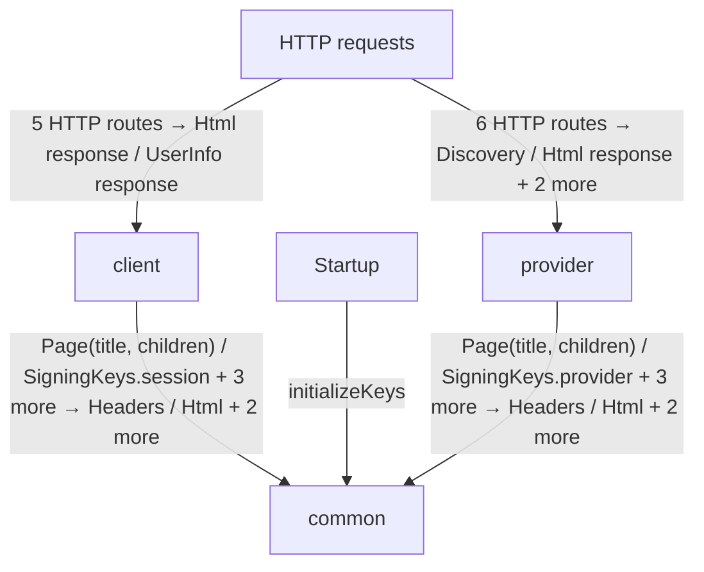
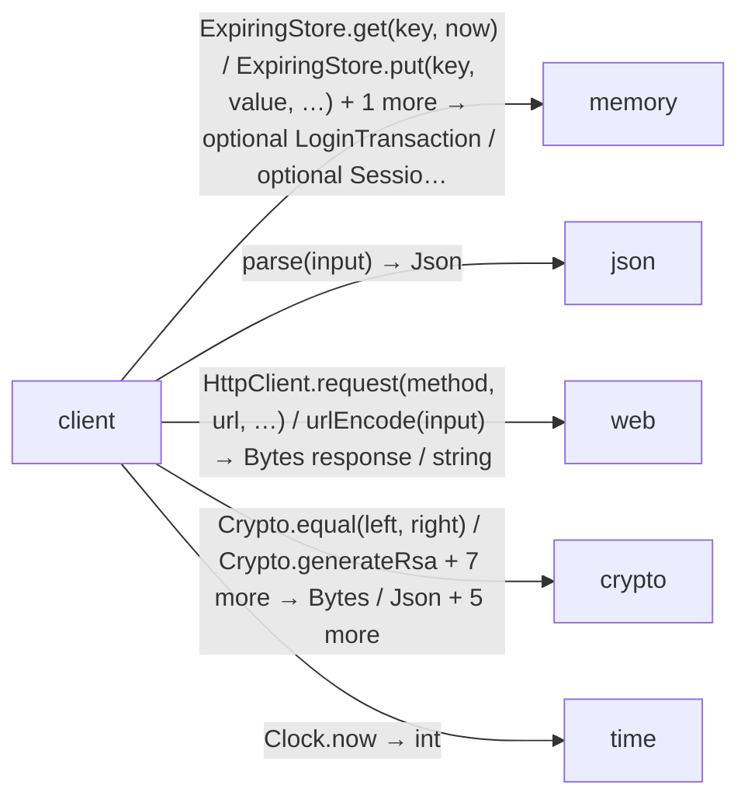
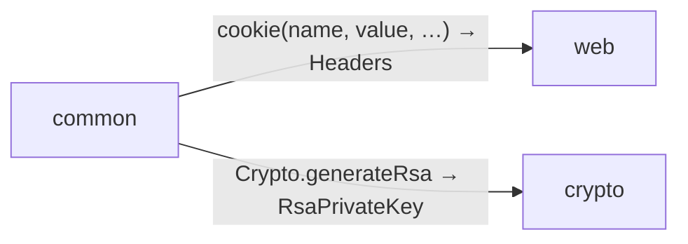
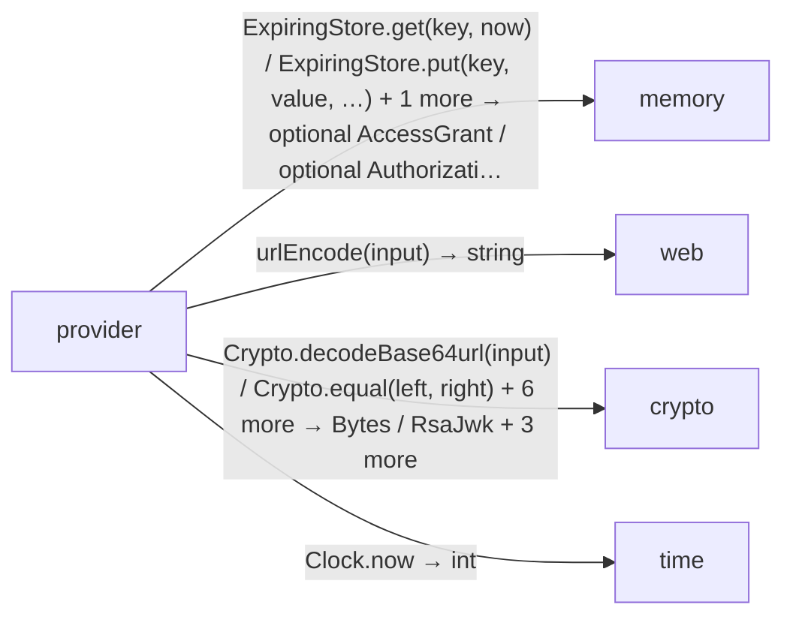

# OpenID Connect login application diagrams

[OpenID Connect login application](../index.md)

Start here to see what moves between the application’s folders. Each arrow names an operation’s inputs and the result it returns to its caller. Open a folder for the next level of detail. Expand the contract list for complete types and dependency links.

## Data flow

### Package boundaries

::: details client package calls

:::

::: details common package calls

:::

::: details provider package calls

:::

::: details Data crossing these boundaries (64 contracts)

| From | To | Operation and inputs | Result |
| --- | --- | --- | --- |
| HTTP requests | client | [GET /](../client/endpoints.md#symbol-home) · token: optional string from cookie · HTTP endpoint | HttpResponse\<Html\> |
| HTTP requests | client | [GET /login/callback](../client/login.md#symbol-loginCallback) · code: string from query, state: string from query, browser: optional string from cookie · HTTP endpoint | HttpResponse\<Html\> |
| HTTP requests | client | [GET /login/start](../client/login.md#symbol-startLogin) · HTTP endpoint | HttpResponse\<Html\> |
| HTTP requests | client | [GET /me](../client/endpoints.md#symbol-me) · token: optional string from cookie · HTTP endpoint | HttpResponse\<UserInfo\> |
| HTTP requests | client | [POST /logout](../client/logout.md#symbol-logout) · input: LogoutForm from form, token: optional string from cookie, origin: optional string from header · HTTP endpoint | HttpResponse\<Html\> |
| HTTP requests | provider | [GET /provider/.well-known/openid-configuration](../provider/discovery.md#symbol-discovery) · HTTP endpoint | Discovery |
| HTTP requests | provider | [GET /provider/authorize](../provider/authorization.md#symbol-authorize) · response\_type: string from query, client\_id: string from query, redirect\_uri: string from query, requestedScope: string from query, state: string from query, nonce: string from query, code\_challenge: string from query, code\_challenge\_method: string from query · HTTP endpoint | HttpResponse\<Html\> |
| HTTP requests | provider | [GET /provider/jwks](../provider/discovery.md#symbol-jwks) · HTTP endpoint | RsaJwks |
| HTTP requests | provider | [GET /provider/userinfo](../provider/userinfo.md#symbol-userinfo) · authorization: optional string from header · HTTP endpoint | HttpResponse\<Json\> |
| HTTP requests | provider | [POST /provider/login](../provider/authorization.md#symbol-providerLogin) · form: LoginForm from form, browser: optional string from cookie, origin: optional string from header · HTTP endpoint | HttpResponse\<Html\> |
| HTTP requests | provider | [POST /provider/token](../provider/token.md#symbol-token) · http: HttpRequest from request · HTTP endpoint | HttpResponse\<Json\> |
| client | common | [Page](../common/views.md#symbol-Page) · title: string, children: List\<Html\> | Html |
| client | common | [SigningKeys.session](../common/keys.md#symbol-SigningKeys.session) · interface dispatch | RsaPrivateKey |
| client | common | [securityHeaders](../common/headers.md#symbol-securityHeaders) | Headers |
| client | common | [settings](../common/settings.md#symbol-settings) | Settings |
| client | common | [withCookie](../common/headers.md#symbol-withCookie) · headers: Headers, name: string, value: string, path: string, maxAge: int, secure: bool | Headers |
| client | memory | [ExpiringStore.get](../dependencies/packages/%40git/url_0eb7c89453c87681ed15/0.0.0-git.a39fc582565d4fca40be4f75fa304d71adc69301/store.md#symbol-ExpiringStore.get) · key: string, now: int · interface dispatch | optional SessionClaims |
| client | memory | [ExpiringStore.put](../dependencies/packages/%40git/url_0eb7c89453c87681ed15/0.0.0-git.a39fc582565d4fca40be4f75fa304d71adc69301/store.md#symbol-ExpiringStore.put) · key: string, value: LoginTransaction, expires: int, now: int · interface dispatch | void |
| client | memory | [ExpiringStore.put](../dependencies/packages/%40git/url_0eb7c89453c87681ed15/0.0.0-git.a39fc582565d4fca40be4f75fa304d71adc69301/store.md#symbol-ExpiringStore.put) · key: string, value: SessionClaims, expires: int, now: int · interface dispatch | void |
| client | memory | [ExpiringStore.take](../dependencies/packages/%40git/url_0eb7c89453c87681ed15/0.0.0-git.a39fc582565d4fca40be4f75fa304d71adc69301/store.md#symbol-ExpiringStore.take) · key: string, now: int · interface dispatch | optional LoginTransaction |
| client | memory | [ExpiringStore.take](../dependencies/packages/%40git/url_0eb7c89453c87681ed15/0.0.0-git.a39fc582565d4fca40be4f75fa304d71adc69301/store.md#symbol-ExpiringStore.take) · key: string, now: int · interface dispatch | optional SessionClaims |
| client | json | [parse](../dependencies/packages/%40git/url_2d3c37c690c0fa115be1/0.0.0-git.a39fc582565d4fca40be4f75fa304d71adc69301/contracts.md#symbol-parse) · input: string | Json |
| client | web | [HttpClient.request](../dependencies/packages/%40git/url_897efafd565158fc4908/0.0.0-git.a39fc582565d4fca40be4f75fa304d71adc69301/contracts.md#symbol-HttpClient.request) · method: string, url: string, headers: Headers, body: Bytes · interface dispatch | HttpResponse\<Bytes\> |
| client | web | [HttpClient.request](../dependencies/packages/%40git/url_897efafd565158fc4908/0.0.0-git.a39fc582565d4fca40be4f75fa304d71adc69301/contracts.md#symbol-HttpClient.request) · method: string, url: string, headers: Headers, body: optional Bytes · interface dispatch | HttpResponse\<Bytes\> |
| client | web | [HttpClient.request](../dependencies/packages/%40git/url_897efafd565158fc4908/0.0.0-git.a39fc582565d4fca40be4f75fa304d71adc69301/contracts.md#symbol-HttpClient.request) · method: string, url: string, headers: optional Headers, body: optional Bytes · interface dispatch | HttpResponse\<Bytes\> |
| client | web | [urlEncode](../dependencies/packages/%40git/url_897efafd565158fc4908/0.0.0-git.a39fc582565d4fca40be4f75fa304d71adc69301/contracts.md#symbol-urlEncode) · input: string | string |
| client | crypto | [Crypto.equal](../dependencies/packages/%40git/url_9ef654c66d34ab8f5527/0.0.0-git.b14a0f9aa41f1ce58bd51133bcdc424033e40d40/contracts.md#symbol-Crypto.equal) · left: Bytes, right: Bytes · interface dispatch | bool |
| client | crypto | [Crypto.generateRsa](../dependencies/packages/%40git/url_9ef654c66d34ab8f5527/0.0.0-git.b14a0f9aa41f1ce58bd51133bcdc424033e40d40/contracts.md#symbol-Crypto.generateRsa) · interface dispatch | RsaPrivateKey |
| client | crypto | [Crypto.publicRsa](../dependencies/packages/%40git/url_9ef654c66d34ab8f5527/0.0.0-git.b14a0f9aa41f1ce58bd51133bcdc424033e40d40/contracts.md#symbol-Crypto.publicRsa) · key: RsaPrivateKey · interface dispatch | RsaPublicKey |
| client | crypto | [Crypto.random](../dependencies/packages/%40git/url_9ef654c66d34ab8f5527/0.0.0-git.b14a0f9aa41f1ce58bd51133bcdc424033e40d40/contracts.md#symbol-Crypto.random) · size: int · interface dispatch | Bytes |
| client | crypto | [Crypto.sha256](../dependencies/packages/%40git/url_9ef654c66d34ab8f5527/0.0.0-git.b14a0f9aa41f1ce58bd51133bcdc424033e40d40/contracts.md#symbol-Crypto.sha256) · input: Bytes · interface dispatch | Bytes |
| client | crypto | [RsaJwks](../dependencies/packages/%40git/url_9ef654c66d34ab8f5527/0.0.0-git.b14a0f9aa41f1ce58bd51133bcdc424033e40d40/jose.md#symbol-RsaJwks) · keys: List\<RsaJwk\> · value construction | RsaJwks |
| client | crypto | [importJwk](../dependencies/packages/%40git/url_9ef654c66d34ab8f5527/0.0.0-git.b14a0f9aa41f1ce58bd51133bcdc424033e40d40/jose.md#symbol-importJwk) · jwk: RsaJwk | RsaPublicKey |
| client | crypto | [rsaJwk](../dependencies/packages/%40git/url_9ef654c66d34ab8f5527/0.0.0-git.b14a0f9aa41f1ce58bd51133bcdc424033e40d40/jose.md#symbol-rsaJwk) · publicKey: RsaPublicKey, kid: string | RsaJwk |
| client | crypto | [signJwt](../dependencies/packages/%40git/url_9ef654c66d34ab8f5527/0.0.0-git.b14a0f9aa41f1ce58bd51133bcdc424033e40d40/jose.md#symbol-signJwt) · key: RsaPrivateKey, claims: Json, kid: string, tokenType: string | string |
| client | crypto | [verifyJwt](../dependencies/packages/%40git/url_9ef654c66d34ab8f5527/0.0.0-git.b14a0f9aa41f1ce58bd51133bcdc424033e40d40/jose.md#symbol-verifyJwt) · token: string, publicKey: RsaPublicKey, kid: string, tokenType: string | Json |
| client | time | [Clock.now](../dependencies/packages/%40git/url_c092cd151499c4e1d8a1/0.0.0-git.a39fc582565d4fca40be4f75fa304d71adc69301/contracts.md#symbol-Clock.now) · interface dispatch | int |
| client | provider | [IdClaims](../provider/contracts.md#symbol-IdClaims) · iss: string, sub: string, aud: string, exp: int, iat: int, nonce: string, name: string · value construction | IdClaims |
| client | provider | [UserInfo](../provider/contracts.md#symbol-UserInfo) · sub: string, name: string · value construction | UserInfo |
| common | web | [cookie](../dependencies/packages/%40git/url_897efafd565158fc4908/0.0.0-git.a39fc582565d4fca40be4f75fa304d71adc69301/contracts.md#symbol-cookie) · name: string, value: string, path: string, maxAge: int, secure: bool | Headers |
| common | crypto | [Crypto.generateRsa](../dependencies/packages/%40git/url_9ef654c66d34ab8f5527/0.0.0-git.b14a0f9aa41f1ce58bd51133bcdc424033e40d40/contracts.md#symbol-Crypto.generateRsa) · interface dispatch | RsaPrivateKey |
| Startup | common | [initializeKeys](../common/keys.md#symbol-initializeKeys) | void |
| provider | common | [Page](../common/views.md#symbol-Page) · title: string, children: List\<Html\> | Html |
| provider | common | [SigningKeys.provider](../common/keys.md#symbol-SigningKeys.provider) · interface dispatch | RsaPrivateKey |
| provider | common | [securityHeaders](../common/headers.md#symbol-securityHeaders) | Headers |
| provider | common | [settings](../common/settings.md#symbol-settings) | Settings |
| provider | common | [withCookie](../common/headers.md#symbol-withCookie) · headers: Headers, name: string, value: string, path: string, maxAge: int, secure: bool | Headers |
| provider | memory | [ExpiringStore.get](../dependencies/packages/%40git/url_0eb7c89453c87681ed15/0.0.0-git.a39fc582565d4fca40be4f75fa304d71adc69301/store.md#symbol-ExpiringStore.get) · key: string, now: int · interface dispatch | optional AccessGrant |
| provider | memory | [ExpiringStore.put](../dependencies/packages/%40git/url_0eb7c89453c87681ed15/0.0.0-git.a39fc582565d4fca40be4f75fa304d71adc69301/store.md#symbol-ExpiringStore.put) · key: string, value: AccessGrant, expires: int, now: int · interface dispatch | void |
| provider | memory | [ExpiringStore.put](../dependencies/packages/%40git/url_0eb7c89453c87681ed15/0.0.0-git.a39fc582565d4fca40be4f75fa304d71adc69301/store.md#symbol-ExpiringStore.put) · key: string, value: AuthorizationCode, expires: int, now: int · interface dispatch | void |
| provider | memory | [ExpiringStore.put](../dependencies/packages/%40git/url_0eb7c89453c87681ed15/0.0.0-git.a39fc582565d4fca40be4f75fa304d71adc69301/store.md#symbol-ExpiringStore.put) · key: string, value: AuthorizationRequest, expires: int, now: int · interface dispatch | void |
| provider | memory | [ExpiringStore.take](../dependencies/packages/%40git/url_0eb7c89453c87681ed15/0.0.0-git.a39fc582565d4fca40be4f75fa304d71adc69301/store.md#symbol-ExpiringStore.take) · key: string, now: int · interface dispatch | optional AuthorizationRequest |
| provider | memory | [ExpiringStore.take](../dependencies/packages/%40git/url_0eb7c89453c87681ed15/0.0.0-git.a39fc582565d4fca40be4f75fa304d71adc69301/store.md#symbol-ExpiringStore.take) · key: string, now: int · interface dispatch | optional AuthorizationCode |
| provider | web | [urlEncode](../dependencies/packages/%40git/url_897efafd565158fc4908/0.0.0-git.a39fc582565d4fca40be4f75fa304d71adc69301/contracts.md#symbol-urlEncode) · input: string | string |
| provider | crypto | [Crypto.decodeBase64url](../dependencies/packages/%40git/url_9ef654c66d34ab8f5527/0.0.0-git.b14a0f9aa41f1ce58bd51133bcdc424033e40d40/contracts.md#symbol-Crypto.decodeBase64url) · input: string · interface dispatch | Bytes |
| provider | crypto | [Crypto.equal](../dependencies/packages/%40git/url_9ef654c66d34ab8f5527/0.0.0-git.b14a0f9aa41f1ce58bd51133bcdc424033e40d40/contracts.md#symbol-Crypto.equal) · left: Bytes, right: Bytes · interface dispatch | bool |
| provider | crypto | [Crypto.passwordHash](../dependencies/packages/%40git/url_9ef654c66d34ab8f5527/0.0.0-git.b14a0f9aa41f1ce58bd51133bcdc424033e40d40/contracts.md#symbol-Crypto.passwordHash) · password: Bytes, salt: Bytes, iterations: int · interface dispatch | Bytes |
| provider | crypto | [Crypto.publicRsa](../dependencies/packages/%40git/url_9ef654c66d34ab8f5527/0.0.0-git.b14a0f9aa41f1ce58bd51133bcdc424033e40d40/contracts.md#symbol-Crypto.publicRsa) · key: RsaPrivateKey · interface dispatch | RsaPublicKey |
| provider | crypto | [Crypto.random](../dependencies/packages/%40git/url_9ef654c66d34ab8f5527/0.0.0-git.b14a0f9aa41f1ce58bd51133bcdc424033e40d40/contracts.md#symbol-Crypto.random) · size: int · interface dispatch | Bytes |
| provider | crypto | [Crypto.sha256](../dependencies/packages/%40git/url_9ef654c66d34ab8f5527/0.0.0-git.b14a0f9aa41f1ce58bd51133bcdc424033e40d40/contracts.md#symbol-Crypto.sha256) · input: Bytes · interface dispatch | Bytes |
| provider | crypto | [RsaJwks](../dependencies/packages/%40git/url_9ef654c66d34ab8f5527/0.0.0-git.b14a0f9aa41f1ce58bd51133bcdc424033e40d40/jose.md#symbol-RsaJwks) · keys: List\<RsaJwk\> · value construction | RsaJwks |
| provider | crypto | [rsaJwk](../dependencies/packages/%40git/url_9ef654c66d34ab8f5527/0.0.0-git.b14a0f9aa41f1ce58bd51133bcdc424033e40d40/jose.md#symbol-rsaJwk) · publicKey: RsaPublicKey, kid: string | RsaJwk |
| provider | crypto | [signJwt](../dependencies/packages/%40git/url_9ef654c66d34ab8f5527/0.0.0-git.b14a0f9aa41f1ce58bd51133bcdc424033e40d40/jose.md#symbol-signJwt) · key: RsaPrivateKey, claims: Json, kid: string, tokenType: string | string |
| provider | time | [Clock.now](../dependencies/packages/%40git/url_c092cd151499c4e1d8a1/0.0.0-git.a39fc582565d4fca40be4f75fa304d71adc69301/contracts.md#symbol-Clock.now) · interface dispatch | int |

:::

## Open a folder

| Folder | Read |
| --- | --- |
| client | [Folder data flow](folders/client/index.md) |
| common | [Folder data flow](folders/common/index.md) |
| provider | [Folder data flow](folders/provider/index.md) |

## Open a module

| Module | Read |
| --- | --- |
| client/contracts.aug | [Flow and sequences](../client/contracts-diagrams.md) · [Explanation](../client/contracts.md) |
| client/endpoints.aug | [Flow and sequences](../client/endpoints-diagrams.md) · [Explanation](../client/endpoints.md) |
| client/export.aug | [Flow and sequences](../client/export-diagrams.md) · [Explanation](../client/export.md) |
| client/login.aug | [Flow and sequences](../client/login-diagrams.md) · [Explanation](../client/login.md) |
| client/logout.aug | [Flow and sequences](../client/logout-diagrams.md) · [Explanation](../client/logout.md) |
| client/protocol.aug | [Flow and sequences](../client/protocol-diagrams.md) · [Explanation](../client/protocol.md) |
| client/session.aug | [Flow and sequences](../client/session-diagrams.md) · [Explanation](../client/session.md) |
| client/views.aug | [Flow and sequences](../client/views-diagrams.md) · [Explanation](../client/views.md) |
| common/export.aug | [Flow and sequences](../common/export-diagrams.md) · [Explanation](../common/export.md) |
| common/headers.aug | [Flow and sequences](../common/headers-diagrams.md) · [Explanation](../common/headers.md) |
| common/keys.aug | [Flow and sequences](../common/keys-diagrams.md) · [Explanation](../common/keys.md) |
| common/settings.aug | [Flow and sequences](../common/settings-diagrams.md) · [Explanation](../common/settings.md) |
| common/views.aug | [Flow and sequences](../common/views-diagrams.md) · [Explanation](../common/views.md) |
| main.aug | [Flow and sequences](../main-diagrams.md) · [Explanation](../main.md) |
| provider/authorization.aug | [Flow and sequences](../provider/authorization-diagrams.md) · [Explanation](../provider/authorization.md) |
| provider/contracts.aug | [Flow and sequences](../provider/contracts-diagrams.md) · [Explanation](../provider/contracts.md) |
| provider/credentials.aug | [Flow and sequences](../provider/credentials-diagrams.md) · [Explanation](../provider/credentials.md) |
| provider/discovery.aug | [Flow and sequences](../provider/discovery-diagrams.md) · [Explanation](../provider/discovery.md) |
| provider/export.aug | [Flow and sequences](../provider/export-diagrams.md) · [Explanation](../provider/export.md) |
| provider/token.aug | [Flow and sequences](../provider/token-diagrams.md) · [Explanation](../provider/token.md) |
| provider/userinfo.aug | [Flow and sequences](../provider/userinfo-diagrams.md) · [Explanation](../provider/userinfo.md) |
| provider/views.aug | [Flow and sequences](../provider/views-diagrams.md) · [Explanation](../provider/views.md) |

These are static call boundaries, not a request trace. Interface implementations and foreign internals stop at their checked contracts. Dotted arrows defer a callback or browser action. Imports alone do not imply a call.

## HTTP APIs

| API | Operation |
| --- | --- |
| GET / | [home](../client/endpoints-diagrams.md#sequence-home) |
| GET /me | [me](../client/endpoints-diagrams.md#sequence-me) |
| GET /login/start | [startLogin](../client/login-diagrams.md#sequence-startLogin) |
| GET /login/callback | [loginCallback](../client/login-diagrams.md#sequence-loginCallback) |
| POST /logout | [logout](../client/logout-diagrams.md#sequence-logout) |
| GET /provider/authorize | [authorize](../provider/authorization-diagrams.md#sequence-authorize) |
| POST /provider/login | [providerLogin](../provider/authorization-diagrams.md#sequence-providerLogin) |
| GET /provider/.well-known/openid-configuration | [discovery](../provider/discovery-diagrams.md#sequence-discovery) |
| GET /provider/jwks | [jwks](../provider/discovery-diagrams.md#sequence-jwks) |
| POST /provider/token | [token](../provider/token-diagrams.md#sequence-token) |
| GET /provider/userinfo | [userinfo](../provider/userinfo-diagrams.md#sequence-userinfo) |
