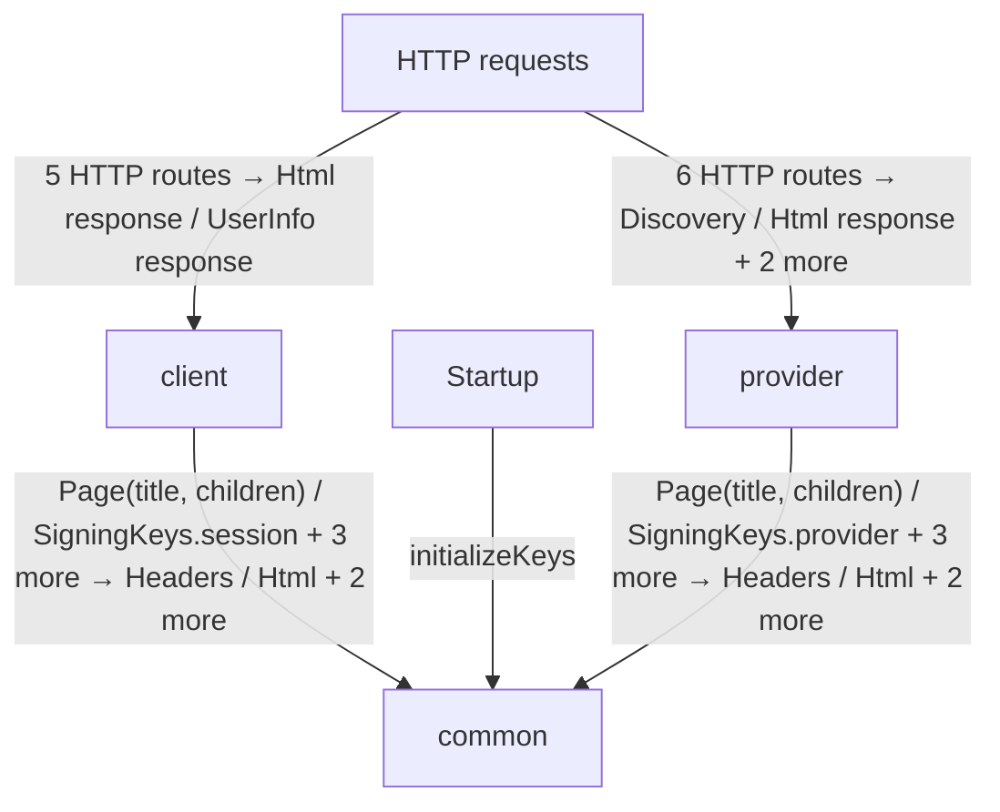
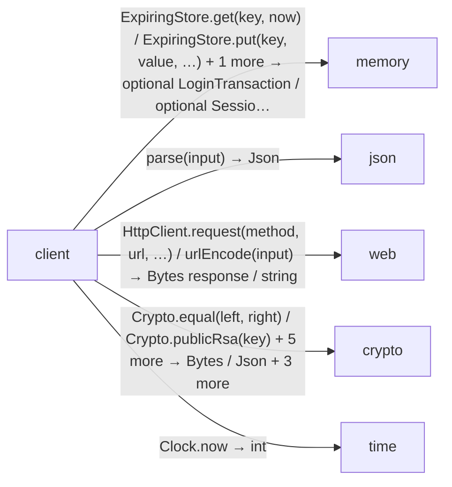
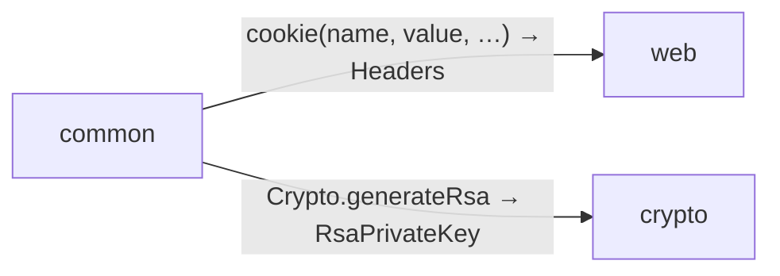
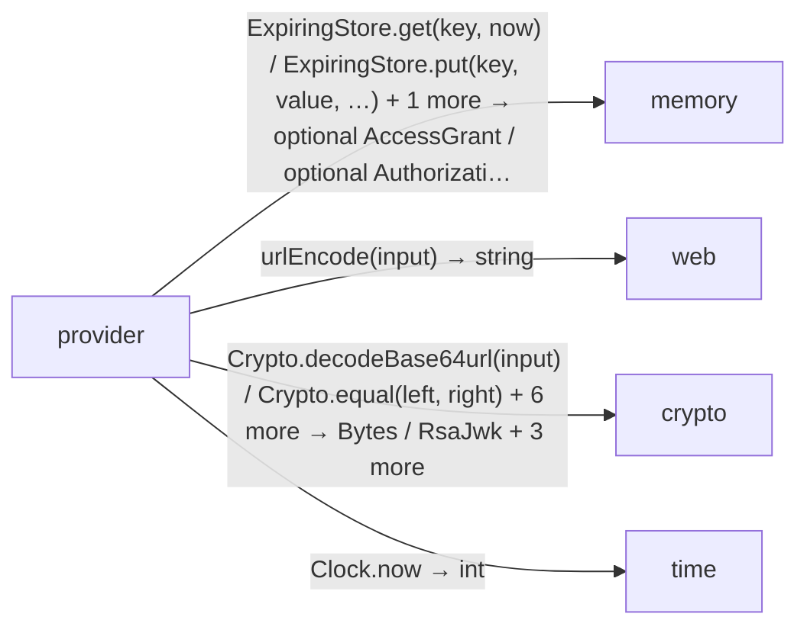

# OpenID Connect login application diagrams

[OpenID Connect login application](../index.md)

Start with how the application begins, then follow data between its folders. Open an operation to see its decisions, calls, failures and cleanup. Its explanation supplies the exact contract and linked dependencies.

This view includes 22 application source files. Package and interface boundaries show checked contracts; their runtime implementations are not expanded. The views describe the checked program, not desired requirements or a recorded execution.

## Where execution begins

### HTTP configuration

Listen on `127.0.0.1`. Limit request bodies to 16384 bytes and buffered responses to 1048576 bytes. Serve OpenAPI at `/openapi.json` and API docs at `/docs`.

### Providers {#providers}

`Crypto` is provided by [`GnuTlsCrypto`](../dependencies/packages/%40git/url_9ef654c66d34ab8f5527/0.0.0-git.b14a0f9aa41f1ce58bd51133bcdc424033e40d40/contracts.md#symbol-GnuTlsCrypto). The same instance is shared. `Clock` is provided by [`SystemClock`](../dependencies/packages/%40git/url_c092cd151499c4e1d8a1/0.0.0-git.a39fc582565d4fca40be4f75fa304d71adc69301/contracts.md#symbol-SystemClock). The same instance is shared.

`HttpClient` is provided by [`WebHttpClient`](../dependencies/packages/%40git/url_897efafd565158fc4908/0.0.0-git.a39fc582565d4fca40be4f75fa304d71adc69301/contracts.md#symbol-WebHttpClient). The same instance is shared.

`SigningKeys` is provided by [`MemorySigningKeys`](../common/keys.md#symbol-MemorySigningKeys). The same instance is shared. Shared mutation is allowed.

`ExpiringStore<LoginTransaction>` is provided by [`MemoryStore<LoginTransaction>`](../dependencies/packages/%40git/url_0eb7c89453c87681ed15/0.0.0-git.a39fc582565d4fca40be4f75fa304d71adc69301/store.md#symbol-MemoryStore). The same instance is shared. Shared mutation is allowed.

`ExpiringStore<AuthorizationRequest>` is provided by [`MemoryStore<AuthorizationRequest>`](../dependencies/packages/%40git/url_0eb7c89453c87681ed15/0.0.0-git.a39fc582565d4fca40be4f75fa304d71adc69301/store.md#symbol-MemoryStore). The same instance is shared. Shared mutation is allowed.

`ExpiringStore<AuthorizationCode>` is provided by [`MemoryStore<AuthorizationCode>`](../dependencies/packages/%40git/url_0eb7c89453c87681ed15/0.0.0-git.a39fc582565d4fca40be4f75fa304d71adc69301/store.md#symbol-MemoryStore). The same instance is shared. Shared mutation is allowed.

`ExpiringStore<SessionClaims>` is provided by [`MemoryStore<SessionClaims>`](../dependencies/packages/%40git/url_0eb7c89453c87681ed15/0.0.0-git.a39fc582565d4fca40be4f75fa304d71adc69301/store.md#symbol-MemoryStore). The same instance is shared. Shared mutation is allowed.

`ExpiringStore<AccessGrant>` is provided by [`MemoryStore<AccessGrant>`](../dependencies/packages/%40git/url_0eb7c89453c87681ed15/0.0.0-git.a39fc582565d4fca40be4f75fa304d71adc69301/store.md#symbol-MemoryStore). The same instance is shared. Shared mutation is allowed.

### Startup {#startup}

::: spec-paragraph specification-paragraph-1
It tries to call [`initializeKeys`](../common/keys.md#symbol-initializeKeys) using injected `Crypto` for `crypto` and `SigningKeys` for `keys`. If this work raises `CryptoError`, it prints `"Cryptographic initialization failed"`; then it calls `exit` with `status` `1`. If this work raises [`KeyError`](../common/keys.md#symbol-KeyError), it prints `"Signing keys could not be initialized"`; then it calls `exit` with `status` `1`. It serves [`home`](../client/endpoints.md#symbol-home), [`me`](../client/endpoints.md#symbol-me), [`logout`](../client/logout.md#symbol-logout), [`startLogin`](../client/login.md#symbol-startLogin), [`loginCallback`](../client/login.md#symbol-loginCallback), [`discovery`](../provider/discovery.md#symbol-discovery), [`jwks`](../provider/discovery.md#symbol-jwks), [`authorize`](../provider/authorization.md#symbol-authorize), [`providerLogin`](../provider/authorization.md#symbol-providerLogin), [`token`](../provider/token.md#symbol-token), and [`userinfo`](../provider/userinfo.md#symbol-userinfo) on port `8787`. [source](../main.md#source-L20-L29)
:::

## Data flow

### Package boundaries

::: details client package calls

:::

::: details common package calls

:::

::: details provider package calls

:::

### Follow the data

Each row opens the complete operations and call sites behind one pair of logical units. A grouped arrow records calls between those units; connected arrows need not belong to the same execution path.

| From | To | Operations | Read |
| --- | --- | --- | --- |
| HTTP requests | client | 5 | [Inputs, results and call sites](index.md#boundary-3a2232a5f5e0) |
| HTTP requests | provider | 6 | [Inputs, results and call sites](index.md#boundary-3cd184d08464) |
| client | common | 5 | [Inputs, results and call sites](index.md#boundary-0581e7d5c82e) |
| client | memory | 5 | [Inputs, results and call sites](index.md#boundary-4e2b8177ce42) |
| client | json | 1 | [Inputs, results and call sites](index.md#boundary-355763c17585) |
| client | web | 4 | [Inputs, results and call sites](index.md#boundary-dde5b5558455) |
| client | crypto | 10 | [Inputs, results and call sites](index.md#boundary-412fec56df12) |
| client | time | 1 | [Inputs, results and call sites](index.md#boundary-1ba581de07f0) |
| client | provider | 2 | [Inputs, results and call sites](index.md#boundary-466b327d97f9) |
| common | web | 1 | [Inputs, results and call sites](index.md#boundary-061d64468607) |
| common | crypto | 1 | [Inputs, results and call sites](index.md#boundary-4246365de112) |
| Startup | common | 1 | [Inputs, results and call sites](index.md#boundary-5ff699d0f9ec) |
| provider | common | 5 | [Inputs, results and call sites](index.md#boundary-8b3d9000aeea) |
| provider | memory | 6 | [Inputs, results and call sites](index.md#boundary-274701e13a7d) |
| provider | web | 1 | [Inputs, results and call sites](index.md#boundary-efa3025f773d) |
| provider | crypto | 9 | [Inputs, results and call sites](index.md#boundary-9a2abb1c79c3) |
| provider | time | 1 | [Inputs, results and call sites](index.md#boundary-4b2495f1924c) |

#### Data crossing these boundaries (64 contracts)

#### HTTP requests → client {#boundary-3a2232a5f5e0}

::: details 5 operations, 5 sites

**[GET /](../client/endpoints.md#symbol-home)** · HTTP endpoint

Inputs: token: optional string from cookie. Result: HttpResponse\<Html\>.

| Caller or entry | Evidence |
| --- | --- |
| HTTP requests | [Declaration](../client/endpoints.md#source-L12) · [Caller explanation](../client/endpoints.md#symbol-home) |

**[GET /login/callback](../client/login.md#symbol-loginCallback)** · HTTP endpoint

Inputs: code: string from query, state: string from query, browser: optional string from cookie. Result: HttpResponse\<Html\>.

| Caller or entry | Evidence |
| --- | --- |
| HTTP requests | [Declaration](../client/login.md#source-L27) · [Caller explanation](../client/login.md#symbol-loginCallback) |

**[GET /login/start](../client/login.md#symbol-startLogin)** · HTTP endpoint

No caller-supplied inputs. Result: HttpResponse\<Html\>.

| Caller or entry | Evidence |
| --- | --- |
| HTTP requests | [Declaration](../client/login.md#source-L12) · [Caller explanation](../client/login.md#symbol-startLogin) |

**[GET /me](../client/endpoints.md#symbol-me)** · HTTP endpoint

Inputs: token: optional string from cookie. Result: HttpResponse\<UserInfo\>.

| Caller or entry | Evidence |
| --- | --- |
| HTTP requests | [Declaration](../client/endpoints.md#source-L20) · [Caller explanation](../client/endpoints.md#symbol-me) |

**[POST /logout](../client/logout.md#symbol-logout)** · HTTP endpoint

Inputs: input: LogoutForm from form, token: optional string from cookie, origin: optional string from header. Result: HttpResponse\<Html\>.

| Caller or entry | Evidence |
| --- | --- |
| HTTP requests | [Declaration](../client/logout.md#source-L10) · [Caller explanation](../client/logout.md#symbol-logout) |

:::

#### HTTP requests → provider {#boundary-3cd184d08464}

::: details 6 operations, 6 sites

**[GET /provider/.well-known/openid-configuration](../provider/discovery.md#symbol-discovery)** · HTTP endpoint

No caller-supplied inputs. Result: Discovery.

| Caller or entry | Evidence |
| --- | --- |
| HTTP requests | [Declaration](../provider/discovery.md#source-L7) · [Caller explanation](../provider/discovery.md#symbol-discovery) |

**[GET /provider/authorize](../provider/authorization.md#symbol-authorize)** · HTTP endpoint

Inputs: response\_type: string from query, client\_id: string from query, redirect\_uri: string from query, requestedScope: string from query, state: string from query, nonce: string from query, code\_challenge: string from query, code\_challenge\_method: string from query. Result: HttpResponse\<Html\>.

| Caller or entry | Evidence |
| --- | --- |
| HTTP requests | [Declaration](../provider/authorization.md#source-L12) · [Caller explanation](../provider/authorization.md#symbol-authorize) |

**[GET /provider/jwks](../provider/discovery.md#symbol-jwks)** · HTTP endpoint

No caller-supplied inputs. Result: RsaJwks.

| Caller or entry | Evidence |
| --- | --- |
| HTTP requests | [Declaration](../provider/discovery.md#source-L12) · [Caller explanation](../provider/discovery.md#symbol-jwks) |

**[GET /provider/userinfo](../provider/userinfo.md#symbol-userinfo)** · HTTP endpoint

Inputs: authorization: optional string from header. Result: HttpResponse\<Json\>.

| Caller or entry | Evidence |
| --- | --- |
| HTTP requests | [Declaration](../provider/userinfo.md#source-L8) · [Caller explanation](../provider/userinfo.md#symbol-userinfo) |

**[POST /provider/login](../provider/authorization.md#symbol-providerLogin)** · HTTP endpoint

Inputs: form: LoginForm from form, browser: optional string from cookie, origin: optional string from header. Result: HttpResponse\<Html\>.

| Caller or entry | Evidence |
| --- | --- |
| HTTP requests | [Declaration](../provider/authorization.md#source-L35) · [Caller explanation](../provider/authorization.md#symbol-providerLogin) |

**[POST /provider/token](../provider/token.md#symbol-token)** · HTTP endpoint

Inputs: http: HttpRequest from request. Result: HttpResponse\<Json\>.

| Caller or entry | Evidence |
| --- | --- |
| HTTP requests | [Declaration](../provider/token.md#source-L12) · [Caller explanation](../provider/token.md#symbol-token) |

:::

#### client → common {#boundary-0581e7d5c82e}

::: details 5 operations, 21 sites

**[Page](../common/views.md#symbol-Page)**

Inputs: title: string, children: List\<Html\>. Result: Html.

| Caller or entry | Evidence |
| --- | --- |
| LoginPage | [Call site](../client/views.md#source-L7) · [Caller explanation](../client/views.md#symbol-LoginPage) |
| Welcome | [Call site](../client/views.md#source-L14) · [Caller explanation](../client/views.md#symbol-Welcome) |

**[SigningKeys.session](../common/keys.md#symbol-SigningKeys.session)** · interface dispatch

No caller-supplied inputs. Result: RsaPrivateKey.

| Caller or entry | Evidence |
| --- | --- |
| loginCallback | [Call site](../client/login.md#source-L55) · [Caller explanation](../client/login.md#symbol-loginCallback) |
| authenticate | [Call site](../client/session.md#source-L15) · [Caller explanation](../client/session.md#symbol-authenticate) |

**[securityHeaders](../common/headers.md#symbol-securityHeaders)**

No caller-supplied inputs. Result: Headers.

| Caller or entry | Evidence |
| --- | --- |
| home | [Call site](../client/endpoints.md#source-L15) · [Caller explanation](../client/endpoints.md#symbol-home) |
| home | [Call site](../client/endpoints.md#source-L17) · [Caller explanation](../client/endpoints.md#symbol-home) |
| me | [Call site](../client/endpoints.md#source-L22) · [Caller explanation](../client/endpoints.md#symbol-me) |
| startLogin | [Call site](../client/login.md#source-L23) · [Caller explanation](../client/login.md#symbol-startLogin) |
| loginCallback | [Call site](../client/login.md#source-L57) · [Caller explanation](../client/login.md#symbol-loginCallback) |
| logout | [Call site](../client/logout.md#source-L18) · [Caller explanation](../client/logout.md#symbol-logout) |

**[settings](../common/settings.md#symbol-settings)**

No caller-supplied inputs. Result: Settings.

| Caller or entry | Evidence |
| --- | --- |
| startLogin | [Call site](../client/login.md#source-L13) · [Caller explanation](../client/login.md#symbol-startLogin) |
| loginCallback | [Call site](../client/login.md#source-L40) · [Caller explanation](../client/login.md#symbol-loginCallback) |
| logout | [Call site](../client/logout.md#source-L11) · [Caller explanation](../client/logout.md#symbol-logout) |
| discover | [Call site](../client/protocol.md#source-L28) · [Caller explanation](../client/protocol.md#symbol-discover) |
| validateIdentity | [Call site](../client/protocol.md#source-L40) · [Caller explanation](../client/protocol.md#symbol-validateIdentity) |
| test validateIdentity | [Call site](../client/protocol.md#source-L72) · [Caller explanation](../client/protocol.md#symbol-test-20-validateIdentity) |
| authenticate | [Call site](../client/session.md#source-L17) · [Caller explanation](../client/session.md#symbol-authenticate) |

**[withCookie](../common/headers.md#symbol-withCookie)**

Inputs: headers: Headers, name: string, value: string, path: string, maxAge: int, secure: bool. Result: Headers.

| Caller or entry | Evidence |
| --- | --- |
| startLogin | [Call site](../client/login.md#source-L23) · [Caller explanation](../client/login.md#symbol-startLogin) |
| loginCallback | [Call site](../client/login.md#source-L57) · [Caller explanation](../client/login.md#symbol-loginCallback) |
| loginCallback | [Call site](../client/login.md#source-L58) · [Caller explanation](../client/login.md#symbol-loginCallback) |
| logout | [Call site](../client/logout.md#source-L18) · [Caller explanation](../client/logout.md#symbol-logout) |

:::

#### client → memory {#boundary-4e2b8177ce42}

::: details 5 operations, 5 sites

**[ExpiringStore.get](../dependencies/packages/%40git/url_0eb7c89453c87681ed15/0.0.0-git.a39fc582565d4fca40be4f75fa304d71adc69301/store.md#symbol-ExpiringStore.get)** · interface dispatch

Inputs: key: string, now: int. Result: optional SessionClaims.

| Caller or entry | Evidence |
| --- | --- |
| authenticate | [Call site](../client/session.md#source-L23) · [Caller explanation](../client/session.md#symbol-authenticate) |

**[ExpiringStore.put](../dependencies/packages/%40git/url_0eb7c89453c87681ed15/0.0.0-git.a39fc582565d4fca40be4f75fa304d71adc69301/store.md#symbol-ExpiringStore.put)** · interface dispatch

Inputs: key: string, value: LoginTransaction, expires: int, now: int. Result: void.

| Caller or entry | Evidence |
| --- | --- |
| startLogin | [Call site](../client/login.md#source-L20) · [Caller explanation](../client/login.md#symbol-startLogin) |

**[ExpiringStore.put](../dependencies/packages/%40git/url_0eb7c89453c87681ed15/0.0.0-git.a39fc582565d4fca40be4f75fa304d71adc69301/store.md#symbol-ExpiringStore.put)** · interface dispatch

Inputs: key: string, value: SessionClaims, expires: int, now: int. Result: void.

| Caller or entry | Evidence |
| --- | --- |
| loginCallback | [Call site](../client/login.md#source-L56) · [Caller explanation](../client/login.md#symbol-loginCallback) |

**[ExpiringStore.take](../dependencies/packages/%40git/url_0eb7c89453c87681ed15/0.0.0-git.a39fc582565d4fca40be4f75fa304d71adc69301/store.md#symbol-ExpiringStore.take)** · interface dispatch

Inputs: key: string, now: int. Result: optional LoginTransaction.

| Caller or entry | Evidence |
| --- | --- |
| loginCallback | [Call site](../client/login.md#source-L34) · [Caller explanation](../client/login.md#symbol-loginCallback) |

**[ExpiringStore.take](../dependencies/packages/%40git/url_0eb7c89453c87681ed15/0.0.0-git.a39fc582565d4fca40be4f75fa304d71adc69301/store.md#symbol-ExpiringStore.take)** · interface dispatch

Inputs: key: string, now: int. Result: optional SessionClaims.

| Caller or entry | Evidence |
| --- | --- |
| logout | [Call site](../client/logout.md#source-L17) · [Caller explanation](../client/logout.md#symbol-logout) |

:::

#### client → json {#boundary-355763c17585}

::: details 1 operation, 1 site

**[parse](../dependencies/packages/%40git/url_2d3c37c690c0fa115be1/0.0.0-git.a39fc582565d4fca40be4f75fa304d71adc69301/contracts.md#symbol-parse)**

Inputs: input: string. Result: Json.

| Caller or entry | Evidence |
| --- | --- |
| responseJson | [Call site](../client/protocol.md#source-L20) · [Caller explanation](../client/protocol.md#symbol-responseJson) |

:::

#### client → web {#boundary-dde5b5558455}

::: details 4 operations, 13 sites

**[HttpClient.request](../dependencies/packages/%40git/url_897efafd565158fc4908/0.0.0-git.a39fc582565d4fca40be4f75fa304d71adc69301/contracts.md#symbol-HttpClient.request)** · interface dispatch

Inputs: method: string, url: string, headers: Headers, body: Bytes. Result: HttpResponse\<Bytes\>.

| Caller or entry | Evidence |
| --- | --- |
| loginCallback | [Call site](../client/login.md#source-L44) · [Caller explanation](../client/login.md#symbol-loginCallback) |

**[HttpClient.request](../dependencies/packages/%40git/url_897efafd565158fc4908/0.0.0-git.a39fc582565d4fca40be4f75fa304d71adc69301/contracts.md#symbol-HttpClient.request)** · interface dispatch

Inputs: method: string, url: string, headers: Headers, body: optional Bytes. Result: HttpResponse\<Bytes\>.

| Caller or entry | Evidence |
| --- | --- |
| loginCallback | [Call site](../client/login.md#source-L50) · [Caller explanation](../client/login.md#symbol-loginCallback) |

**[HttpClient.request](../dependencies/packages/%40git/url_897efafd565158fc4908/0.0.0-git.a39fc582565d4fca40be4f75fa304d71adc69301/contracts.md#symbol-HttpClient.request)** · interface dispatch

Inputs: method: string, url: string, headers: optional Headers, body: optional Bytes. Result: HttpResponse\<Bytes\>.

| Caller or entry | Evidence |
| --- | --- |
| loginCallback | [Call site](../client/login.md#source-L47) · [Caller explanation](../client/login.md#symbol-loginCallback) |
| discover | [Call site](../client/protocol.md#source-L29) · [Caller explanation](../client/protocol.md#symbol-discover) |

**[urlEncode](../dependencies/packages/%40git/url_897efafd565158fc4908/0.0.0-git.a39fc582565d4fca40be4f75fa304d71adc69301/contracts.md#symbol-urlEncode)**

Inputs: input: string. Result: string.

| Caller or entry | Evidence |
| --- | --- |
| startLogin | [Call site](../client/login.md#source-L22) · [Caller explanation](../client/login.md#symbol-startLogin) |
| startLogin | [Call site](../client/login.md#source-L22) · [Caller explanation](../client/login.md#symbol-startLogin) |
| startLogin | [Call site](../client/login.md#source-L22) · [Caller explanation](../client/login.md#symbol-startLogin) |
| startLogin | [Call site](../client/login.md#source-L22) · [Caller explanation](../client/login.md#symbol-startLogin) |
| startLogin | [Call site](../client/login.md#source-L22) · [Caller explanation](../client/login.md#symbol-startLogin) |
| loginCallback | [Call site](../client/login.md#source-L42) · [Caller explanation](../client/login.md#symbol-loginCallback) |
| loginCallback | [Call site](../client/login.md#source-L42) · [Caller explanation](../client/login.md#symbol-loginCallback) |
| loginCallback | [Call site](../client/login.md#source-L42) · [Caller explanation](../client/login.md#symbol-loginCallback) |
| loginCallback | [Call site](../client/login.md#source-L42) · [Caller explanation](../client/login.md#symbol-loginCallback) |

:::

#### client → crypto {#boundary-412fec56df12}

::: details 10 operations, 23 sites

**[Crypto.equal](../dependencies/packages/%40git/url_9ef654c66d34ab8f5527/0.0.0-git.b14a0f9aa41f1ce58bd51133bcdc424033e40d40/contracts.md#symbol-Crypto.equal)** · interface dispatch

Inputs: left: Bytes, right: Bytes. Result: bool.

| Caller or entry | Evidence |
| --- | --- |
| loginCallback | [Call site](../client/login.md#source-L38) · [Caller explanation](../client/login.md#symbol-loginCallback) |
| logout | [Call site](../client/logout.md#source-L15) · [Caller explanation](../client/logout.md#symbol-logout) |
| validateIdentity | [Call site](../client/protocol.md#source-L53) · [Caller explanation](../client/protocol.md#symbol-validateIdentity) |
| authenticate | [Call site](../client/session.md#source-L27) · [Caller explanation](../client/session.md#symbol-authenticate) |

**[Crypto.generateRsa](../dependencies/packages/%40git/url_9ef654c66d34ab8f5527/0.0.0-git.b14a0f9aa41f1ce58bd51133bcdc424033e40d40/contracts.md#symbol-Crypto.generateRsa)** · interface dispatch

No caller-supplied inputs. Result: RsaPrivateKey.

| Caller or entry | Evidence |
| --- | --- |
| test validateIdentity | [Call site](../client/protocol.md#source-L69) · [Caller explanation](../client/protocol.md#symbol-test-20-validateIdentity) |

**[Crypto.publicRsa](../dependencies/packages/%40git/url_9ef654c66d34ab8f5527/0.0.0-git.b14a0f9aa41f1ce58bd51133bcdc424033e40d40/contracts.md#symbol-Crypto.publicRsa)** · interface dispatch

Inputs: key: RsaPrivateKey. Result: RsaPublicKey.

| Caller or entry | Evidence |
| --- | --- |
| test validateIdentity | [Call site](../client/protocol.md#source-L70) · [Caller explanation](../client/protocol.md#symbol-test-20-validateIdentity) |
| authenticate | [Call site](../client/session.md#source-L15) · [Caller explanation](../client/session.md#symbol-authenticate) |

**[Crypto.random](../dependencies/packages/%40git/url_9ef654c66d34ab8f5527/0.0.0-git.b14a0f9aa41f1ce58bd51133bcdc424033e40d40/contracts.md#symbol-Crypto.random)** · interface dispatch

Inputs: size: int. Result: Bytes.

| Caller or entry | Evidence |
| --- | --- |
| startLogin | [Call site](../client/login.md#source-L15) · [Caller explanation](../client/login.md#symbol-startLogin) |
| startLogin | [Call site](../client/login.md#source-L16) · [Caller explanation](../client/login.md#symbol-startLogin) |
| startLogin | [Call site](../client/login.md#source-L17) · [Caller explanation](../client/login.md#symbol-startLogin) |
| startLogin | [Call site](../client/login.md#source-L18) · [Caller explanation](../client/login.md#symbol-startLogin) |
| loginCallback | [Call site](../client/login.md#source-L54) · [Caller explanation](../client/login.md#symbol-loginCallback) |
| loginCallback | [Call site](../client/login.md#source-L54) · [Caller explanation](../client/login.md#symbol-loginCallback) |

**[Crypto.sha256](../dependencies/packages/%40git/url_9ef654c66d34ab8f5527/0.0.0-git.b14a0f9aa41f1ce58bd51133bcdc424033e40d40/contracts.md#symbol-Crypto.sha256)** · interface dispatch

Inputs: input: Bytes. Result: Bytes.

| Caller or entry | Evidence |
| --- | --- |
| startLogin | [Call site](../client/login.md#source-L21) · [Caller explanation](../client/login.md#symbol-startLogin) |

**[RsaJwks](../dependencies/packages/%40git/url_9ef654c66d34ab8f5527/0.0.0-git.b14a0f9aa41f1ce58bd51133bcdc424033e40d40/jose.md#symbol-RsaJwks)** · value construction

Inputs: keys: List\<RsaJwk\>. Result: RsaJwks.

| Caller or entry | Evidence |
| --- | --- |
| test validateIdentity | [Call site](../client/protocol.md#source-L71) · [Caller explanation](../client/protocol.md#symbol-test-20-validateIdentity) |

**[importJwk](../dependencies/packages/%40git/url_9ef654c66d34ab8f5527/0.0.0-git.b14a0f9aa41f1ce58bd51133bcdc424033e40d40/jose.md#symbol-importJwk)**

Inputs: jwk: RsaJwk. Result: RsaPublicKey.

| Caller or entry | Evidence |
| --- | --- |
| validateIdentity | [Call site](../client/protocol.md#source-L47) · [Caller explanation](../client/protocol.md#symbol-validateIdentity) |

**[rsaJwk](../dependencies/packages/%40git/url_9ef654c66d34ab8f5527/0.0.0-git.b14a0f9aa41f1ce58bd51133bcdc424033e40d40/jose.md#symbol-rsaJwk)**

Inputs: publicKey: RsaPublicKey, kid: string. Result: RsaJwk.

| Caller or entry | Evidence |
| --- | --- |
| test validateIdentity | [Call site](../client/protocol.md#source-L71) · [Caller explanation](../client/protocol.md#symbol-test-20-validateIdentity) |

**[signJwt](../dependencies/packages/%40git/url_9ef654c66d34ab8f5527/0.0.0-git.b14a0f9aa41f1ce58bd51133bcdc424033e40d40/jose.md#symbol-signJwt)**

Inputs: key: RsaPrivateKey, claims: Json, kid: string, tokenType: string. Result: string.

| Caller or entry | Evidence |
| --- | --- |
| loginCallback | [Call site](../client/login.md#source-L55) · [Caller explanation](../client/login.md#symbol-loginCallback) |
| test validateIdentity | [Call site](../client/protocol.md#source-L78) · [Caller explanation](../client/protocol.md#symbol-test-20-validateIdentity) |
| test validateIdentity | [Call site](../client/protocol.md#source-L93) · [Caller explanation](../client/protocol.md#symbol-test-20-validateIdentity) |
| test validateIdentity | [Call site](../client/protocol.md#source-L102) · [Caller explanation](../client/protocol.md#symbol-test-20-validateIdentity) |

**[verifyJwt](../dependencies/packages/%40git/url_9ef654c66d34ab8f5527/0.0.0-git.b14a0f9aa41f1ce58bd51133bcdc424033e40d40/jose.md#symbol-verifyJwt)**

Inputs: token: string, publicKey: RsaPublicKey, kid: string, tokenType: string. Result: Json.

| Caller or entry | Evidence |
| --- | --- |
| validateIdentity | [Call site](../client/protocol.md#source-L48) · [Caller explanation](../client/protocol.md#symbol-validateIdentity) |
| authenticate | [Call site](../client/session.md#source-L16) · [Caller explanation](../client/session.md#symbol-authenticate) |

:::

#### client → time {#boundary-1ba581de07f0}

::: details 1 operation, 7 sites

**[Clock.now](../dependencies/packages/%40git/url_c092cd151499c4e1d8a1/0.0.0-git.a39fc582565d4fca40be4f75fa304d71adc69301/contracts.md#symbol-Clock.now)** · interface dispatch

No caller-supplied inputs. Result: int.

| Caller or entry | Evidence |
| --- | --- |
| startLogin | [Call site](../client/login.md#source-L19) · [Caller explanation](../client/login.md#symbol-startLogin) |
| startLogin | [Call site](../client/login.md#source-L20) · [Caller explanation](../client/login.md#symbol-startLogin) |
| loginCallback | [Call site](../client/login.md#source-L34) · [Caller explanation](../client/login.md#symbol-loginCallback) |
| loginCallback | [Call site](../client/login.md#source-L48) · [Caller explanation](../client/login.md#symbol-loginCallback) |
| loginCallback | [Call site](../client/login.md#source-L53) · [Caller explanation](../client/login.md#symbol-loginCallback) |
| logout | [Call site](../client/logout.md#source-L17) · [Caller explanation](../client/logout.md#symbol-logout) |
| authenticate | [Call site](../client/session.md#source-L18) · [Caller explanation](../client/session.md#symbol-authenticate) |

:::

#### client → provider {#boundary-466b327d97f9}

::: details 2 operations, 4 sites

**[IdClaims](../provider/contracts.md#symbol-IdClaims)** · value construction

Inputs: iss: string, sub: string, aud: string, exp: int, iat: int, nonce: string, name: string. Result: IdClaims.

| Caller or entry | Evidence |
| --- | --- |
| test validateIdentity | [Call site](../client/protocol.md#source-L77) · [Caller explanation](../client/protocol.md#symbol-test-20-validateIdentity) |
| test validateIdentity | [Call site](../client/protocol.md#source-L92) · [Caller explanation](../client/protocol.md#symbol-test-20-validateIdentity) |
| test validateIdentity | [Call site](../client/protocol.md#source-L101) · [Caller explanation](../client/protocol.md#symbol-test-20-validateIdentity) |

**[UserInfo](../provider/contracts.md#symbol-UserInfo)** · value construction

Inputs: sub: string, name: string. Result: UserInfo.

| Caller or entry | Evidence |
| --- | --- |
| me | [Call site](../client/endpoints.md#source-L22) · [Caller explanation](../client/endpoints.md#symbol-me) |

:::

#### common → web {#boundary-061d64468607}

::: details 1 operation, 1 site

**[cookie](../dependencies/packages/%40git/url_897efafd565158fc4908/0.0.0-git.a39fc582565d4fca40be4f75fa304d71adc69301/contracts.md#symbol-cookie)**

Inputs: name: string, value: string, path: string, maxAge: int, secure: bool. Result: Headers.

| Caller or entry | Evidence |
| --- | --- |
| withCookie | [Call site](../common/headers.md#source-L9) · [Caller explanation](../common/headers.md#symbol-withCookie) |

:::

#### common → crypto {#boundary-4246365de112}

::: details 1 operation, 2 sites

**[Crypto.generateRsa](../dependencies/packages/%40git/url_9ef654c66d34ab8f5527/0.0.0-git.b14a0f9aa41f1ce58bd51133bcdc424033e40d40/contracts.md#symbol-Crypto.generateRsa)** · interface dispatch

No caller-supplied inputs. Result: RsaPrivateKey.

| Caller or entry | Evidence |
| --- | --- |
| initializeKeys | [Call site](../common/keys.md#source-L36) · [Caller explanation](../common/keys.md#symbol-initializeKeys) |
| initializeKeys | [Call site](../common/keys.md#source-L37) · [Caller explanation](../common/keys.md#symbol-initializeKeys) |

:::

#### Startup → common {#boundary-5ff699d0f9ec}

::: details 1 operation, 1 site

**[initializeKeys](../common/keys.md#symbol-initializeKeys)**

No caller-supplied inputs. Result: void.

| Caller or entry | Evidence |
| --- | --- |
| Startup | [Call site](../main.md#source-L21) · [Caller explanation](../main.md#startup) |

:::

#### provider → common {#boundary-8b3d9000aeea}

::: details 5 operations, 22 sites

**[Page](../common/views.md#symbol-Page)**

Inputs: title: string, children: List\<Html\>. Result: Html.

| Caller or entry | Evidence |
| --- | --- |
| ProviderLogin | [Call site](../provider/views.md#source-L5) · [Caller explanation](../provider/views.md#symbol-ProviderLogin) |
| ProviderFailure | [Call site](../provider/views.md#source-L19) · [Caller explanation](../provider/views.md#symbol-ProviderFailure) |

**[SigningKeys.provider](../common/keys.md#symbol-SigningKeys.provider)** · interface dispatch

No caller-supplied inputs. Result: RsaPrivateKey.

| Caller or entry | Evidence |
| --- | --- |
| jwks | [Call site](../provider/discovery.md#source-L13) · [Caller explanation](../provider/discovery.md#symbol-jwks) |
| token | [Call site](../provider/token.md#source-L31) · [Caller explanation](../provider/token.md#symbol-token) |

**[securityHeaders](../common/headers.md#symbol-securityHeaders)**

No caller-supplied inputs. Result: Headers.

| Caller or entry | Evidence |
| --- | --- |
| authorize | [Call site](../provider/authorization.md#source-L31) · [Caller explanation](../provider/authorization.md#symbol-authorize) |
| providerLogin | [Call site](../provider/authorization.md#source-L39) · [Caller explanation](../provider/authorization.md#symbol-providerLogin) |
| providerLogin | [Call site](../provider/authorization.md#source-L42) · [Caller explanation](../provider/authorization.md#symbol-providerLogin) |
| providerLogin | [Call site](../provider/authorization.md#source-L46) · [Caller explanation](../provider/authorization.md#symbol-providerLogin) |
| providerLogin | [Call site](../provider/authorization.md#source-L49) · [Caller explanation](../provider/authorization.md#symbol-providerLogin) |
| providerLogin | [Call site](../provider/authorization.md#source-L51) · [Caller explanation](../provider/authorization.md#symbol-providerLogin) |
| providerLogin | [Call site](../provider/authorization.md#source-L57) · [Caller explanation](../provider/authorization.md#symbol-providerLogin) |
| providerLogin | [Call site](../provider/authorization.md#source-L60) · [Caller explanation](../provider/authorization.md#symbol-providerLogin) |
| \_oauthError | [Call site](../provider/token.md#source-L9) · [Caller explanation](../provider/token.md#symbol-_oauthError) |
| token | [Call site](../provider/token.md#source-L36) · [Caller explanation](../provider/token.md#symbol-token) |
| userinfo | [Call site](../provider/userinfo.md#source-L23) · [Caller explanation](../provider/userinfo.md#symbol-userinfo) |
| userinfo | [Call site](../provider/userinfo.md#source-L26) · [Caller explanation](../provider/userinfo.md#symbol-userinfo) |

**[settings](../common/settings.md#symbol-settings)**

No caller-supplied inputs. Result: Settings.

| Caller or entry | Evidence |
| --- | --- |
| authorize | [Call site](../provider/authorization.md#source-L13) · [Caller explanation](../provider/authorization.md#symbol-authorize) |
| providerLogin | [Call site](../provider/authorization.md#source-L36) · [Caller explanation](../provider/authorization.md#symbol-providerLogin) |
| discovery | [Call site](../provider/discovery.md#source-L8) · [Caller explanation](../provider/discovery.md#symbol-discovery) |
| token | [Call site](../provider/token.md#source-L13) · [Caller explanation](../provider/token.md#symbol-token) |

**[withCookie](../common/headers.md#symbol-withCookie)**

Inputs: headers: Headers, name: string, value: string, path: string, maxAge: int, secure: bool. Result: Headers.

| Caller or entry | Evidence |
| --- | --- |
| authorize | [Call site](../provider/authorization.md#source-L31) · [Caller explanation](../provider/authorization.md#symbol-authorize) |
| providerLogin | [Call site](../provider/authorization.md#source-L57) · [Caller explanation](../provider/authorization.md#symbol-providerLogin) |

:::

#### provider → memory {#boundary-274701e13a7d}

::: details 6 operations, 6 sites

**[ExpiringStore.get](../dependencies/packages/%40git/url_0eb7c89453c87681ed15/0.0.0-git.a39fc582565d4fca40be4f75fa304d71adc69301/store.md#symbol-ExpiringStore.get)** · interface dispatch

Inputs: key: string, now: int. Result: optional AccessGrant.

| Caller or entry | Evidence |
| --- | --- |
| userinfo | [Call site](../provider/userinfo.md#source-L19) · [Caller explanation](../provider/userinfo.md#symbol-userinfo) |

**[ExpiringStore.put](../dependencies/packages/%40git/url_0eb7c89453c87681ed15/0.0.0-git.a39fc582565d4fca40be4f75fa304d71adc69301/store.md#symbol-ExpiringStore.put)** · interface dispatch

Inputs: key: string, value: AccessGrant, expires: int, now: int. Result: void.

| Caller or entry | Evidence |
| --- | --- |
| token | [Call site](../provider/token.md#source-L34) · [Caller explanation](../provider/token.md#symbol-token) |

**[ExpiringStore.put](../dependencies/packages/%40git/url_0eb7c89453c87681ed15/0.0.0-git.a39fc582565d4fca40be4f75fa304d71adc69301/store.md#symbol-ExpiringStore.put)** · interface dispatch

Inputs: key: string, value: AuthorizationCode, expires: int, now: int. Result: void.

| Caller or entry | Evidence |
| --- | --- |
| providerLogin | [Call site](../provider/authorization.md#source-L55) · [Caller explanation](../provider/authorization.md#symbol-providerLogin) |

**[ExpiringStore.put](../dependencies/packages/%40git/url_0eb7c89453c87681ed15/0.0.0-git.a39fc582565d4fca40be4f75fa304d71adc69301/store.md#symbol-ExpiringStore.put)** · interface dispatch

Inputs: key: string, value: AuthorizationRequest, expires: int, now: int. Result: void.

| Caller or entry | Evidence |
| --- | --- |
| authorize | [Call site](../provider/authorization.md#source-L30) · [Caller explanation](../provider/authorization.md#symbol-authorize) |

**[ExpiringStore.take](../dependencies/packages/%40git/url_0eb7c89453c87681ed15/0.0.0-git.a39fc582565d4fca40be4f75fa304d71adc69301/store.md#symbol-ExpiringStore.take)** · interface dispatch

Inputs: key: string, now: int. Result: optional AuthorizationRequest.

| Caller or entry | Evidence |
| --- | --- |
| providerLogin | [Call site](../provider/authorization.md#source-L40) · [Caller explanation](../provider/authorization.md#symbol-providerLogin) |

**[ExpiringStore.take](../dependencies/packages/%40git/url_0eb7c89453c87681ed15/0.0.0-git.a39fc582565d4fca40be4f75fa304d71adc69301/store.md#symbol-ExpiringStore.take)** · interface dispatch

Inputs: key: string, now: int. Result: optional AuthorizationCode.

| Caller or entry | Evidence |
| --- | --- |
| token | [Call site](../provider/token.md#source-L23) · [Caller explanation](../provider/token.md#symbol-token) |

:::

#### provider → web {#boundary-efa3025f773d}

::: details 1 operation, 2 sites

**[urlEncode](../dependencies/packages/%40git/url_897efafd565158fc4908/0.0.0-git.a39fc582565d4fca40be4f75fa304d71adc69301/contracts.md#symbol-urlEncode)**

Inputs: input: string. Result: string.

| Caller or entry | Evidence |
| --- | --- |
| providerLogin | [Call site](../provider/authorization.md#source-L56) · [Caller explanation](../provider/authorization.md#symbol-providerLogin) |
| providerLogin | [Call site](../provider/authorization.md#source-L56) · [Caller explanation](../provider/authorization.md#symbol-providerLogin) |

:::

#### provider → crypto {#boundary-9a2abb1c79c3}

::: details 9 operations, 18 sites

**[Crypto.decodeBase64url](../dependencies/packages/%40git/url_9ef654c66d34ab8f5527/0.0.0-git.b14a0f9aa41f1ce58bd51133bcdc424033e40d40/contracts.md#symbol-Crypto.decodeBase64url)** · interface dispatch

Inputs: input: string. Result: Bytes.

| Caller or entry | Evidence |
| --- | --- |
| authorize | [Call site](../provider/authorization.md#source-L21) · [Caller explanation](../provider/authorization.md#symbol-authorize) |
| verifyCredentials | [Call site](../provider/credentials.md#source-L8) · [Caller explanation](../provider/credentials.md#symbol-verifyCredentials) |

**[Crypto.equal](../dependencies/packages/%40git/url_9ef654c66d34ab8f5527/0.0.0-git.b14a0f9aa41f1ce58bd51133bcdc424033e40d40/contracts.md#symbol-Crypto.equal)** · interface dispatch

Inputs: left: Bytes, right: Bytes. Result: bool.

| Caller or entry | Evidence |
| --- | --- |
| providerLogin | [Call site](../provider/authorization.md#source-L48) · [Caller explanation](../provider/authorization.md#symbol-providerLogin) |
| providerLogin | [Call site](../provider/authorization.md#source-L48) · [Caller explanation](../provider/authorization.md#symbol-providerLogin) |
| verifyCredentials | [Call site](../provider/credentials.md#source-L9) · [Caller explanation](../provider/credentials.md#symbol-verifyCredentials) |
| verifyCredentials | [Call site](../provider/credentials.md#source-L10) · [Caller explanation](../provider/credentials.md#symbol-verifyCredentials) |
| token | [Call site](../provider/token.md#source-L28) · [Caller explanation](../provider/token.md#symbol-token) |

**[Crypto.passwordHash](../dependencies/packages/%40git/url_9ef654c66d34ab8f5527/0.0.0-git.b14a0f9aa41f1ce58bd51133bcdc424033e40d40/contracts.md#symbol-Crypto.passwordHash)** · interface dispatch

Inputs: password: Bytes, salt: Bytes, iterations: int. Result: Bytes.

| Caller or entry | Evidence |
| --- | --- |
| verifyCredentials | [Call site](../provider/credentials.md#source-L7) · [Caller explanation](../provider/credentials.md#symbol-verifyCredentials) |

**[Crypto.publicRsa](../dependencies/packages/%40git/url_9ef654c66d34ab8f5527/0.0.0-git.b14a0f9aa41f1ce58bd51133bcdc424033e40d40/contracts.md#symbol-Crypto.publicRsa)** · interface dispatch

Inputs: key: RsaPrivateKey. Result: RsaPublicKey.

| Caller or entry | Evidence |
| --- | --- |
| jwks | [Call site](../provider/discovery.md#source-L13) · [Caller explanation](../provider/discovery.md#symbol-jwks) |

**[Crypto.random](../dependencies/packages/%40git/url_9ef654c66d34ab8f5527/0.0.0-git.b14a0f9aa41f1ce58bd51133bcdc424033e40d40/contracts.md#symbol-Crypto.random)** · interface dispatch

Inputs: size: int. Result: Bytes.

| Caller or entry | Evidence |
| --- | --- |
| authorize | [Call site](../provider/authorization.md#source-L25) · [Caller explanation](../provider/authorization.md#symbol-authorize) |
| authorize | [Call site](../provider/authorization.md#source-L26) · [Caller explanation](../provider/authorization.md#symbol-authorize) |
| authorize | [Call site](../provider/authorization.md#source-L27) · [Caller explanation](../provider/authorization.md#symbol-authorize) |
| providerLogin | [Call site](../provider/authorization.md#source-L53) · [Caller explanation](../provider/authorization.md#symbol-providerLogin) |
| token | [Call site](../provider/token.md#source-L32) · [Caller explanation](../provider/token.md#symbol-token) |

**[Crypto.sha256](../dependencies/packages/%40git/url_9ef654c66d34ab8f5527/0.0.0-git.b14a0f9aa41f1ce58bd51133bcdc424033e40d40/contracts.md#symbol-Crypto.sha256)** · interface dispatch

Inputs: input: Bytes. Result: Bytes.

| Caller or entry | Evidence |
| --- | --- |
| token | [Call site](../provider/token.md#source-L27) · [Caller explanation](../provider/token.md#symbol-token) |

**[RsaJwks](../dependencies/packages/%40git/url_9ef654c66d34ab8f5527/0.0.0-git.b14a0f9aa41f1ce58bd51133bcdc424033e40d40/jose.md#symbol-RsaJwks)** · value construction

Inputs: keys: List\<RsaJwk\>. Result: RsaJwks.

| Caller or entry | Evidence |
| --- | --- |
| jwks | [Call site](../provider/discovery.md#source-L14) · [Caller explanation](../provider/discovery.md#symbol-jwks) |

**[rsaJwk](../dependencies/packages/%40git/url_9ef654c66d34ab8f5527/0.0.0-git.b14a0f9aa41f1ce58bd51133bcdc424033e40d40/jose.md#symbol-rsaJwk)**

Inputs: publicKey: RsaPublicKey, kid: string. Result: RsaJwk.

| Caller or entry | Evidence |
| --- | --- |
| jwks | [Call site](../provider/discovery.md#source-L14) · [Caller explanation](../provider/discovery.md#symbol-jwks) |

**[signJwt](../dependencies/packages/%40git/url_9ef654c66d34ab8f5527/0.0.0-git.b14a0f9aa41f1ce58bd51133bcdc424033e40d40/jose.md#symbol-signJwt)**

Inputs: key: RsaPrivateKey, claims: Json, kid: string, tokenType: string. Result: string.

| Caller or entry | Evidence |
| --- | --- |
| token | [Call site](../provider/token.md#source-L31) · [Caller explanation](../provider/token.md#symbol-token) |

:::

#### provider → time {#boundary-4b2495f1924c}

::: details 1 operation, 5 sites

**[Clock.now](../dependencies/packages/%40git/url_c092cd151499c4e1d8a1/0.0.0-git.a39fc582565d4fca40be4f75fa304d71adc69301/contracts.md#symbol-Clock.now)** · interface dispatch

No caller-supplied inputs. Result: int.

| Caller or entry | Evidence |
| --- | --- |
| authorize | [Call site](../provider/authorization.md#source-L28) · [Caller explanation](../provider/authorization.md#symbol-authorize) |
| providerLogin | [Call site](../provider/authorization.md#source-L40) · [Caller explanation](../provider/authorization.md#symbol-providerLogin) |
| providerLogin | [Call site](../provider/authorization.md#source-L52) · [Caller explanation](../provider/authorization.md#symbol-providerLogin) |
| token | [Call site](../provider/token.md#source-L22) · [Caller explanation](../provider/token.md#symbol-token) |
| userinfo | [Call site](../provider/userinfo.md#source-L19) · [Caller explanation](../provider/userinfo.md#symbol-userinfo) |

:::

## Open a folder

| Folder | Read |
| --- | --- |
| client | [Folder data flow](folders/client/index.md) |
| common | [Folder data flow](folders/common/index.md) |
| provider | [Folder data flow](folders/provider/index.md) |

## Open a module

| Module | Read |
| --- | --- |
| client/contracts.aug | [Flow and sequences](../client/contracts-diagrams.md) · [Explanation](../client/contracts.md) |
| client/endpoints.aug | [Flow and sequences](../client/endpoints-diagrams.md) · [Explanation](../client/endpoints.md) |
| client/export.aug | [Flow and sequences](../client/export-diagrams.md) · [Explanation](../client/export.md) |
| client/login.aug | [Flow and sequences](../client/login-diagrams.md) · [Explanation](../client/login.md) |
| client/logout.aug | [Flow and sequences](../client/logout-diagrams.md) · [Explanation](../client/logout.md) |
| client/protocol.aug | [Flow and sequences](../client/protocol-diagrams.md) · [Explanation](../client/protocol.md) |
| client/session.aug | [Flow and sequences](../client/session-diagrams.md) · [Explanation](../client/session.md) |
| client/views.aug | [Flow and sequences](../client/views-diagrams.md) · [Explanation](../client/views.md) |
| common/export.aug | [Flow and sequences](../common/export-diagrams.md) · [Explanation](../common/export.md) |
| common/headers.aug | [Flow and sequences](../common/headers-diagrams.md) · [Explanation](../common/headers.md) |
| common/keys.aug | [Flow and sequences](../common/keys-diagrams.md) · [Explanation](../common/keys.md) |
| common/settings.aug | [Flow and sequences](../common/settings-diagrams.md) · [Explanation](../common/settings.md) |
| common/views.aug | [Flow and sequences](../common/views-diagrams.md) · [Explanation](../common/views.md) |
| main.aug | [Flow and sequences](../main-diagrams.md) · [Explanation](../main.md) |
| provider/authorization.aug | [Flow and sequences](../provider/authorization-diagrams.md) · [Explanation](../provider/authorization.md) |
| provider/contracts.aug | [Flow and sequences](../provider/contracts-diagrams.md) · [Explanation](../provider/contracts.md) |
| provider/credentials.aug | [Flow and sequences](../provider/credentials-diagrams.md) · [Explanation](../provider/credentials.md) |
| provider/discovery.aug | [Flow and sequences](../provider/discovery-diagrams.md) · [Explanation](../provider/discovery.md) |
| provider/export.aug | [Flow and sequences](../provider/export-diagrams.md) · [Explanation](../provider/export.md) |
| provider/token.aug | [Flow and sequences](../provider/token-diagrams.md) · [Explanation](../provider/token.md) |
| provider/userinfo.aug | [Flow and sequences](../provider/userinfo-diagrams.md) · [Explanation](../provider/userinfo.md) |
| provider/views.aug | [Flow and sequences](../provider/views-diagrams.md) · [Explanation](../provider/views.md) |

These are static call boundaries, not a request trace. Interface implementations and foreign internals stop at their checked contracts. Dotted arrows defer a callback or browser action. Imports alone do not imply a call.

## HTTP APIs

| API | Operation |
| --- | --- |
| GET / | [home](../client/endpoints-diagrams.md#sequence-home) |
| GET /me | [me](../client/endpoints-diagrams.md#sequence-me) |
| GET /login/start | [startLogin](../client/login-diagrams.md#sequence-startLogin) |
| GET /login/callback | [loginCallback](../client/login-diagrams.md#sequence-loginCallback) |
| POST /logout | [logout](../client/logout-diagrams.md#sequence-logout) |
| GET /provider/authorize | [authorize](../provider/authorization-diagrams.md#sequence-authorize) |
| POST /provider/login | [providerLogin](../provider/authorization-diagrams.md#sequence-providerLogin) |
| GET /provider/.well-known/openid-configuration | [discovery](../provider/discovery-diagrams.md#sequence-discovery) |
| GET /provider/jwks | [jwks](../provider/discovery-diagrams.md#sequence-jwks) |
| POST /provider/token | [token](../provider/token-diagrams.md#sequence-token) |
| GET /provider/userinfo | [userinfo](../provider/userinfo-diagrams.md#sequence-userinfo) |
