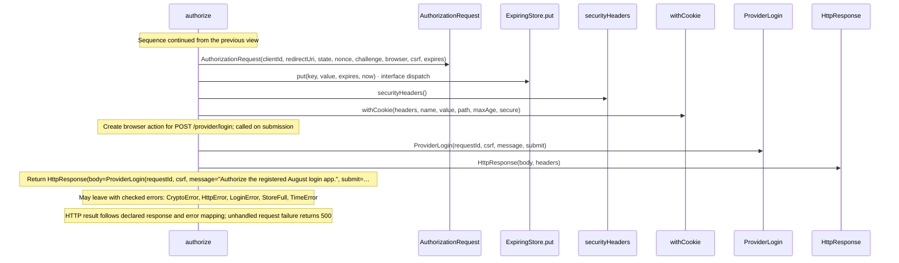
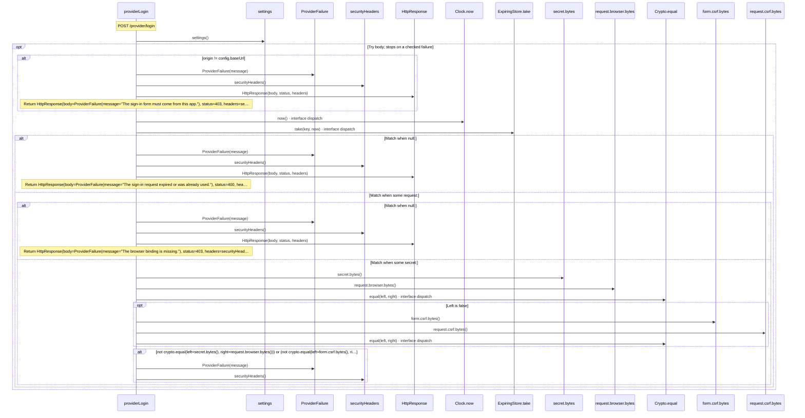
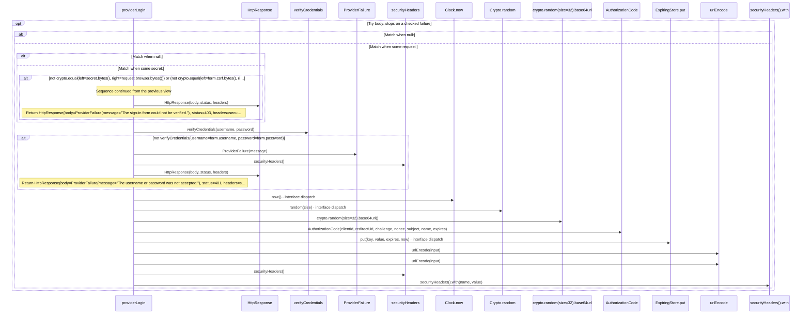
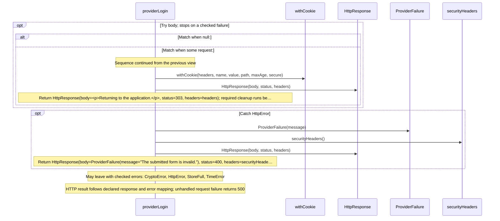

# provider/authorization.aug diagrams

[OpenID Connect login application](../index.md)

[Project overview](../diagrams/index.md) · [Compiled explanation](authorization.md)

## Class interactions

```mermaid
flowchart TD
    n0["securityHeaders · common/headers.aug"]
    n1["withCookie · common/headers.aug"]
    n2["settings · common/settings.aug"]
    n3["ExpiringStore · package/@git/url_0eb7c89453c87681ed15@0.0.0-git.a39fc582565d4fca40be4f75fa304d71adc69301/store.aug"]
    n4["urlEncode · package/@git/url_897efafd565158fc4908@0.0.0-git.a39fc582565d4fca40be4f75fa304d71adc69301/contracts.aug"]
    n5["Crypto · package/@git/url_9ef654c66d34ab8f5527@0.0.0-git.b14a0f9aa41f1ce58bd51133bcdc424033e40d40/contracts.aug"]
    n6["Clock · package/@git/url_c092cd151499c4e1d8a1@0.0.0-git.a39fc582565d4fca40be4f75fa304d71adc69301/contracts.aug"]
    n7["authorize · provider/authorization.aug"]
    n8["providerLogin · provider/authorization.aug"]
    n9["AuthorizationCode · provider/contracts.aug"]
    n10["AuthorizationRequest · provider/contracts.aug"]
    n11["LoginError · provider/contracts.aug"]
    n12["verifyCredentials · provider/credentials.aug"]
    n13["ProviderFailure · provider/views.aug"]
    n14["ProviderLogin · provider/views.aug"]
    n7 -->|"calls"| n0
    n7 -->|"calls"| n1
    n7 -->|"calls"| n2
    n7 -->|"calls"| n3
    n7 -->|"depends on"| n3
    n7 -->|"calls"| n5
    n7 -->|"depends on"| n5
    n7 -->|"calls"| n6
    n7 -->|"depends on"| n6
    n7 -->|"defers HTTP call to"| n8
    n7 -->|"calls"| n10
    n7 -->|"calls"| n11
    n7 -->|"calls"| n14
    n8 -->|"calls"| n0
    n8 -->|"calls"| n1
    n8 -->|"calls"| n2
    n8 -->|"calls"| n3
    n8 -->|"depends on"| n3
    n8 -->|"calls"| n4
    n8 -->|"calls"| n5
    n8 -->|"depends on"| n5
    n8 -->|"calls"| n6
    n8 -->|"depends on"| n6
    n8 -->|"calls"| n9
    n8 -->|"calls"| n12
    n8 -->|"calls"| n13
```

## API calls

```mermaid
flowchart TD
    n0["securityHeaders · common/headers.aug"]
    n1["withCookie · common/headers.aug"]
    n2["settings · common/settings.aug"]
    n3["ExpiringStore.put · package/@git/url_0eb7c89453c87681ed15@0.0.0-git.a39fc582565d4fca40be4f75fa304d71adc69301/store.aug"]
    n4["ExpiringStore.take · package/@git/url_0eb7c89453c87681ed15@0.0.0-git.a39fc582565d4fca40be4f75fa304d71adc69301/store.aug"]
    n5["urlEncode · package/@git/url_897efafd565158fc4908@0.0.0-git.a39fc582565d4fca40be4f75fa304d71adc69301/contracts.aug"]
    n6["Crypto.decodeBase64url · package/@git/url_9ef654c66d34ab8f5527@0.0.0-git.b14a0f9aa41f1ce58bd51133bcdc424033e40d40/con…"]
    n7["Crypto.equal · package/@git/url_9ef654c66d34ab8f5527@0.0.0-git.b14a0f9aa41f1ce58bd51133bcdc424033e40d40/contracts.aug"]
    n8["Crypto.random · package/@git/url_9ef654c66d34ab8f5527@0.0.0-git.b14a0f9aa41f1ce58bd51133bcdc424033e40d40/contracts.aug"]
    n9["Clock.now · package/@git/url_c092cd151499c4e1d8a1@0.0.0-git.a39fc582565d4fca40be4f75fa304d71adc69301/contracts.aug"]
    n10["authorize · provider/authorization.aug"]
    n11["providerLogin · provider/authorization.aug"]
    n12["AuthorizationCode · provider/contracts.aug"]
    n13["AuthorizationRequest · provider/contracts.aug"]
    n14["LoginError · provider/contracts.aug"]
    n15["verifyCredentials · provider/credentials.aug"]
    n16["ProviderFailure · provider/views.aug"]
    n17["ProviderLogin · provider/views.aug"]
    n10 -->|"calls"| n0
    n10 -->|"calls"| n1
    n10 -->|"calls"| n2
    n10 -->|"calls"| n3
    n10 -->|"calls"| n6
    n10 -->|"calls"| n8
    n10 -->|"calls"| n9
    n10 -->|"defers HTTP call to"| n11
    n10 -->|"calls"| n13
    n10 -->|"calls"| n14
    n10 -->|"calls"| n17
    n11 -->|"calls"| n0
    n11 -->|"calls"| n1
    n11 -->|"calls"| n2
    n11 -->|"calls"| n3
    n11 -->|"calls"| n4
    n11 -->|"calls"| n5
    n11 -->|"calls"| n7
    n11 -->|"calls"| n8
    n11 -->|"calls"| n9
    n11 -->|"calls"| n12
    n11 -->|"calls"| n15
    n11 -->|"calls"| n16
```

## Sequences

Call arrows identify checked targets; loop and branch frames determine when they run. Open that target’s module to follow its implementation. Branches describe alternatives; loops describe repeated work. Native calls and interface dispatch stop at their declared contracts. Exit notes end that path; enclosing recovery and cleanup remain visible.

### authorize {#sequence-authorize}

::: spec-paragraph specification-paragraph-1
[Source](authorization.md#source-L12)
:::

#### Sequence 1 of 2 (continued)

```mermaid
sequenceDiagram
    participant p0 as authorize
    participant p1 as settings
    participant p2 as LoginError
    participant p3 as state.isToken
    participant p4 as nonce.isToken
    participant p5 as code_challenge.length
    participant p6 as Crypto.decodeBase64url
    participant p7 as crypto.decodeBase64url(input=code_challenge).length
    participant p8 as Crypto.random
    participant p9 as crypto.random(size=32).base64url
    participant p10 as Clock.now
    Note over p0: GET /provider/authorize
    p0->>p1: settings()
    opt Left is false
    end
    opt Left is false
    end
    opt Left is false
    end
    alt client_id != config.clientId or redirect_uri != config.callback or response_type != #34;code#34; or code_challenge_method !…
    p0->>p2: LoginError()
    Note over p0: Raise checked failure LoginError()#59; required cleanup runs before exit
    end
    opt Left is true
    end
    alt requestedScope != #34;openid#34; and requestedScope != #34;openid profile#34;
    p0->>p2: LoginError()
    Note over p0: Raise checked failure LoginError()#59; required cleanup runs before exit
    end
    p0->>p3: state.isToken(min, max)
    opt Left is false
    p0->>p4: nonce.isToken(min, max)
    end
    opt Left is false
    p0->>p5: code_challenge.length()
    end
    alt not state.isToken(min=43, max=128)) or (not nonce.isToken(min=43, max=128)) or code_challenge.length() != 43
    p0->>p2: LoginError()
    Note over p0: Raise checked failure LoginError()#59; required cleanup runs before exit
    end
    opt Try body#59; stops on a checked failure
    p0->>p6: decodeBase64url(input) · interface dispatch
    p0->>p7: crypto.decodeBase64url(input=code_challenge).length()
    alt crypto.decodeBase64url(input=code_challenge).length() != 32
    p0->>p2: LoginError()
    Note over p0: Raise checked failure LoginError()#59; required cleanup runs before exit
    end
    end
    opt Catch CryptoError
    p0->>p2: LoginError()
    Note over p0: Raise checked failure LoginError()#59; required cleanup runs before exit
    end
    p0->>p8: random(size) · interface dispatch
    p0->>p9: crypto.random(size=32).base64url()
    p0->>p8: random(size) · interface dispatch
    p0->>p9: crypto.random(size=32).base64url()
    p0->>p8: random(size) · interface dispatch
    p0->>p9: crypto.random(size=32).base64url()
    p0->>p10: now() · interface dispatch
```

#### Sequence 2 of 2 (continued)

### providerLogin {#sequence-providerLogin}

::: spec-paragraph specification-paragraph-2
[Source](authorization.md#source-L35)
:::

#### Sequence 1 of 3 (continued)

#### Sequence 2 of 3 (continued)

#### Sequence 3 of 3 (continued)

## Called contracts

- [securityHeaders](../common/headers-diagrams.md#sequence-securityHeaders) — common/headers.aug
- [withCookie](../common/headers-diagrams.md#sequence-withCookie) — common/headers.aug
- [settings](../common/settings-diagrams.md#sequence-settings) — common/settings.aug
- [ExpiringStore](../dependencies/packages/%40git/url_0eb7c89453c87681ed15/0.0.0-git.a39fc582565d4fca40be4f75fa304d71adc69301/store-diagrams.md) — package/@git/url\_0eb7c89453c87681ed15@0.0.0-git.a39fc582565d4fca40be4f75fa304d71adc69301/store.aug
- [ExpiringStore.put](../dependencies/packages/%40git/url_0eb7c89453c87681ed15/0.0.0-git.a39fc582565d4fca40be4f75fa304d71adc69301/store-diagrams.md#sequence-ExpiringStore.put) — package/@git/url\_0eb7c89453c87681ed15@0.0.0-git.a39fc582565d4fca40be4f75fa304d71adc69301/store.aug
- [ExpiringStore.take](../dependencies/packages/%40git/url_0eb7c89453c87681ed15/0.0.0-git.a39fc582565d4fca40be4f75fa304d71adc69301/store-diagrams.md#sequence-ExpiringStore.take) — package/@git/url\_0eb7c89453c87681ed15@0.0.0-git.a39fc582565d4fca40be4f75fa304d71adc69301/store.aug
- [urlEncode](../dependencies/packages/%40git/url_897efafd565158fc4908/0.0.0-git.a39fc582565d4fca40be4f75fa304d71adc69301/contracts-diagrams.md#sequence-urlEncode) — package/@git/url\_897efafd565158fc4908@0.0.0-git.a39fc582565d4fca40be4f75fa304d71adc69301/contracts.aug
- [Crypto](../dependencies/packages/%40git/url_9ef654c66d34ab8f5527/0.0.0-git.b14a0f9aa41f1ce58bd51133bcdc424033e40d40/contracts-diagrams.md) — package/@git/url\_9ef654c66d34ab8f5527@0.0.0-git.b14a0f9aa41f1ce58bd51133bcdc424033e40d40/contracts.aug
- [Crypto.decodeBase64url](../dependencies/packages/%40git/url_9ef654c66d34ab8f5527/0.0.0-git.b14a0f9aa41f1ce58bd51133bcdc424033e40d40/contracts-diagrams.md#sequence-Crypto.decodeBase64url) — package/@git/url\_9ef654c66d34ab8f5527@0.0.0-git.b14a0f9aa41f1ce58bd51133bcdc424033e40d40/contracts.aug
- [Crypto.equal](../dependencies/packages/%40git/url_9ef654c66d34ab8f5527/0.0.0-git.b14a0f9aa41f1ce58bd51133bcdc424033e40d40/contracts-diagrams.md#sequence-Crypto.equal) — package/@git/url\_9ef654c66d34ab8f5527@0.0.0-git.b14a0f9aa41f1ce58bd51133bcdc424033e40d40/contracts.aug
- [Crypto.random](../dependencies/packages/%40git/url_9ef654c66d34ab8f5527/0.0.0-git.b14a0f9aa41f1ce58bd51133bcdc424033e40d40/contracts-diagrams.md#sequence-Crypto.random) — package/@git/url\_9ef654c66d34ab8f5527@0.0.0-git.b14a0f9aa41f1ce58bd51133bcdc424033e40d40/contracts.aug
- [Clock](../dependencies/packages/%40git/url_c092cd151499c4e1d8a1/0.0.0-git.a39fc582565d4fca40be4f75fa304d71adc69301/contracts-diagrams.md) — package/@git/url\_c092cd151499c4e1d8a1@0.0.0-git.a39fc582565d4fca40be4f75fa304d71adc69301/contracts.aug
- [Clock.now](../dependencies/packages/%40git/url_c092cd151499c4e1d8a1/0.0.0-git.a39fc582565d4fca40be4f75fa304d71adc69301/contracts-diagrams.md#sequence-Clock.now) — package/@git/url\_c092cd151499c4e1d8a1@0.0.0-git.a39fc582565d4fca40be4f75fa304d71adc69301/contracts.aug
- [providerLogin](authorization-diagrams.md#sequence-providerLogin) — provider/authorization.aug
- [AuthorizationCode](contracts-diagrams.md#sequence-AuthorizationCode-20-constructor) — provider/contracts.aug
- [AuthorizationRequest](contracts-diagrams.md#sequence-AuthorizationRequest-20-constructor) — provider/contracts.aug
- [LoginError](contracts-diagrams.md#sequence-LoginError-20-constructor) — provider/contracts.aug
- [verifyCredentials](credentials-diagrams.md#sequence-verifyCredentials) — provider/credentials.aug
- [ProviderFailure](views-diagrams.md#sequence-ProviderFailure) — provider/views.aug
- [ProviderLogin](views-diagrams.md#sequence-ProviderLogin) — provider/views.aug
