# provider/contracts.aug diagrams

[OpenID Connect login application](../index.md)

[Project overview](../diagrams/index.md) · [Compiled explanation](contracts.md)

## Class interactions

```mermaid
flowchart TD
    n0["AccessGrant · provider/contracts.aug"]
    n1["AuthorizationCode · provider/contracts.aug"]
    n2["AuthorizationRequest · provider/contracts.aug"]
    n3["CodeError · provider/contracts.aug"]
    n4["IdClaims · provider/contracts.aug"]
    n5["LoginError · provider/contracts.aug"]
    n6["LoginForm · provider/contracts.aug"]
    n7["OAuthError · provider/contracts.aug"]
    n8["TokenForm · provider/contracts.aug"]
    n9["TokenResponse · provider/contracts.aug"]
    n10["UserInfo · provider/contracts.aug"]

```

## API calls

No relationships at this level.

## Sequences

Call arrows identify checked targets; loop and branch frames determine when they run. Open that target’s module to follow its implementation. Branches describe alternatives; loops describe repeated work. Native calls and interface dispatch stop at their declared contracts. Exit notes end that path; enclosing recovery and cleanup remain visible.

### AuthorizationRequest constructor {#sequence-AuthorizationRequest-20-constructor}

::: spec-paragraph specification-paragraph-1
[Source](contracts.md#source-L3)
:::

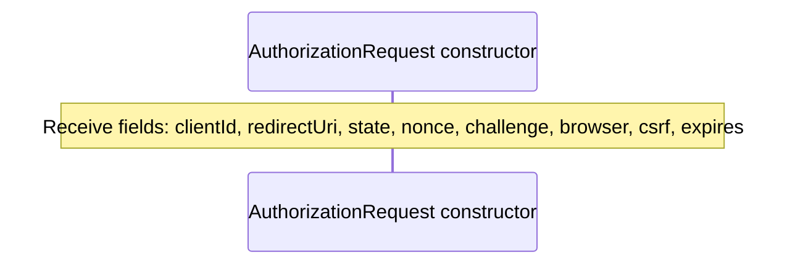

### AuthorizationCode constructor {#sequence-AuthorizationCode-20-constructor}

::: spec-paragraph specification-paragraph-2
[Source](contracts.md#source-L5)
:::

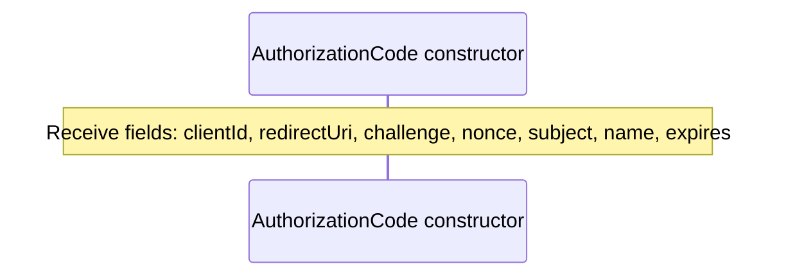

### IdClaims constructor {#sequence-IdClaims-20-constructor}

::: spec-paragraph specification-paragraph-3
[Source](contracts.md#source-L6)
:::

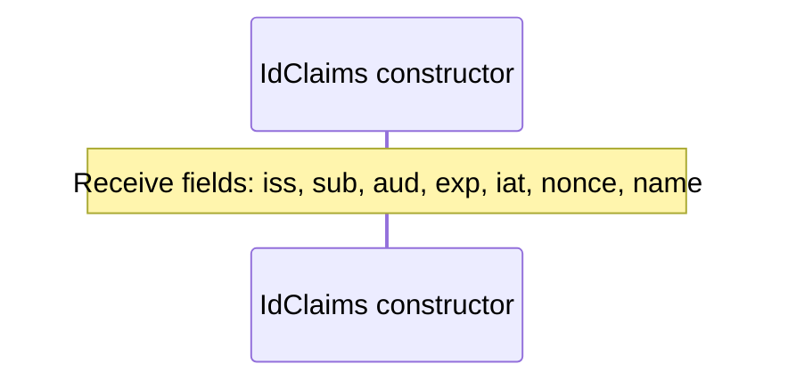

### AccessGrant constructor {#sequence-AccessGrant-20-constructor}

::: spec-paragraph specification-paragraph-4
[Source](contracts.md#source-L7)
:::

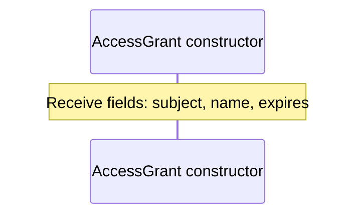

### TokenResponse constructor {#sequence-TokenResponse-20-constructor}

::: spec-paragraph specification-paragraph-5
[Source](contracts.md#source-L8)
:::

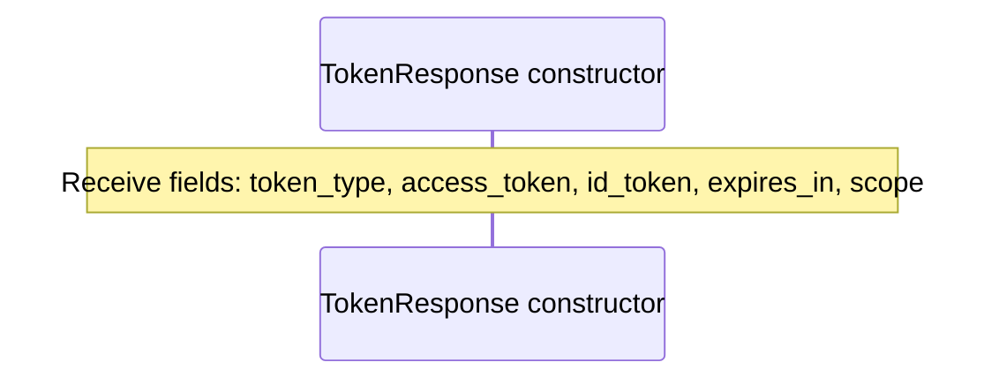

### OAuthError constructor {#sequence-OAuthError-20-constructor}

::: spec-paragraph specification-paragraph-6
[Source](contracts.md#source-L9)
:::

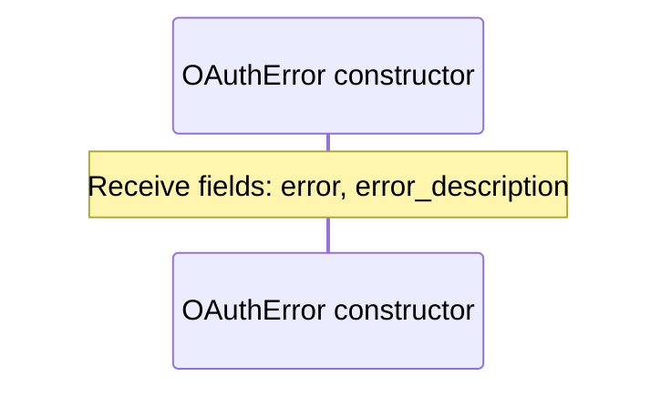

### TokenForm constructor {#sequence-TokenForm-20-constructor}

::: spec-paragraph specification-paragraph-7
[Source](contracts.md#source-L10)
:::

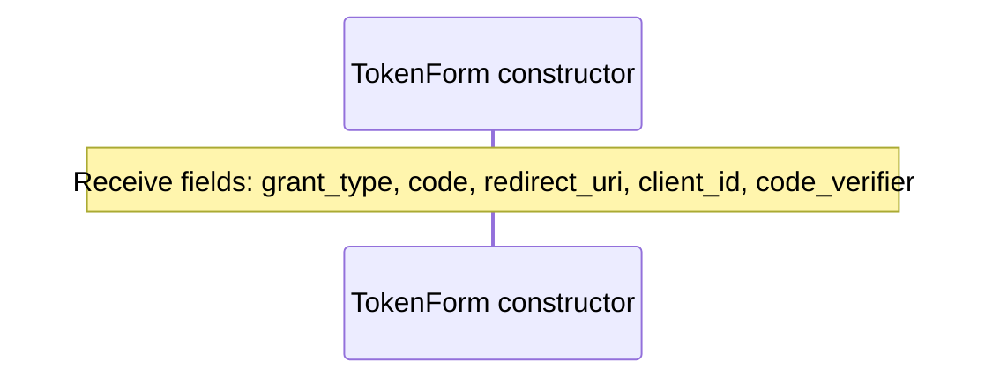

### LoginForm constructor {#sequence-LoginForm-20-constructor}

::: spec-paragraph specification-paragraph-8
[Source](contracts.md#source-L11)
:::

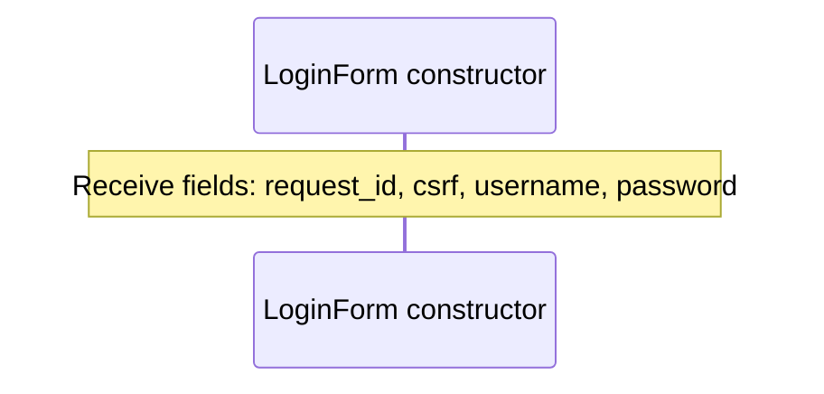

### UserInfo constructor {#sequence-UserInfo-20-constructor}

::: spec-paragraph specification-paragraph-9
[Source](contracts.md#source-L12)
:::

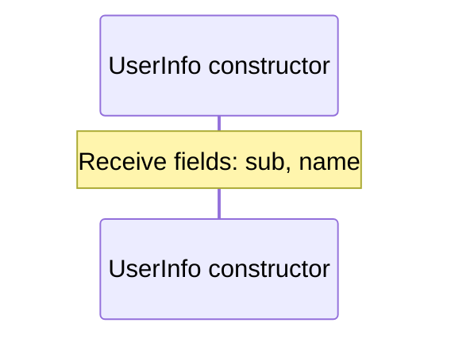

### LoginError constructor {#sequence-LoginError-20-constructor}

::: spec-paragraph specification-paragraph-10
[Source](contracts.md#source-L13)
:::

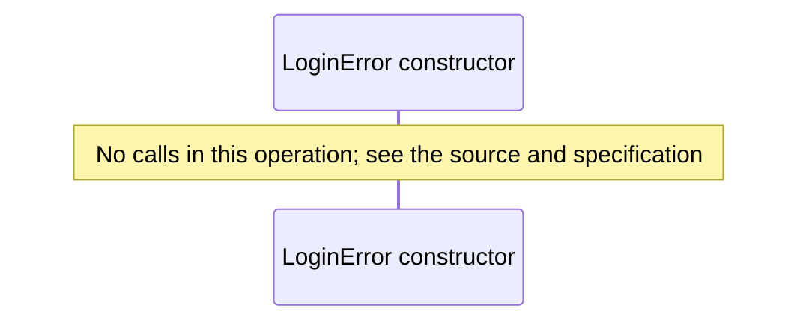

### CodeError constructor {#sequence-CodeError-20-constructor}

::: spec-paragraph specification-paragraph-11
[Source](contracts.md#source-L15)
:::

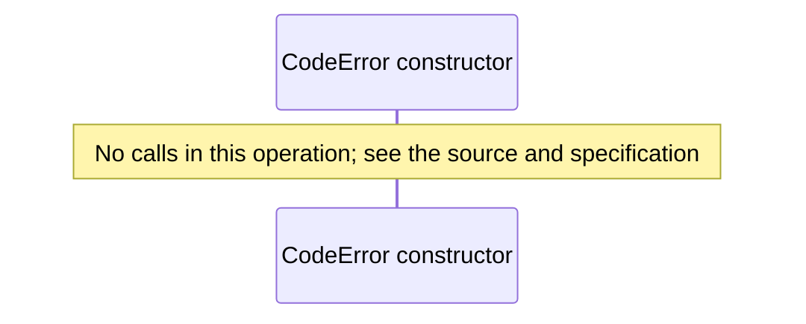

