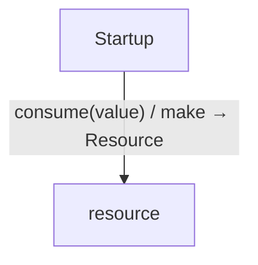
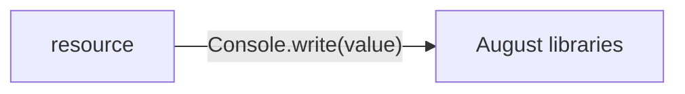

# Move ownership diagrams

[Move ownership](../index.md)

Start here to see what moves between the application’s folders. Each arrow names an operation’s inputs and the result it returns to its caller. Open a folder for the next level of detail. Expand the contract list for complete types and dependency links.

## Data flow

### Package boundaries

::: details resource package calls

:::

::: details Data crossing these boundaries (3 contracts)

| From | To | Operation and inputs | Result |
| --- | --- | --- | --- |
| Startup | resource | [consume](../resource.md) · value: Resource | void |
| Startup | resource | [make](../resource.md) | Resource |
| resource | August libraries | [Console.write](../dependencies/august/0.23.0/io/contracts.md) · value: string · interface dispatch | void |

:::

## Open a module

| Module | Read |
| --- | --- |
| main.aug | [Flow and sequences](../main-diagrams.md) · [Explanation](../main.md) |
| resource.aug | [Flow and sequences](../resource-diagrams.md) · [Explanation](../resource.md) |

These are static call boundaries, not a request trace. Interface implementations and foreign internals stop at their checked contracts. Dotted arrows defer a callback or browser action. Imports alone do not imply a call.
