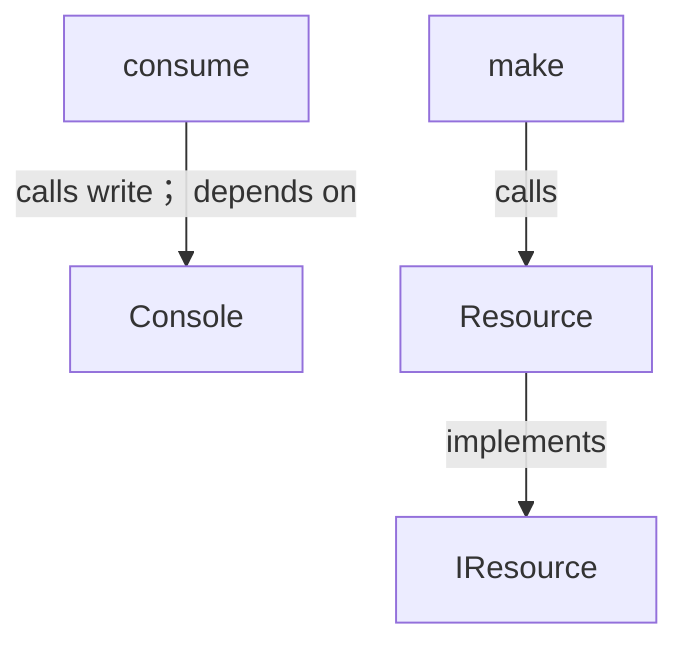
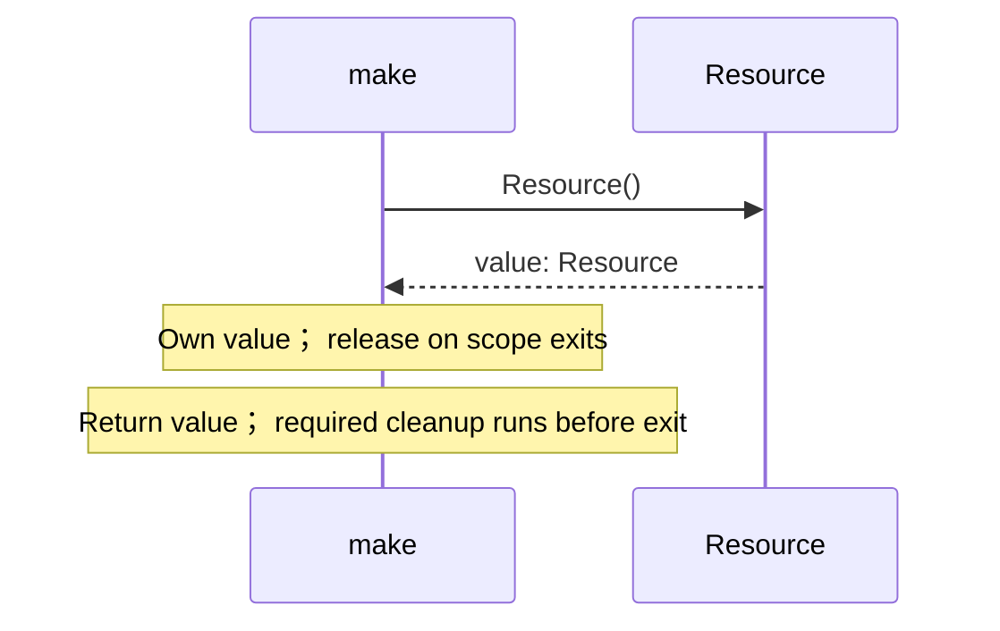
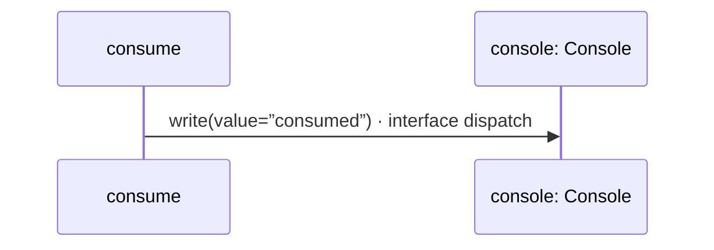

# resource.aug diagrams

[Move ownership](index.md)

[Project overview](diagrams/index.md) · [Compiled explanation](resource.md)

## Class interactions

## Sequences

Call arrows identify checked targets; loop and branch frames determine when they run. Open that target’s module to follow its implementation. Branches describe alternatives; loops describe repeated work. Native calls and interface dispatch stop at their declared contracts. Exit notes end that path; enclosing recovery and cleanup remain visible.

### Resource constructor {#sequence-Resource-20-constructor}

::: spec-paragraph specification-paragraph-1
[Source](resource.md#source-L3)
:::

[Explanation](resource.md).

### Resource.drop {#sequence-Resource.drop}

::: spec-paragraph specification-paragraph-2
[Source](resource.md#source-L4)
:::

[Explanation](resource.md).

### make {#sequence-make}

::: spec-paragraph specification-paragraph-3
[Source](resource.md#source-L11)
:::

### consume {#sequence-consume}

::: spec-paragraph specification-paragraph-4
[Source](resource.md#source-L15)
:::

## Called contracts

- [Console](dependencies/august/0.23.0/io/contracts-diagrams.md) — august/io/contracts.aug
- [Console.write](dependencies/august/0.23.0/io/contracts-diagrams.md#sequence-Console.write) — august/io/contracts.aug
- [IResource](resource-diagrams.md) — resource.aug
- [Resource](resource-diagrams.md#sequence-Resource-20-constructor) — resource.aug
