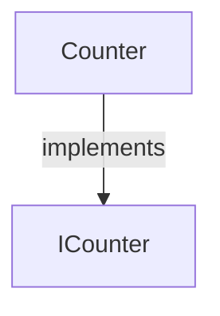
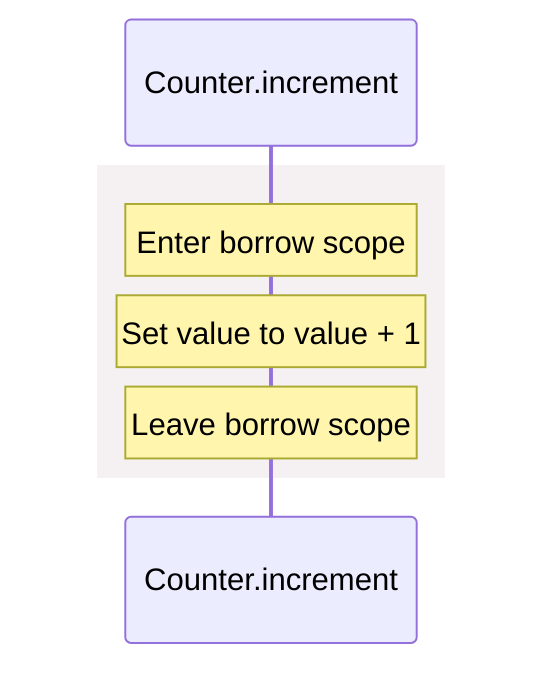

# counter.aug diagrams

[Read access and mutable borrows](index.md)

[Project overview](diagrams/index.md) · [Compiled explanation](counter.md)

## Class interactions

## Sequences

Call arrows identify checked targets; loop and branch frames determine when they run. Open that target’s module to follow its implementation. Branches describe alternatives; loops describe repeated work. Native calls and interface dispatch stop at their declared contracts. Exit notes end that path; enclosing recovery and cleanup remain visible.

### Counter constructor {#sequence-Counter-20-constructor}

::: spec-paragraph specification-paragraph-1
[Source](counter.md#source-L2)
:::

Receive fields: value. [Explanation](counter.md).

### Counter.increment {#sequence-Counter.increment}

::: spec-paragraph specification-paragraph-2
[Source](counter.md#source-L3)
:::

### Counter.read {#sequence-Counter.read}

::: spec-paragraph specification-paragraph-3
[Source](counter.md#source-L8)
:::

Return value; required cleanup runs before exit. [Explanation](counter.md).

### ICounter.increment {#sequence-ICounter.increment}

::: spec-paragraph specification-paragraph-4
[Source](counter.md#source-L13)
:::

Interface contract; implementation selected at runtime. [Explanation](counter.md).

### ICounter.read {#sequence-ICounter.read}

::: spec-paragraph specification-paragraph-5
[Source](counter.md#source-L14)
:::

Interface contract; implementation selected at runtime. [Explanation](counter.md).

## Called contracts

- [ICounter](counter-diagrams.md) — counter.aug
