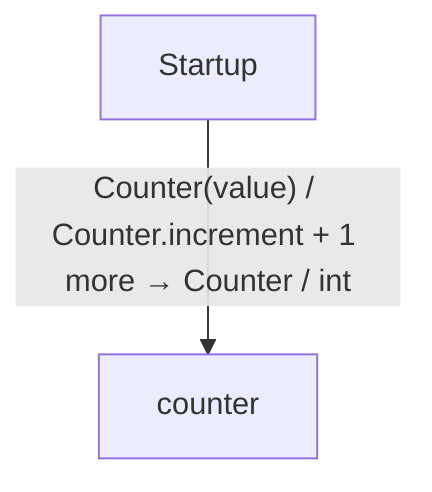

# Read access and mutable borrows diagrams

[Read access and mutable borrows](../index.md)

Start here to see what moves between the application’s folders. Each arrow names an operation’s inputs and the result it returns to its caller. Open a folder for the next level of detail. Expand the contract list for complete types and dependency links.

## Data flow

::: details Data crossing these boundaries (3 contracts)

| From | To | Operation and inputs | Result |
| --- | --- | --- | --- |
| Startup | counter | [Counter](../counter.md) · value: int | Counter |
| Startup | counter | [Counter.increment](../counter.md) | void |
| Startup | counter | [Counter.read](../counter.md) | int |

:::

## Open a module

| Module | Read |
| --- | --- |
| counter.aug | [Flow and sequences](../counter-diagrams.md) · [Explanation](../counter.md) |
| main.aug | [Flow and sequences](../main-diagrams.md) · [Explanation](../main.md) |

These are static call boundaries, not a request trace. Interface implementations and foreign internals stop at their checked contracts. Dotted arrows defer a callback or browser action. Imports alone do not imply a call.
