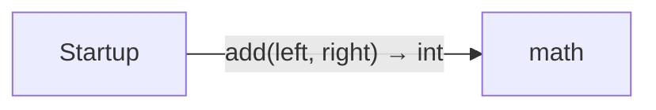

# Use a package diagrams

[Use a package](../index.md)

Start here to see what moves between the application’s folders. Each arrow names an operation’s inputs and the result it returns to its caller. Open a folder for the next level of detail. Expand the contract list for complete types and dependency links.

## Data flow

No calls cross the source files in this view. Follow local operations in the file sequences below.

### Package boundaries

::: details Data crossing these boundaries (1 contracts)

| From | To | Operation and inputs | Result |
| --- | --- | --- | --- |
| Startup | math | [add](../dependencies/packages/%40example/aug-math/0.1.0/arithmetic.md) · left: int, right: int | int |

:::

## Open a module

| Module | Read |
| --- | --- |
| main.aug | [Flow and sequences](../main-diagrams.md) · [Explanation](../main.md) |

These are static call boundaries, not a request trace. Interface implementations and foreign internals stop at their checked contracts. Dotted arrows defer a callback or browser action. Imports alone do not imply a call.
