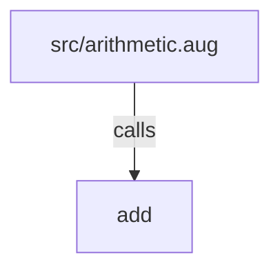

# src/arithmetic.aug diagrams

[Create a package](../index.md)

[Project overview](../diagrams/index.md) · [Compiled explanation](arithmetic.md)

::: details Call relationships

:::

## Sequences

Call arrows identify checked targets; loop and branch frames determine when they run. Open that target’s module to follow its implementation. Branches describe alternatives; loops describe repeated work. Native calls and interface dispatch stop at their declared contracts. Exit notes end that path; enclosing recovery and cleanup remain visible.

### add {#sequence-add}

::: spec-paragraph specification-paragraph-1
[Source](arithmetic.md#source-L3)
:::

Return left + right; required cleanup runs before exit. [Explanation](arithmetic.md).

## Called contracts

- [add](arithmetic-diagrams.md#sequence-add) — src/arithmetic.aug
