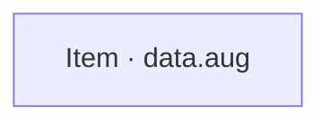
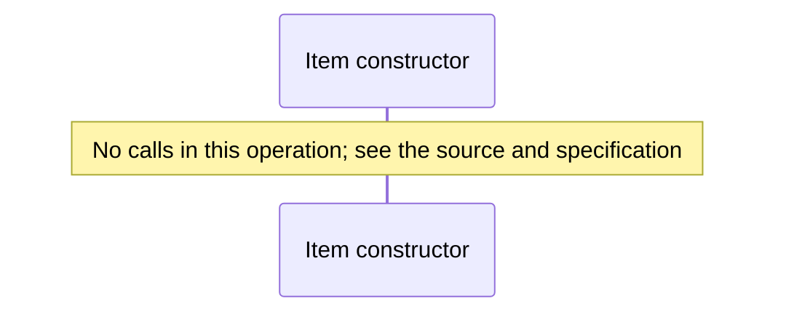

# Record allocation benchmark diagrams

[Record allocation benchmark](index.md)

[Project overview](diagrams/index.md) · [Compiled explanation](data.md)

### Class interactions

### API calls

No relationships at this level.

### Sequences

Call arrows identify checked targets; loop and branch frames determine when they run. Open that target’s module to follow its implementation. Branches describe alternatives; loops describe repeated work. Native calls and interface dispatch stop at their declared contracts. Exit notes end that path; enclosing recovery and cleanup remain visible.

#### Item constructor {#sequence-Item-20-constructor}

::: spec-paragraph specification-paragraph-1
[Source](data.md#source-L2)
:::

