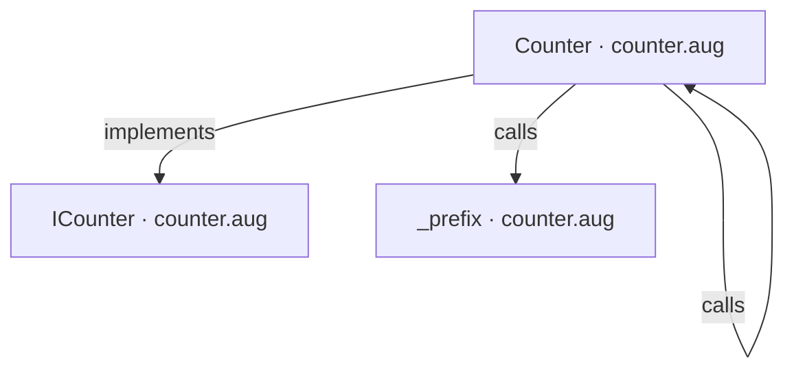
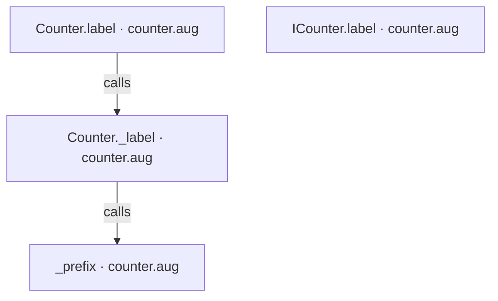
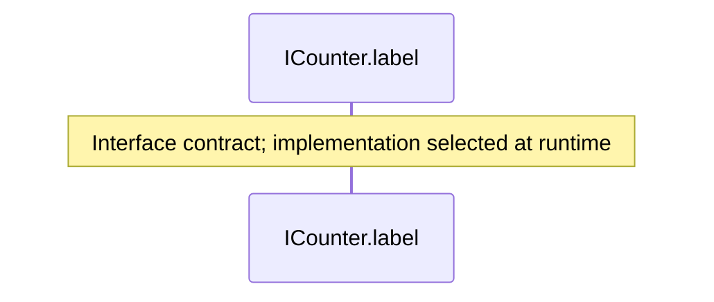
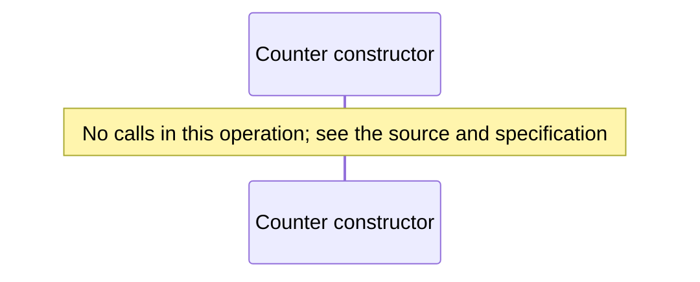
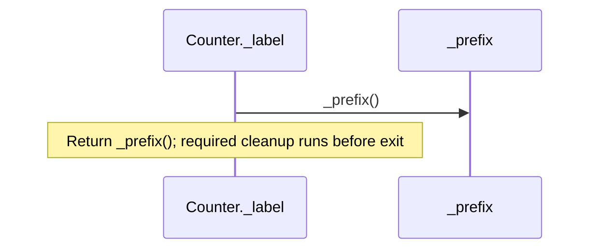
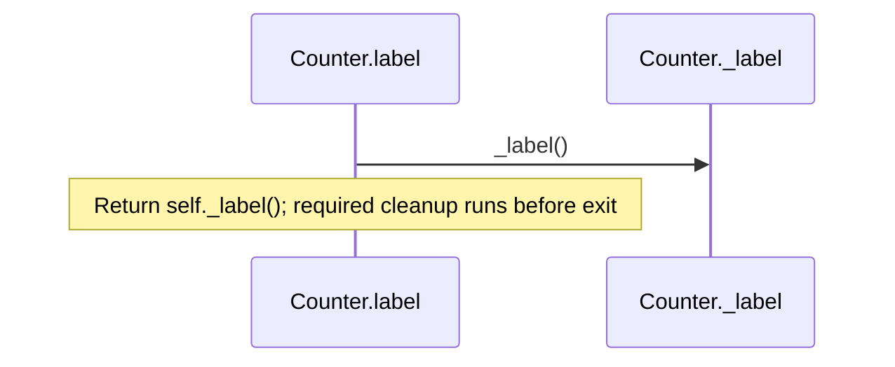
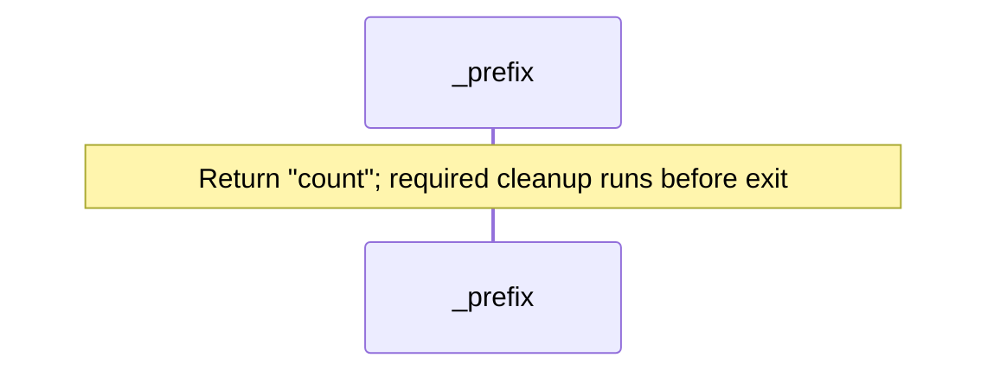

# Private state and helpers diagrams

[Private state and helpers](index.md)

[Project overview](diagrams/index.md) · [Compiled explanation](counter.md)

### Class interactions

### API calls

### Sequences

Call arrows identify checked targets; loop and branch frames determine when they run. Open that target’s module to follow its implementation. Branches describe alternatives; loops describe repeated work. Native calls and interface dispatch stop at their declared contracts. Exit notes end that path; enclosing recovery and cleanup remain visible.

#### ICounter.label {#sequence-ICounter.label}

::: spec-paragraph specification-paragraph-1
[Source](counter.md#source-L3)
:::

#### Counter constructor {#sequence-Counter-20-constructor}

::: spec-paragraph specification-paragraph-2
[Source](counter.md#source-L5)
:::

#### Counter.\_label {#sequence-Counter._label}

::: spec-paragraph specification-paragraph-3
[Source](counter.md#source-L6)
:::

#### Counter.label {#sequence-Counter.label}

::: spec-paragraph specification-paragraph-4
[Source](counter.md#source-L9)
:::

#### \_prefix {#sequence-_prefix}

::: spec-paragraph specification-paragraph-5
[Source](counter.md#source-L13)
:::

### Called contracts

- [Counter.\_label](counter-diagrams.md#sequence-Counter._label) — counter.aug
- [ICounter](counter-diagrams.md) — counter.aug
- [\_prefix](counter-diagrams.md#sequence-_prefix) — counter.aug
