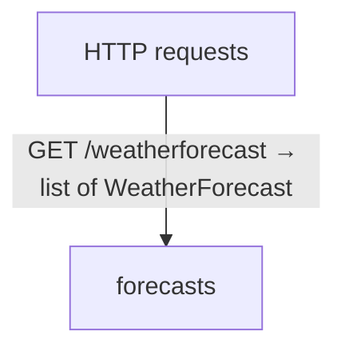

# Weather API diagrams

[Weather API](../index.md)

Start here to see what moves between the application’s folders. Each arrow names an operation’s inputs and the result it returns to its caller. Open a folder for the next level of detail. Expand the contract list for complete types and dependency links.

## Data flow

::: details Data crossing these boundaries (1 contracts)

| From | To | Operation and inputs | Result |
| --- | --- | --- | --- |
| HTTP requests | forecasts | [GET /weatherforecast](../forecasts.md#symbol-weatherForecast) · HTTP endpoint | List\<WeatherForecast\> |

:::

## Open a module

| Module | Read |
| --- | --- |
| forecasts.aug | [Flow and sequences](../forecasts-diagrams.md) · [Explanation](../forecasts.md) |
| main.aug | [Flow and sequences](../main-diagrams.md) · [Explanation](../main.md) |

These are static call boundaries, not a request trace. Interface implementations and foreign internals stop at their checked contracts. Dotted arrows defer a callback or browser action. Imports alone do not imply a call.

## HTTP APIs

| API | Operation |
| --- | --- |
| GET /weatherforecast | [weatherForecast](../forecasts-diagrams.md#sequence-weatherForecast) |
