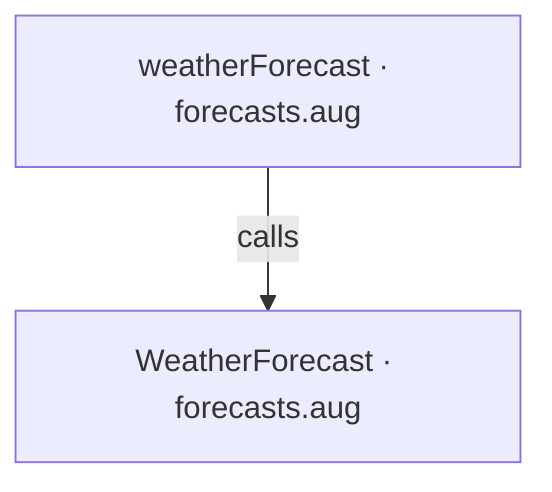
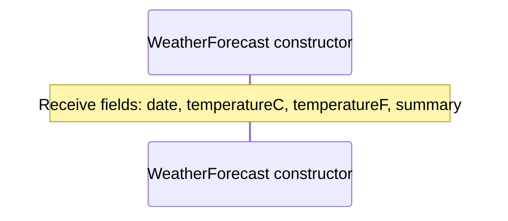
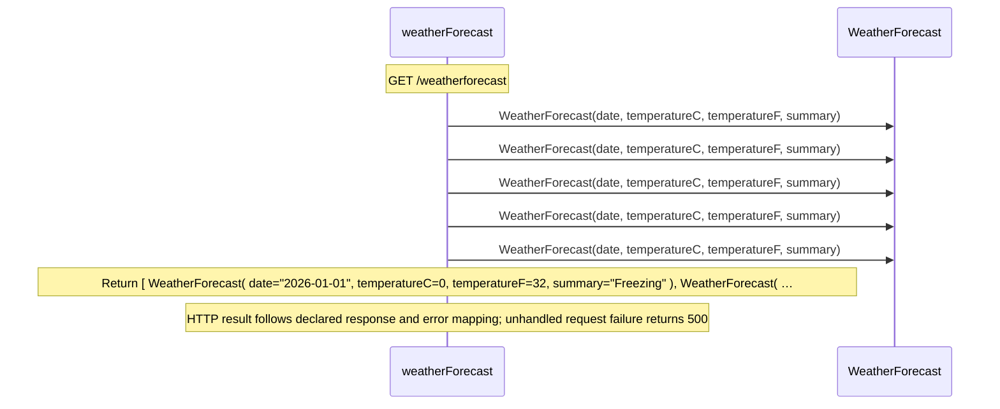

# forecasts.aug diagrams

[Weather API](index.md)

[Project overview](diagrams/index.md) · [Compiled explanation](forecasts.md)

## Class interactions

## API calls

## Sequences

Call arrows identify checked targets; loop and branch frames determine when they run. Open that target’s module to follow its implementation. Branches describe alternatives; loops describe repeated work. Native calls and interface dispatch stop at their declared contracts. Exit notes end that path; enclosing recovery and cleanup remain visible.

### WeatherForecast constructor {#sequence-WeatherForecast-20-constructor}

::: spec-paragraph specification-paragraph-1
[Source](forecasts.md#source-L3)
:::

### weatherForecast {#sequence-weatherForecast}

::: spec-paragraph specification-paragraph-2
[Source](forecasts.md#source-L6)
:::

## Called contracts

- [WeatherForecast](forecasts-diagrams.md#sequence-WeatherForecast-20-constructor) — forecasts.aug
