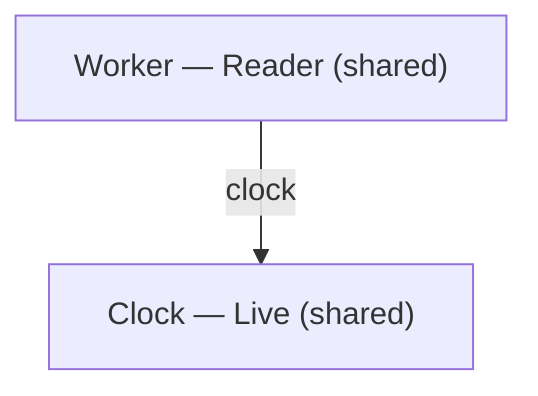

# Reuse service wiring

Use a composition when several applications or test groups need the same explicit bindings. Each file still imports its own dependencies. An include selects the listed providers before startup; it does not scan for implementations or replace another binding.

The editor completes included compositions. `aug graph` shows which providers the checked bindings select.

## Declare the services

Save the contracts, providers and compositions in `services.aug`:

```aug project=reusable-services file=services.aug
interface Clock:
    now() returns int

Fixed() implements Clock:
    now():
        return 7

Live() implements Clock:
    now():
        return 9

interface Worker:
    read() returns int

Reader(resolve Clock clock) implements Worker:
    read():
        return clock.now()

composition Services:
    implement Clock with Live
    implement Worker with Reader

composition TestServices:
    implement Clock with Fixed
    implement Worker with Reader

test Reader subject:
    when isolated:
        include TestServices
        subject = Reader()
        it reads:
            assert(condition=subject.read() == 7)
```

`Reader` receives its clock through its constructor header. The application selects `Live`; the same-file test selects `Fixed`. Both compositions select the same reader. The test has its own wiring and fresh process, so it does not run application startup or inherit its providers.

Save the application entry in `main.aug`:

```aug project=reusable-services file=main.aug
import Services and Worker from services

include Services
resolve Worker to worker
print(value=worker.read())
```

`aug run` prints `9`. `aug test` runs the test that expects `7`. To share the compositions across folders or packages, list them in the appropriate `export.aug` and import them normally. In the editor, completing `include Services` can add that import. Private and unexported compositions remain inside their allowed scope; includes are suggested in main and test setup.

## Inspect the selected providers

The graph command checks existing source without running the application, executing tests or installing dependencies:

```sh
aug graph --composition
aug graph --composition --json
aug graph --composition --mermaid
```

The human report lists each binding’s provider, lifetime and constructor dependencies. JSON also includes source and include locations, statefulness, scope requirements, a source/configuration revision and the selected program. `checked` means the selected program passed static checking; `behavioralChecks` remains `not-run`.

Mermaid output for this application has this shape:



The arrow means `Reader` needs the selected `Clock` through its `clock` constructor input. Lifetimes come from the checker, including transitive state and scoped dependencies. This example’s adapters are stateless and use shared bindings by default.

Use a case id from `aug test --list --json` to inspect test wiring:

```sh
aug graph --composition --case services.aug:Reader:isolated:reads --json
```

That report selects `Fixed` instead of `Live`. It checks the chosen test program; it does not claim that application startup passed checking. Both reports cover the bindings of the selected program, not external callers or future dynamic execution.

## Resolve a conflict

Including both `Services` and `TestServices` in one root creates duplicate `Clock` and `Worker` bindings. The compiler reports the conflicting include and links the earlier selection. Choose one composition, or create another composition with the providers you intend. Includes do not override bindings. A rejected graph exits with status 1 and produces no verified Mermaid diagram; JSON retains its diagnostics for review.

A missing provider, dependency cycle or lifetime conflict remains a compiler error. Review the linked constructor input and binding before changing a lifetime. See [dependency injection](../reference.md#dependency-injection-and-lifetimes) and [tests](../testing.md) for those contracts.
