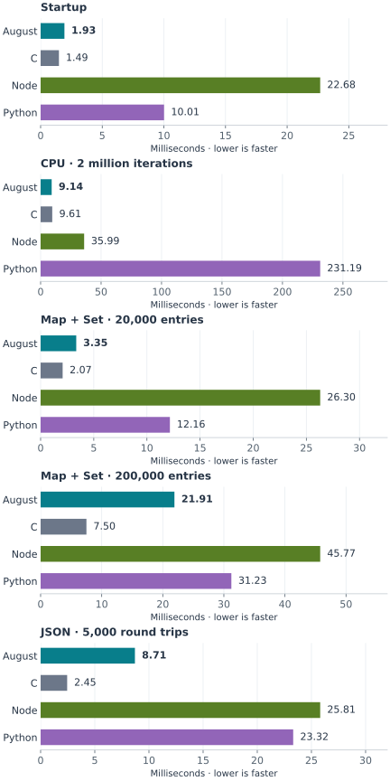
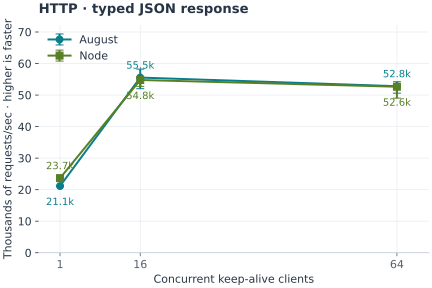
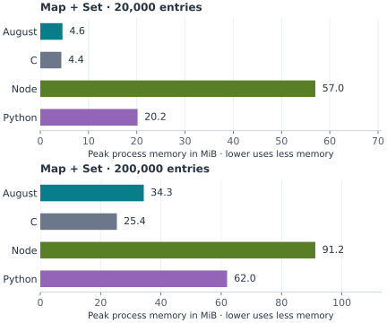
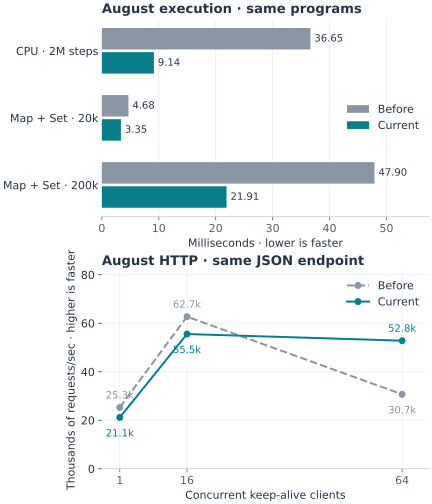

# Performance and benchmarks

Use this page to measure an August application, read the comparison graphs, and inspect the exact August programs behind each result. The recorded results used August 0.18.0, which compiles to native code through C. The current compiler is 0.19.0; rerun the suite before comparing a new release. Always measure work that resembles your application.

## Read the graphs

Execution and memory bars use **lower is better**. HTTP throughput uses **higher is better**. Read the workload name and units before comparing: a 20,000-entry map and a two-million-step CPU loop do different amounts of work. The execution panels have separate linear scales; compare implementations within a panel. Tables provide exact values and remain readable on a phone.

All results below were recorded on September 29, 2026: Apple M5, macOS Darwin 25.6.0, ARM64, Apple Clang 21, Node 24.18.0, CPython 3.12.14. August and C use `-O2` without LTO. [Raw samples, checksums, build timings and environment](benchmark-results.json) are committed with this page.

## Execution time



[benchmark-execution-start]: #

| Workload | August | C | Node | Python |
| --- | ---: | ---: | ---: | ---: |
| Startup | 1.46 ms | 1.29 ms | 19.07 ms | 8.42 ms |
| CPU · 2 million iterations | 7.24 ms | 8.17 ms | 30.22 ms | 194.98 ms |
| Map + Set · 20,000 entries | 2.54 ms | 1.65 ms | 22.31 ms | 10.36 ms |
| Map + Set · 200,000 entries | 15.10 ms | 6.38 ms | 38.33 ms | 26.44 ms |
| JSON · 5,000 round trips | 6.92 ms | 2.01 ms | 20.84 ms | 19.20 ms |

[benchmark-execution-end]: #

Times include a fresh process's startup and exclude compilation: 3 warmups and 15 measured runs for each implementation, with the execution order rotated. Every run must produce the expected checksum. Node and Python start a new interpreter each time; these are batch timings, not warmed server-loop or steady-state JIT timings. The startup row helps make that cost visible; subtracting medians would not establish a new measured result.

The programs below are the actual benchmark sources. The suite checks their printed results against the C, Node and Python references on every run.

The C reference is tailored to these inputs: it preallocates integer tables and checks JSON field types. August uses its normal Map, Set and typed JSON APIs. The programs produce the same checked results, but perform different amounts of validation and memory management. Read the complete sources below when comparing them.

[benchmark-summary-start]: #

The CPU program takes **7.24 ms** in August and **8.17 ms** in C on this host. The large-collection program takes **15.10 ms** in August. These are measurements of the shown programs, not guarantees for other applications. JSON batch time includes interpreter startup for Node and Python; it does not establish a universal JSON-throughput advantage.

[benchmark-summary-end]: #

### Startup program

Save this as `main.aug`. Its result is `7`; the measurement includes starting and stopping the executable.

[benchmark-source-startup-start]: #

**main.aug**

```aug project=benchmark-startup file=main.aug
print(value=7)
```


[benchmark-source-startup-end]: #

### CPU program

This loop performs two million dependent integer steps. Its result must be `819677333`. Change the iteration count to measure a different workload; keep it the same across comparisons.

[benchmark-source-cpu-start]: #

**main.aug**

```aug project=benchmark-cpu file=main.aug
// A loop-carried dependency prevents removal of the computation.
int state = 123
int index = 0
while index < 2000000:
    int product = state * 48271
    state = product - (product / 2147483647) * 2147483647
    index = index + 1
print(value=state)
```


[benchmark-source-cpu-end]: #

### Map and Set program

This creates a Map and Set, inserts 20,000 values, checks membership, and sums values while iterating. Its results are `599970000` and `true`. The larger graph uses the same program with `20000` changed to `200000`, producing `59999700000` and `true`.

[benchmark-source-collections-start]: #

**main.aug**

```aug project=benchmark-collections file=main.aug
own Map<int, int> values = {}
own Set<int> unique = {}
int index = 0
while index < 20000:
    values.set(key=index, value=index * 3)
    unique.add(value=index)
    index = index + 1
int checksum = 0
for (key, value) in values:
    if unique.contains(value=key):
        checksum = checksum + value
print(value=checksum)
print(value=values.length() == unique.length())
```


[benchmark-source-collections-end]: #

### JSON program

These two files belong in one folder. The program parses JSON, reads a typed record, writes JSON, and checks the result 5,000 times. Its result is `250000`.

[benchmark-source-json-start]: #

**data.aug**

```aug project=benchmark-json file=data.aug
record Payload(int id, string message, List<int> values)
```

**main.aug**

```aug project=benchmark-json file=main.aug
import parse from august.json
import Payload from data
int checksum = 0
int index = 0
try:
    while index < 5000:
        document = parse(input="{\"id\":7,\"message\":\"hello\",\"values\":[1,2,3]}")
        payload = document.decode<Payload>()
        encoded = Json(value=payload).stringify()
        checksum = checksum + payload.id + encoded.length()
        index = index + 1
    print(value=checksum)
catch JsonError error:
    exit(status=1)
```


[benchmark-source-json-end]: #

## HTTP throughput



[benchmark-http-start]: #

| Clients | August req/sec | Node req/sec | August p95 latency | Node p95 latency |
| ---: | ---: | ---: | ---: | ---: |
| 1 | 23,526 | 25,580 | 0.05 ms | 0.04 ms |
| 16 | 73,370 | 69,166 | 0.37 ms | 0.40 ms |
| 64 | 65,365 | 69,260 | 1.74 ms | 1.32 ms |

[benchmark-http-end]: #

A real August `GET /bench` endpoint returns a newly constructed typed JSON record. The Node reference constructs and serializes the same response. Both run on loopback with HTTP/1.1 keep-alive, 1,000 warmup requests and three fresh-server rounds of 5,000 measured requests per concurrency level. Every response must have status 200, JSON content type, and the exact expected data. The measured runs had zero errors. p95 is the median of the three per-round p95 latencies; graph error bars show observed throughput min/max, not confidence intervals.

The Node load generator runs on the same machine and consumes CPU. This closed-loop test has no TLS, authentication, logging, database, outbound network calls or slow clients. Its numbers are endpoint microbenchmark throughput, not a supported production capacity or service-level guarantee. HTTP/2, HTTP/3 and streaming are not benchmarked here.

Use the table to compare throughput and latency at the concurrency you expect. These results measure one process on one OS thread; they do not establish multicore scaling.

### HTTP program

Place these files in one folder. Every request constructs a `Reply` and returns it as JSON. Port `0` selects a free port; the server prints the chosen port when it starts.

[benchmark-source-http-start]: #

**routes.aug**

```aug project=benchmark-http file=routes.aug
record Reply(int id, string message)
endpoint GET "/bench" as reply() returns Reply:
    return Reply(id=7, message="hello")
```

**main.aug**

```aug project=benchmark-http file=main.aug
import reply from routes
serve reply on port 0
```


[benchmark-source-http-end]: #

Start the app in one terminal:

```sh
aug run path/to/http-example
```

Save the load generator below as `http-load.mjs`, or use `scripts/http-load.mjs` from a repository checkout. In another terminal, replace `PORT` with the printed port. This is the **same load generator** the comparison suite uses:

```sh
node http-load.mjs --url http://127.0.0.1:PORT/bench \
  --concurrency 64 --requests 5000 --warmup 1000 --rounds 3
```

The output includes requests/sec, p95 latency and validated request counts. An incorrect status, content type, JSON result, or timeout fails the run. The default expected result is `{"id":7,"message":"hello"}`. For your own JSON endpoint, pass `--expected '{"your":"result"}'`. This tool measures HTTP/1.1 without TLS. Its CLI rounds reuse your running server; the comparison suite starts a fresh server for each round.

The measurement uses a fixed number of keep-alive clients. Each client waits for its response before sending another request. Inspect the complete code below when reproducing a result.

::: details HTTP load generator source

[benchmark-source-load-start]: #

```js
#!/usr/bin/env node
import assert from 'node:assert/strict';
import http from 'node:http';
import {resolve} from 'node:path';
import {fileURLToPath} from 'node:url';

export const statistics = samples => {
  const sorted = [...samples].sort((a, b) => a - b), middle = Math.floor(sorted.length / 2);
  return {samples, minimum:sorted[0], median:sorted.length % 2 ? sorted[middle] : (sorted[middle - 1] + sorted[middle]) / 2,
    p95:sorted[Math.ceil(sorted.length * .95) - 1]};
};

/** Closed-loop HTTP/1.1 load with a fixed number of keep-alive clients.
 * Every response is checked; failed requests fail the measurement.
 */
export async function httpLoad(target, concurrency, count, expected = {id:7, message:'hello'}) {
  assert.ok(Number.isInteger(concurrency) && concurrency > 0);
  assert.ok(Number.isInteger(count) && count > 0);
  const url = new URL(typeof target === 'number' ? `http://127.0.0.1:${target}/bench` : target);
  assert.equal(url.protocol, 'http:', 'This benchmark measures HTTP/1.1 without TLS');
  const agent = new http.Agent({keepAlive:true, maxSockets:concurrency}), latencies = [];
  let next = 0;
  const started = performance.now();
  try {
    await Promise.all(Array.from({length:concurrency}, async () => {
      while (next++ < count) {
        const begin = performance.now();
        await new Promise((resolve, reject) => {
          const req = http.get(url, {agent}, response => {
            let body = ''; response.on('data', chunk => {body += chunk;});
            response.on('error', reject); response.on('end', () => {
              try {
                assert.equal(response.statusCode, 200);
                assert.match(response.headers['content-type'], /application\/json/);
                assert.deepEqual(JSON.parse(body), expected);
                latencies.push(performance.now() - begin); resolve();
              } catch (error) { reject(error); }
            });
          });
          req.setTimeout(10000, () => req.destroy(new Error('HTTP request timed out'))); req.on('error', reject);
        });
      }
    }));
    assert.equal(latencies.length, count);
    const elapsedMs = performance.now() - started;
    return {requests:count, errors:0, elapsedMs, requestsPerSecond:count * 1000 / elapsedMs, latencyMs:statistics(latencies)};
  } finally { agent.destroy(); }
}

if (process.argv[1] && fileURLToPath(import.meta.url) === resolve(process.argv[1])) {
  const option = (name, fallback) => {
    const index = process.argv.indexOf('--' + name);
    return index < 0 ? fallback : process.argv[index + 1];
  };
  try {
    const url = option('url');
    assert.ok(url, 'Use --url http://127.0.0.1:PORT/bench [--concurrency 64 --requests 5000 --warmup 1000 --rounds 3]');
    const concurrency = Number(option('concurrency', 16)), requests = Number(option('requests', 5000));
    const warmup = Number(option('warmup', 1000)), rounds = Number(option('rounds', 3));
    assert.ok(Number.isInteger(rounds) && rounds > 0);
    const expected = JSON.parse(option('expected', '{"id":7,"message":"hello"}'));
    const results = [];
    for (let i = 0; i < rounds; i++) {
      await httpLoad(url, concurrency, warmup, expected);
      const result = await httpLoad(url, concurrency, requests, expected);
      delete result.latencyMs.samples; results.push(result);
    }
    const measured = statistics(results.map(result => result.requestsPerSecond));
    console.log(JSON.stringify({url, concurrency, warmup, rounds:results, requestsPerSecond:measured}, null, 2));
  } catch (error) { console.error(error.message); process.exitCode = 1; }
}
```

[benchmark-source-load-end]: #

:::

## Memory



[benchmark-memory-start]: #

| Workload | August | C | Node | Python |
| --- | ---: | ---: | ---: | ---: |
| Startup | 1.3 MiB | 1.4 MiB | 46.0 MiB | 15.1 MiB |
| CPU · 2 million iterations | 1.3 MiB | 1.4 MiB | 52.2 MiB | 15.1 MiB |
| Map + Set · 20,000 entries | 4.5 MiB | 4.4 MiB | 57.0 MiB | 20.2 MiB |
| Map + Set · 200,000 entries | 34.2 MiB | 25.4 MiB | 91.1 MiB | 62.1 MiB |
| JSON · 5,000 round trips | 1.8 MiB | 1.5 MiB | 47.4 MiB | 16.2 MiB |

[benchmark-memory-end]: #

These are medians of three separate peak-RSS measurements through `/usr/bin/time`, in MiB, including the process runtime/interpreter. They are not allocation counts or retained heap after a GC. Long-running heap stability and leak behavior need separate soak tests.

## Before and after

The same August programs and measurement settings were run on this machine before and after the performance work. Shorter bars are faster for execution time; taller points are faster for HTTP. This compares observed application performance. [Earlier measurement summaries](benchmark-baseline.json) preserve the baseline.



[benchmark-improvements-start]: #

| August workload | Before | Current | Current relative to before |
| --- | ---: | ---: | ---: |
| CPU · 2 million iterations | 36.65 ms | 7.24 ms | 5.06× faster |
| Map + Set · 20,000 entries | 4.68 ms | 2.54 ms | 1.84× faster |
| Map + Set · 200,000 entries | 47.90 ms | 15.10 ms | 3.17× faster |
| HTTP · 1 clients | 25,273 req/sec | 23,526 req/sec | 0.93× throughput |
| HTTP · 16 clients | 62,719 req/sec | 73,370 req/sec | 1.17× throughput |
| HTTP · 64 clients | 30,693 req/sec | 65,365 req/sec | 2.13× throughput |
| Map + Set · 200k peak memory | 61.9 MiB | 34.2 MiB | 45% less |

[benchmark-improvements-end]: #

## Benchmark your own project

1. Choose a representative finite workload in `main.aug`. Give it a deterministic result so you can check correctness.
2. Run it once and verify the output. Keep input size, dependencies, native compiler, machine and background load recorded.
3. Measure a release executable repeatedly. Compilation is excluded; process startup is included.

```sh
aug check path/to/project
aug run path/to/project
aug bench path/to/project --iterations 20 --warmup 3 --json > benchmark.json
```

`aug bench` compiles with release optimization even when the project's normal setting is debug. Do not benchmark `aug run`: that command includes compiler work. Server programs run indefinitely, so use an HTTP load generator against a built server instead of `aug bench`. Record errors and latency as well as throughput. The comparison suite validates checksums; `aug bench` itself checks exit status, so verify your program's result first.

## Reproduce the comparison graphs

From a checkout, with Node 24+, Python and a C11 compiler:

```sh
npm ci
node scripts/bootstrap-native.mjs
npm run bench:compare
```

Set `AUG_BENCH_PYTHON=/path/to/python3` or `CC=/path/to/clang` to select the reference interpreter/compiler. `AUG_NATIVE_HOME` selects the native dependency cache. The raw result file records versions and a source fingerprint. Compilation timings are included separately from executable run time.

For core/JSON only, extract the smaller native source dependencies and omit HTTP:

```sh
node scripts/bootstrap-native.mjs --extract-only --only minicoro,yyjson
npm run bench:compare -- --skip-http
```

The full suite writes `docs/benchmark-results.json`; a core-only run writes `.aug-build/benchmarks/results-core.json` and preserves the complete wiki measurements. Focus on selected workloads while trying your own changes:

```sh
npm run bench:compare -- --only cpu,collections-200k
npm run bench:compare -- --only http --http-requests 10000
```

Focused runs write `.aug-build/benchmarks/results-focused.json`. Use `--output PATH` to keep separate reports. Render graphs, tables and the exact source examples from the full result file using Python 3.12+:

```sh
python3 -m venv .aug-build/benchmark-plotting
.aug-build/benchmark-plotting/bin/python -m pip install -r benchmarks/plot-requirements.txt
.aug-build/benchmark-plotting/bin/python scripts/render-benchmarks.py
.aug-build/benchmark-plotting/bin/python scripts/render-benchmarks.py --check
npm run docs:build
```

The plot environment is isolated and ignored; published documentation includes the rendered graphs and needs no Python installation. Review this page's environment, interpretations and limitations when replacing measurements. Short exploratory runs can use `--iterations 3 --warmup 1 --http-rounds 1 --http-requests 1000`; they have less statistical coverage.

### Comparison implementation sources

These are the complete reference programs used for the graphs. The C collection case preallocates integer tables, while August, Node and Python use their normal growing collections. Expected inputs and printed checksums match.

::: details C reference

[benchmark-source-c-start]: #

```c
#include <stdint.h>
#include <stdio.h>
#include <stdlib.h>
#include <string.h>
#include "yyjson.h"

// A specialized integer table is a useful C baseline, not August's generic value representation.
typedef struct { int64_t key, value; unsigned char occupied; } Entry;
static size_t slot(Entry *table, size_t mask, int64_t key) {
  uint64_t hash = (uint64_t)key;
  hash ^= hash >> 30; hash *= UINT64_C(0xbf58476d1ce4e5b9);
  hash ^= hash >> 27; hash *= UINT64_C(0x94d049bb133111eb); hash ^= hash >> 31;
  size_t index = (size_t)hash & mask;
  while (table[index].occupied && table[index].key != key) index = (index + 1) & mask;
  return index;
}
int main(int argc, char **argv) {
  if (argc != 3) return 2;
  int64_t count = strtoll(argv[2], NULL, 10);
  if (!strcmp(argv[1], "startup")) puts("7");
  else if (!strcmp(argv[1], "cpu")) {
    int64_t state = 123;
    for (int64_t i = 0; i < count; i++) {
      int64_t product = state * 48271;
      state = product - (product / 2147483647) * 2147483647;
    }
    printf("%lld\n", (long long)state);
  } else if (!strcmp(argv[1], "collections")) {
    size_t capacity = 8; while (capacity < (size_t)count * 2) capacity *= 2;
    Entry *values = calloc(capacity, sizeof(Entry)), *unique = calloc(capacity, sizeof(Entry));
    if (!values || !unique) return 3;
    for (int64_t i = 0; i < count; i++) {
      values[slot(values, capacity - 1, i)] = (Entry){i, i * 3, 1};
      unique[slot(unique, capacity - 1, i)] = (Entry){i, 0, 1};
    }
    int64_t checksum = 0;
    for (size_t i = 0; i < capacity; i++) if (values[i].occupied && unique[slot(unique, capacity - 1, values[i].key)].occupied) checksum += values[i].value;
    printf("%lld\ntrue\n", (long long)checksum);
    free(values); free(unique);
  } else if (!strcmp(argv[1], "json")) {
    const char *input = "{\"id\":7,\"message\":\"hello\",\"values\":[1,2,3]}";
    int64_t checksum = 0;
    for (int64_t i = 0; i < count; i++) {
      yyjson_doc *doc = yyjson_read(input, strlen(input), 0); if (!doc) return 4;
      yyjson_val *root = yyjson_doc_get_root(doc);
      yyjson_val *id = yyjson_obj_get(root, "id");
      if (!yyjson_is_int(id) || !yyjson_is_str(yyjson_obj_get(root, "message")) || !yyjson_is_arr(yyjson_obj_get(root, "values"))) return 5;
      size_t length = 0; char *encoded = yyjson_write(doc, 0, &length); if (!encoded) return 6;
      checksum += yyjson_get_sint(id) + (int64_t)length;
      free(encoded); yyjson_doc_free(doc);
    }
    printf("%lld\n", (long long)checksum);
  } else return 2;
  return 0;
}
```

[benchmark-source-c-end]: #

:::

::: details Node reference

[benchmark-source-node-start]: #

```js
const [workload, countText] = process.argv.slice(2), count = Number(countText);
if (workload === 'startup') console.log(7);
else if (workload === 'cpu') {
  let state = 123;
  for (let i = 0; i < count; i++) {
    const product = state * 48271;
    state = product - Math.trunc(product / 2147483647) * 2147483647;
  }
  console.log(state);
} else if (workload === 'collections') {
  const values = new Map(), unique = new Set();
  for (let i = 0; i < count; i++) { values.set(i, i * 3); unique.add(i); }
  let checksum = 0;
  for (const [key, value] of values) if (unique.has(key)) checksum += value;
  console.log(checksum); console.log(values.size === unique.size);
} else if (workload === 'json') {
  let checksum = 0;
  for (let i = 0; i < count; i++) {
    const value = JSON.parse('{"id":7,"message":"hello","values":[1,2,3]}');
    checksum += value.id + JSON.stringify(value).length;
  }
  console.log(checksum);
} else if (workload === 'http') {
  const { default: http } = await import('node:http');
  http.createServer((req, res) => {
    if (req.method !== 'GET' || req.url !== '/bench') { res.writeHead(404); res.end(); return; }
    const body = JSON.stringify({ id: 7, message: 'hello' });
    res.writeHead(200, { 'content-type': 'application/json', 'content-length': Buffer.byteLength(body) }); res.end(body);
  }).listen(0, '127.0.0.1', function () { console.log('PORT ' + this.address().port); });
} else throw new Error('Unknown workload');
```

[benchmark-source-node-end]: #

:::

::: details Python reference

[benchmark-source-python-start]: #

```python
import sys

workload, count = sys.argv[1], int(sys.argv[2])
if workload == 'startup':
    print(7)
elif workload == 'cpu':
    state = 123
    for index in range(count):
        product = state * 48271
        state = product - (product // 2147483647) * 2147483647
    print(state)
elif workload == 'collections':
    values, unique = {}, set()
    for index in range(count):
        values[index] = index * 3
        unique.add(index)
    checksum = sum(value for key, value in values.items() if key in unique)
    print(checksum)
    print(str(len(values) == len(unique)).lower())
elif workload == 'json':
    import json
    checksum = 0
    for index in range(count):
        value = json.loads('{"id":7,"message":"hello","values":[1,2,3]}')
        checksum += value['id'] + len(json.dumps(value, separators=(',', ':')))
    print(checksum)
else:
    raise ValueError('Unknown workload')
```

[benchmark-source-python-end]: #

:::

## Production assessment

**Experimental; appropriate for prototypes and controlled pilots. General production readiness is not established.** The measured native path is viable enough to continue developing and profiling. These microbenchmarks do not cover the correctness, operational behavior and portability needed for a production language/runtime.

| Remaining evidence or feature | Why it matters |
| --- | --- |
| Application-specific profiling | These small workloads do not predict a complete application's performance. |
| Long-running memory/lifecycle tests | Peak RSS of a short process does not prove a stable server heap. |
| Tasks that capture injected mutable state; cleanup of owned shared values | These ownership and resource-lifetime cases still have gaps. Check the gap ledger before relying on them. |
| Multicore workers, bounded channels and broadcasts | Tasks currently run on one OS thread; these features are not available yet. |
| Independent HTTP conformance and adverse-client tests | Existing socket regressions do not cover the entire HTTP specification. |
| Other native platform builds | The native bootstrap and full suite are verified on macOS ARM and Linux ARM. Linux x86-64 runs in CI; Windows and other platforms remain unverified. |
| Identity-provider hardening and durable storage | The OIDC demo is a development proof; persistence, key rotation, federation and certification remain. |
| Stable package/native ABI and operational tooling | Source packages work, but compiler compatibility is exact and rich debugging remains limited. |

See [the library/runtime gap ledger](web-library-gaps.md) for current support and limitations.
