<!-- Generated by aug spec. Edit the August source, then regenerate. -->

# august/io/contracts.aug diagrams

[Project overview](../../../diagrams/index.md) · [Compiled explanation](contracts.aug.md)

## Class interactions

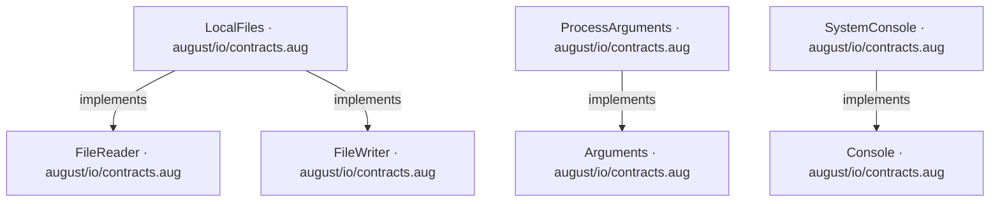

## API calls

```mermaid
flowchart TD
    n0["Arguments.read · august/io/contracts.aug"]
    n1["Console.write · august/io/contracts.aug"]
    n2["FileReader.read · august/io/contracts.aug"]
    n3["FileWriter.write · august/io/contracts.aug"]
    n4["LocalFiles.read · august/io/contracts.aug"]
    n5["LocalFiles.write · august/io/contracts.aug"]
    n6["ProcessArguments.read · august/io/contracts.aug"]
    n7["SystemConsole.write · august/io/contracts.aug"]

```

## Sequences

Call arrows identify checked targets; loop and branch frames determine when they run. Open that target’s module to follow its implementation. Branches describe alternatives; loops describe repeated work. Native calls and interface dispatch stop at their declared contracts. Exit notes end that path; enclosing recovery and cleanup remain visible.

### Console.write

[Source](contracts.aug#L6)

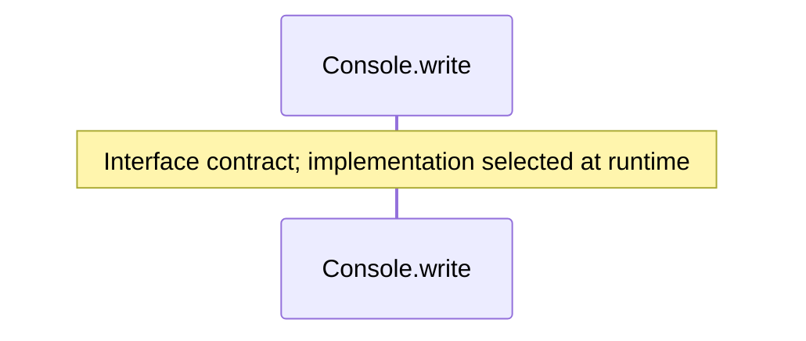

### SystemConsole constructor

[Source](contracts.aug#L9)

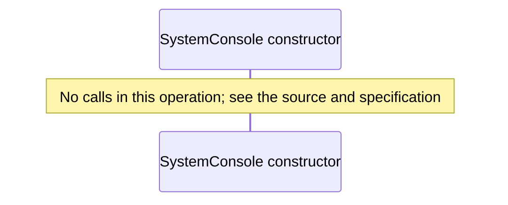

### SystemConsole.write

[Source](contracts.aug#L10)

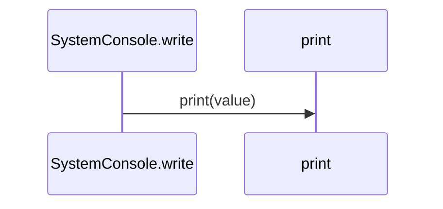

### FileReader.read

[Source](contracts.aug#L16)

### FileWriter.write

[Source](contracts.aug#L21)

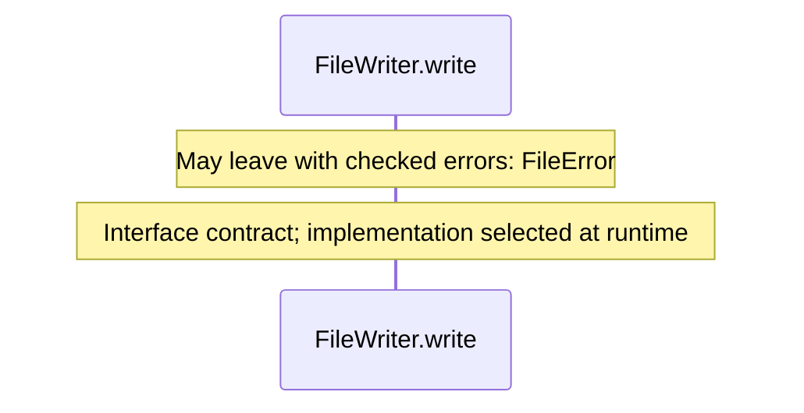

### LocalFiles constructor

[Source](contracts.aug#L24)

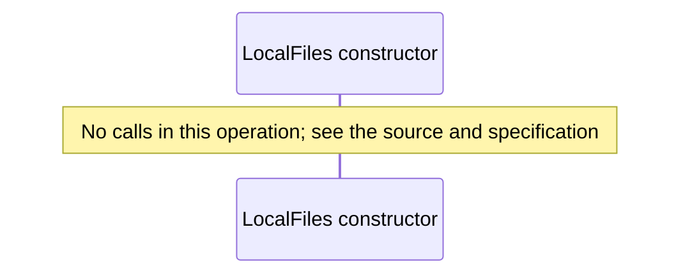

### LocalFiles.read

[Source](contracts.aug#L25)

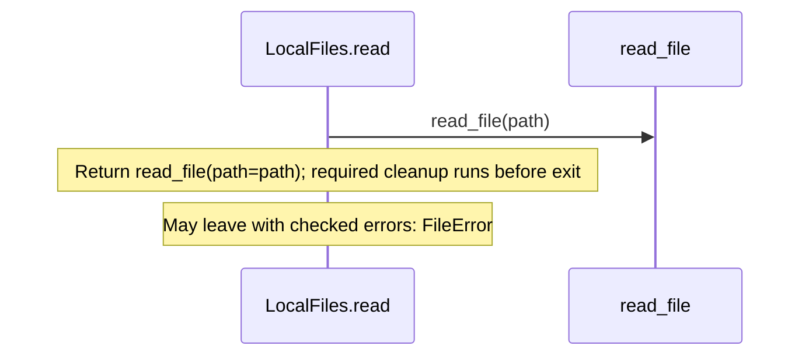

### LocalFiles.write

[Source](contracts.aug#L27)

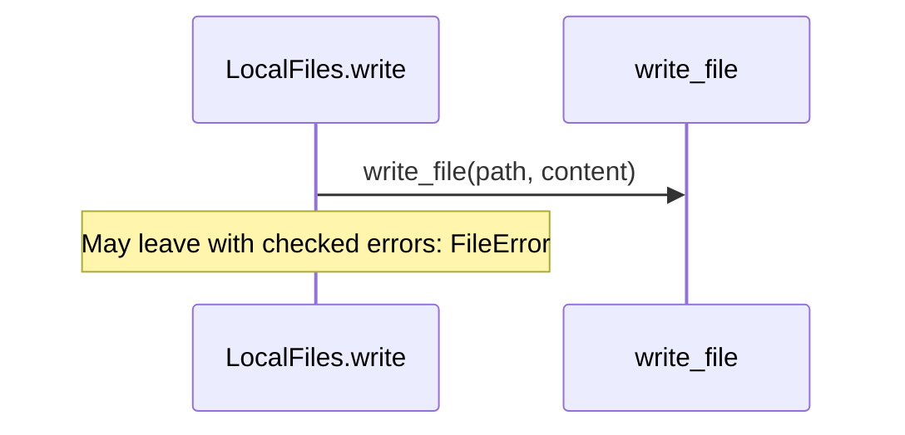

### Arguments.read

[Source](contracts.aug#L32)

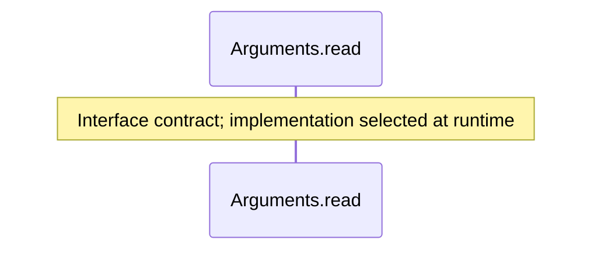

### ProcessArguments constructor

[Source](contracts.aug#L35)

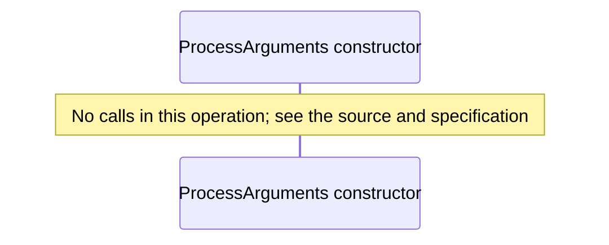

### ProcessArguments.read

[Source](contracts.aug#L36)

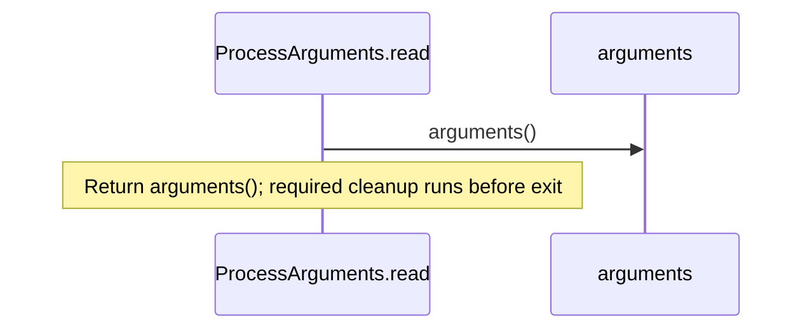

## Called contracts

- [Arguments](contracts.aug.diagrams.md) — august/io/contracts.aug
- [Console](contracts.aug.diagrams.md) — august/io/contracts.aug
- [FileReader](contracts.aug.diagrams.md) — august/io/contracts.aug
- [FileWriter](contracts.aug.diagrams.md) — august/io/contracts.aug
