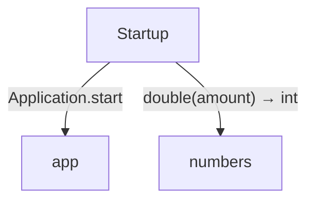
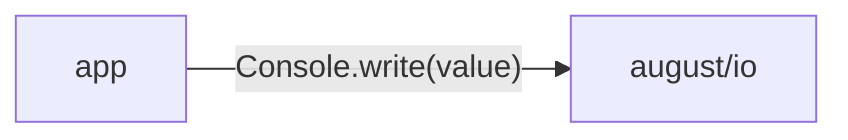

<!-- Generated by aug spec. Edit the August source, then regenerate. -->

# domain data flow

[Project overview](../../index.md)

This view opens the domain folder one level deeper. Each arrow shows the called operation and the data it returns to its caller. Calls inside a file stay in that file’s sequence view.

### Package boundaries

app package calls

Data crossing these boundaries (5 contracts)

| From | To | Operation and inputs | Result |
| --- | --- | --- | --- |
| app | august/io | [Console.write](../../../august/0.23.0/io/contracts.aug.md#symbol-Console.write) · value: string · interface dispatch | void |
| app | models | [Fruit](../../../../domain/models.aug.md#symbol-Fruit) · code: int, name: string · value construction | Fruit |
| Startup | app | [Application.start](../../../../domain/app.aug.md#symbol-Application.start) · interface dispatch | void |
| Startup | models | [Fruit](../../../../domain/models.aug.md#symbol-Fruit) · code: int, name: string · value construction | Fruit |
| Startup | numbers | [double](../../../../domain/numbers.aug.md#symbol-double) · amount: int | int |

## Files in this folder

| Module | Read |
| --- | --- |
| domain/app.aug | [Flow and sequences](../../../../domain/app.aug.diagrams.md) · [Explanation](../../../../domain/app.aug.md) |
| domain/export.aug | [Flow and sequences](../../../../domain/export.aug.diagrams.md) · [Explanation](../../../../domain/export.aug.md) |
| domain/models.aug | [Flow and sequences](../../../../domain/models.aug.diagrams.md) · [Explanation](../../../../domain/models.aug.md) |
| domain/numbers.aug | [Flow and sequences](../../../../domain/numbers.aug.diagrams.md) · [Explanation](../../../../domain/numbers.aug.md) |
